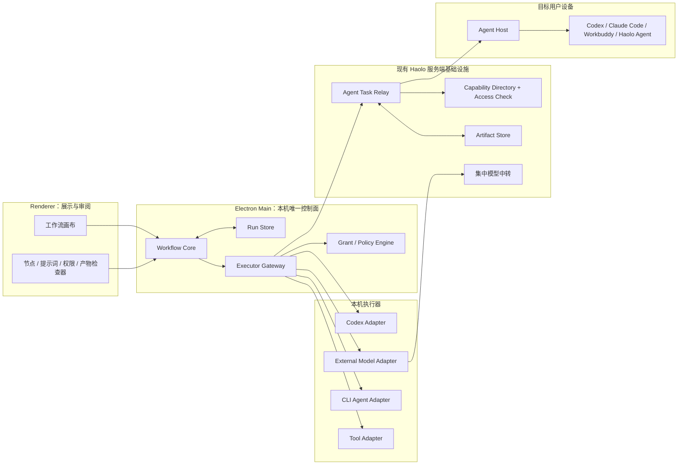
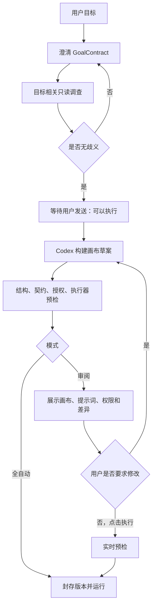
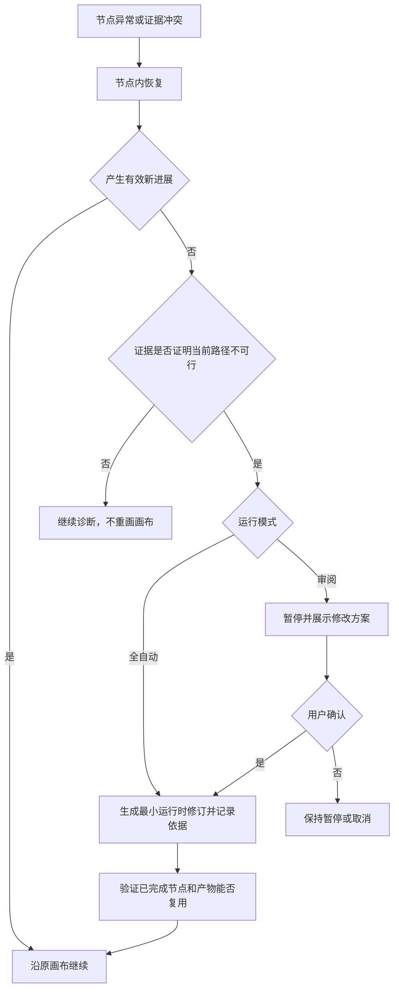

# Haolo 工作流与多 Agent 最简架构

> 状态：架构基线（2026-07-22）
> 适用范围：Haolo 桌面工作流、外部模型、Codex/Claude Code/Workbuddy 等 CLI Agent、其他用户的 Haolo Agent，以及未来工具节点。
> 当前实现说明：本文定义目标架构和演进边界，不表示所有能力已经上线。现有外部模型只读 Runtime、生产模型中转和功能开关继续按当前路线运行，直到对应阶段完成并通过灰度。
> 2026-08-16 当前产品覆盖：Haolo 桌面客户端固定为普通串行执行模式，禁止根 Codex 创建子 Agent、协作委派、并行任务或后台任务分支；App Server 每会话只保留根线程一个槽位，Renderer 不提供计划/集群任务模式切换，主进程拒绝启动新的多模型工作流，也拒绝通过旧画布节点语义编译入口发起模型调用。该覆盖撤销下文 2026-07-26 的三模型并行临时覆盖；下文并行图模型继续作为长期架构与历史数据兼容定义，当前不得据此启动新运行。
> 2026-07-27 已落地边界：集群工作流的全部模型节点声明 `local.files.review`，仅在根 Codex 为当前节点签发只读 `CapabilityGrant` 后，由 Context Broker 按节点独立组装 `ContextPackage`；问答模式是独立的直连产品路径，不经过根 Codex 或工作流节点授权，由桌面问答运行时直接只读当前分组目录和本次上传文件。
> 2026-07-27 已落地执行节点：集群规划协议现在显式区分 `external_model` 与 `codex_subagent`。前者继续只读分析；后者通过统一 `ExecutorGateway + ExecutorAdapter + CapabilityGrant + ExecutionResult` 边界启动隔离临时 Codex Worker，可按 `read_only`、`workspace_write` 或 `full_access` 执行文件、命令、应用、网络与发布类任务。运行时 Grant 绑定 workflow/node/task/attempt，禁止隐式全局上下文和转授权；可写 Agent 强制串行且不做未知副作用后的盲目自动重试。当前 App Server sandbox 是第一层程序边界，更细的逐工具强制、远程 Agent Host、两阶段提交和可验证远端凭证仍属于后续阶段。
> 2026-07-27 已落地多模态边界：模型能力由单一注册表声明；文件正文继续走 `ContextPackage`，图片和视频走显式 `ArtifactRef`/附件引用，并在同一个节点执行边界交付。媒体输入不进入隐式全局上下文，也不改变根 Codex 的编排与采纳权。
> 2026-07-27 已落地 Doubao 视频传输策略：问答与集群模型节点共享同一 Executor Adapter。已有阿里云 OSS URL 时优先使用 OSS Accelerate 的同桶地址，纯本地视频才进入 Sub2API 短期输入媒体桥接；传输选择只改变 `ArtifactRef` 的物理交付方式，不改变画布、权限、上下文选择或根 Codex 决策语义。
> 2026-07-27 已落地 Doubao 历史追问兼容：不鸣 AI 的 Doubao Chat 兼容路由无法直接接收历史 `assistant` 消息，统一 Provider Adapter 因此只对该路由把显式选中的历史轮次封装为保留角色的系统上下文，再将当前问题与选中的历史媒体作为当前节点输入发送。该兼容只处理 Transport 差异，不得扩大上下文来源、产生隐式共享状态或绕过 `ContextSourcePlan`/节点 `contextSelection`；问答与集群节点复用同一规则。
> 2026-07-27 已落地问答上下文来源规划：问答运行时使用显式 `ContextSourcePlan`，分别选择历史对话轮次、本轮附件、历史附件、上传文档和当前分组文件。历史图片或视频追问会复用对应 `ArtifactRef`，对话追问会复用相关轮次；两者都不会因为出现“上下文”“这个视频”或时间片段等表达而默认扫描当前分组。
> 2026-07-27 已落地问答派生媒体边界：`ContextSourcePlan` 可显式声明 `derivedMedia.extract_video_frames`，由桌面 Host 的独立视频帧 Executor 从语义选中的本地原视频和确切时间点提取 PNG，并按 `Artifact` 交付。只输出文本的外部模型不得伪造图片链接；所选源文件或时间点无效时失败关闭，不回退给文本模型。普通图片/视频理解仍走统一 Provider Adapter，媒体响应窗口独立于纯文本请求放宽。
> 2026-08-01 已落地可编辑画布版本边界：用户对节点、连线、提示词和执行器的修改先进入可变 `WorkflowRevisionDraft`，布局仍独立写入 `WorkflowLayout`；执行前由主进程校验并冻结为带版本、内容哈希的不可变 `WorkflowSpec`，`WorkflowRun` 只引用这个确切版本。历史运行事实不会被草稿覆盖。输入框可以显式连接任意一个或多个入口节点；本次运行只执行这些入口可达的下游子图，入口自身切断旧上游依赖，多入口在汇合点只执行一次。总输入框只向直接入口注入数据，固定附件永远是节点附加输入；两者都不得越级补齐可达下游缺失的旁路上游输出。
> 2026-08-01 已落地嵌套画布与终验边界：历史工作流可以作为 `nested_workflow` 节点加入父画布，但必须锁定确切 `specId + version + contentHash`，运行时创建独立子运行并通过统一结果信封返回，递归引用会在预检阶段失败关闭。根 Codex 的终验回答必须携带机器可读 `haolo_final_meta`；只有原目标和冻结成功标准确实达成时才能把运行标记为 `succeeded`，缺失、无效或明确未达成时均保留真实结果并以失败终态呈现，不自动重规划、重跑或回滚。
> 2026-08-02 已确定节点契约与局部运行边界：节点提示词固定为不可删除的输入、任务、输出三段，保存时由 Haolo 一次性编译为确定性契约；下游输入只由连线和上游输出生成，固定附件只做额外输入；工作流禁止环路、固定等待全部上游成功，并要求本次可达子图只有一个终点结果。完整规范见 `youle_desktop/docs/workflow-node-contract-and-partial-run-spec.zh-CN.md`。
> 2026-08-05 已确定并联入口输入身份规则：多个直接入口要求兼容的提示词、文件、图片或视频时，默认使用同一份运行输入；只有节点定义明确要求不同、分别或各自独立的资源时才拆成多个槽位。Renderer 预览、冻结 Spec、发送校验和 Runtime 分发必须使用同一契约，同一输入值按引用分发给全部目标入口节点。
> 2026-08-02 已落地 GitHub 用户身份边界：全局 GitHub MCP 与内置 GitHub Skill 共用 Haolo Tool Broker，但不依赖 Skill 才可调用。每个 Haolo 用户通过后端发起带一次性 state 的 GitHub App user-to-server 授权；access/refresh token 只在后端按 Haolo 用户 UUID 使用 AES-256-GCM 加密，桌面、Renderer、Codex 配置和 MCP 环境均不持有长期 GitHub 凭证。工具调用同时受 Haolo 用户身份、GitHub 用户与 App 权限交集、可选管理员仓库上限、写开关、MCP 写审批和当前对话确认约束；GitHub 副作用归属于已连接的 GitHub 用户。管理员安装令牌模式仅保留为用户模式关闭时的兼容路径。

## 1. 核心结论

Haolo 不建设一个替代 Codex 的新编排器。Codex CLI 始终是根编排器，同时也可以作为执行器；外部模型和其他 Agent 是可插拔的“分析大脑”或“执行节点”。根 Codex 负责目标理解、画布生成、节点选择、权限定义、结果采纳、动态重规划和最终验收。

最小可用架构只有五个本地边界：

1. **Canvas UI**：只负责展示、审阅和用户操作，不执行任务、不持有凭证。
2. **Workflow Core**：负责目标契约、画布版本、预检、调度、状态机、重规划和终验。
3. **Run Store**：负责定义、运行、事件、授权和产物元数据；它是主进程内模块，不是独立服务。
4. **Executor Gateway**：统一执行入口，负责能力匹配、授权校验、适配器调用和结果归一。
5. **Executor Adapters**：Codex、外部模型、CLI Agent、远程 Haolo Agent 和工具的插件实现。

跨设备时只增加现有 Haolo 后端上的任务中转、能力目录和产物存储，不把本地 Workflow Core 拆成微服务。第一版不引入本地消息队列、分布式事务、CRDT 或多主编排。



## 2. 不可破坏的产品不变量

### 2.1 根 Codex

- Codex CLI 是默认且唯一的根编排器，不替换现有 Codex 原生子线程。
- 每个 `WorkflowRun` 绑定不可变的 `rootOrchestratorId`。
- 其他 Codex 实例不能接管；原进程退出后，只允许同一逻辑根身份恢复。
- 根 Codex 保留全局判断权、调度权、授权范围定义权、结果采纳权和最终责任。
- 根 Codex 自己动手时也必须经过统一执行路径；其编排推理不需要包装成执行节点。

### 2.2 目标先于画布

生成画布前必须形成不可歧义的 `GoalContract`：

- 最终交付物；
- 成功标准；
- 限制条件；
- 禁止事项。

目标不清楚时持续澄清，不得急于生成画布或执行。目标明确后，Codex 引导用户发送“可以执行”。

规划阶段可以进行与目标相关的广泛只读调查，包括项目文件、配置、日志、文档、系统状态、网络资料和只读外部 Agent。调查必须能够说明与目标的关系；违法内容、与目标无关的材料以及写入、安装、发布、发消息等副作用不属于此授权。

规划调查和外部模型调用属于 `PlanningSession`，单独记录来源、结论及其对画布的影响，不污染正式执行画布。

### 2.3 两种交互模式

| 模式 | “可以执行”的含义 | 开始运行 | 运行中结构修改 |
|---|---|---|---|
| 全自动模式 | 授权构建画布并直接运行 | 预检通过后自动开始 | 证据证明当前路径不可行时可自动生成最小修订 |
| 审阅模式 | 只授权构建画布 | 用户查看后点击执行按钮 | 暂停、展示差异，用户确认后创建新修订 |

审阅模式运行后，节点内恢复不需要再次确认，包括调整本节点任务提示词、补充上下文、重试和切换到已批准的备用执行器。改变节点目标、图结构、依赖、能力、权限或候选执行器范围才属于画布修订。

### 2.4 目标不可变

- 一个运行启动后，目标、交付物、成功标准、限制条件和禁止事项不可改变。
- 不改变目标的上下文补充可以进入显式 `ContextPackage`。
- 用户改变目标时暂停当前运行，并创建新的 `PlanningSession` 和 `WorkflowSpec`；这不是运行中重规划。
- 新工作流可以复用仍然有效的产物，但必须重新证明复用后仍可实现新目标。

### 2.5 终验是终点

- 每个普通节点只做基础机器校验；高风险或低置信度节点由根 Codex 额外语义验收。
- 所有节点结束后，根 Codex 必须按 `GoalContract` 做一次全局终验。
- 所有必要成功标准满足才是 `succeeded`；否则是 `failed`。
- 进入终验后不得重新规划、补节点或重跑。本次运行直接呈现成功或失败。
- 失败结果必须包含原因、未满足标准、已有成果、实际副作用、证据和改进建议。改进建议只能由用户发起为新的目标。
- 无论成功、失败、取消或异常，Haolo 都不自动回滚。只能展示当前状态和可执行的补偿方案；补偿必须作为新工作流重新授权。

### 2.6 不设置资源上限，但必须检测无进展

- Haolo 不为工作流设置费用、Token、总时长或总重试次数上限。
- 不得因为资源消耗较大而降低质量或擅自终止。
- 保留技术心跳、单次调用超时、租约和重复失败检测，用于识别失联、卡死和无进展。
- 技术超时不是工作流总时限。恢复、换执行器或重规划必须由执行证据驱动。

## 3. 画布与工作流模型

### 3.1 三层对象

```text
WorkflowTemplate  可保存、分享、复制和发布的模板
      ↓ 固化某次目标、节点契约和执行策略
WorkflowSpec      不可变、带版本的语义画布
      ↓ 每次手动、定时或无人值守触发
WorkflowRun       独立状态、根身份、事件、授权和产物
```

- `WorkflowLayout` 与 `WorkflowSpec` 分离。移动、缩放、折叠节点不产生语义版本。
- 已发布或被定时任务引用的模板版本不可变；更新创建新版本。
- 历史运行和正在运行的实例永不自动升级。
- 分享模板不携带凭证、授权或私有产物；使用者必须在自己的环境重新预检和授权。

### 3.2 主画布保持无环

主画布支持顺序、条件分支、并行、汇合和嵌套子画布，但普通节点连线不能形成任意循环。重复执行使用显式 `IterationNode`；每一轮生成独立记录。节点重试属于同一节点的多次 `attempt`，不是新节点。

多模型集群第一阶段对超时、限流、网络断开和上游临时不可用采用节点内重连与同节点执行器替补：根 Codex 为每个模型节点按能力匹配度预先排列最多 3 个候选模型；每个候选最多连续尝试 3 次，每次使用独立 `attemptId`。当前候选前两次失败时节点保持 `running`；第 3 次仍失败时不释放下游，而是在原节点内切换并展示第二选择，再按相同规则尝试第三选择。只有三个候选均失败后才形成最终失败信封并继续调度。参数、鉴权、权限等明确不可恢复错误不做无意义重试，但可以直接切换到下一个已批准候选。该规则是单节点瞬时故障与执行器替补策略，不构成工作流总重试次数限制。

集中中转先在一次请求内部完成账号级调度、临时故障隔离和可用账号切换；只有中转路由耗尽后，桌面 Workflow Core 才进行节点级重试或切换候选模型。两层恢复不得互相越权：中转不修改工作流节点，桌面不选择中转内部账号。中转失败必须返回机器可读错误信封和同义诊断响应头，至少包含 `code`、`category`、`retryable`、`retry_after_ms`、`request_id`、`upstream_status` 和 `route_exhausted`，同时保持 OpenAI/Anthropic 原有错误外形兼容。

集群模型节点使用流式请求作为真实执行链路，并把根工作流的 `AbortSignal` 传到网络请求。超时分为首包等待和流中无进展两类，不设置固定的整次响应总时限；当前默认首包等待 120 秒、流中连续 90 秒无数据判定失联。可恢复错误的默认节点退避为约 2 秒、5 秒并加入抖动；中转给出更长 `retry_after_ms` 时以中转建议为准。直接联系人聊天仍可使用非流式单次调用，不与集群节点的恢复策略混为一谈。

双模型并行审核组使用更严格的组级回退，不套用上述逐节点替补：两个主并行节点各自只运行首选模型并最多重连 3 次。只有两路都被确认是连接超时且都耗尽 3 次，Workflow Core 才动态派出一个第三模型接替节点；只超时一路、一路成功，或失败类型不是连接超时时均不派出第三节点，而是把现有成功结果和失败证据交给独立审核门。第三节点开始时前两路已经结束，因此任一时刻仍最多有 2 个模型并发；审核门会把条件接替节点纳入输入并等待它结束。第三节点是运行时可审计的条件激活节点，不允许规划器预先制造三路同时并行。

#### 2026-07-26 临时产品覆盖：用户明确要求三模型并行

在该临时覆盖被明确撤销前，它优先于上一段“双模型并行审核组”的并发数量限制，但不改变根 Codex 的唯一编排权：

- 用户没有明确指定并行数量时，仍由根 Codex 判断是否需要并行；并行审核组默认保持 2 个独立候选。
- 原始目标明确要求 **3 个模型并行** 时，根 Codex 可以在同一并行组规划 3 个独立候选同时执行，随后必须进入一个独立审核门。
- 三模型并行组的每个候选仍只运行首选执行器并最多重连 3 次；不得再动态派出第四个接替节点。
- 当前并发硬边界临时调整为：默认最多 2 个模型；只有上述明确请求成立时，该工作流最多 3 个模型并发。
- 用户要求超过 3 个模型参与时，不得静默把用户目标改写为 3 个。根 Codex 应保持参与模型数量语义，通过最多 3 个并发的分批、分层或依赖编排实现；如果“必须全部同时运行”是不可放宽的成功条件，则在规划阶段说明当前边界并继续澄清。
- 第一阶段允许协议归一器识别原始用户文本中的明确并行数量，并在画布封存前校验或补足候选数量，作为防止规划器漏掉用户硬要求的临时护栏。它不能独立改变目标、选择与根 Codex 计划无关的节点，不能在运行中越过重规划规则；长期仍应由结构化 `GoalContract` 和根 Codex 计划表达该要求。

该覆盖只改变显式三模型请求的规划拓扑和并发上限，不改变终验、重规划、权限、上下文、结果信封、重试、无回滚及同一逻辑根身份恢复等其他不变量。

#### 当前会影响后续规划的实现债务（不得视为产品规则）

截至 2026-07-26，以下行为存在于当前代码或未提交改动中。后续 Codex 在设计、审查和复用历史运行时必须识别它们，但不得把它们沿用为目标架构：

- 当前 `normalizeGoalContract` 会用完整原始提示词覆盖 `deliverable`，而运行入口对任意非空目标直接开始规划。这只是防止规划器篡改原目标的临时补丁，不等于已经形成无歧义的四段式 `GoalContract`。长期实现仍必须单独保存 `originalUserPrompt`，提炼最终交付物、成功标准、限制条件和禁止事项，并在有歧义时先澄清。
- 当前并行数量识别会把超过 3 的明确请求静默截断为 3，并可能由协议归一器补造缺失候选。静默截断不被接受；补足行为只可作为上述临时护栏，并应记录补足来源和原因，接受根 Codex 的预检与最终责任。

Renderer 的定时规划文案、会话列表启发式去重和文件拆分问题虽然需要修复，但不构成规划规则，也不得进入 `GoalContract`、`WorkflowSpec` 或根 Codex 的决策依据。

Agent 节点可以展开为 `ChildWorkflowRun`：

- 主画布中的 Agent 仍是一个稳定契约；
- 子画布通过 `parentNodeRunId`、`parentTaskId` 和 `traceId` 关联；
- 子画布变化不修改父画布；
- 尽可能展示内部节点、提示词、工具调用、重试、产物、授权和进度；
- 无法暴露完整内部过程的 Agent 至少返回阶段、心跳、效果、产物和证据，不能只显示“完成”。

### 3.3 核心定义示意

```ts
interface GoalContract {
  deliverables: DeliverableSpec[];
  successCriteria: SuccessCriterion[];
  constraints: Constraint[];
  prohibitions: Prohibition[];
}

interface WorkflowSpec {
  schemaVersion: 1;
  workflowSpecId: string;
  version: number;
  mode: "full_auto" | "review" | "scheduled_auto";
  goal: GoalContract;
  nodes: NodeSpec[];
  edges: DataEdge[];
  preflightSnapshot?: PreflightSnapshot;
}

interface NodeSpec {
  nodeId: string;
  capability: string;               // 例如 repo.review@1
  taskPrompt: string;                // 用户可见、可编辑
  inputBindings: InputBinding[];
  outputSchema: JsonSchema;
  executorPolicy: ExecutorPolicy;    // 首选、备用、是否锁定
  risk: "low" | "medium" | "high";
  sideEffectPolicy: "none" | "reversible" | "two_phase_commit";
}
```

## 4. 提示词、上下文和产物

### 4.1 提示词分层

1. **Task Prompt**：节点目标、输入、质量要求和输出；用户可查看和修改。
2. **Context Package**：原始材料、摘要、引用、产物和选择理由；用户可查看来源。
3. **Policy Prompt**：身份、协议、禁止事项和行权边界；系统生成，可查看但不能直接编辑。
4. **CapabilityGrant**：程序强制执行的权限凭证，不是提示词，不能靠文字绕过。

### 4.2 禁止隐式全局上下文

- 节点只能读取数据边、结构化参数、`ArtifactRef` 和显式 `ContextPackage`。
- Codex 可以为了节点质量传递充分的原文、摘要和历史结果，但必须记录传递了什么以及为什么。
- 上下文选择目标是“使节点完成得更出色”，不是机械追求最小内容，也不是无差别倾倒全部材料。
- 节点输出只有被下游显式引用时才进入下游。

### 4.3 凭证与内容分离

API Key、密码、Cookie、私钥和长期访问令牌永远不进入提示词、画布、事件、模型上下文或普通产物。执行器只获得短期、限范围、绑定当前任务的凭证句柄。审计只保存凭证类型、授权范围和使用结果。

### 4.4 Artifact

代码快照、文件、文档、图片、日志和大型模型结果统一登记为 `Artifact`：

```ts
interface ArtifactRef {
  artifactId: string;
  version: number;
  sha256: string;
  mediaType: string;
  sourceNodeRunId: string;
  state: "active" | "stale" | "superseded";
}
```

节点消息只内联小型结构化数据；大型内容通过 `ArtifactRef` 和临时访问授权传递。旧产物不因重规划或失败被删除，只标记状态。第一版远程产物通过 Haolo 服务端对象存储和短期签名地址中转，未来可替换为点对点数据面而不修改任务协议。

## 5. 执行边界

### 5.1 统一到节点，不统一到每次工具调用

```ts
interface ExecutorAdapter {
  describe(): ExecutorManifest;
  invoke(task: ExecutionTask, signal: AbortSignal): AsyncIterable<ExecutionEvent>;
  cancel(taskId: string): Promise<void>;
}
```

- Codex、模型、CLI Agent、远程 Agent 和工具均实现同一适配器契约。
- 每个正式节点有一个 `ExecutionTask`、一个授权范围和一个最终结果。
- 节点内部读取文件、运行命令或调用工具只是可展开的 `ExecutionEvent`，不自动成为主画布节点。
- 只有具有独立目标、输入输出契约或调度意义的工作才成为节点。
- 本地 Adapter 与 Gateway 在同一主进程内调用，不经过本地 HTTP 服务。

### 5.2 能力优先，而非品牌优先

节点声明版本化能力，如 `repo.review@1`，而不是硬编码“调用 Claude”。`ExecutorManifest` 声明能力、输入输出 Schema、协议版本、风险、所需权限、健康状态和可观察性。

审阅模式默认批准“能力 + 首选执行器 + 备用列表”。Codex 可以在批准范围内切换。用户可显式锁定某个执行器；锁定执行器不可用时，审阅模式需要画布修订，全自动模式也必须先取得当前路径不可行的证据。

能力可信度按“具体能力 + 版本”分为：

- `declared`：执行者自行声明；
- `observed`：已有执行记录；
- `verified`：通过测试、可验证产物或稳定历史验证；
- `degraded`：近期结果与声明不符。

公开可发现不等于公开可执行。好友关系、当前工作流、组织或其他产品规则在调用时独立检查。

### 5.3 并行与资源隔离

- 无依赖节点可以并行；只读节点可以并行读取相同资源。
- 写节点必须声明资源范围并取得 `ResourceLease`。
- 代码并行写入优先使用隔离 Worktree；应用、数据库和发布目标使用排他锁。
- 锁在所有本机工作流之间生效，而不只在单个画布内生效。
- 合并冲突由根 Codex 判断合并、重做或调整路径。

### 5.4 流式可观察性

长任务必须持续提供内部步骤、阶段或心跳，不生成虚假百分比。下游节点只能消费上游已完成并通过必要校验的最终结果，不能直接消费尚在生成的流式内容。第一版跨节点流式事件只用于展示和诊断。

### 5.5 性能约束

- Codex CLI 和可复用的本地 Agent 会话保持长连接，不为每条命令启动新进程。
- Grant 在节点开始时完整校验，节点内部工具操作使用缓存后的快速范围检查。
- 授权、提交、完成和失败等关键 Event 立即落库；普通流式 Event 批量写入。
- Artifact 使用流式校验和引用传递，不在节点之间反复复制大文件。
- 统一结果优先由 Adapter 确定性转换，只有确实无法解析时才请求模型修复格式。
- 本地执行不绕行服务端。协议层预期是毫秒级固定开销，不能成为模型或 Agent 调用的主要延迟来源。

## 6. 权限和远程 Agent

### 6.1 DiscoveryGrant

规划阶段使用独立的 `DiscoveryGrant`：范围广、只读、目标相关。它不允许修改、安装、发布、发送消息或其他副作用。规划调查进入 `PlanningSession`，不为每次读取创建正式画布节点。

### 6.2 CapabilityGrant

其他 Agent 可以在自己的环境中读写文件、运行命令、操作应用和发布，但必须持有根 Codex 为当前节点定义的 `CapabilityGrant`：

```ts
interface CapabilityGrant {
  grantVersion: 1;
  grantId: string;
  workflowRunId: string;
  nodeRunId: string;
  taskId: string;
  agentId: string;
  capabilities: string[];
  resources: ResourceScope[];
  actions: ActionScope[];
  network?: NetworkScope;
  applications?: ApplicationScope[];
  publishTargets?: PublishTarget[];
  delegation?: DelegationPolicy;
  leaseExpiresAt: string;            // 技术租约，不是总执行时限
}
```

授权原则是“足以把当前节点完成得更出色，同时边界清晰”，而不是给整个系统无限权限，也不是机械压缩到影响结果质量的范围。Grant 不能超出发起用户和目标用户已预授权的能力类别。

目标用户在画布执行前预授权能力类别，不需要逐任务确认。运行时撤销、过期或离线是明确的运行事实；全自动重规划也只能选择已经预授权的远程能力。

#### 6.2.1 集群工作流与问答模式的文件读取边界

- 集群工作流中的模型节点全部具备 `local.files.review` 能力声明，但“具备”不等于默认启用。根 Codex 在节点启动前判断是否需要，只为当前工作流、当前节点签发只读、不可转授权的 `CapabilityGrant`。
- 集群规划必须为每个模型节点固化 `contextSelection` 语义资料契约：`needsLocalFiles` 决定是否读取本机内容，`scope` 决定当前分组或上传区，`selectedUploads` 决定该节点实际收到的文档、图片和视频，`searchHints`/`requiredEvidence` 约束 Context Broker 的资料选择。运行时不得再用关键词、正则、路径存在或附件存在二次猜测，也不得把全部附件广播给所有节点。
- 每个获授权节点都按自己的职责、提示词和验收标准独立组装 `ContextPackage`。不同节点不得复用隐式全局文件上下文；重试和同节点模型替补可以复用该节点已经冻结的材料包。
- 画布和 Run Store 只保存授权元数据、文件清单、哈希和来源，不保存传给模型的文件正文；正文只存在于主进程执行边界。
- 用户明确要求所有群聊模型审查本地文件时，根 Codex 可以为全部相关模型节点分别启用该能力，仍需逐节点生成 Grant 和 ContextPackage。
- 截图入口所示的 `question_answer` 问答模式不是工作流节点执行：它不要求根 Codex 签发 `CapabilityGrant`。所选模型通过桌面问答运行时的只读 read-through 通道访问被语义选中的分组文件或上传文档；远程 API 模型不能直接打开 Windows 路径，因此由桌面 Host 在请求边界读取并传入内容。
- 问答模式必须先由 Haolo/Codex 的 `ContextSourcePlanner` 按用户目标和结构化历史做语义决策，再读取任何本地资料。`ContextSourcePlan` 必须独立选择：相关历史轮次、本轮原生媒体、历史原生媒体、上传文档和当前分组文件；不得通过硬编码、关键词、正则、路径存在或附件存在强制开启分组文件上下文。
- 每个对话轮次和附件必须具有稳定 ID。历史图片或视频追问通过显式历史附件 ID 再次提交相应 `ArtifactRef`；历史文档追问通过显式文档附件 ID 进入 Host read-through；历史回答追问通过轮次 ID 或受限的最近对话窗口继续。禁止依赖隐式全局对话或把历史媒体错误转换为项目文件扫描。
- 用户通过 `@` 显式选择的其他会话引用由独立 reference-context 通道交付。来源规划器只接收其 ID、标题和选择范围元数据来判断已有证据，不复制引用正文，也不得把会话引用转换为当前分组文件访问。
- 如果来源规划失败或返回了失效的历史轮次 ID，问答运行时只能保留最近对话和本轮原生附件作为韧性降级，不能因此默认读取当前分组。只有用户目标对项目/分组文件有正向证据时，才允许 `includeCurrentGroup=true`。
- 问答模式与集群节点遵循同一条语义选择原则，但授权路径分开：问答模式由 Host read-through 执行，集群节点由根 Codex 的 `contextSelection + CapabilityGrant + ContextPackage` 执行。两者都以充分支撑任务质量且排除无关资料为准。
- 图片和视频作为原生媒体附件直接交付给支持该能力的模型，不因为存在本地路径而自动触发文件读取。只有用户语义还要求项目、分组或文档证据时，才额外构建文件 `ContextPackage`。
- 问答模式当前经跨厂商无状态 Chat Completions 传输，Host 必须先构建充分的任务相关材料包，再使用 `single_complete_context` 一次提交并取得最终回答。不得在已经提交完整文件上下文后继续多轮工具补充，因为每轮重放历史 `messages` 会重复传输和计费。只有 Executor Adapter 明确声明并验证真实 stateful continuation，且上游不会把旧上下文按全量重复计费时，才能发送仅含新增证据的增量轮次；桌面或中转侧缓存但上游仍重放全文不满足该条件。

#### 6.2.2 图片与视频输入边界

- `ProviderInputCapabilities` 是问答模式、工作流规划、节点执行和 UI 提示共用的唯一能力来源；不得在各层分别硬编码或仅依据厂商宣传推断能力。
- 只有经过生产接口真实请求验证的模型才能声明 `image` 或 `video`。不支持的模型必须在问答发送前明确阻止；集群模式可以继续执行非媒体节点，但根 Codex 必须把媒体任务路由给已声明对应能力的节点。
- 文档、代码和普通文件由 Host 提取正文后进入 `ContextPackage`；图片和视频保留为显式媒体附件，由 Executor Adapter 转换为目标协议。二者不得合并为不可审计的“全局附件上下文”。
- 媒体附件随当前 `NodeExecutionRequest` 进入节点边界，节点重试可复用同一冻结附件引用；其他节点只有被画布数据边或根 Codex 显式路由时才能获得该附件。
- UI 根据能力注册表展示“文件 / 图片 / 视频”提示，但提示只反映已验证能力，不授予权限，也不替代 Executor Gateway 的运行时校验。

### 6.3 Agent Host 是可信边界

- 模型或 CLI Agent 只提出工具请求。
- 目标设备的 Agent Host 校验 Grant 后执行文件、命令、应用、网络和发布操作。
- Host 生成模型无法篡改的效果记录、产物校验值和结果凭证。
- 无法接入 Agent Host 的第三方 Agent 仍可调用，但其副作用标记为“执行者声明”，风险提高、置信度降低。

### 6.4 子 Agent 委派

只有 Grant 明确允许时才能委派。子级授权只能收窄，不能扩大资源、动作、应用、网络或发布范围。每层委派生成独立授权和审计记录，并显示在子画布。父授权失效时，全部子授权同步失效。

### 6.5 不可逆操作

发布、付款、不可恢复删除等操作必须使用两阶段执行：

1. `Prepare`：生成具体目标、差异和影响预览，不产生不可逆副作用；
2. 根 Codex 强制验收；
3. `Commit`：签发短期、单次、绑定具体内容的 `CommitGrant`；
4. Agent Host 幂等提交并返回可验证凭证。

如果能力已经预授权，不需要再次询问用户；超出授权范围则不能提交。执行后无论工作流最终成功还是失败，都不自动回滚。

## 7. 统一任务和结果协议

### 7.1 Task

```ts
interface ExecutionTask {
  protocolVersion: 1;
  traceId: string;
  workflowRunId: string;
  nodeRunId: string;
  taskId: string;
  attemptId: string;
  parentTaskId?: string;
  capability: string;
  prompt: PromptLayers;
  inputs: Record<string, unknown>;
  artifacts: ArtifactRef[];
  grantRef: string;
  idempotencyKey: string;
}
```

### 7.2 Result

所有执行器在离开适配器边界前必须形成统一信封：

```ts
interface ExecutionResult {
  protocolVersion: 1;
  status: "succeeded" | "partial" | "failed" | "blocked";
  conclusion: unknown;
  evidence: EvidenceRef[];
  artifacts: ArtifactRef[];
  effects: EffectRecord[];
  confidence: ConfidenceAssessment;
  unresolved: UnresolvedIssue[];
  suggestedNextSteps: SuggestedStep[];
  error?: ExecutionError;
  rawResultRef?: ArtifactRef;
}

interface ExecutionError {
  code: string;
  message: string;
  category: "validation" | "policy" | "routing" | "transport" | "remote"
    | "protocol" | "execution" | "timeout" | "cancelled";
  retryable: boolean;
  status?: number;
  retryAfterMs?: number;
  requestId?: string;
  upstreamStatus?: number;
  routeExhausted?: boolean;
}
```

- 支持结构化输出的模型使用 Schema 或工具调用约束。
- 不支持的模型由 Adapter 确定性解析和包装。
- 无法可靠归一时返回 `protocol_error`，不能伪装成功。
- 原始响应作为 Artifact 保存。
- 格式合规、事实可信和目标达成是三个独立判断。

### 7.3 协议版本

持久化和跨边界契约必须携带显式版本：`WorkflowSpec.schemaVersion`、任务/结果/Event 协议、`CapabilityGrant`、能力名和 Agent 协议。新增可选字段可保持兼容；删除字段、改变含义或改变必需结构必须升级主版本。旧数据在边界转换到当前内部结构，不能静默改写历史画布。

## 8. 状态机、预检和重规划

### 8.1 规划与启动



预检检查：图无环、数据边类型、必需输入、候选执行器、协议版本、能力状态、凭证句柄、远程预授权、资源冲突和不可逆操作策略。预检只证明当前已知条件可运行，不承诺资源以后永远在线。

审阅模式在用户批准后若实时预检需要改变画布，必须重新展示差异并确认。全自动模式在执行开始前可以自行修正草案。

### 8.2 运行状态

```text
created → preflighting → running ↔ pausing → paused
                              ↓
                         finalizing
                    ↙         ↓          ↘
               succeeded    failed    cancelled
```

`succeeded`、`failed` 和 `cancelled` 是终态。终态不能重新打开；继续工作必须创建新运行。

### 8.3 节点校验

所有节点完成后进行基础机器校验：协议、必需字段、Schema、产物存在性、校验值和权限越界。普通节点通过后自动激活下游。

风险和置信度采用双重判定：

- 构建画布时根据不可逆性、影响范围和能力可信度预标；
- 运行时根据证据不足、结果矛盾、Agent 自报低置信度和 Host 记录动态升级；
- 高风险或低置信度节点由根 Codex 额外语义验收后才能推进。

### 8.4 证据门控重规划

“更好的想法”不是重规划理由。必须先完成节点内恢复：补充上下文、调整本节点提示词、重试、查询远程状态、使用已批准备用执行器。只有证据证明当前路径无法实现目标且节点内恢复不能解决时，才进入重规划。



- 全自动修订优先做最小局部图补丁，不重新生成整个工作流。
- 审阅模式确认前不得修改已批准画布。
- 已完成节点只有在假设、输入、输出仍有效且复用后能实现目标时才复用，否则标记 `stale` 并从必要上游重做。
- 记录触发证据、图差异、复用内容和新增工作。
- 目标本身不可实现时直接失败，不无限规划。
- 进入 `finalizing` 后不再允许重规划。

定时任务使用严格冻结、预授权的 `WorkflowSpec`。它可以执行节点内恢复和已批准备用执行器切换，但不在无人审阅时修改图结构；当前路径不可行时本次运行失败并报告原因。若将来需要定时任务支持运行时修订，应作为新的明确产品决策开放。

## 9. 远程任务协议

跨用户执行使用专用 Agent Task 通道，不复用聊天消息作为执行总线。可以复用现有账号身份、好友关系、访问检查、SSE 和服务端基础设施。

建议服务端边界：

```text
capabilities/describe     能力公开发现
agent-tasks/create        创建已授权任务
agent-tasks/{id}/events   事件补拉 / SSE
agent-tasks/{id}/result   最终结果与凭证
agent-tasks/{id}/cancel   取消
capability-grants/issue   短期授权
artifacts/*               产物上传、下载和短期访问
```

### 9.1 交付语义

- 网络层采用“至少送达一次 + 幂等去重”，不宣称恰好一次。
- `taskId + attemptId + idempotencyKey` 用于去重。
- 同一任务的 Event 带递增序号，支持乱序处理、断线补拉和缺口检测。
- 不可逆提交使用单次 `CommitGrant`，重复请求只能返回首次提交结果。
- Agent 之间可以直接传输数据或在授权内委派，但任何任务、回复、状态、取消和授权变化都必须经过统一协议并携带父子关系。不可追踪私聊不能改变工作流状态。

### 9.2 离线与恢复

- 本机 Workflow Core 只在 Haolo 运行时继续调度；首版不要求关机后云端继续编排。
- 状态、事件和检查点实时持久化，重启后由同一逻辑根身份恢复。
- 根设备离线时，远程 Agent 可以在已签发 Grant 内完成当前节点并缓存结果，但不能申请新权限、启动主画布下游或创建未授权委派。
- 已获得具体 `CommitGrant` 的不可逆操作可以继续；否则必须等待根 Codex。
- 重连后先对账，再决定是否恢复，不能盲目重跑。

## 10. 持久化与可定位性

使用“当前状态 + 追加事件”的轻量混合架构，首版可全部位于一个本地 SQLite 数据库：

```text
planning_sessions
workflow_templates
workflow_specs
workflow_layouts
workflow_runs
node_runs
node_attempts
capability_grants
artifacts
resource_leases
run_events
remote_outbox          远程阶段启用
remote_inbox_dedup     远程阶段启用
```

- 当前状态表供调度器和 UI 直接读取。
- `run_events` 只追加，不覆盖历史；大内容只保存 Artifact 引用。
- 状态变更和对应事件在同一数据库事务中写入。
- 系统不依赖每次重放全部事件才能运行，也不引入 Kafka、CQRS 或独立事件服务。
- 每个 Event 至少携带 `traceId`、`workflowRunId`、`nodeRunId`、`taskId`、`attemptId`、`executorId`、`agentId` 和端点标识。

统一错误分类：

```text
validation | policy | routing | transport | remote
protocol | execution | timeout | cancelled
```

## 11. Canvas UI 边界

- 主画布展示节点功能、依赖、执行器策略、风险、状态和关键产物。
- 节点检查器展示 Task Prompt、只读 Policy Prompt、Context Package 来源、权限、尝试记录和结果。
- Agent 节点可以展开嵌套子画布。
- 用户可以移动布局、缩放、折叠和查看信息；纯布局变化只更新 `WorkflowLayout`。
- 用户可以直接增加、删除、编辑节点和修改连线，但这些操作只修改 `WorkflowRevisionDraft`，不能改写已冻结 Spec、历史运行或正在运行的实例。删除节点同时删除关联边且不自动旁路；环、悬空依赖、无效汇聚和不完整嵌套引用由主进程预检拒绝。
- 小白编辑界面以节点提示词、执行者和节点固定附件为主要参数；输入来源由画布连线表达，输出形态由 Haolo 根据提示词编译，汇聚固定等待全部上游成功，不再暴露汇聚条件、输出要求或输出格式控件。Skill 通过提示词中的显式 `@` 引用表达，权限仍由根 Codex 和 `CapabilityGrant` 强制，不把底层安全字段暴露成普通用户表单。
- 历史工作流可以作为一个嵌套画布节点加入，选择时锁定确切不可变 Spec；该节点从接收父画布输入开始完整运行子画布，最后只通过声明的输出契约回到父画布。
- 输入框可以连接任意一个或多个节点作为本次运行入口；发送后从这些入口沿可达下游执行，且可达子图必须最终汇聚为唯一终点。输入框只向直接入口注入运行数据，不越级补充下游缺失依赖；固定附件始终是节点额外输入，不能替代入口或上游数据。该连接是显式运行边界，不是隐式全局上下文，也不永久修改历史运行。
- `WorkflowLayout` 独立保存，纯布局变化不创建语义版本。
- 用户在两种模式下都可以暂停、恢复或取消。暂停停止新节点并要求运行中节点在安全检查点停下；取消撤销授权并尽力终止，但不抹除已发生效果。
- 最终结果页按成功标准逐项展示终验结论；失败不伪装为部分成功。

不建设多人实时共同拖拽编辑。协作采用分享、复制、评论、不可变版本和差异审阅，避免引入 CRDT 和在线冲突合并。

## 12. 模板、分享和定时运行

- 模板可以保存、复制、分享或公开发布，但运行前必须生成或选择一个不可变 `WorkflowSpec`。
- 模板作者更新时创建新版本；现有定时任务不自动升级。
- 用户升级定时任务前查看差异并重新完成预检和授权。
- 定时任务每次自动执行，只使用已冻结、已预授权的 Spec。
- 每次定时触发创建新的 `WorkflowRun`、根 Codex 逻辑身份、事件链和产物集合，不复用上次运行状态。
- 同一个模板的不同运行可以复用显式声明为可复用且校验仍有效的 Artifact，但不能依赖隐式历史上下文。

## 13. 与当前代码的衔接

| 当前实现 | 可复用部分 | 不应沿用的部分 |
|---|---|---|
| `src/main/external-agent/*` | Provider 归一、取消、用量、引用、Owner 隔离、运行事件 | 当前 BYOK Transport、只读角色策略和旧预算模型不是最终 Workflow Core |
| 频道 / 定向桌面 Agent P0 | 身份、关系验证、SSE、claim 和历史补拉思路 | 聊天 payload 不是任务协议；不得直接启用隐藏线程自动执行路径 |
| `src/main/automation/*` | 定时触发、时区、misfire 等调度基础 | 单个 `promptTemplate` 不是图模型，旧执行上限不是新工作流的不变量 |
| Codex thread/app-server | Codex 原生执行和流式事件 | 工作流 Codex 节点必须使用隔离内部会话，不替换现有用户任务或原生子线程 |
| 现有 DeepSeek MCP | 无需迁移 | 不扩展为通用多模型或远程 Agent 桥 |

当前频道能力仍被 `CHANNELS_ENABLED = false` 和 `CHANNEL_APIS_ENABLED = false` 关闭；相关路径使用 `approvalPolicy = "never"` 与 `danger-full-access`。该代码只能证明跨用户消息和本机 Agent 执行可行，不能直接开启或改造成生产 Agent 执行总线。

新的 Workflow、Executor 和 Canvas 代码不得继续堆进超大 `renderer/main.ts` 和 `main/main.mjs`。三个长期代码边界固定为：桌面端 `D:\youle_desktop`、后端 `D:\youle_agent_ms`、统一模型中转 `D:\zhongzhuan`。这三个仓库均可为实现工作流目标按需联动修改；桌面端不得持有上游厂商密钥，生产模型流量继续经后端与统一中转。建议模块边界：

```text
youle_desktop/src/main/workflow/
  schema.mjs
  core.mjs
  preflight.mjs
  store.mjs
  scheduler.mjs
  replanner.mjs

youle_desktop/src/main/executors/
  protocol.mjs
  gateway.mjs
  policy.mjs
  artifact-store.mjs
  adapters/
    codex.mjs
    external-model.mjs
    cli-agent.mjs
    remote-haolo.mjs
    tool.mjs

youle_desktop/src/renderer/workflow/
  canvas.ts
  inspector.ts
  revisions.ts
  run-view.ts
```

## 14. 分阶段实施

### Phase 0：契约和护栏

- 固化本文 Schema、状态机、错误分类和协议版本。
- 建立契约测试、状态机测试和 Feature Flag。
- 更新外部模型路线图，明确当前只读阶段与目标架构的差异。

### Phase 1：本地工作流 MVP

- Canvas UI、目标契约和两种模式；
- Workflow Core、预检、SQLite Run Store 和追加事件；
- Executor Gateway；
- Codex Adapter；
- 通过生产集中中转的只读 External Model Adapter；
- 节点级权限、Artifact、基础校验、选择性验收和全局终验；
- 不启用远程 Agent，不替换现有子线程。

### Phase 2：本机 Agent Host

- Tool Broker、CapabilityGrant、效果记录和两阶段提交；
- CLI Agent Adapter；
- Codex、Claude Code、Workbuddy 等本地执行器；
- 隔离 Worktree、资源锁、嵌套子画布。

### Phase 3：跨用户 Haolo Agent

- 后端 Agent Task 专用通道；
- 公开能力目录与调用访问检查；
- 服务端 Artifact 中转；
- 目标用户能力预授权；
- Agent Host 结果凭证、离线缓存、幂等和恢复。

### Phase 4：模板、分享和定时运行

- Template 发布、复制、版本和差异升级；
- 冻结 Spec 的自动定时运行；
- 分享权限、能力重新授权和跨运行产物复用。

每一阶段先增加策略与契约测试，再开放 Feature Flag；关闭新能力时，现有 Codex 对话、子线程、联系人聊天、自动化和外部模型功能保持原样。

## 15. 明确不做

- 不把外部模型替换成 Codex 原生子线程；
- 不让 Renderer 执行任务、持有厂商 Key 或签发权限；
- 不把每次工具调用变成主画布节点；
- 不允许隐式全局业务上下文；
- 不建设任意循环、完整 BPMN 或分布式事务；
- 不建设本地微服务、消息总线或多主编排；
- 不建设多人实时拖拽协作；
- 不自动回滚；
- 不用预算、Token 或总运行时限作为终止目标的理由；
- 不把现有聊天频道或 DeepSeek MCP 直接扩展成通用 Agent 执行协议。

## 16. 架构验收标准

进入实现前，设计必须能够清晰回答：

1. 这个节点为什么存在，输入和成功条件是什么？
2. 它实际看到了哪些上下文和产物，为什么选择这些内容？
3. 谁执行、依据什么能力选择、持有什么 Grant？
4. 实际发生了哪些文件、命令、应用、网络或发布效果？
5. 为什么结果被接受、重试、切换执行器或触发重规划？
6. 崩溃、断网和重复投递后，如何证明不会重复不可逆副作用？
7. 最终交付物是否逐项满足最初冻结的成功标准？

如果任一问题只能依赖隐藏提示词、共享内存、人工猜测或不可追踪私聊回答，说明实现偏离了本架构。
