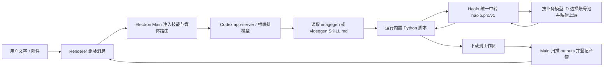
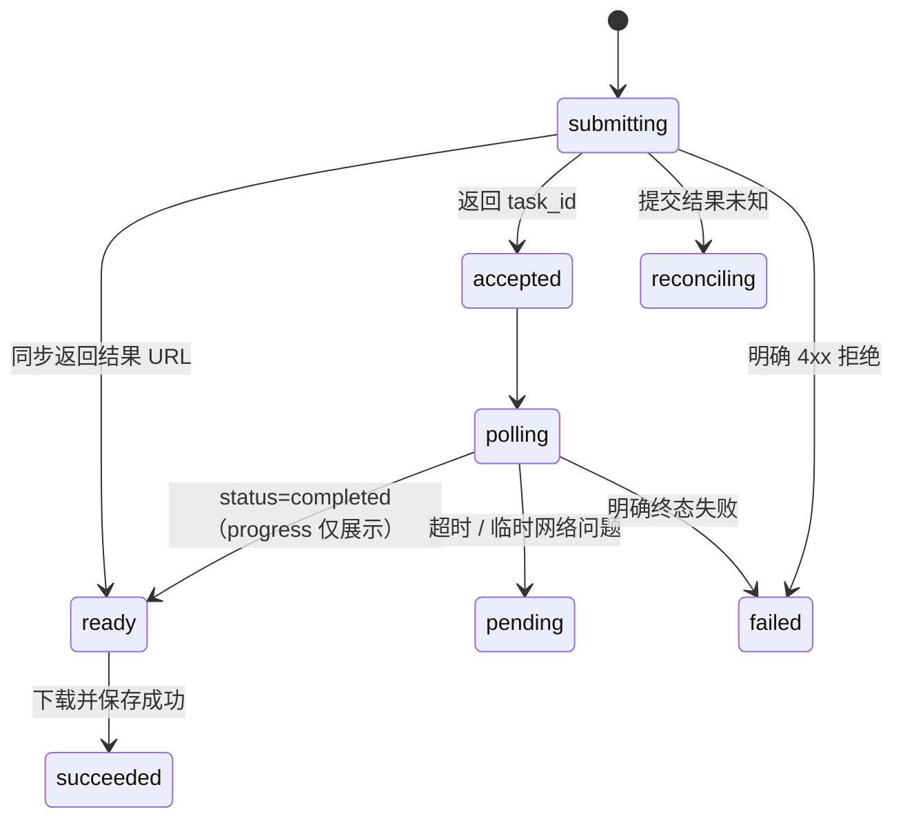
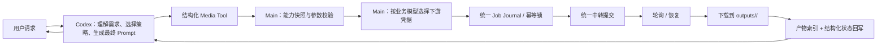

# Haolo 普通执行模式生图 / 生视频链路报告

> 审计日期：2026-07-25
> 客户端版本：`0.1.158`
> 代码基线：`f4abb04`
> 审计范围：Haolo 桌面端“普通执行模式”为主，同时覆盖“媒体创作 → 生图模式”和“视频专家”的同模型供应商兜底。

## 一、结论摘要

普通执行模式的媒体生成不是 Renderer 直接调用生图/视频 API，也不是 Electron Main 根据固定参数直接调用模型。它是一条“Codex 根编排 + 本地技能脚本 + Haolo 集中中转”的模型参与式链路：



核心判断如下：

1. **普通模式的最终脚本参数由 Codex 根据技能说明生成，不是客户端硬编码。** 客户端只负责强制路由、提供技能、上传附件、启动本轮和回收产物。因此，模型是否严格遵循技能说明，是主链中的实际控制点。
2. **生图链路具备较完整的防重复提交能力。** 它先做本地提示词预设校验，再由 Director 提交；每个请求有 UUID、哈希、任务日志、进程锁和恢复语义。
3. **生视频链路是标准异步任务，但缺少与生图等价的本地任务日志和恢复入口。** 提交后会轮询并下载；一旦提交后进程超时或退出，技能说明要求“不要重复提交”，但脚本本身没有按 `task_id` 恢复的命令参数。
4. **截图中“先读技能说明，确认模型、参数和脚本调用方式”是根编排模型发出的过程说明，不是 Seedance 后端状态。** 真正的后端状态存在于 Python 脚本的提交响应和轮询响应中。
5. **普通视频链与视频专家链不是同一条链。** 普通视频由 Codex 调脚本；视频专家由 Main 进程直接校验参数、选择业务模型凭证并运行同一视频脚本。后者更确定，也带交互 ID、会话 ID和时间戳文件名。
6. 当前存在三项高优先级工程风险：
   - 视频技能示例把结果保存到 `output/videogen/`，但普通聊天的产物扫描根目录是 `outputs/`。
   - 视频脚本没有幂等任务日志和恢复机制。
   - 普通视频脚本只从环境变量取通用下游 Key，不像生图 Director 那样按模型读取业务模型池凭证文件。

## 二、普通执行模式的公共前半链路

### 2.1 用户输入与附件上传

Renderer 的发送入口是 `sendCurrentMessage()`：

1. 读取输入框和当前附件。
2. 如果附件仍在上传，等待上传完成；上传失败则不发送。
3. 附件通过 AgentMS 的签名上传流程写入对象存储：
   - 请求上传签名；
   - `PUT` 文件；
   - 确认上传；
   - 创建素材记录；
   - 得到 `object_key`、素材 ID 和可供模型使用的 URL。
4. `composerAgentText()` 把用户原文、附件 URL、`object_key`、本地路径等组装成给 Codex 的文本。

因此，普通模式中的图生图、图生视频参考图不是直接把 Renderer 的内存图片传给生成 API，而是：

```text
本地文件 / 剪贴板图片
  → AgentMS 获取上传签名
  → 对象存储
  → 返回素材 URL
  → URL 写入 Codex 本轮上下文
  → Codex 将 URL 传给媒体脚本
```

关键代码：

- `src/renderer/main.ts`：`sendCurrentMessage()`、`composerAgentText()`、`uploadQueuedFile()`
- `src/main/youle-api-client.mjs`：`uploadMaterialFile()`

### 2.2 普通聊天进入 Codex，而不是媒体专用 IPC

普通模式调用：

```text
Renderer api.sendMessage
  → preload: codex:sendMessage
  → Main ipcMain.handle("codex:sendMessage")
  → app-server thread/resume
  → app-server turn/start
```

Renderer 同时传入当前聊天模型、推理强度、工作目录、审批策略和沙箱策略。当前普通执行模式固定为：

```text
approvalPolicy = never
sandboxPolicy  = danger-full-access
```

这意味着媒体脚本能够直接写入本地工作区并发起网络请求，不需要用户逐次批准。

### 2.3 技能安装、刷新与强制注入

App Server 启动时，桌面端把安装包中的：

```text
resources/default-haolo-ai/skills/.system/imagegen
resources/default-haolo-ai/skills/.system/videogen
```

同步到当前线程组隔离的 Codex Home：

```text
<thread-group>/haolo-ai-home/skills/.system/
```

每次发送前，Main 都会刷新技能清单并生成 Developer Instructions。即使 app-server 自己的 `skills/list` 漏掉媒体技能，`withMandatoryMediaSkillDefinitions()` 仍会把 `imagegen` 和 `videogen` 补入可用技能。

### 2.4 双层媒体意图识别

目前存在两套独立正则：

| 位置 | 作用 |
|---|---|
| Renderer | 判断普通聊天是否应附加“视频专家”入口；部分媒体状态/UI 分类也使用 Renderer 正则 |
| Main | 在真正的 `turn/start` 输入前识别生图/生视频意图，并注入本轮强制路由 |

Main 的 `buildTurnInputWithGroupMemory()` 会先移除旧的 Haolo 内部块，再调用 `buildTurnMediaRoutingReminder()`。识别到媒体请求后，Codex 实际收到的本轮输入类似：

```text
<haolo_media_routing_reminder>
This turn asks for a media deliverable...
- Image route: read .../imagegen/SKILL.md and run generate_openai_image.py
- Video route: read .../videogen/SKILL.md and run generate_seedance_video.py
</haolo_media_routing_reminder>

用户原始请求
```

这个内部路由块不会作为用户消息原样显示。与此同时，线程级 Developer Instructions 还长期包含一份 `haolo_media_routing`，形成“线程级规则 + 本轮提醒”的双保险。

## 三、普通执行模式生图链路

### 3.1 路由与默认模型

普通执行模式识别到图片交付物后，Codex 被要求：

1. 读取 `imagegen/SKILL.md`。
2. 不使用内建 `image_gen`、OpenAI 官方生图工具或 HTML/CSS/SVG/PIL 替代。
3. 先运行本地提示词预设解析器。
4. 再运行 `generate_openai_image.py` Director。
5. 普通模式默认使用 `gpt-image-2`。

未由客户端或用户显式锁定模型时，普通模式的自动回退顺序为：

```text
gpt-image-2
→ gpt-image-2-1k
→ gpt-image-2-2k
→ 不鸣 / OtuAPI image2
```

其中末级裸 ID `image2` 与首级 `gpt-image-2` 是两个不同的模型契约，不能混用。末级仍由同一个 Director 提交，以保留预设检查、参考图、任务日志和防重复提交。

“媒体创作 → 生图模式”从实时模型目录锁定具体模型和尺寸。选中基础 `gpt-image-2` 时使用 `--exact-model --provider-fallback-only`：同步路由安全失败后只允许转 `gpt-image-2-1k` 异步链路，不经过 2K/3.5K。选中其他档位时仍使用 `--exact-model`，不换模型。**普通执行模式没有这层 Renderer 选型参数**，因此默认依次走 `gpt-image-2 → 1K → 2K → 3.5K`。

### 3.2 第一步：本地提示词预设闸门

Codex 先运行：

```powershell
python "$env:CODEX_HOME\skills\.system\imagegen\scripts\resolve_prompt_preset.py" `
  --request "用户原始请求" `
  --output-dir ".\outputs"
```

解析器只读取本地文件，不访问网络。其行为是：

1. 读取 `references/prompt-presets/index.md`。
2. 优先按最长关键词匹配最具体的预设。
3. 普通“生成照片”类请求可回退到“真实照片”预设。
4. 未命中时明确记录 `preset_id=none`。
5. 为本次请求创建 UUID4。
6. 计算用户原文和预设文件的 SHA-256。
7. 写入：

```text
outputs/.media-jobs/preset-check-<request_id>.json
```

返回内容包含 `preset_id`、`preset_text`、`request_id`、哈希和 `check_file`。

### 3.3 第二步：Codex 增强提示词

Codex 根据技能规则合并：

```text
用户原始要求
+ 命中的本地预设（如有）
+ 主体、场景、构图、光线、风格等必要控制项
+ 精确可见文字、身份、数量、尺寸和禁止项
```

这里是模型参与步骤。客户端没有一个确定性的 Prompt Builder；Director 只负责校验和补齐，增强文本本身由 Codex 生成。

### 3.4 第三步：Director 校验与提交

典型调用：

```powershell
python "$env:CODEX_HOME\skills\.system\imagegen\scripts\generate_openai_image.py" `
  --prompt "增强后的提示词" `
  --user-request "用户原始请求" `
  --preset-check-file "预设校验文件" `
  --prompt-output ".\outputs\image-generation-prompt.txt" `
  --output-dir ".\outputs" `
  --basename "image" `
  --model "gpt-image-2" `
  --quality "auto" `
  --size "auto" `
  --output-format "png" `
  --timeout 600
```

Director 在联网前会再次验证：

- 校验文件必须由解析器创建且不能被搬移；
- `request_id` 必须是规范 UUID4；
- 用户原文 SHA-256 必须一致；
- 当前解析器重新计算的匹配结果必须一致；
- 命中预设时，预设路径和文件 SHA-256 必须一致；
- 已存在任务时，Prompt、模型、尺寸、质量、图片和输出路径不得漂移。

若增强 Prompt 漏掉用户原文或已验证的预设全文，Director 会把缺失层自动追加到最终提交 Prompt。

### 3.5 模型、接口与请求体

| 模型 / 模式 | 提交接口 | 请求形式 | 完成形式 |
|---|---|---|---|
| `gpt-image-2` 文生图 | `POST /v1/images/generations` | JSON | 通常同步返回 URL |
| `gpt-image-2` 单图编辑 | `POST /v1/images/edits` | multipart，脚本先下载并校验参考图 | 通常同步返回 URL |
| `gpt-image-2-1k` | `POST /v1/videos` | JSON；中转改写上游模型为 `gpt-image-2-1k-async` | 返回 `task_id`，只以 `status=completed` 完成，结果读 `video_url` 或 `/v1/videos/{task_id}/content` |
| `gpt-image-2-2k` | `POST /v1/videos` | JSON | 返回 `task_id`，轮询 `/v1/videos/{task_id}` |
| `gpt-image-2-3.5k` | `POST /v1/videos` | JSON | 返回 `task_id`，轮询 `/v1/videos/{task_id}` |
| 不鸣 / OtuAPI `image2` | `POST /v1/images/generations` | JSON；多参考图使用 `image` 数组 | 同步 URL 或 Base64 |

默认 `gpt-image-2` 文生图请求体：

```json
{
  "model": "gpt-image-2",
  "prompt": "...",
  "size": "auto",
  "quality": "auto",
  "response_format": "url",
  "n": 1
}
```

请求头包含：

```text
Authorization: Bearer <用户下游中转凭据>
X-Haolo-Model-Pool: media_creation
X-Haolo-Model-Capability: image_generation
```

客户端不会取得或保存上游厂商 Key。Director 支持从 `HAOLO_MODEL_CREDENTIALS_FILE` / `auth.json` 中按当前业务模型选择下游路由凭据和 Base URL；其实际 Key 选择顺序是：环境变量 `LLMHUB_API_KEY` → `auth.json` 中的 `LLMHUB_API_KEY` → 按模型凭据 → `SUB2API_API_KEY` → Provider Key → `OPENAI_API_KEY`。因此，只有通用 LLMHub Key 未配置时，按模型凭据才会成为首选。

末级不鸣 `image2` 是例外：Director 按该模型的独立中转契约使用主进程注入的 `OPENAI_API_KEY` / `OPENAI_BASE_URL`，并且不发送 `X-Haolo-Model-Pool: media_creation` 路由头。

### 3.6 防重复提交与恢复

Director 在真正 POST 前创建：

```text
outputs/.media-jobs/image-<request_id>.json
outputs/.media-jobs/image-<request_id>.json.lock
```

状态大致为：



关键语义：

- 一旦拿到 `task_id`，再次运行完全相同的命令会恢复轮询，不会再次 POST。
- 提交后断线且不知道服务端是否受理时进入 `reconciling`，禁止自动重提。
- 同一校验文件被另一个进程执行时返回 `active_elsewhere`。
- 轮询期间的 429、5xx、连接重置按可用性问题处理，不直接判定生成失败。
- 提交阶段若中转明确返回机器可读错误信封 `code=UPSTREAM_TEMPORARILY_UNAVAILABLE`、`retryable=true`、`route_exhausted=true`，Director 会记录 `accepted=false`，将当前模型判为可安全回退，并返回下一个模型。
- 对旧版本已经写成 `reconciling` 的任务日志，Director 仅在其保存的错误文本仍能完整验证上述机器字段时，才会安全升级为“明确未受理”；无结构的历史 502 仍保持待核对状态。
- 连接中断、读取超时、无结构 429/5xx 或格式损坏的响应仍进入 `reconciling`，因为这些情况不能证明请求未被受理，不得自动切模型。
- 已成功任务再次执行时，若本地文件仍存在，直接返回既有结果。

### 3.7 下载、文件与回写

结果支持公网 URL、中转同源 URL和 `data:image/...`：

- 同源中转下载会带 Bearer 凭据；
- 文件名带时间戳和序号，例如 `image-20260725-120000-1.png`；
- 同时保存 Prompt 文本和元数据 JSON；
- 元数据记录提交响应、轮询响应、源 URL、本地文件、request ID 和预设摘要。

Codex 读取脚本 JSON 输出后，在最终答复中给出图片路径、Prompt 路径和预设 ID。Main 在 `turn/started` 时拍摄 `outputs/` 快照，在 `turn/completed` 时扫描差异、登记结果产物，并把图片附件绑定到本轮最后一个 Agent Message。

## 四、普通执行模式生视频链路

### 4.1 模型选择

视频技能脚本自身的默认模型是：

```text
grok-imagine-video-1.5
```

它同时支持文生视频和单图图生视频，参考图可选。

普通执行模式现在对未显式指定模型的请求采用以下自动优先级：

```text
文本或单张参考图：先使用 AIHubCC Grok 1.5
单张公网参考图安全失败后：Buming Grok → AIHubCC Omni Fast
每次只在脚本明确返回 fallback_allowed=true 时前进一步
纯文本：从 AIHubCC Grok 1.5 开始；跳过仅支持图生视频的回退模型
源视频：Omni Fast V2V
```

因此，普通模式的实际规则是：

- 纯文本或带一张参考图：Codex 首先调用 AIHubCC `grok-imagine-video-1.5`。
- 当前路由在提交阶段没有返回 task ID（包括普通 429/5xx、断线、非 JSON 或格式损坏响应），或任务进入明确失败终态时，脚本返回 Buming `aihubcc/grok-video-3.5` 作为下一步；Buming 发生同类提交失败后可继续返回 AIHubCC `omni-fast-no-water`。
- 纯文本请求：Codex 先使用 `grok-imagine-video-1.5`，安全失败时跳过仅支持图生视频的 Buming 路由。
- Seedance 不再自动选择；只有客户端或用户明确指定 Seedance 时才使用，并且显式选择不应用自动回退。
- 提交阶段未拿到 task ID 时立即启动下一路由，产品明确接受潜在双任务和重复计费；一旦已拿到 task ID，queued、pending、processing 或仅轮询超时都不启动下一路由。
- 视频专家锁定用户所选模型：若选中 AIHubCC Grok，Main 使用 `--exact-model --provider-fallback-only`，仅允许同模型的 Buming Grok 兜底，不再转 Omni。

截图中的回复“Seedance 支持参考图，使用 4 秒或 6 秒短片”来自修改前的技能选型判断，不是 Renderer 自动选择。按当前规则，同样的单图请求应先选择 Grok，而不是 Seedance。

### 4.2 参数构造与模型契约

普通纯文本视频典型调用：

```powershell
python "$env:CODEX_HOME\skills\.system\videogen\scripts\generate_seedance_video.py" `
  --prompt "增强后的提示词" `
  --model "grok-imagine-video-1.5" `
  --input-mode "text-to-video" `
  --aspect-ratio "9:16" `
  --resolution "720p" `
  --duration "6" `
  --output-dir ".\outputs\videogen" `
  --basename "video" `
  --timeout 900
```

脚本首先执行本地合同校验：

- 所有媒体 URL 必须是公网 HTTP(S)；
- `text-to-video` 不允许携带参考媒体；
- `image-to-video` 要求恰好一张图；
- 首尾帧模式要求恰好两张图；
- V2V 要求 1–2 个视频；
- Seedance 当前最多 4 图、3 视频、1 音频；
- Seedance 的参考视频或音频必须搭配至少一张主图；
- 模型、时长、比例和分辨率组合必须在脚本能力表中。

### 4.3 各模型请求体

普通单图请求首先使用 Grok：

```json
{
  "model": "grok-imagine-video-1.5",
  "prompt": "...",
  "image": "https://...",
  "seconds": "6",
  "aspect_ratio": "9:16",
  "resolution": "720p"
}
```

AIHubCC Grok 安全失败后，Buming 同模型兜底使用独立的嵌套请求体：

```json
{
  "model": "aihubcc/grok-video-3.5",
  "prompt": "...",
  "params": {
    "images": ["https://..."],
    "aspect_ratio": "9:16",
    "resolution": "720p",
    "duration": 6
  }
}
```

桌面端向统一中转提交整数时长，避免中转在创建 AIHubCC 任务前预校验 Buming 备用契约时把字符串时长判为无效；中转转发 AIHubCC 上游时再按其协议序列化为字符串。

Buming Grok 也安全失败后，普通任务的末级 Omni 回退使用：

```json
{
  "model": "omni-fast-no-water",
  "prompt": "...",
  "images": ["https://..."],
  "aspect_ratio": "9:16",
  "duration": 10
}
```

Omni 纯文本请求不发送 `images`；Omni V2V 使用 `videos`。

Seedance 仍是显式可选模型。它的业务模型 ID 原样提交，不发送独立 `resolution` 字段，因为清晰度已经编码在 ID 中；参考图使用 `reference_image_urls`，首尾帧使用 `first_image_url` 和 `last_image_url`，参考视频和音频分别使用 `reference_videos`、`reference_audios`。有参考图时，脚本会在 Prompt 缺少绑定词的情况下自动增加 `@image1`、`@image2` 等引用说明。

### 4.4 提交、轮询和账号池路由

Grok 1.5 使用新的直接异步提交：

```text
POST https://haolo.pro/v1/videos
```

请求头包含 Bearer 下游凭据；如果环境中存在交互信息，还会携带：

```text
X-Haolo-Interaction-ID
X-Haolo-Conversation-ID
X-Haolo-Source-Type
X-Haolo-Model-Pool
X-Haolo-Model-Capability
```

统一中转按业务模型 ID选择账号池并完成实际的上游模型映射。桌面端不选择具体账号，也不持有上游 Provider Key。

提交响应解析 `task_id` 或兼容字段 `id`。Grok 1.5 的轮询地址优先使用提交响应中的 `polling_url`，否则使用：

```text
GET https://haolo.pro/v1/videos/<task_id>
```

默认每 5 秒轮询一次，最长 900 秒。Windows 优先使用 `curl`，其他平台或显式配置时可使用 `urllib`。除非设置 `HAOLO_GEN_USE_PROXY=1`，请求默认绕过系统代理，避免长连接被本地代理提前断开。

Grok 1.5 成功条件：

```text
status = completed
+ 能解析出 video_url / result_url / url / content_url
```

明确失败状态或 `is_final=true` 且没有成功结果会写入终态日志。拿到 task ID 后的临时网络、轮询超时和 429/5xx 会写为 `pending`，同一 request ID 恢复轮询而不再次 POST。提交阶段未拿到 task ID 的普通 429/5xx、断线、非 JSON 或缺字段响应会写为可回退失败，并返回下一模型；该策略明确接受原路由可能已经受理所带来的重复生成风险。

### 4.5 下载与回写

脚本下载结果到：

```text
<output-dir>/<basename>.mp4
```

同源中转下载会带 Bearer 凭据；下载先写 `.part` 文件，再原子替换正式文件。脚本最终输出：

```json
{
  "ok": true,
  "model": "grok-imagine-video-1.5",
  "task_id": "...",
  "status": "completed",
  "saved": ".../video.mp4",
  "source_url": "...",
  "duration": "6"
}
```

Codex 应在最终回复中给出本地视频路径和最终 Prompt，但不得展示实际模型名称、供应商名称或任务 ID；这些字段只保留在脚本 JSON 与恢复日志中。若文件位于 `outputs/` 下，Main 会像生图一样在本轮结束后登记并附加到 Agent Message。Renderer 还会对包含“视频已生成”或“成品视频”的历史与新消息做定向脱敏，避免旧记录继续显示这些内部字段。

## 五、截图现象对应

截图中的关键文字是：

> “我会走 Haolo 的视频生成技能……先读技能说明，确认模型、参数和脚本调用方式，然后直接提交生成。”

它对应链路中的：

```text
Main 注入 videogen 强制路由
  → Codex 读取 SKILL.md
  → Codex 根据参考图和用户动作选择模型 / 时长 / Prompt
```

第二段：

> “技能说明里 Seedance 支持参考图……我会用 4 秒或 6 秒短片……”

对应修改前 Codex 的参数决策阶段。当前普通任务已改为单图请求依次尝试 AIHubCC Grok、Buming Grok、AIHubCC Omni Fast，因此新请求不应再自动选择 Seedance。无论选用哪个模型，这段自然语言都不是：

- 上传完成确认；
- 中转已接受任务；
- 视频中转已返回 `task_id`；
- 轮询进度；
- 计费成功确认。

只有在命令实际执行并打印提交 JSON 后，才能证明任务已进入中转。截图底部“正在思考”也是 Codex 本轮通用忙碌状态，不等价于视频任务的 `queued` / `processing` 状态。

## 六、普通模式与专用模式对比

| 项目 | 普通执行模式 | 生图模式 | 视频专家 |
|---|---|---|---|
| 入口 | 普通 Codex 对话 | 媒体创作中的图片模式 | 视频专家 Provider 线程 |
| 谁选择参数 | Codex 按 `gpt-image-2 → 1K → 2K → 3.5K` | Renderer 锁定模型/尺寸；基础 Image2 仅允许转 1K 异步兜底 | Renderer + Main 确定性校验；选中 Grok 仅允许 Buming 同模型兜底 |
| 谁运行脚本 | Codex Shell | Codex Shell | Electron Main |
| 模型凭据 | 生图和视频均可按模型读凭据文件 | 生图按模型凭据；Buming 复用同家族路由凭据 | Main 调用 `businessModelCredential()`；Buming Grok 复用所选 Grok 凭据 |
| 交互/会话追踪头 | 脚本按 request/conversation ID 注入 | 同普通生图 | Main 显式注入 |
| 输出文件名 | 由 Codex 命令决定 | 由 Codex 命令决定 | Main 使用时间戳 basename |
| 可选跟进入口 | 视频请求会附加“视频专家”按钮 | 无 | 本身就是专家链 |

普通模式附加“视频专家”按钮并不会取消普通视频生成。正确产品语义是：

```text
普通链先直接生成视频
+ 结果消息可提供“视频专家”作为可选后续入口
```

## 七、问题与风险

### 本轮已处理：视频产物、日志恢复与模型凭据

- 技能命令和 Main 直连统一把视频写入 `outputs/videogen/`，进入现有产物扫描范围。
- 视频脚本使用 `request_id + conversation_id + journal + submit lock + payload hash`；拿到 task ID 后可恢复轮询，提交阶段没有 task ID 时把当前尝试封存为失败并授权下一模型，并发相同 request ID 仍只允许一次 POST。
- `--resume-latest` 会先读本地日志，再查询中转的 24 小时用户任务索引，不会创建替代任务。
- 普通视频脚本可从 `HAOLO_MODEL_CREDENTIALS_FILE` / `auth.json` 按业务模型读取凭据。Buming Grok 兼容 ID 复用 AIHubCC Grok 的业务路由凭据，并使用自己的供应商契约。
- 模型切换必须由脚本的结构化 `fallback_allowed` 元数据授权；无 task ID 的 429/5xx、断线和格式损坏会授权下一模型，拿到 task ID 后的读取或轮询超时仍只恢复原任务。

### P1-1：普通链的确定性依赖模型遵循技能

Main 只注入规则，不直接调用脚本。Codex 仍可能：

- 先输出长篇计划；
- 选错模型或漏参数；
- 没有把附件 URL 传入；
- 拿到 task ID 后仍错误启动下一路由，形成不受产品策略允许的重复任务；
- 选择不一致的输出目录。

建议：

- 保留 Codex 做 Prompt 和模型策略判断；
- 把“提交、轮询、恢复、下载”收口成结构化媒体工具；
- 工具参数由 Schema 校验，凭据和幂等由 Main 强制执行。

### P1-2：两套媒体意图正则可能漂移

Renderer 与 Main 的关键词和排除条件不同。例如 Renderer 对“生成视频脚本/文案”有专门排除，Main 的媒体正则更宽。

影响：

- UI 可能不显示视频专家入口，但 Main 强制路由到视频技能；
- 或 UI 判定为视频请求，Main 没注入技能提醒。

建议：抽成一个共享模块和统一测试向量。

### P1-3：普通视频默认参数来自静态技能而非实时能力目录

技能文字写死 AIHubCC Grok → Buming Grok → Omni 的优先级以及各路由默认参数；脚本也维护一份静态 `MODEL_OPTIONS`。实时模型池或维护限制变化时，普通模式可能滞后。

建议：

- 脚本提交前读取已认证能力快照；
- 静态表只做离线兜底；
- 在请求中记录能力快照版本。

### P1-4：UI 的“正在思考”不是结构化媒体进度

普通模式展示的是 Codex 通用执行状态。用户无法仅凭 UI 区分：

```text
正在读技能
正在生成 Prompt
正在上传
已提交 / queued
processing
正在下载
已保存
```

建议：

- 从脚本输出结构化事件；
- Main 转换为媒体任务状态；
- Renderer 显示真实 `task_id`、模型、阶段和最近更新时间，不显示虚假百分比。

## 八、建议的目标链路

目标不是取消 Codex，而是把“创意判断”和“不可重复的网络副作用”分层：



推荐改造顺序：

1. 合并 Renderer / Main 的媒体意图识别。
2. 把普通媒体提交收口为结构化工具，Codex只负责 Prompt 与策略。
3. 让脚本能力表由已认证能力快照驱动。
4. Renderer 展示真实媒体任务状态。

## 九、关键代码索引

| 环节 | 文件 / 入口 |
|---|---|
| 普通消息发送 | `src/renderer/main.ts` → `sendCurrentMessage()` |
| 附件上传 | `src/renderer/main.ts` → `uploadQueuedFile()` |
| 素材签名、上传、确认 | `src/main/youle-api-client.mjs` → `uploadMaterialFile()` |
| 附件上下文组装 | `src/renderer/main.ts` → `composerAgentText()` |
| 普通 Codex IPC | `src/main/main.mjs` → `ipcMain.handle("codex:sendMessage")` |
| 每轮媒体强制路由 | `src/main/main.mjs` → `buildTurnMediaRoutingReminder()` |
| 线程级媒体规则 | `src/main/main.mjs` → `buildHaoloMediaDeveloperInstructions()` |
| 内置技能同步 | `src/main/app-server-client.mjs` → `syncDefaultCodexResources()` |
| App Server 凭据环境 | `src/main/app-server-client.mjs` → `loadDefaultCodexAuthEnv()`、`buildAppServerEnv()` |
| 生图预设解析 | `resources/default-haolo-ai/skills/.system/imagegen/scripts/resolve_prompt_preset.py` |
| 生图提交 / 恢复 | `resources/default-haolo-ai/skills/.system/imagegen/scripts/generate_openai_image.py` |
| 生视频提交 / 轮询 | `resources/default-haolo-ai/skills/.system/videogen/scripts/generate_seedance_video.py` |
| 产物扫描与通知 | `src/main/main.mjs` → `snapshotThreadArtifacts()`、`notifyThreadArtifactsChanged()` |
| 产物绑定消息 | `src/renderer/main.ts` → `attachPersistedResultArtifactsToThread()` |
| 视频专家确定性直调 | `src/main/main.mjs` → `runVideoGenerationSkill()`、`videoGenerationSkillEnv()` |

## 十、最终判断

当前普通执行模式已经具备可用的端到端媒体能力：

```text
意图识别
→ 强制技能路由
→ 本地脚本
→ 用户下游中转凭据
→ 统一账号池
→ 异步任务
→ 本地下载
→ 聊天产物回写
```

生图和生视频现在都具备任务日志、幂等锁、恢复语义、按模型凭据和受保护的回退授权。普通任务的图片链是 `gpt-image-2 → 1K → 2K → 3.5K`，视频链是 `AIHubCC Grok → Buming Grok → AIHubCC Omni Fast`；媒体创作中的基础 Image2 则只允许同步失败后转 1K 异步。剩余主要风险是普通链仍依赖 Codex 遵循技能、静态能力表可能滞后，以及 UI 尚未展示完整结构化媒体进度。截图中的自然语言步骤只能说明 Codex 已进入技能规划阶段，不能单独证明视频任务已提交或完成。
