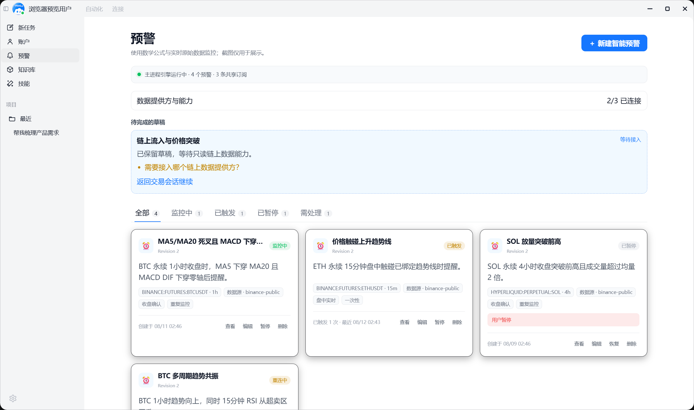
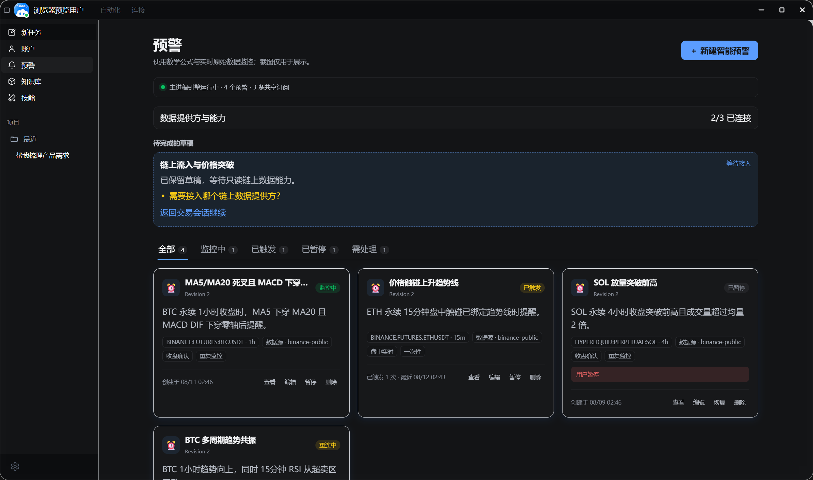
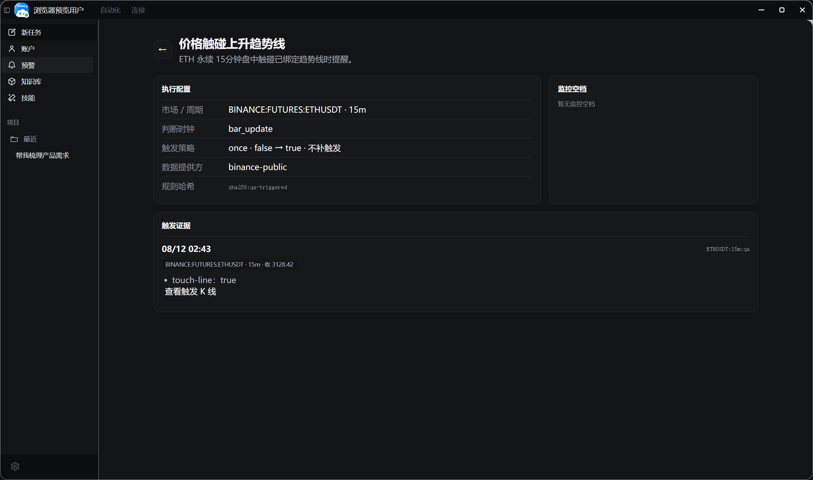
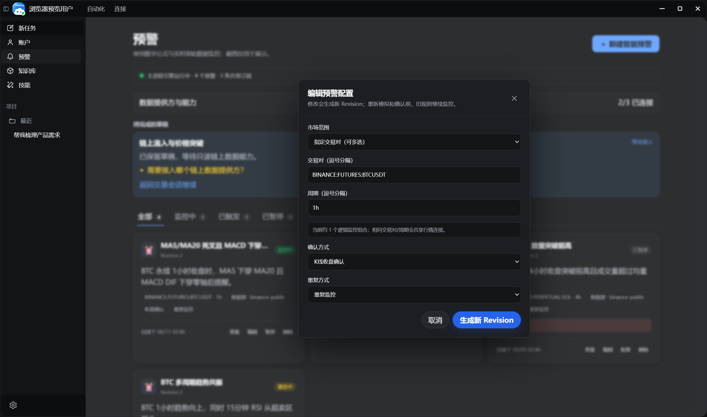

# Trading Alert Windows 实机视觉验收记录

> 验收日期：2026-08-12  
> 环境：Windows、Electron 39.8.10、Chromium 142.0.7444.265  
> 入口：production Vite build，经真实 Electron `BrowserWindow.capturePage()` 渲染  
> 结果：通过

## 覆盖矩阵

- 亮色与暗色主题。
- 100%、125%、150% 缩放。
- 预警列表、状态卡片、待补能力草稿、监控空档。
- 触发详情、Evidence、K 线深链入口。
- Revision 编辑器及输入控件。
- 加载态、错误态、焦点、禁用及 reduced-motion 契约。
- 14 张截图均通过无横向溢出、无无关弹窗遮挡和关键卡片文字对比度检查；亮色卡片对比度 17.74，暗色 16.14。

首次实机截图暴露出内容较少时预警主页面作为 flex 子项收缩的问题；已在 `.trading-alerts-page` 增加 `flex: 1 1 auto` 与 `box-sizing: border-box`，重建后重新执行完整矩阵并通过。

## 代表性截图

亮色列表：

暗色列表：

暗色触发证据详情：

亮色 Revision 编辑器：

完整机器报告见 [report.json](./report.json)，其余截图与本文件位于同一目录。
