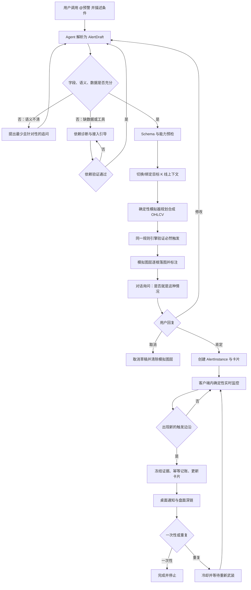
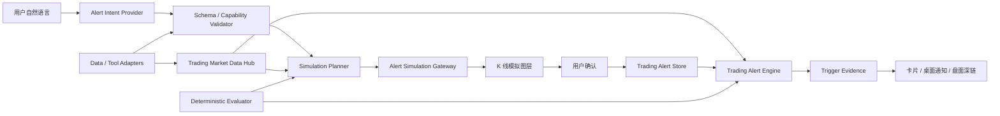
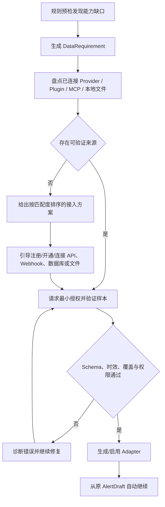

# Haolo 智能交易预警技术规格

> 文档状态：已冻结的开发基线  
> 规格版本：1.0.0  
> 创建日期：2026-08-12  
> 最近更新：2026-08-12  
> 适用仓库：`youle_desktop`  
> 配套进度台账：[trading-alert-agent-progress.zh-CN.md](./trading-alert-agent-progress.zh-CN.md)  
> 安全与性能报告：[trading-alert-agent-security-performance-report.zh-CN.md](./trading-alert-agent-security-performance-report.zh-CN.md)  
> 灰度与发布手册：[trading-alert-agent-release-runbook.zh-CN.md](./trading-alert-agent-release-runbook.zh-CN.md)  
> 上位交易架构：[trading-expert-realtime-ai-execution-plan.zh-CN.md](./trading-expert-realtime-ai-execution-plan.zh-CN.md)

## 1. 文档用途与更新规则

本文把已确认的“智能交易预警”产品需求固化为可以直接拆分、实现、测试和验收的工程规格。开发开始前必须先阅读本文及配套进度台账；开始一个任务时先把进度台账中的稳定任务编号改为 `进行中`，完成代码、测试和验收证据后才能改为 `已完成`。

如果实现需要改变本文的核心语义，必须先在本文第 22 节追加 ADR，并同步修改进度台账。不得只改代码而让产品行为与文档分叉。

本文中的“必须”是发布阻断条件；“建议”可以通过 ADR 调整，但不能静默偏离。

## 2. 已确认的产品契约

### 2.1 最终目标

用户通过交易专家输入框调用 `@预警`，用自然语言描述任意可计算的行情条件。系统必须：

1. 理解条件、作用范围、触发时机和重复策略。
2. 对不明确或条件不足的部分持续追问，直到形成无歧义、可执行的规则。
3. 使用当前 K 线画布，或先切换到用户指定的交易对和周期。
4. 基于真实历史上下文，严谨计算一段能够触发规则的模拟未来 K 线，并在画布上以独立模拟图层绘制和标注。
5. 在对话中询问用户“是否就是这种情况”。
6. 只有用户明确肯定后，才在“预警”页面创建监控卡片。
7. Haolo 客户端运行期间持续用原始行情数据和确定性数学规则监控；不通过截图识别 K 线。
8. 真实触发后保存证据、更新卡片并弹出类似任务完成通知的桌面通知；点击通知回到对应盘面和触发位置。

### 2.2 固定默认值

| 决策 | 默认值 | 用户明确表达时 |
|---|---|---|
| 运行范围 | 仅 Haolo 客户端运行时监控 | 首版不扩展为云端或关机监控 |
| 指标、K 线形态、收盘价条件 | K 线收盘确认后触发 | 可改为盘中实时候选或其他明确语义 |
| 价格触碰、突破、用户画线触碰 | 盘中实时触发 | 可要求收盘确认、连续确认或容差 |
| 生命周期 | 一次性 | 可改为重复监控 |
| 断线或停机恢复 | 不补触发，只从恢复后继续 | 不允许后台推断并补发空档期信号 |
| 恢复时条件已经成立 | 不立即触发，先建立基线并等待新的触发边沿 | 用户明确要求“恢复即检查”时才可采用另一策略，且需二次确认 |
| 未指定交易对/周期 | 继承当前活动 K 线窗格 | 用户指定时先切换或绑定指定上下文 |

### 2.3 组合能力目标

规则必须支持无限数量的结构化组合，而不是为每一句话硬编码一个分支。至少支持：

- `AND`、`OR`、`NOT` 和任意嵌套分组；
- 同一交易对或跨交易对条件；
- 同一周期或多周期条件；
- “同时”“先 A 后 B”“A 后 N 根 K 线内 B”“连续 N 根成立”；
- 价格、OHLCV、涨跌幅、成交量、指标、指标交叉、K 线形态、时间、用户画线；
- 一次性、重复、冷却时间、每日/总触发次数限制；
- 安全的自定义数学表达式；
- 通过数据适配器扩展资金费率、持仓量、盘口、逐笔、爆仓、链上数据、情绪数据等外部字段。

例如“MA5 和 MA20 发生死叉，同时 MACD 的 DIF 下穿 0 轴”应被编译为两个同一确认事件上的 `cross_under` 事件，再由 `AND` 组合，而不是每个行情事件调用大模型重新解释。

### 2.4 明确不做

- 不用实时截图、OCR、像素颜色或视觉模型作为触发事实源。
- 不让大模型直接运行监控循环、直接操作 DOM/SVG、持有行情连接或决定某次真实触发。
- 不执行用户输入的任意 JavaScript、Python、Shell 或未审计代码。
- 不自动下单、不连接交易账户、不把预警描述成收益保证。
- 不在停机、休眠、断网空档内补触发。
- 不因暂时缺数据就直接拒绝创建；必须先执行第 14 节的“完成优先”依赖补齐流程。

## 3. 术语与身份

- `marketId`：稳定市场身份，至少包含 Provider、Venue、MarketType、Symbol，例如 `BINANCE:FUTURES:BTCUSDT`。现货与永续不能只因 Symbol 相同而混为一体。
- `interval`：规则计算周期，例如 `1m`、`15m`、`1h`、`1d`。
- `AlertDraft`：仍可能需要追问或模拟的预警草稿。
- `AlertRule`：通过 Schema 校验的版本化规则树。
- `AlertInstance`：用户确认后创建的持久化监控实例。
- `EvaluationEvent`：触发一次确定性求值的行情事件，如 tick、聚合成交、K 线更新或 K 线收盘。
- `TriggerEdge`：条件从“不满足/未武装”进入“满足”的新边沿。
- `MonitoringGap`：Haolo 未能连续监控的时间段及原因。
- `SimulationScenario`：只用于确认用户意图的合成 K 线与标注；绝不能进入真实行情缓存或触发监控。
- `TriggerEvidence`：真实触发时冻结的行情、指标值、子条件结果、规则版本和数据来源。

全部时间在协议、计算和存储中使用 UTC Unix 毫秒；本地时区仅用于显示。

## 4. 端到端流程与状态机



### 4.1 草稿状态

`interpreting | awaiting_clarification | awaiting_data | awaiting_tool | awaiting_authorization | validating_dependency | ready_to_simulate | simulating | awaiting_confirmation | cancelled | confirmed`

### 4.2 监控状态

`arming | monitoring | reconnecting | paused | gap_detected | triggered | cooling_down | completed | failed`

状态必须持久化并对用户可见。`awaiting_*` 不是失败；系统要保留草稿、已确认字段、缺失项和下一步，依赖补齐后从原任务继续。

## 5. 自然语言理解与持续澄清协议

### 5.1 大模型的职责边界

大模型只负责：

- 从用户文本和已授权的当前画布上下文提取规则意图；
- 输出严格版本化的 `AlertDraft` JSON；
- 列出歧义、缺失字段、推断依据和需要追问的问题；
- 把确定性求值、模拟和触发证据解释给用户。

大模型不能：

- 自报“已触发”并代替求值器；
- 生成任意可执行脚本进入监控热路径；
- 自行新增用户没有确认的数据源、交易对、周期或画线；
- 把截图中的视觉相似当作数值条件。

模型输出是不可信输入，必须经过 JSON Schema、能力、市场身份、指标参数、时间语义和资源上限校验。

### 5.2 必须澄清的情形

以下任一情况存在时，不得直接模拟或创建：

1. 交易对象无法从当前画布或用户文本唯一确定。
2. “突破”“触碰”“附近”“放量”“大跌”等词没有可继承的已确认定义。
3. 指标参数、数据字段或价格源可能有多种合理解释。
4. “同时”可能指同一 tick、同一根收盘 K 线或 N 根窗口。
5. 盘中条件和收盘条件混合，但触发时钟不明确。
6. 主观形态没有可计算定义或规则包版本。
7. 多周期条件没有说明以哪个事件作为最终判定时钟。
8. 重复预警没有说明重新武装方式，而默认方式会明显偏离用户意图。
9. 所需数据覆盖不足、延迟过大或供应方不匹配。
10. 条件在数学上冲突，或模拟器在约束预算内找不到可行解。

追问应一次只问会改变规则语义的最小问题集合；已确认字段不得重复询问。每轮修改后重新生成规则摘要和模拟，旧确认自动失效。

### 5.3 用户确认协议

对话气泡至少展示：

- 人类可读规则摘要；
- 绑定市场与周期；
- 每个子条件；
- `盘中实时` 或 `收盘确认`；
- “同时/顺序/窗口/持续”语义；
- 一次性或重复；
- 数据源与可用性；
- 模拟图层说明。

只有语义明确的肯定回复才创建，例如“是”“确认”“就这样”“创建”。“差不多”“先看看”“可能”不视为确认。确认绑定 `draftId + ruleHash + simulationId`；任何规则或模拟变化都会使旧确认失效。

## 6. 版本化 Alert DSL / AST

### 6.1 顶层契约

```ts
interface AlertRule {
  schemaVersion: 1;
  ruleId: string;
  revision: number;
  title: string;
  root: BooleanNode;
  contexts: MarketContext[];
  evaluationPolicy: EvaluationPolicy;
  triggerPolicy: TriggerPolicy;
  dataRequirements: DataRequirement[];
  sourceText: string;
  normalizedSummary: string;
  createdAt: number;
}

interface MarketContext {
  contextId: string;
  marketSelector:
    | { kind: "fixed"; marketIds: string[] }
    | { kind: "current" }
    | { kind: "universe"; provider: string; venue: string; marketType: string; quoteAsset?: string };
  intervals: string[];
  drawingBinding?: {
    drawingId: string;
    drawingRevision: number;
    marketId: string;
    interval: string;
    geometryMode: "segment" | "ray" | "extended";
  };
}
```

### 6.2 布尔、事件和时间节点

```ts
type BooleanNode =
  | { type: "all"; children: BooleanNode[] }
  | { type: "any"; children: BooleanNode[] }
  | { type: "not"; child: BooleanNode }
  | { type: "condition"; condition: ConditionNode }
  | { type: "sequence"; steps: BooleanNode[]; within?: WindowSpec }
  | { type: "within"; child: BooleanNode; window: WindowSpec }
  | { type: "sustain"; child: BooleanNode; count: number; unit: "events" | "bars" }
  | { type: "count"; child: BooleanNode; atLeast: number; window: WindowSpec };

type ConditionNode = {
  conditionId: string;
  contextId: string;
  operator:
    | "gt" | "gte" | "lt" | "lte" | "eq" | "neq"
    | "inside" | "outside" | "touch" | "break_above" | "break_below"
    | "cross_over" | "cross_under" | "rises_by" | "falls_by";
  left: ValueExpr;
  right: ValueExpr;
  tolerance?: ToleranceSpec;
  confirmation?: "intrabar" | "bar_close";
};
```

### 6.3 值表达式

```ts
type ValueExpr =
  | { type: "constant"; value: number }
  | { type: "field"; field: "open" | "high" | "low" | "close" | "volume" | "last" | "mark" | "index" }
  | { type: "lag"; expr: ValueExpr; bars: number }
  | { type: "rolling"; op: "min" | "max" | "avg" | "sum"; expr: ValueExpr; period: number; offset?: number }
  | { type: "indicator"; name: string; params: Record<string, number | string>; output?: string }
  | { type: "drawing"; drawingId: string; output: "price_at_time" | "upper" | "lower" }
  | { type: "external"; capability: string; field: string; params?: Record<string, unknown> }
  | { type: "math"; op: "add" | "sub" | "mul" | "div" | "abs" | "min" | "max" | "percent_change"; args: ValueExpr[] };
```

`math` 只允许白名单运算、有限数值、受限深度和受限节点数。`lag` 与 `rolling` 只接受 1～5000 根的有界窗口；`rolling.offset=1` 表示窗口从上一根开始，严格排除当前柱。比如“当前量能大于前 3 根每一根的 3 倍”必须表达为 `volume > 3 × rolling(max, volume, period=3, offset=1)`，而“前 3 根平均量的 3 倍”使用 `rolling(avg, ...)`。除法为零、NaN、Infinity、窗口历史不足、缺数据或未知指标都返回显式 `unknown`，不得把 `unknown` 当作 `false` 静默吞掉。

### 6.4 求值与触发策略

```ts
interface EvaluationPolicy {
  clock: "tick" | "trade" | "bar_update" | "bar_close" | "mixed";
  anchorContextId: string;
  joinMode: "latest_closed" | "same_close_time" | "explicit_window";
  maxDataAgeMs: number;
  unknownPolicy: "do_not_trigger";
}

interface TriggerPolicy {
  mode: "once" | "repeat";
  edge: "false_to_true";
  rearm: "must_become_false" | "next_bar" | "after_cooldown";
  cooldownMs?: number;
  maxTriggersTotal?: number;
  maxTriggersPerDay?: number;
  resumePolicy: "baseline_only_no_catch_up";
}
```

### 6.5 组合示例

“任意永续交易对的任意周期，MA5 下穿 MA20，并且同一根收盘 K 线上 MACD DIF 下穿 0；只提醒一次。”

```json
{
  "schemaVersion": 1,
  "ruleId": "rule_example",
  "revision": 1,
  "title": "MA5/MA20 死叉且 MACD 下穿零轴",
  "root": {
    "type": "all",
    "children": [
      {
        "type": "condition",
        "condition": {
          "conditionId": "ma_cross",
          "contextId": "primary",
          "operator": "cross_under",
          "left": { "type": "indicator", "name": "sma", "params": { "period": 5 } },
          "right": { "type": "indicator", "name": "sma", "params": { "period": 20 } },
          "confirmation": "bar_close"
        }
      },
      {
        "type": "condition",
        "condition": {
          "conditionId": "macd_zero",
          "contextId": "primary",
          "operator": "cross_under",
          "left": { "type": "indicator", "name": "macd", "params": { "fast": 12, "slow": 26, "signal": 9 }, "output": "dif" },
          "right": { "type": "constant", "value": 0 },
          "confirmation": "bar_close"
        }
      }
    ]
  },
  "contexts": [
    {
      "contextId": "primary",
      "marketSelector": { "kind": "universe", "provider": "binance", "venue": "binance", "marketType": "perpetual" },
      "intervals": ["*"]
    }
  ],
  "evaluationPolicy": {
    "clock": "bar_close",
    "anchorContextId": "primary",
    "joinMode": "same_close_time",
    "maxDataAgeMs": 5000,
    "unknownPolicy": "do_not_trigger"
  },
  "triggerPolicy": {
    "mode": "once",
    "edge": "false_to_true",
    "rearm": "must_become_false",
    "resumePolicy": "baseline_only_no_catch_up"
  },
  "dataRequirements": [],
  "sourceText": "...",
  "normalizedSummary": "...",
  "createdAt": 0
}
```

实现时 `intervals: ["*"]` 必须先经产品允许的周期目录展开为冻结列表，不能让运行时星号含义随版本静默变化。全市场规则需要估算订阅与计算成本，并通过订阅规划器共享数据，不为每张卡片各开一条连接。

## 7. 确定性数学语义

### 7.1 均线

简单移动平均：

```text
SMA_n(t) = (C_t + C_(t-1) + ... + C_(t-n+1)) / n
```

指数移动平均采用冻结初始化规则：第一个有效 EMA 使用前 `n` 个收盘价的 SMA，后续：

```text
alpha = 2 / (n + 1)
EMA_n(t) = alpha * C_t + (1 - alpha) * EMA_n(t-1)
```

指标定义、初始化、舍入和空值语义必须版本化；展示层舍入不能进入求值。

### 7.2 交叉

下穿：

```text
crossUnder(A, B, t) := A(t-1) >= B(t-1) AND A(t) < B(t)
```

上穿：

```text
crossOver(A, B, t) := A(t-1) <= B(t-1) AND A(t) > B(t)
```

相等后离开算一次新交叉；持续位于另一侧不重复触发。`t-1` 和 `t` 必须来自同一确认模式下的连续有效样本。

### 7.3 MACD

```text
DIF(t) = EMA_fast(t) - EMA_slow(t)
DEA(t) = EMA_signal(DIF)(t)
HIST(t) = 2 * (DIF(t) - DEA(t))
```

“MACD 下穿 0 轴”存在 DIF、DEA、柱体三种常见解释，未指明且上下文不能唯一继承时必须追问。默认 UI 摘要必须展示实际采用的输出字段。

### 7.4 用户画线

两点直线在时间 `t` 的价格：

```text
L(t) = p1 + (p2 - p1) * (t - t1) / (t2 - t1)
```

触碰判定：

```text
low(t) - epsilon <= L(t) <= high(t) + epsilon
```

盘中 tick 触碰使用 `abs(price - L(t)) <= epsilon` 或由连续两个价格跨过该线。`epsilon` 默认基于价格最小跳动单位，允许用户指定绝对值、百分比或 ATR 倍数。线段、射线、延长线分别限制有效时间域。

画线规则绑定 `drawingId + marketId + interval`：

- 移动画线时更新几何 revision，预警跟随新几何并重新建立基线；
- 删除画线时预警自动暂停并通知用户；
- 画线规则或任何包含画线的组合规则不能扩展到其他交易对或周期；
- 卡片必须显示绑定对象及最新 revision。

### 7.5 触碰、突破和收盘确认

- `touch`：进入容差带或从容差带一侧跨到另一侧。
- `break_above`：前值不高于阈值，当前值高于阈值。
- `break_below`：前值不低于阈值，当前值低于阈值。
- 收盘突破只使用 `closed=true` 的最终收盘值。
- 盘中实时必须使用 tick、成交或 K 线增量事件；不能用最终 OHLC 猜测 K 线内部先后顺序。

### 7.6 复合条件和多周期时钟

- “同时”默认要求同一锚定求值事件成立；收盘条件通常要求同一 `closeTime`。
- “且”若包含两个瞬时事件而没有时间关系，必须在确认摘要中明确采用“同一事件”还是“窗口内都发生”；有实质歧义时追问。
- “先 A 后 B”由有状态序列节点维护，A 发生后才武装 B，过期后清空序列状态。
- 多周期 `latest_closed` 只能读取锚定事件发生时各周期最后一根已收盘 K 线，禁止读取未来才收盘的值。
- 数据过期或任一必需子条件为 `unknown` 时整条规则不触发，并记录数据覆盖原因。

## 8. 模拟 K 线规划器

### 8.1 原则

模拟不是随手画几个蜡烛，而是一个约束求解问题。输入包括：

- 已确认 `AlertRule`；
- 当前或指定市场的真实历史 OHLCV；
- 指标需要的预热窗口；
- tick size、价格范围、近期 ATR、收益和成交量分布；
- 用户画线几何；
- 最大模拟根数和计算预算。

输出 `SimulationScenario`：合成 OHLCV、每根 K 线后的指标值、每个子条件首次成立位置、最终触发位置、求解参数、规则哈希和验证结果。

### 8.2 有效蜡烛约束

每根合成蜡烛必须满足：

```text
high >= max(open, close)
low <= min(open, close)
high >= low
open, high, low, close > 0
volume >= 0
price % tickSize == 0（按交易所精度归一）
```

第一根 `open` 默认接近最后真实收盘；后续开盘跳空范围由市场类型和近期分布约束。模拟时间严格位于最后真实 K 线之后。

### 8.3 求解流程

1. 从规则树反推各叶子条件的目标不等式与事件边沿。
2. 计算指标最小预热长度和模拟最小根数。
3. 用近期 ATR、收益分位数和成交量分位数生成一组可行初值。
4. 对收盘价、最高价、最低价和成交量做有界数值搜索；交叉条件同时约束 `t-1` 与 `t`。
5. 对序列、持续、计数和多周期规则执行离散状态搜索与周期聚合。
6. 使用与生产监控完全相同的 Evaluator 回放候选，不允许单独写“演示判定器”。
7. 仅接受所有目标条件按指定语义成立、非目标提前触发受控、OHLCV 合法且市场运动合理的候选。
8. 在可行解中最小化根数、总价格位移、异常波动、异常成交量和不必要的提前触发。

可以采用分层策略：解析目标约束 → 确定性启发式 → beam search / backtracking → 有界优化。不得为了演示效果修改真实历史数据或放宽规则。

### 8.4 无解处理

以下情况返回结构化诊断而不是伪造图形：

- 条件逻辑矛盾；
- 数据窗口不足以预热指标；
- 所需外部字段无法在 K 线模拟中表达；
- 用户要求同一时点满足数学上互斥的条件；
- 在最大根数、价格范围或计算预算内没有合理解。

Agent 根据诊断向用户说明冲突或请求调整范围。对于链上、订单簿等不能仅靠 OHLCV 演示的条件，应在 K 线旁使用受控数据轨道/证据面板模拟对应字段，并仍由同一规则求值器验证，不能把它伪装成 K 线。

### 8.5 画布展示

- 模拟数据进入独立 `alert-simulation` 图层和独立内存命名空间。
- 模拟 K 线使用与真实 K 线明确区分且同时适配亮暗主题的配色；按真实周期在最后一根真实 K 线之后逐根出现，不使用贯穿画布的竖线、水印或占据主图的横幅。
- 指标型规则必须从已验证 Alert AST 提取实际指标族、参数、输出和条件 ID，不得重新解析聊天文本。以真实历史 OHLCV 为预热段、以未来模拟 OHLCV 为延伸段连续复算：MA/SMA、EMA、BOLL 位于主图；VOLUME（量柱与量均线）、MACD、RSI、KDJ、ATR、CCI、ADX、MOM、ROC 位于独立副图。未来指标点和量柱必须与对应模拟 K 线同步出现。
- 指标交叉、穿轴或阈值事件的标记绑定生产 Evaluator 已验证的 `triggerBarIndex`；组合规则同时显示全部涉及指标，不得只展示其中一个条件。其他标注展示条件名称、关键数值、成立/未成立及最终触发点。
- 缩放、平移和主题切换后继续使用真实时间/价格坐标。
- 取消、修改、切换草稿或完成创建后清除模拟图层。
- 模拟数据不得进入行情缓存、指标历史持久化、真实绘图撤销栈或真实监控事件流。

## 9. 总体架构



### 9.1 固定分工

| 模块 | 负责 | 不负责 |
|---|---|---|
| Alert Intent Provider | 语义解析、歧义与追问、可读解释 | 实时判定、直接创建、画图、持有数据连接 |
| Schema/Capability Validator | 规则、参数、数据覆盖、权限与资源预算校验 | 猜测用户意图 |
| Market Data Hub | 行情连接、标准化、聚合、缓存、重连、覆盖状态 | 自然语言与通知文案 |
| Indicator/Feature Registry | 纯函数指标、版本和增量状态 | UI 展示舍入 |
| Deterministic Evaluator | 规则树、有状态事件、边沿与证据 | 调用大模型 |
| Simulation Planner | 约束反推、搜索、同求值器验证 | 真实触发 |
| Alert Engine | 订阅规划、生命周期、监控、冷却、幂等 | 渲染卡片 |
| Alert Store | 草稿、规则、实例、状态、空档、证据、事件 | 计算指标 |
| Renderer | 对话、模拟图层、卡片、设置、深链 | 持有上游凭据或决定触发 |

### 9.2 为什么不能使用现有自动任务 Worker 直接监控

现有 `src/main/automation/worker.mjs` 默认约 30 秒轮询，并会启动 Agent 任务，适合定时自动任务，不适合 tick、成交或 K 线收盘边沿监控。预警必须使用独立 `TradingAlertEngine` 和独立 Store；可以复用自动任务卡片的视觉语言、通知窗口和部分通用状态组件，但不能把每个行情事件变成 AI 自动任务。

## 10. 行情数据与监控实现

### 10.1 事实源

触发事实按优先级来自：

1. 交易所或数据商 WebSocket 的 tick、成交、K 线、盘口等原始事件；
2. 经过 Data Hub 确定性聚合的自定义周期 K 线；
3. REST 只用于首次预热、明确缺口诊断和恢复后的指标预热；
4. 用户画线的时间/价格坐标；
5. 已验证的外部数据适配器。

截图只用于给用户看，永远不参与触发判定。

### 10.2 Data Hub 要求

- 运行于 Electron 主进程或独立 Worker 边界，不依赖当前可见 Renderer 或活动图表。
- 按 `marketId + sourceInterval + capability` 合并订阅，多张卡片共享一份行情流。
- 处理序列号、事件 ID、重复、乱序、迟到、心跳、服务端时间差和重连。
- 自定义周期由固定 UTC 边界聚合，并显式产生 `bar_update` 与唯一 `bar_close`。
- 每个字段携带 `available | delayed | partial | unavailable` 以及 `observedAt`。
- 对资源做订阅分片、限速和背压；全市场规则不得创建无上限连接。

现有 Renderer 中的 Binance WebSocket、REST、K 线聚合和 `trading-expert-indicators.ts` 纯函数可作为迁移依据。最终图表与预警必须共享同一 Data Hub 事实源，不能长期保留两个彼此可能不一致的实时源。

### 10.3 监控循环

```text
on market event:
  normalize + deduplicate + order event
  update candle/tick/feature state
  resolve affected alert instances from subscription index
  for each instance:
    if not monitoring or data stale: record state, skip
    evaluate rule with immutable event snapshot
    persist compact evaluation transition
    if false/unknown: update re-arm state, continue
    if true but no new edge: continue
    enforce cooldown and count limits
    atomically persist TriggerEvidence + idempotency key + card state
    emit one UI event and one desktop notification
```

大模型不在该循环内。相同 `alertId + ruleRevision + triggerEventId` 的重复事件只能生成一次触发记录。

### 10.4 休眠、断网、退出与恢复

系统通过应用生命周期、`powerMonitor`、Data Hub 心跳和网络状态记录空档：

```ts
interface MonitoringGap {
  gapId: string;
  alertId: string;
  startedAt: number;
  endedAt: number;
  reason: "app_stopped" | "system_sleep" | "network_offline" | "provider_disconnected" | "unknown";
  lastGoodEventAt?: number;
  resumedAt: number;
  catchUpEvaluated: false;
}
```

恢复步骤固定为：

1. 结束并持久化空档，卡片显示起止时间、持续时长和原因。
2. 通过 REST/缓存补充足够历史，仅用于指标预热和画面连续性。
3. 明确丢弃空档期间可能发生的交叉、触碰和序列事件，不运行历史触发扫描。
4. 用恢复时最新事实计算基线，状态设为 `arming`。
5. 条件若已经为真，不立即通知；等待它先变为假并重新出现 `false → true` 边沿，或等待规则定义的下一新事件重新武装。
6. 从恢复后的第一个可验证实时事件开始监控。

正常退出时记录精确退出时间；崩溃时以最后心跳时间作为空档起点并标记原因可能为 `unknown`。任何卡片存在未连续覆盖时都必须显示“监控空档”，不得让用户误认为全程在线。

## 11. 指标与扩展能力注册表

首批复用并迁移现有纯函数指标：SMA、EMA、BOLL、MACD、RSI、KDJ、Stochastic、CCI、ATR、ADX、OBV、MFI、Williams %R 等。迁移后指标注册项至少包含：

```ts
interface IndicatorManifest {
  id: string;
  version: string;
  inputCapabilities: string[];
  parameterSchema: object;
  outputs: string[];
  warmupBars: (params: object) => number;
  supportsIntrabar: boolean;
  calculateBatch: Function;
  updateIncremental?: Function;
}
```

显示层和监控层必须调用同一版本的指标实现。指标升级不能静默改变已有卡片；旧卡片保留原版本，用户主动升级规则后生成新 revision。

主观形态应通过版本化 Pattern/Strategy Registry 扩展，每个实现必须有数据要求、参数 Schema、确定性输出、黄金样例和反例。只有自然语言解释、没有可复算定义的形态不能进入监控。

## 12. 持久化模型

建议使用独立的主进程 `TradingAlertStore`，首版可采用原子 JSON；进入多实例、事件量或查询复杂度阈值前迁移 SQLite。不得复用自动任务的 Job/Run 语义强行承载行情事件。

```ts
interface AlertInstance {
  schemaVersion: 1;
  alertId: string;
  draftId: string;
  rule: AlertRule;
  ruleHash: string;
  simulationId: string;
  confirmationId: string;
  status: "arming" | "monitoring" | "reconnecting" | "paused" | "gap_detected" | "triggered" | "cooling_down" | "completed" | "failed";
  enabled: boolean;
  createdAt: number;
  updatedAt: number;
  armedAt?: number;
  lastEvaluatedAt?: number;
  lastTriggeredAt?: number;
  triggerCount: number;
  rearmState: "unarmed" | "armed" | "waiting_false" | "cooldown";
  latestGapId?: string;
  latestEvidenceId?: string;
}

interface TriggerEvidence {
  schemaVersion: 1;
  evidenceId: string;
  alertId: string;
  ruleRevision: number;
  ruleHash: string;
  triggerEventId: string;
  triggeredAt: number;
  contexts: Array<{
    marketId: string;
    interval: string;
    eventTime: number;
    candle?: object;
    source: string;
    coverage: object;
  }>;
  conditionResults: Array<{
    conditionId: string;
    result: true | false | "unknown";
    previousValues?: object;
    currentValues?: object;
  }>;
  inputHash: string;
}
```

写入规则、状态转换、触发证据和幂等键必须在同一事务或等价的原子提交内完成。事件日志只追加，不覆盖历史。

## 13. UI 与交互规格

### 13.1 对话区

阶段气泡依次显示：理解指令、等待补充、检查数据、规划模拟、验证触发、绘制模拟、等待确认、创建完成。进展使用现有可折叠 `commentary` 语义，最终规则摘要使用 `final_answer` 语义；不得显示内部 Prompt 或原始模型 JSON。

确认气泡提供“确认创建”“修改条件”“取消”操作，也接受自然语言回复。确认前不能在预警页出现正式卡片；可以显示仅属于当前会话的草稿状态。

### 13.2 预警卡片

卡片布局参考现有自动任务卡片，至少展示：

- 标题和状态；
- 人类可读条件摘要；
- 市场/周期作用范围；
- 盘中实时或收盘确认；
- 一次性或重复、冷却和次数限制；
- 数据源和覆盖状态；
- 最近评估、最近触发、触发次数；
- 监控空档提示；
- 查看、编辑、暂停/启用、删除和证据入口。

编辑规则后必须生成新 revision、重新模拟并重新确认；暂停/启用等不改变规则的生命周期操作无需重新模拟。删除是破坏性操作，必须二次确认。

### 13.3 动态配置范围

- 通用指标/价格规则：可配置当前、指定多个或产品允许的全市场；可配置一个或多个周期。
- 画线规则：市场、周期和 Drawing 均锁定，相关选择器禁用并说明原因。
- 混合规则：只要任一必需条件绑定画线，整个规则至少受该固定上下文约束；其他跨市场条件必须显式声明，不能隐式复制画线。
- 外部数据规则：展示 Provider、字段、延迟、权限和健康状态。

### 13.4 状态与主题

亮色和暗色必须作为同一交付物，同时覆盖：默认、hover、active/selected、focus、open、loading、simulating、awaiting-confirmation、arming、monitoring、reconnecting、gap、paused、cooldown、triggered、completed、failed、disabled。

文字、图标、背景、边框、阴影、菜单、弹窗、表单、分段控件、数据状态、模拟蜡烛、水印和标注均使用语义 Token；不得硬编码只适合白底的浅色。新增 UI 必须有亮暗主题回归测试和必要的截图/DOM/CSS 契约。

## 14. 缺数据或工具时的“完成优先”流程

### 14.1 原则

当用户需求合理但本地暂不具备数据或工具时，系统不能把“当前没接口”当作最终拒绝理由。必须先识别缺口并推动补齐，目标是完成用户需求，同时保持安全、真实性和合法授权。

### 14.2 依赖解决器



例如用户要求 Hyperliquid 能提供的市场、账户或链上相关字段，而当前没有连接时，可以引导用户注册或连接 Hyperliquid，并通过受控设置页完成 API/钱包只读授权。若 Hyperliquid 不提供目标字段，则必须选择真正覆盖该字段的数据商或链上索引服务，不能为了迎合示例而接错数据源。

可接受补齐方式包括：

- 连接现有 Provider、Plugin、MCP 或 Haolo Tool Broker 能力；
- 引导用户在合适平台开通账号和最小只读 API 权限；
- 用户提供 API、Webhook、数据库只读连接、CSV/JSON 或其他合法数据；
- 为稳定接口实现新的版本化 Data Adapter；
- 暂时采用用户明确同意的降级代理字段，并在卡片醒目标记语义差异。

### 14.3 数据要求契约

```ts
interface DataRequirement {
  requirementId: string;
  capability: string;
  fields: string[];
  markets?: string[];
  minFrequencyMs?: number;
  maxLatencyMs?: number;
  historyWindow?: number;
  permission: "public" | "read_only_account" | "wallet_signature";
  status: "missing" | "awaiting_user" | "validating" | "available" | "degraded";
  candidateProviders: string[];
  selectedProvider?: string;
}
```

验证必须覆盖：身份匹配、字段 Schema、时间戳、时区、更新频率、延迟、历史长度、空值、重复、限速、断线和许可证/授权范围。未验证前不得编造数据或声称可以监控。

### 14.4 凭证安全

- 不要求用户把 API Key、私钥、Cookie 或助记词发到聊天。
- 凭证只能通过受控设置页或后端授权流程进入安全存储。
- Renderer、规则 DSL、日志、卡片、截图和普通导出不能看到完整凭证。
- 优先只读、最小权限和可撤销授权；监控不需要交易或提现权限。
- Provider 原始错误和日志必须脱敏。

只有在安全的接入路径、可替代数据源和用户可提供的数据都被实际评估后，才能把草稿标记为 `blocked`；仍需保留草稿、已完成解析和明确解除条件。

## 15. IPC 与安全边界

Renderer 仅通过窄 IPC 调用：

```text
tradingAlerts:interpret
tradingAlerts:clarify
tradingAlerts:simulate
tradingAlerts:confirm
tradingAlerts:list
tradingAlerts:get
tradingAlerts:updateLifecycle
tradingAlerts:delete
tradingAlerts:listEvidence
tradingAlerts:openTriggerContext
tradingAlerts:listDataRequirements
tradingAlerts:validateDependency
```

要求：

- 仅接受主窗口主 Frame 和受信任应用来源。
- Preload 暴露固定参数，不接受任意 channel、URL、Header、代码或路径。
- 主进程对输入和持久化数据都做 Schema 校验；Renderer 校验仅用于交互提示。
- 模型输出、外部 Provider 数据、导入规则和旧版本迁移结果全部视为不可信。
- 事件推送按 `alertId`、Owner 和窗口生命周期过滤。
- 删除、授权、连接外部数据源等高风险动作有明确确认和审计。

## 16. 通知与深链

真实触发后复用现有任务完成通知的展示方式，但使用独立的预警通知协议：

- 标题包含预警名称和交易对/周期；
- 正文包含触发条件的简短证据，不包含敏感凭证；
- Windows 使用现有自定义桌面通知窗口，其他平台可使用 Electron Notification；
- 点击通知打开 Haolo，进入预警详情，并把对应 K 线定位到触发时间；
- 对话、卡片、桌面通知共享同一 `evidenceId`，避免重复或指向不同事实；
- 通知显示前先确保持久化证据和 Renderer 可恢复状态完成；
- 重复事件、重连重放和 Renderer 重绘不能重复弹窗。

通知设置应允许用户关闭桌面弹窗，但卡片证据仍需保存。

## 17. 失败、降级与可观察性

### 17.1 错误分类

`validation | ambiguity | missing_data | authorization | provider | transport | stale_data | protocol | evaluation | simulation | storage | notification | cancelled`

### 17.2 降级原则

1. 意图模型失败：保留用户原文和草稿，允许重试或手动补充；不能创建未解析规则。
2. 模拟器失败：展示确定性冲突/预算诊断并追问；不画伪造场景。
3. 单个行情源断线：进入 `reconnecting/gap_detected`，不使用截图或陈旧数据继续触发。
4. 外部字段不可用：相关规则暂停，其他卡片继续；不把 `unknown` 当 `false` 后声称正常。
5. 通知失败：证据与卡片仍标记触发，记录通知失败并允许查看。
6. Store 写入失败：不发送触发通知，避免出现无法追溯的幽灵触发。

### 17.3 审计字段

至少记录：`traceId`、`draftId`、`alertId`、`ruleRevision`、`ruleHash`、`simulationId`、`marketId`、`interval`、`eventId`、数据 Provider、字段覆盖、指标版本、求值耗时、状态转换、gap、evidenceId、通知结果和错误分类。原始高频行情不重复写普通日志；使用有界回放 Fixture 或受控 Artifact。

## 18. 性能与容量

首版验收目标：

- 单一行情事件的增量特征更新和受影响规则求值 P95 小于 100ms，不能阻塞 Renderer。
- K 线收盘后相关规则完成求值 P95 小于 500ms（不含数据商延迟）。
- 触发证据原子落库后 1 秒内更新卡片，2 秒内尝试显示桌面通知。
- 100 张固定市场卡片共享订阅时不出现按卡片线性增加的 WebSocket 数量。
- 24 小时运行无持续内存增长；断线重连不重复订阅、不重复触发。
- 复杂规则限制 AST 深度、节点数、市场数、周期数和历史窗口，并在确认前展示资源估算。

真实 24 小时长稳使用 `pnpm alerts:soak:assess` 机器判定，冻结门槛如下：

- Hyperliquid 真实公共行情、BTC 永续 1m、100 张预警连续运行不少于 24 小时，逐分钟采样覆盖率不低于 95%。
- 100 张卡片的物理订阅峰值必须为 1；预热后订阅健康采样比例不低于 95%。
- 行情接收数必须大于 0 且接收/发出相等；重复行情、未闭合缺口、重复 Evidence、误触发通知和运行期 MonitoringGap 必须为 0；迟到事件比例不得高于 10%。
- 平均 CPU 不高于单个逻辑核的 50%；Heap/RSS 峰值分别不高于 256/512 MiB。
- 内存趋势排除最多前 30 分钟预热后做最小二乘回归；Heap/RSS 正向斜率分别不高于 1/4 MiB 每小时。负斜率允许通过，样本不足则失败关闭。
- 运行状态必须为 `passed`、错误为空且实际墙钟达到配置时长。验收器必须输出 JSON 与 Markdown；任何门槛失败均不得关闭 TA-M5-009/TA-M9-003。

全市场、全周期或高频外部数据的实际上限必须通过基准测试和 Provider 限速确定；达到上限时引导用户缩小范围或配置适当数据服务，不能静默漏监控。

## 19. 测试与验收矩阵

| 测试层 | 必须覆盖 |
|---|---|
| Schema/协议 | 版本、未知字段、旧版本迁移、非法参数、AST 深度、Owner/IPC |
| 公式黄金向量 | SMA/EMA/MACD/RSI/ATR 等与冻结样例一致 |
| 边沿语义 | 相等后上/下穿、持续为真不重复、容差、重新武装 |
| 布尔与时间 | AND/OR/NOT、嵌套、sequence、within、sustain、count |
| 多市场/周期 | 锚定时钟、latest closed、同 closeTime、无未来数据 |
| 画线 | 线段/射线/延长线、tick 容差、移动跟随、删除暂停 |
| 模拟器 | OHLCV 合法、规则必然触发、无提前误触发、无解诊断、求值器同源 |
| 数据流 | 重复、乱序、迟到、掉线、重连、聚合、订阅共享、背压 |
| 生命周期 | 一次性、重复、冷却、次数限制、暂停/启用/编辑/删除 |
| 空档 | 退出、崩溃、休眠、断网；只预热不补触发；已成立不立即触发 |
| 数据依赖 | 缺能力、接入引导、授权失败、Schema/延迟验证、草稿续接 |
| 持久化 | 原子写入、崩溃恢复、迁移、幂等键、证据不可变 |
| 通知 | 触发一次、失败降级、点击深链、Renderer 重绘不重复 |
| 安全 | Prompt 注入、任意脚本、凭证泄漏、恶意 Provider 数据、越权 IPC |
| UI/E2E | 追问→模拟→修改→再确认→卡片→真实回放触发→通知 |
| 主题 | 亮色/暗色及所有默认、交互、加载、空档、错误和禁用状态 |
| 性能 | 100 卡片、全市场规划、长时间运行、事件洪峰和内存 |

关键 E2E Fixture：

1. MA5/MA20 死叉并且 MACD DIF 同根收盘下穿零轴。
2. 当前 BTCUSDT 1H 的 K 线盘中触碰用户画线 1 或画线 2。
3. 15m RSI 超卖后 5 根内，1h 收盘重新站上 EMA20。
4. BTC 与 ETH 跨市场条件组合。
5. 重复预警触发后持续为真不连发，变假再变真才重触发。
6. Haolo 退出期间发生条件，重启后显示空档但不补通知。
7. 缺链上字段时进入依赖接入，数据验证后从原草稿继续模拟。

## 20. 建议代码边界与迁移顺序

```text
src/main/trading-alerts/
  protocol.mjs
  schema.mjs
  intent-provider.mjs
  capability-registry.mjs
  dependency-resolver.mjs
  market-data-hub.mjs
  subscription-planner.mjs
  indicator-registry.mjs
  evaluator.mjs
  temporal-state.mjs
  simulation-planner.mjs
  store.mjs
  engine.mjs
  lifecycle.mjs
  evidence.mjs
  notifications.mjs
  adapters/

src/renderer/trading-alerts/
  controller.ts
  conversation.ts
  simulation-layer.ts
  alert-list.ts
  alert-card.ts
  alert-editor.ts
  dependency-setup.ts
  theme.ts

test/fixtures/trading-alerts/
test/trading-alert-*.test.mjs
```

迁移顺序：

1. 固化 DSL、公式、状态机、Store 和纯 Fixture，不接真实行情。
2. 从现有 `trading-expert-indicators.ts` 抽取共享纯函数，保证图表结果不变。
3. 通过临时只读桥复用当前 Renderer 行情，跑通“解析→模拟→确认→卡片”的纵向切片。
4. 建立主进程 Data Hub 和 Alert Engine，跑通单市场收盘与盘中规则。
5. 迁移 Renderer 图表为 Data Hub 只读订阅者并删除临时双数据源。
6. 增加多市场/多周期、画线绑定、重复触发和空档恢复。
7. 增加依赖解决器和外部 Data Adapter。
8. 完成主题、安全、性能、长稳、灰度和发布。

`src/renderer/main.ts` 与 `src/main/main.mjs` 只增加装配和窄 IPC；业务逻辑必须进入独立模块。现有 `trading-expert-drawing.ts` 的绘图 ID、市场、周期和点坐标可用于绑定迁移，但需要为修改 revision、删除事件和只读快照增加明确协议。

## 21. 发布定义（Definition of Done）

只有以下全部成立，功能才算完成：

1. 用户可以通过自然语言创建、修改和取消复杂组合预警。
2. 歧义和缺数据都会进入可继续的追问/接入流程，不会误建或直接放弃。
3. 模拟场景经同一生产 Evaluator 验证，图层明确标记为模拟且不污染真实行情。
4. 用户确认绑定规则哈希，修改后必须重新模拟确认。
5. 监控完全基于数据和公式，不依赖截图或大模型热路径。
6. 盘中、收盘、多周期、画线、一次性和重复语义均通过黄金样例与 E2E。
7. 停机、休眠和断网不补触发，卡片完整显示监控空档。
8. 真实触发有不可变证据、幂等卡片更新和可点击通知。
9. Renderer 销毁、切页面和切图表不停止主进程监控；Haolo 退出则停止。
10. 外部凭证不进入聊天、Renderer、日志或普通存储。
11. 亮色和暗色所有交互、加载、空档、触发和错误状态通过回归。
12. 相关专项、全量测试、TypeScript、生产构建、长稳和实机验收通过。

## 22. 架构决策记录

### ADR-ALERT-001：触发使用原始数据与确定性公式，不使用截图

- 状态：已批准。
- 日期：2026-08-12。
- 决策：OHLCV、tick、成交、外部字段和画线坐标是触发事实源；截图仅为展示。
- 原因：数值求值可复现、可回放、可审计，截图识别会受缩放、主题、遮挡和像素误差影响。

### ADR-ALERT-002：模型只编译规则，不能进入监控热路径

- 状态：已批准。
- 日期：2026-08-12。
- 决策：自然语言由模型编译为受控 DSL；创建后由确定性 Evaluator 监控。
- 原因：兼顾自然语言覆盖面与触发的性能、稳定性和可验证性。

### ADR-ALERT-003：模拟器与监控器共用同一 Evaluator

- 状态：已批准。
- 日期：2026-08-12。
- 决策：模拟器只能生成候选数据，是否触发由生产 Evaluator 回放验证。
- 原因：防止“演示看起来符合、真实规则却不同”的双重语义。

### ADR-ALERT-004：仅客户端运行时监控，恢复不补触发

- 状态：已批准。
- 日期：2026-08-12。
- 决策：恢复历史只做指标预热和基线；丢弃空档期事件，卡片显示 MonitoringGap。
- 原因：与用户确认的运行边界一致，并避免用不完整历史重建盘中顺序造成误报。

### ADR-ALERT-005：预警与自动任务分离运行时和存储

- 状态：已批准。
- 日期：2026-08-12。
- 决策：复用卡片/通知视觉，不复用 30 秒 Agent Worker 作为行情监控器。
- 原因：行情事件的延迟、吞吐、幂等和确定性要求与定时 AI 任务不同。

### ADR-ALERT-006：缺能力时采用完成优先的依赖补齐

- 状态：已批准。
- 日期：2026-08-12。
- 决策：先诊断、推荐、引导授权、验证和接入 Adapter，草稿持续保留；不得把“目前没接口”直接作为终局拒绝。
- 原因：以完成用户真实目标为第一性原则，同时不编造数据或扩大权限。

### ADR-ALERT-007：模型响应关联值显式下发并保持失败关闭

- 状态：已批准。
- 日期：2026-08-12。
- 决策：每次意图编译的唯一 `requestId` 必须同时出现在模型请求信封和模型可见的 `INPUT_JSON` 中；响应必须逐字符回传。首次发生非法 JSON、未知字段、Schema 错误或关联错配时，只允许使用同一请求上下文进行一次只读格式修正。第二次仍失败时，只有命中已验证、边界明确且不需要猜测的本地确定性编译器才允许恢复；其余情况返回可重试协议错误，绝不能由客户端静默覆盖关联 ID、接受未知结构或猜测用户指向。
- 原因：关联校验不能要求模型复制一个从未提供给它的值；同时，直接忽略错配会使并发或迟到响应污染另一份预警草稿。显式下发加一次受限修正兼顾可靠性与失败关闭。

### ADR-ALERT-008：模型获得完整 DSL 契约，画线常见意图提供确定性安全恢复

- 状态：已批准。
- 日期：2026-08-12。
- 决策：意图 Prompt 必须包含完整、版本化的 `CandidateRule`、布尔节点、条件、值表达式、Context、EvaluationPolicy、TriggerPolicy 与 DataRequirement 契约，并提供绑定当前唯一画线的动态合法示例；不得只列概念名称后让模型自行发明结构。`schemaVersion/ruleId/revision/sourceText/createdAt/ruleHash` 由本地编译器统一写入。对于“当前唯一画线 + 触碰/突破 + 无指标/外部数据”的封闭意图，模型两次协议失败后允许使用本地确定性编译器恢复；零条或多条画线必须追问，不能猜测。
- 语义：K 线触碰画线编译为同一根 K 线 `high >= line(t) AND low <= line(t)`；未指定突破方向时同时覆盖 `break_above` 与 `break_below`；交易对、周期、画线 ID、revision 和 geometry mode 全部固定绑定。
- 验证：真实 `gpt-5.6-sol` 使用生产 Prompt 返回合法 DSL 并通过生产 Schema；回归测试强制模型连续两次返回旧简化结构，仍完成 `compile → simulate → confirmation binding → alert card/store → Engine monitoring → shared market subscription`。多画线场景只进入澄清。
- 原因：模型结构错误是编译协议问题，不应被误报成用户条件不足；同时恢复必须只覆盖可数学证明且上下文唯一的情况，避免为了提高成功率而静默误建预警。

### ADR-ALERT-009：所有预警意图必须先经大模型，协议异常转为可续接草稿

- 状态：已批准，取代 ADR-ALERT-007/008 中“本地确定性意图编译或恢复”的部分；两者的关联校验、完整 DSL、托管身份字段和严格 Validator 继续有效。
- 日期：2026-08-12。
- 决策：画线、指标、价格、形态、外部数据及任意复合条件都必须先由大模型解析；客户端不得用关键词、正则或本地快速路径代替模型判断用户意图。本地代码只负责请求清洗、协议/Schema/能力校验、确定性数学执行和安全持久化。模型响应校验失败时，把机器可读错误码、精确字段路径、受限长度的上一轮响应及原始请求上下文反馈给同一模型重新编译；连续异常后再请求模型生成仅含缺口与最小追问的澄清响应。若澄清响应也不合规，则只允许创建不含候选规则的可续接技术澄清草稿，保留原指令、请求关联和诊断摘要，不得本地猜测规则，也不得把用户带回无上下文的通用失败。
- 语义知识：Prompt 必须提供版本化指标能力清单、领域词汇与合法规则样例，包括“金叉/上穿 → `cross_over`”“死叉/下穿 → `cross_under`”、MA 周期表达、MACD 输出、同一收盘事件上的 AND、顺序/时间窗以及画线触碰的 OHLC 数学定义；这些是提供给模型的编译知识，不是客户端意图分流器。
- 安全边界：模型始终无工具、无 DOM、无创建预警权限；模型响应仍是不可信输入。协议重试不得放宽未知字段、关联 ID、市场身份、画线 revision、资源上限或真实创建确认门禁。运行时监控继续完全使用原始行情和确定性 Evaluator，不调用模型、不看截图。
- 验证：必须覆盖唯一/多画线、MA5/MA20 死叉、MA+MACD 同时条件、嵌套 AND/OR/sequence/within、非法 JSON、未知字段、关联错配、连续畸形响应、取消和并发隔离；确认最终得到可执行草稿或可续接澄清草稿，且任何路径都实际调用了模型。

### ADR-ALERT-010：指标模拟使用规则同源的临时指标投影

- 状态：已批准。
- 日期：2026-08-12。
- 决策：模拟画布从已通过模型编译、严格 Schema 与生产 Evaluator 验证的 Alert AST 提取指标族和参数；以当前真实历史 K 线和独立未来模拟 K 线连续复算指标，并把结果绘制为只属于当前模拟的主图/副图系列。触发标记使用模拟 proof 的 `triggerBarIndex`，不从自然语言或像素位置反推。
- 生命周期：临时指标规格可以随会话级模拟状态恢复，但不得改写用户持久指标设置；市场/周期不匹配时隐藏，返回匹配上下文时恢复；重建副图、主题切换、修改规则、确认、取消和工作区销毁都必须成对创建/清理系列、Pane、图例和 Marker。
- 主题：模拟蜡烛、指标线、图例、价格轴和标记必须同时定义浅色与暗色高对比表现；非交互图层不得遮挡绘图和 K 线操作。
- 原因：只画未来蜡烛会让用户无法核对“为什么这根 K 线构成 MA 死叉或 MACD 穿轴”；规则同源投影可以把后台确定性数学证明转成可目视复核的完整走势，同时保持真实行情和用户图表配置不受污染。

### ADR-ALERT-011：历史量价条件使用有界时间值表达式并搜索完整 OHLCV

- 状态：已批准。
- 日期：2026-08-12。
- 决策：模型 DSL 使用递归 `lag` 和 `rolling(min/max/avg/sum, period, offset)` 表达“前 N 根、最近 N 根、均值、最大值、最小值和合计”等历史量价条件；“前 N 根”必须用 `offset=1` 排除当前柱。模型负责把自然语言口径编译为表达式，本地协议限制深度、节点数和 5000 根窗口，Evaluator 用原始 OHLCV 计算，历史不足失败关闭为 `unknown`。
- 模拟：Simulation Planner 把 volume 与 close 同时作为可控路径维度，从生产 Evaluator trace 反推量能阈值；proof、inputHash 和 `verifySimulation` 必须重放完整 OHLCV，不得重新生成或忽略模拟量。VOLUME 副图从同一规则 AST 自动出现，实际触发量柱使用 `triggerBarIndex` 标注。
- 原因：仅给模拟 K 线附加与价格波动相关的随机量不能证明“放量”条件，也可能出现画面满足但监控公式不满足。时间值表达式与完整 OHLCV 重放使模型语义、数学触发、模拟量柱和后台监控保持同源。
