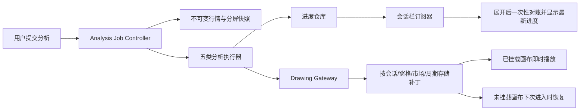

# 交易专家静默后台分析与进度恢复方案

状态：阶段 A 已完成，阶段 B/C 待实施。

本方案只定义“收起会话栏后继续分析、重新展开后恢复当前进度”的实施边界。本轮不改变现有分析执行逻辑。

## 1. 现状结论

- 会话栏的收起/展开事件本身只切换布局类名、可访问状态与按钮状态，不会主动取消交易分析。
- 分析进度会持续写入会话消息并刷新会话表面；当右侧会话栏处于收起状态时，部分会话列表刷新不再走局部 DOM 更新，而会退化为根节点 `render()`。
- 根节点重绘会替换整个应用 DOM。即使正常路径会暂存并恢复 K 线工作区，也仍存在首条消息提升临时会话、线程 ID 替换、目标线程切换或宿主节点短暂不匹配的竞态；一旦工作区被销毁或重启，现有分析代次会被递增并以“分析已取消”结束。
- 同一次根节点替换若发生在展开按钮的按下与点击之间，旧按钮及监听器会被销毁，表现为“按钮偶尔点不动”；持续重绘还会放大主线程卡顿。
- 因此，收起并不是直接原因，真正问题是分析任务、进度渲染与可见 DOM/图表工作区生命周期仍有耦合。

## 2. 目标与边界

实施后应满足：

1. 收起会话栏不取消、不暂停、不重复提交任何交易专家分析。
2. 会话栏收起期间，分析在后台继续执行；重新展开时直接显示同一任务的最新阶段、已完成步骤和结果。
3. 进度更新不得触发应用根节点重绘，也不得销毁或重建同一会话的 K 线工作区。
4. 展开按钮在分析期间始终可点击，交互不依赖右侧面板是否已经挂载。
5. 用户切换会话、币种、周期或分屏布局后，任务继续使用提交时的不可变行情快照，并只把结果写回原会话、原窗格、原币种和原周期，不能误画到当前画布。
6. 只有用户明确停止任务、关闭账户会话或执行会使原上下文不可恢复的显式操作，才允许取消任务。

本方案不改变五类交易分析的业务算法、模型提示词、Drawing Gateway 校验规则或现有画线存储格式。

## 3. 目标架构

### 3.1 Analysis Job Controller

新增独立于右侧会话 DOM 和图表工作区实例的任务控制器。每次分析生成稳定的 `analysisId`，以 `threadId + analysisId` 管理以下状态：

- `queued`
- `loading-data`
- `analyzing`
- `validating-drawings`
- `drawing`
- `finalizing`
- `completed`
- `failed`
- `cancelled`

控制器持有提交时的会话、主窗及全部可见分屏上下文快照。收起面板、重绘聊天 UI、切换到其他会话均不改变任务代次。

### 3.2 进度仓库与订阅

- 进度事件写入线程级仓库，至少保存最新快照和有限数量的关键里程碑。
- 高频进度以 100–250ms 合并刷新，避免每个细粒度步骤都操作 DOM。
- 会话栏展开时订阅该线程；收起时解除可见面板订阅，但任务仍继续写仓库。
- 再展开时先读取最新快照，再恢复实时订阅；不重启任务、不重复请求模型。
- 左侧历史会话只局部更新当前行的运行状态或未读完成标识，不调用根节点 `render()`。

### 3.3 画线结果提交

- 分析输出始终先经过现有 Drawing Gateway 校验。
- 校验后的补丁按原会话、分屏序号、市场和周期写入现有持久化上下文。
- 对应画布仍挂载时继续拟人播放；画布未挂载时仅持久化，用户返回原上下文后恢复结果。
- 任务提交后即使用户切换币种、周期或布局，也禁止把旧任务结果应用到新上下文。

### 3.4 渲染隔离

- 收起/展开只允许切换布局 class、`aria-expanded`、按钮提示和必要的尺寸同步。
- 交易分析处于运行中时，会话消息和列表更新必须走局部补丁；右栏收起不能成为退化为全局重绘的条件。
- 为活动分析增加工作区销毁护栏：同线程、展示性状态变化和进度刷新不得触发 `destroy()` 或分析代次递增。
- 对所有根节点重绘记录来源；若确需重绘，必须先证明不会替换当前交互按钮或取消活动任务。

## 4. 分阶段实施

### 阶段 A：止损补丁

1. 调整收起状态下的更新策略，让交易专家进度和会话列表保持局部更新。
2. 收起后停止刷新隐藏消息区，仅更新进度仓库与必要的侧栏行状态；展开时一次性对账。
3. 为同线程交易工作区增加销毁护栏，并记录所有分析取消来源。
4. 增加展开按钮在持续进度写入期间的点击回归。

该阶段直接解决当前“收起后失败”和“展开偶发失效”，改动面较小。

### 阶段 B：任务与 DOM 解耦

1. 引入 Analysis Job Controller 和稳定 `analysisId`。
2. 把五类分析统一接入任务状态机、不可变窗格快照和显式取消协议。
3. 把进度写入从消息 DOM 更新改为仓库发布；右栏只作为订阅视图。
4. 把画线提交改为“先按原上下文持久化，再由已挂载画布选择播放或延迟恢复”。

### 阶段 C：恢复与可观测性

1. 支持切换会话后在历史列表展示运行/完成状态，返回后恢复进度。
2. 为任务记录 `analysisId`、线程、工作区代次、渲染来源、明确取消原因和耗时。
3. 对意外取消、重复模型调用、错误上下文落图和根节点重绘建立开发环境告警。

## 5. 验收标准

- 五类分析在任意阶段连续收起/展开 50 次，任务不取消、`analysisId` 不变、模型请求不重复。
- 会话栏收起后，进度更新期间根节点 `render()` 次数为 0，交易工作区 `destroy()` 次数为 0。
- 展开按钮在持续进度下点击响应不超过 50ms；展开后 100ms 内显示最新已知进度。
- 首条消息把临时会话提升为真实线程的竞态中，分析仍继续且进度、结果归属新线程。
- 1–9 分屏下，每个窗格只接收其提交快照对应的结果；中途切换币种、周期、布局或会话不串图。
- 显式停止仍能可靠取消全部窗格，且只生成一次明确的取消状态。
- 应用切到后台、最小化、收起右栏再恢复，进度和最终报告保持一致。
- 浅色与暗色主题下，展开入口、运行状态、完成状态、错误状态、hover、active、focus、loading 和 disabled 均清晰可读；不得新增硬编码浅色控件。

## 6. 建议实施顺序

先交付阶段 A 并让开发版验证当前故障消失，再实施阶段 B/C。这样可以先消除用户可见的取消和点击丢失，同时把任务模型、持久化迁移与多分屏恢复拆成可单独回归的变更。
