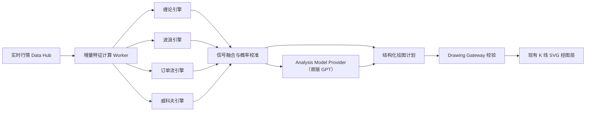

# 交易专家实时 AI 盘面分析执行方案

> 文档状态：已冻结的实施基线
> 创建日期：2026-08-08
> 最近更新：2026-08-27
> 当前里程碑：M0 架构与执行方案冻结
> 总体状态：M0 进行中（已完成 M0-001 至 M0-004、M0-008，下一项为 M0-005）
> 适用仓库：`D:\youle_desktop\youle_desktop`（桌面端）、`D:\youle_agent_ms`（业务后端）、`D:\zhongzhuan`（统一模型中转）

## 1. 文档用途与持续更新规则

本文是“交易专家实时 AI 盘面分析”唯一的长期执行基线，同时承担实施计划、架构决策、验收标准和进度记忆四个职责。后续任何相关开发、审查、测试或发布工作开始前都必须先阅读本文；工作结束前必须回写本文的任务状态和进度日志。

更新规则：

1. 使用本文定义的稳定任务编号，不用临时口头描述替代任务状态。
2. 开始一项任务时，将状态改为 `进行中`，并填写“当前工作焦点”。
3. 只有代码、必要测试和验收证据均完成时才能标记 `已完成`。
4. 任务被设计或外部依赖阻塞时标记 `受阻`，记录阻塞条件、已经验证的事实和解除条件。
5. 每次工作结束都在“进度日志”追加一条记录；历史记录只追加，不覆盖。
6. 如果实现需要偏离本文冻结架构，必须先在“架构决策记录”增加 ADR，写明原因、影响、替代方案和批准状态。
7. 不使用虚构完成百分比。总体进度以已通过验收的任务和里程碑为准。

状态枚举：`未开始 | 进行中 | 受阻 | 已完成 | 已取消`。

## 2. 目标契约

### 2.1 最终交付物

在现有交易专家 K 线工作区内建设可持续运行的实时 AI 盘面分析系统。系统能够基于缠论、艾略特波浪、威科夫和订单流产生可复现的结构化分析，融合为带证据、失效条件和历史校准的市场情景，并通过现有 K 线绘图能力自动落图。

### 2.2 成功标准

1. AI 绘图使用真实市场时间和价格坐标，缩放、拖动、切换主题后保持正确定位。
2. 缠论、波浪、威科夫和订单流分别形成版本化、可测试的独立引擎，不能只依赖大模型自由解释。
3. Analysis Model Provider 只消费结构化市场事实、规则和候选结果，不把截图识别作为主分析链路；首版默认 Provider 使用 `gpt-5.6-sol`。
4. 大模型输出必须经过 JSON Schema、权限、市场版本、坐标范围和对象数量校验后才能进入画布。
5. 用户手工绘图与 AI 绘图完全分层；AI 不覆盖用户绘图，也不污染用户撤销/重做栈。
6. 所有结构区分 `暂定`、`确认`、`失效`，不得在后续行情到来时无痕修改历史判断。
7. 涨跌概率来自无未来数据泄漏的历史回测和校准，不采用大模型自报置信度冒充概率。
8. 数据、分析、绘图、模型和错误事件均带稳定 ID、版本、时间和证据，可回放、可审计。
9. 亮色与暗色主题同时交付，覆盖默认、悬停、选中、焦点、展开、加载、禁用、过期和错误状态。
10. 关闭功能开关后，现有交易专家对话、行情、指标和手工绘图行为保持不变。
11. AI 落图默认使用虚拟 AI 光标逐对象、逐线段播放，用户能观察绘制过程；不得在等待结束后整批瞬间出现。

### 2.3 禁止事项

- 第一版不自动下单、不连接交易账户、不生成可直接执行的订单。
- 不让 GPT 或外部模型直接操作 DOM、SVG、`localStorage`、行情连接或系统权限。
- 不把全部逐笔成交、盘口快照或数千根原始 K 线反复发送给模型。
- 不把外部模型 API Key 写入 Renderer、日志、聊天、源码或普通配置文件。
- 不用普通 OHLCV 数据伪装成订单流；数据源不足时必须明确降级。
- 不以知识库代替确定性算法、行情数据、回测或概率校准。
- 不把新增实现继续堆入超大的 `src/renderer/main.ts` 或 `src/main/main.mjs`。
- 不通过合成真实鼠标/指针事件制造拟人效果，不让 AI 动画进入用户手工绘图的撤销栈。

## 3. 首发范围与后续范围

### 3.1 首发验证范围

- 市场：Binance 永续合约。
- 品种：`BTCUSDT`、`ETHUSDT`。
- 主分析周期：15 分钟、1 小时、4 小时。
- 预测周期：未来 3、6、12 根目标周期 K 线。
- 理论：缠论、波浪、威科夫、订单流四个引擎全部进入融合链路。
- 绘图：理论结构、关键区间、主/备选情景、支撑压力、目标位和失效位。
- 交互：实时分析开关、图层管理、实时结论卡、结构解释、手动刷新、过期提示。
- 运行模式：只分析、自动绘图和提醒；不包含交易执行。

### 3.2 非首发范围

- A 股、美股、外汇等缺少统一深度或逐笔方向数据的真实订单流。
- 自动下单、策略托管、资金管理、仓位同步和交易所账户授权。
- 用户自定义脚本语言、策略市场和公开策略排行榜。
- 大规模在线模型训练和个性化模型微调。

这些能力需要独立目标、数据授权、安全设计和发布验收，不能从本方案自动扩大范围。

## 4. 冻结架构



固定分工：

| 层 | 责任 | 不负责 |
|---|---|---|
| Market Data Hub | 连接数据源、标准化时间与市场身份、缓存和重连 | 理论判断、绘图 |
| Feature Worker | 增量计算摆动点、波动率、成交量、CVD、深度等事实 | 自然语言结论 |
| Theory Engines | 按版本化规则输出候选结构、证据与失效条件 | 最终概率、直接绘图 |
| Fusion/Calibration | 融合信号，产出市场状态和经回测校准的概率 | 自由叙事 |
| Analysis Model Orchestrator | 通过 Provider Registry 处理歧义、主备情景、理论冲突和用户解释 | 绑定具体模型厂商、直接写画布、计算逐笔流 |
| Drawing Gateway | 校验、限流、版本并发控制、生成受信任绘图补丁 | 推理行情 |
| Renderer | 展示、主题、交互、用户控制 | 持有模型凭证、签发权限 |

### 4.1 过渡策略

当前 Binance REST/WebSocket 和 K 线数组主要位于 Renderer。为避免一次性重写现有行情：

1. M1 先增加严格的只读 `MarketSnapshot` 导出桥，复用当前行情，打通端到端绘图链路。
2. M2 建立主进程 `TradingMarketDataHub`，由主进程统一管理订阅、重连、缓存和多周期数据。
3. Renderer 改为 Data Hub 的只读订阅者，分析 Worker 与图表共享同一行情事实源。
4. 迁移验收完成后删除临时 Renderer 快照桥，不能长期保留双数据源。

## 5. 数据和时间语义

### 5.1 市场身份

所有协议使用稳定 `marketId`，不得仅用 `symbol`。至少包含：

- `provider`：数据提供方；
- `venue`：交易场所；
- `marketType`：现货、永续或其他；
- `symbol`：交易标的；
- `interval`：目标周期；
- `priceTick`、`quantityStep` 和计价币种。

`BINANCE:FUTURES:BTCUSDT` 与 `BINANCE:SPOT:BTCUSDT` 必须被视为不同市场。

### 5.2 时间语义

- 协议、存储、分析和绘图锚点一律使用 UTC Unix 时间。
- 中国时区偏移只在 Renderer 显示阶段应用。
- 每根 K 线明确携带 `openTime`、`closeTime` 和 `closed`。
- 暂未收盘 K 线参与盘中候选分析，但不得作为历史回测中的已知终值。
- 所有分析结果记录 `snapshotTime`、`lastClosedBarTime` 和输入摘要哈希。

### 5.3 数据覆盖

K 线基础数据：OHLCV、成交笔数、主动买/卖量（数据源支持时）、标记价格、指数价格、资金费率、持仓量。

订单流增强数据：逐笔成交方向、盘口深度与增量、最佳买卖价、爆仓、持仓量时间序列和可验证的多空相关数据。

每个数据字段都要带覆盖状态：`available | delayed | partial | unavailable`。订单流数据不完整时，订单流引擎返回 `insufficient_data`，融合层降低覆盖度而不是编造结论。

## 6. 核心协议

所有跨模块对象必须携带 `schemaVersion`。以下为语义基线，实施时固化为 TypeScript/JSON Schema，并在主进程边界重复校验。

### 6.1 MarketSnapshot

```ts
interface MarketSnapshot {
  schemaVersion: 1;
  snapshotId: string;
  marketId: string;
  interval: string;
  snapshotTime: number;
  lastClosedBarTime: number;
  candles: Candle[];
  stats: MarketStats;
  orderFlow?: OrderFlowWindow;
  coverage: DataCoverage;
  inputHash: string;
}
```

要求：

- 同一 `snapshotId` 内容不可变。
- K 线按时间升序、去重、有限数值和合法价格校验。
- 发送给 GPT 的不是完整逐笔数据，而是 TheoryResult、聚合特征和必要的有限 K 线窗口。

### 6.2 TheoryResult

```ts
interface TheoryResult {
  schemaVersion: 1;
  resultId: string;
  engineId: "chan" | "elliott" | "wyckoff" | "order_flow";
  engineVersion: string;
  snapshotId: string;
  status: "succeeded" | "insufficient_data" | "failed";
  structures: TheoryStructure[];
  signals: TheorySignal[];
  evidence: Evidence[];
  invalidations: InvalidationCondition[];
  confidence: ConfidenceAssessment;
}
```

`confidence` 表示本引擎对结构识别的可靠程度，不等于市场上涨概率。

### 6.3 AnalysisPlan

```ts
interface AnalysisPlan {
  schemaVersion: 1;
  analysisId: string;
  revision: number;
  snapshotId: string;
  marketId: string;
  interval: string;
  regime: "trend_up" | "trend_down" | "range" | "transition" | "unknown";
  primaryScenario: Scenario;
  alternateScenarios: Scenario[];
  probabilityForecasts: ProbabilityForecast[];
  theoryViews: TheoryView[];
  drawingPatch: DrawingPatch;
  narrative: AnalysisNarrative;
  expiresAt?: number;
}
```

### 6.4 DrawingPatch

```ts
interface DrawingPatch {
  schemaVersion: 1;
  analysisId: string;
  baseRevision: number;
  marketId: string;
  interval: string;
  operations: Array<
    | { op: "upsert"; drawing: AiDrawing }
    | { op: "remove"; drawingId: string }
  >;
}
```

每个 `AiDrawing` 至少包含：稳定 ID、理论图层、工具类型、时间价格锚点、语义颜色、状态、证据引用、置信度、失效条件和生成来源。

## 7. Drawing Gateway 与图层设计

### 7.1 独立图层

绘图状态至少分为：

- `manual`：用户手工绘图；沿用当前撤销/重做和持久化语义。
- `ai/chan`：缠论。
- `ai/elliott`：波浪。
- `ai/wyckoff`：威科夫。
- `ai/order-flow`：订单流。
- `ai/consensus`：综合情景、目标和失效位。

AI 绘图默认锁定、不可直接拖动。用户选择“复制为手工绘图”后生成新的 manual ID，脱离 AI 分析版本。

### 7.2 校验规则

Drawing Gateway 必须在主进程或受信任 Host 边界执行：

1. Schema、协议版本和必需字段完整。
2. `marketId`、`interval`、`analysisId` 和 `baseRevision` 与当前会话一致。
3. 工具只来自批准白名单；点数符合工具定义。
4. 时间、价格和数值有限，预测锚点处于允许的未来窗口。
5. 单对象点数、单补丁操作数、总 AI 对象数和文本长度受限。
6. 颜色使用语义 Token，不接受任意 CSS、HTML 或 SVG 片段。
7. 迟到修订、旧市场、旧周期和已失效分析不能覆盖当前结果。
8. 应用补丁是幂等操作，同一分析修订重复到达不产生重复绘图。
9. 拒绝事件返回机器可读错误并记入审计，不把模型原始内容渲染为 HTML。

### 7.3 绘图状态

- `tentative`：虚线、较低不透明度，表示盘中或未满足确认规则。
- `confirmed`：实线和正常不透明度。
- `invalidated`：灰化并保留历史；用户可选择隐藏失效结构。
- `stale`：输入行情已经超过有效期但尚未产生新分析。

### 7.4 拟人化逐笔绘制播放

AI 落图默认不得在等待结束后整批瞬间出现。Drawing Gateway 必须先完整校验绘图补丁，再由 Renderer 的 `AiDrawingPlaybackController` 将受信任补丁转换为逐项、逐段、逐帧的播放计划，使用户看到类似分析师操作画布的过程。

固定原则：

1. 不伪造浏览器 `PointerEvent`，不调用手工绘图的点击/拖拽事件处理器，避免污染用户选择状态、撤销栈和输入焦点。
2. 使用独立的 AI 虚拟光标、点击涟漪和 SVG 几何插值表现“移动 → 落点 → 拖动/连线 → 完成”。
3. 每次完整 DrawingPatch 校验通过后才开始播放；不能一边解析不完整的模型 JSON 一边落图。
4. 确定性引擎先完成的图层可以先播放，不必等待 GPT 叙述；GPT 综合图层在完整校验后接续播放。
5. 播放顺序按语义固定为：基础结构 → 理论关键点 → 区间/通道 → 目标与失效位 → 主/备选情景 → 文字标注。
6. 模型只能建议语义优先级，不能指定任意毫秒时长、缓动函数、CSS 或光标行为；具体时序由本地受信任控制器归一化。
7. 每完成一个对象才把它提交为该分析修订的稳定绘图；正在播放的半成品只存在于临时展示状态。

不同工具的默认表现：

| 工具类型 | 播放方式 |
|---|---|
| 趋势线、射线、水平线、箭头 | 光标移动到起点，落点后终点沿路径平滑延伸 |
| 折线、缠论笔、波浪计数 | 按锚点逐段连接，每段完成后短暂停顿 |
| 矩形、中枢、威科夫区间 | 从第一角拖动到对角，边框和填充同步展开 |
| 通道、斐波那契 | 先绘基准锚点，再逐级显示派生线和标签 |
| 预测路径、主备情景 | 从当前价格向未来区域逐段延伸，最后显示概率/失效标签 |
| 文本与标记 | 光标定位后以短打字效果或受控淡入显示 |

播放控制和中断语义：

- 默认显示 AI 虚拟光标和“AI 正在绘制”状态；用户可以暂停、继续、调速或点击“立即完成”。
- “立即完成”只跳过展示动画，仍应用同一份已校验补丁，不能绕过 Gateway。
- 用户切换市场、周期或关闭 AI 图层时，立即取消当前临时动画并清除半成品，不把它提交为完成对象。
- 新 revision 在旧 revision 播放时到达，控制器在当前对象的安全边界终止旧队列，丢弃旧半成品，再从最后已提交状态计算新补丁；旧 revision 不得继续覆盖新结果。
- 用户正在手工绘制或拖动手工对象时，AI 播放暂停，避免视觉光标和真实操作竞争；结束后从安全边界继续。
- `prefers-reduced-motion` 或应用的减少动态效果设置生效时，缩短移动和拖动动画，保留明确的分步淡入，不以闪烁或大幅光标运动呈现。
- 每帧只更新临时几何，不写持久化；只记录播放开始、对象完成、暂停、跳过、被新 revision 取代、取消和全部完成事件。

默认节奏由本地策略配置：单个简单对象约 250–700ms，多点结构按段增量播放；标准密度的一轮分析应在保持可观察的前提下自适应压缩，目标总播放时间约 3–10 秒。对象很多时提高速度或按语义组连续播放，不能让陈旧分析长时间占用画布。

## 8. 理论知识库

### 8.1 目标

知识库不是向模型灌输百科，而是冻结 Haolo 采用的定义、流派、参数、确认规则、失效规则、绘图语义和争议处理方式，使同一输入在不同时间得到可解释的一致结果。

建议目录：

```text
resources/trading-knowledge/
  manifest.json
  shared/
    glossary.zh-CN.md
    evidence-schema.json
    drawing-semantics.json
  chan/v1/
    rules.yaml
    examples.jsonl
    counterexamples.jsonl
  elliott/v1/
    rules.yaml
    examples.jsonl
    counterexamples.jsonl
  wyckoff/v1/
    rules.yaml
    examples.jsonl
    counterexamples.jsonl
  order-flow/v1/
    rules.yaml
    examples.jsonl
    counterexamples.jsonl
```

要求：

- 内容使用原创归纳、获授权或可合法使用的材料，不大段复制受版权保护的书籍。
- 每条规则有稳定 ID、版本、定义、输入要求、确认条件、失效条件和示例引用。
- GPT 每次只接收与当前结构相关的规则片段及其 ID，不倾倒整个知识库。
- 知识库升级创建新版本；历史分析保留当时使用的规则版本。

### 8.2 四个规则包

缠论 v1：包含关系、标准/非标准分型、笔、线段、中枢、走势类型、背驰和买卖点；明确递归级别与未完成结构处理。

波浪 v1：摆动点、推动浪硬规则、调整浪结构、交替原则、比例参考、主/备计数和失效位；软指南不能伪装成硬规则。

威科夫 v1：交易区间、PS/SC/AR/ST、Spring/UTAD、SOS/SOW、LPS/LPSY、量价努力结果和阶段候选；事件标签必须附证据。

订单流 v1：主动买卖方向、CVD、成交失衡、盘口失衡、吸收、衰竭、爆仓和持仓量联动；每个判断注明数据覆盖和阈值来源。

## 9. 确定性分析引擎

统一接口：

```ts
interface TheoryEngine {
  describe(): TheoryEngineManifest;
  analyze(snapshot: MarketSnapshot, context: EngineContext): TheoryResult;
}
```

### 9.1 公共特征层

统一计算并缓存：摆动高低点、ATR、趋势斜率、成交量分位数、VWAP、价差、波动率状态、成交量扩张/收缩、主动成交差、CVD、OI 变化和盘口失衡。相同特征不能由四个引擎各自重复实现。

### 9.2 缠论引擎

流水线：K 线包含处理 → 分型 → 笔 → 线段 → 中枢 → 走势类型 → 背驰/买卖点候选。所有中间结构保留来源 K 线索引和规则 ID。

### 9.3 波浪引擎

使用公共摆动点生成有限候选计数，先执行硬规则剪枝，再用软指南排序。必须输出主计数、最多两个备选计数及各自失效点，禁止只保留一个看似确定的答案。

### 9.4 威科夫引擎

先识别趋势或交易区间，再根据价差、成交量、测试行为和突破质量生成事件与阶段候选。事件没有足够证据时标记候选，不强行命名。

### 9.5 订单流引擎

以滑动窗口增量维护逐笔、CVD、深度、爆仓和 OI 特征。订单流只对数据源覆盖的时间范围给结论；断线恢复后需要标记缺口，不能把缺口前后数据直接视为连续。

## 10. 信号融合与 Analysis Model Provider 边界

### 10.1 机器融合

融合层先于 GPT 工作，输出：

- 当前市场状态；
- 各理论方向、强度、覆盖度和冲突矩阵；
- 关键支撑、压力、目标、失效位；
- 历史校准后的不同预测周期概率；
- 数据不足或理论不适用标志。

### 10.2 模型中立输入

Provider 输入采用单次完整但紧凑的结构化上下文：

- 当前用户问题与显示周期；
- MarketSnapshot 摘要；
- 四个 TheoryResult；
- 融合和概率结果；
- 本次相关规则片段与规则 ID；
- 当前画布 AI 图层摘要；
- 输出 Schema、权限和禁止事项。

不发送全部逐笔成交或无关历史文件。当前生产跨厂商 Transport 没有被验证为真实增量计费，因此不能用伪 stateful 多轮不断重放大上下文。

### 10.3 模型中立输出

Analysis Model Provider 负责：主情景、备选情景、理论冲突解释、用户可读叙述和建议的 DrawingPatch。首版由 `gpt-5.6-sol` 适配器实现；模型自报置信度只能作为语义证据之一，不能直接成为涨跌概率。

任一 Provider 输出都先形成不可信 `ProposedAnalysisPlan`，由 Host 完成 Schema 和业务校验后才形成受信任 `AnalysisPlan`。

### 10.4 模型和权限

- 交易专家根分析默认使用项目指定的 `gpt-5.6-sol`。
- Codex 保持默认且唯一的根编排和最终采纳权。
- 外部模型若参与，只能返回分析建议，不获得绘图、文件、Shell 或系统写权限。
- 实际绘图由本地 Drawing Gateway 按窄能力执行；模型不持有 Renderer 或系统权限。
- 生产模型流量继续通过 `D:\youle_agent_ms` 和 `D:\zhongzhuan` 的集中链路，桌面不持有厂商上游 Key。

## 11. 概率、回测与防未来泄漏

### 11.1 标签定义

对未来 3、6、12 根 K 线分别定义三分类结果。初始基线可使用波动率归一化阈值：

- 未来收益大于 `+k × ATR`：上涨；
- 未来收益小于 `-k × ATR`：下跌；
- 其他：震荡。

`k` 不在产品代码硬编码；按市场、周期和训练窗口在校准配置中版本化。

### 11.2 校准原则

- 使用 walk-forward 或 expanding-window，禁止随机打乱时间序列造成泄漏。
- 未收盘 K 线不得以终值参与历史特征。
- 特征、规则和模型版本必须与回测记录绑定。
- 在样本不足前界面显示“信号强度”，不显示伪精确概率。
- 概率和结构识别置信度分别展示。
- 上涨、下跌和震荡概率之和必须为 100%，同时展示样本量、覆盖期和最近校准时间。

### 11.3 发布门槛

- Brier Score 必须优于无条件频率基线。
- 校准误差、分类覆盖、最大回撤情景和不同市场状态表现必须进入报告。
- 不以单次收益或少数截图作为有效性证据。
- 达不到发布门槛时保留结构分析功能，但关闭“概率”展示。

## 12. 实时触发与性能

触发分层：

- Tick/盘口：本地 Worker 以 100–500ms 节流增量更新；不调用 GPT。
- 盘中结构：关键结构发生变化时更新暂定图形。
- K 线收盘：确认结构、运行四理论融合，必要时调用 GPT。
- 事件触发：突破失效位、区间边界、订单流异常或数据恢复时重新分析。
- 用户触发：手动刷新、追问或切换主要分析周期。

性能目标：

- 本地特征和绘图增量更新 P95 小于 1 秒。
- K 线收盘后的本地四引擎结果 P95 小于 3 秒。
- GPT 综合分析目标 P95 小于 10 秒；超时不阻塞本地结构更新。
- Drawing Gateway 接受补丁后 150ms 内出现首个可见绘制反馈，不能继续停留在无反馈等待状态。
- 拟人化播放使用 `requestAnimationFrame`，目标 60fps；每帧不进行持久化、全量 Schema 校验或重新计算理论结构。
- 300 个可见 AI 绘图对象下，常规缩放和拖动保持流畅，不因分析阻塞 UI 线程。
- 所有高频计算放入 Worker 或主进程计算边界，不占用 Renderer 主线程。

## 13. 产品交互

### 13.1 图表控制

- 顶部“AI 实时分析”总开关。
- 状态：监听中、分析中、已更新、数据不足、已过期、连接中断和错误。
- 图层：综合、缠论、波浪、威科夫、订单流。
- 密度：精简、标准、完整。
- 绘制速度：0.5×、1×、2×；默认 1×。
- 操作：暂停/继续绘制、立即完成、刷新、隐藏失效结构、清除当前 AI 视图、复制为手工绘图。
- AI 虚拟光标必须与系统真实鼠标明显区分，并带“AI”标识，不能让用户误以为真实鼠标被接管。

### 13.2 实时结论卡

右侧交易专家对话区域顶部展示：

- 市场状态与数据时间；
- 未来 3/6/12 根 K 线的上涨/下跌/震荡概率或信号强度；
- 主情景和备选情景；
- 支撑、压力、目标和失效位；
- 四理论一致度、数据覆盖和规则版本；
- “为什么这样判断”的可展开证据。

### 13.3 主题要求

所有新增 UI 使用交易专家局部语义变量，例如 `--trading-ai-bull`、`--trading-ai-bear`、`--trading-ai-tentative`、`--trading-ai-stale`，分别为亮色和暗色定义。不能把只适合白底的浅色、阴影或图标颜色写死在组件中。

主题验收覆盖默认、hover、active/selected、focus、open、loading、disabled、stale、invalidated 和 error；同时检查文字、图标、边框、菜单、弹层、表单、开关、图层 Chip、图形透明度、AI 虚拟光标和点击涟漪。亮暗主题都必须保证虚拟光标可见且不遮挡 K 线价格信息。

## 14. 代码模块边界

建议结构：

```text
src/main/trading-analysis/
  protocol.mjs
  model-provider.mjs
  app-server-provider.mjs
  chan-engine.mjs
  chan-pipeline.mjs
  market-data-hub.mjs
  snapshot-store.mjs
  analysis-runtime.mjs
  drawing-gateway.mjs
  knowledge-loader.mjs
  probability-calibrator.mjs
  theory/
    common-features.mjs
    chan.mjs
    elliott.mjs
    wyckoff.mjs
    order-flow.mjs
  workers/
    feature-worker.mjs

src/renderer/
  trading-expert-ai.ts
  trading-expert-ai-view.ts
  trading-expert-ai-playback.ts
  trading-expert-drawing.ts
  trading-expert-market.ts

resources/trading-knowledge/
test/fixtures/trading-analysis/
test/trading-analysis-*.test.mjs
```

`src/renderer/main.ts` 和 `src/main/main.mjs` 只增加装配和窄 IPC 入口；业务逻辑必须位于独立模块。

## 15. 测试与验收矩阵

| 测试层 | 必须覆盖 |
|---|---|
| 协议测试 | Schema 版本、无效数值、旧修订、错误市场、对象限额、幂等 |
| 单元测试 | 四引擎规则、公共特征、时间聚合、概率标签、颜色 Token |
| 黄金样例 | 每种理论的标准案例、反例、争议案例和专家共识 |
| 回放测试 | 固定行情事件流得到相同结构、ID、状态变化和绘图补丁 |
| 集成测试 | WebSocket/REST → Snapshot → Engines → Fusion → Gateway → Renderer |
| 播放测试 | 虚拟光标、各工具插值、语义顺序、暂停/继续、立即完成、取消、新 revision 取代和 reduced-motion |
| 断线测试 | 重连、缺口、乱序、重复事件、迟到 GPT 响应和切市场 |
| 性能测试 | 高频 Worker、300 个对象、切周期、缩放和长时间运行 |
| 主题回归 | 亮色/暗色及全部交互状态的截图或 DOM/CSS 契约 |
| 安全测试 | Prompt 注入、HTML/SVG 注入、任意颜色、越界坐标和权限绕过 |
| 回测审计 | 无未来泄漏、版本绑定、基线对比、校准和样本覆盖 |

任何里程碑在相应测试未通过前不得标记完成。

## 16. 可观察性与故障降级

每次分析至少记录：`traceId`、`snapshotId`、`analysisId`、revision、市场、周期、引擎版本、规则版本、模型、触发原因、耗时、数据覆盖、结果状态和错误分类。模型原始大响应保存为受控 Artifact 引用，不直接写普通日志。

降级顺序：

1. GPT 不可用：继续展示确定性引擎和上次有效叙述，标记“AI 综合暂不可用”。
2. 某理论数据不足：从融合中降权并明确显示覆盖不足。
3. 订单流断线：保留 K 线理论，订单流图层标记过期并停止输出新信号。
4. Drawing Gateway 拒绝：不改变当前画布，记录机器可读错误并允许重新分析。
5. 全部行情不可用：冻结最后有效视图并显示时间，不继续生成新判断。

## 17. 风险清单

| 风险 | 应对 |
|---|---|
| 缠论和波浪流派差异 | 知识库冻结口径，规则版本化，展示备选情景 |
| 模型幻觉或绘图注入 | Schema + Drawing Gateway + 工具白名单 + Host 执行 |
| 结构重绘导致误导 | 暂定/确认/失效状态与不可变分析修订 |
| 订单流数据不完整 | Coverage 契约、缺口标记和 `insufficient_data` |
| 概率被理解为保证 | 历史校准、样本信息、风险提示和无自动下单 |
| 高频计算卡顿 | Worker、增量算法、RAF 合并和对象上限 |
| 拟人动画拖慢新分析 | 自适应时长、安全边界中断、新 revision 取代和立即完成 |
| AI 光标干扰真实操作 | 独立展示层、禁止合成 PointerEvent、手工操作时自动暂停 |
| 模型调用成本过高 | 事件触发、紧凑完整上下文、缓存和本地优先 |
| 未来数据泄漏 | UTC/收盘语义、walk-forward、回放审计测试 |
| 亮暗主题割裂 | 同一任务同时实现两主题并加入回归测试 |
| 当前工作区改动较多 | 小切片、避免覆盖无关改动、逐模块验证 |

## 18. 里程碑与详细任务台账

### M0：架构、规则和契约基线

| ID | 任务 | 状态 | 依赖 | 完成证据 |
|---|---|---|---|---|
| M0-001 | 核对现有行情、绘图、模型和主题实现 | 已完成 | 无 | 2026-08-08 代码盘点 |
| M0-002 | 冻结混合架构、目标契约与首发范围 | 已完成 | M0-001 | 本文第 2–4 节 |
| M0-003 | 建立长期执行文档与进度台账 | 已完成 | M0-002 | 本文 |
| M0-004 | 在 `AGENTS.md` 登记持久读取与回写要求 | 已完成 | M0-003 | `AGENTS.md` 持久记忆入口与 2026-08-08 校验记录 |
| M0-005 | 固化 MarketSnapshot/TheoryResult/AnalysisPlan/DrawingPatch Schema | 未开始 | M0-002 | 协议模块与契约测试 |
| M0-006 | 定义 Feature Flag、错误分类、审计字段和本地存储迁移 | 未开始 | M0-005 | 配置与测试 |
| M0-007 | 创建四理论规则模板、词汇表和版权来源规范 | 未开始 | M0-002 | knowledge 目录与校验 |
| M0-008 | 冻结拟人化逐笔落图、虚拟光标和中断语义 | 已完成 | M0-002 | 本文 7.4、ADR-005 与 2026-08-08 记录 |

M0 退出条件：协议、规则模板、错误和功能开关均有自动化测试；关闭开关时旧行为无变化。

### M1：AI 自动绘图纵向切片

| ID | 任务 | 状态 | 依赖 | 完成证据 |
|---|---|---|---|---|
| M1-001 | 导出/适配当前绘图模型，建立 manual 与 AI 图层 | 未开始 | M0-005 | 单元测试 |
| M1-002 | 实现 Drawing Gateway 校验、幂等和 revision 控制 | 未开始 | M0-005 | 安全与协议测试 |
| M1-003 | 实现临时 Renderer MarketSnapshot 只读桥 | 未开始 | M0-005 | 集成测试 |
| M1-004 | 使用固定 Fixture 生成模拟 TheoryResult 和 DrawingPatch | 未开始 | M1-002,M1-003 | 端到端演示 |
| M1-005 | 实现 AI 总开关、状态和图层控制 | 未开始 | M1-001 | UI 测试 |
| M1-006 | 实现亮色/暗色全部状态 | 未开始 | M1-005 | 主题回归 |
| M1-007 | 实现“复制为手工绘图”和独立撤销语义 | 未开始 | M1-001 | 交互测试 |
| M1-008 | 实现 AiDrawingPlaybackController 和工具几何插值 | 未开始 | M1-001,M1-002,M1-004 | 动画单元/回放测试 |
| M1-009 | 实现 AI 虚拟光标、涟漪、绘制状态和速度控制 | 未开始 | M1-005,M1-008 | 亮暗主题与交互测试 |
| M1-010 | 实现暂停/继续、立即完成、取消、revision 取代及 reduced-motion | 未开始 | M1-008,M1-009 | 中断与可访问性测试 |
| M1-011 | 以当前真实 K 线跑通经过 GPT-5.6 Sol 的缠论测试按钮纵向切片 | 已完成 | M0-005,M1-001,M1-002,M1-003,M1-008,M1-009 | `trading-analysis/*`、窄 IPC、测试按钮、AI 独立图层/光标、46 项专项通过、类型检查与生产构建通过 |
| M1-012 | 修复真实客户端点击“测试”后进入“重试”的运行时故障 | 已完成 | M1-011 | 根因是 `userMessage` 被误计为副作用；修复捕获分类并增加可见错误提示；真实 500 根 BTC 日线 + GPT 完整管线成功；46 项专项、类型检查、语法检查、生产构建通过 |
| M1-013 | 将缠论测试按钮升级为 `@策略:缠论` 对话式专家入口 | 已完成 | M1-012 | 已移除测试按钮；完成问答/截图/看盘意图分流、当前画布参数继承、按指令切换行情、对话进度、受控绘图与完整报告；74 项交易专家专项、类型检查、语法检查和生产构建通过 |
| M1-014 | 修复交易专家发送消息缺失、整页闪动与当前 K 线周期丢失 | 已完成 | M1-013 | 用户气泡和分析报告作为本地历史保留；进度改为局部更新对话区；临时任务升级正式 ID 时迁移同一行情工作区；交易专家及发送/分组相关 186 项测试、类型检查和生产构建通过 |
| M1-015 | 修复交易专家发送后输入残留并补齐标准思考状态气泡 | 已完成 | M1-014 | 发送后同步清空 textarea、草稿和 mention 高亮层；复用标准思考气泡展示准备行情、分析盘面、绘制结构、整理报告及耗时；交易专家 75 项与发送相关 111 项回归、类型检查和生产构建通过 |
| M1-016 | 在缠论最终报告中增加当下判断、涨跌情景概率和条件交易计划 | 已完成 | M1-015 | 已增加偏多/偏空/中性判断、25%–75% 审慎情景概率、结构来源的多空触发/失效/目标价、观望与风险条件；交易专家专项 76 项、类型检查、管线语法检查和生产构建通过 |
| M1-017 | 移除普通/升级模式按钮并由 `@自定义指标:趋势带` 双向同步趋势带 K 线 | 已完成 | M1-016 | 已删除按钮、事件和样式；标记出现时启用趋势带，普通删除、原子标记删除或发送清空时恢复原 K 线并保持视窗；77 项交易专家专项、类型检查、变更检查和生产构建通过 |
| M1-018 | 修复口语化缠论看盘误分流、当前 K 线丢失和内部提示词回显 | 已完成 | M1-017 | “帮我分析下/分析看看/研判下/复盘下”等表达进入专用看盘链路，缺省参数严格继承当前品种、周期和可见范围；内部专家提示词由统一消息清洗层隐藏；交易专家与历史消息专项 82 项、类型检查、变更检查和生产构建通过 |
| M1-019 | 用模型固定 JSON 路由替换缠论请求正则判断 | 已完成 | M1-018 | 新增只读 `gpt-5.6-sol` 路由、8 字段固定 JSON 契约、显式参数提取、0.65 置信度门槛和问答安全回退；移除缠论语义/参数正则；交易专家与消息发送共 123 项回归、类型检查、主进程语法检查和生产构建通过 |
| M1-020 | 修复模型路由等待期间交易专家输入框未清空 | 已完成 | M1-019 | 用户气泡登记后、等待路由模型前立即清空状态、草稿、匹配当前任务的 textarea 和 mention 覆盖层，正式任务升级后继续二次兜底；交易专家专项 82 项、类型检查和生产构建通过 |
| M1-021 | 修复缠论模型复核 180 秒超时后直接失败 | 已完成 | M1-020 | 超时改为结构化 `WORKFLOW_TURN_TIMEOUT/timeout`，模型活动会续期空闲看门狗，连续无进展时在原会话自动恢复；路由请求仍在 60 秒失败回退；增加脱敏诊断和中文超时回归，97 项相关测试、类型检查、主进程语法检查及生产构建通过 |
| M1-022 | 优化交易专家一级菜单到二级菜单的悬浮容错 | 已完成 | M1-013 | 接入级联菜单 180ms 延迟关闭并保留透明跨栏热区；补齐 `.submenu-open`、ARIA 展开态及亮暗主题契约；相关 30 项测试、类型检查和生产构建通过 |
| M1-023 | 将交易专家分析过程改为流式留存并在最终结果后折叠 | 已完成 | M1-015 | 每条进展作为独立 `commentary` 追加，运行中保持展开，最终报告/错误作为 `final_answer` 后复用普通执行折叠；核心 67 项、主题/流式 18 项、类型检查和生产构建通过 |
| M1-024 | 增加 K 线专业多点标注并约束文字框排版 | 已完成 | M1-011 | 每次输出 3–4 条综合判断/末笔/关键分型/中枢标注；AI 字号由 16px 缩至 12.8px，自动换行并约束框体/命中区；相关 65 项、类型检查和生产构建通过 |
| M1-025 | 对 AI 标注进行整组防碰撞和 K 线避让 | 已完成 | M1-024 | 12px 标注间距、8px 蜡烛避让、40px 顶部保护区；三角尾改为 1.2px 线段和锚点，缩放/平移后重排；相关 66 项、类型检查和生产构建通过 |
| M1-026 | 修复视窗外标注错位并改为 9px 无框文字 | 已完成 | M1-025 | 屏外锚点不参与布局且不进入渲染，末端笔绑定真实分型；9px 无框文字、连接线结束于首字并优先采用斜线；相关 66 项、类型检查和生产构建通过 |
| M1-027 | 将 AI 标注调整为 10px 并把缠论笔改为深灰色 | 已完成 | M1-026 | AI 标注统一为 10px；缠论笔亮色为 `#4b5563`、暗色为 `#9aa3b2`；相关 66 项、类型检查和生产构建通过 |
| M1-028 | 将缠论笔恢复为原紫色 | 已完成 | M1-027 | 亮色恢复 `#7b61ff`、暗色恢复 `#a994ff`；相关 66 项、类型检查和生产构建通过 |
| M1-029 | 将 AI 标注引线改为虚线并收紧文字行宽 | 已完成 | M1-028 | 确认/暂定标注统一虚线，单行最大宽度收紧为 200px；相关 66 项、类型检查和生产构建通过 |
| M1-030 | 为交易专家复用普通任务右侧会话栏收起/展开控制 | 已完成 | M1-023 | 复用 `rightCollapsed`、`toggle-right-panel`、面板图标及状态同步；布局与普通任务相关 61 项、类型检查和生产构建通过 |
| M1-031 | 复核当前缠论完整链路并以 `@策略:订单流` 跑通真实订单流纵向切片 | 已完成 | M1-030 | 完成真实 Binance 聚合成交/深度/OI、确定性 Delta/CVD/POC/成交簇/失衡引擎、模型中立复核、Gateway、AI 独立图层与拟人播放；15 项订单流+缠论专项、类型/语法检查、真实数据烟测和生产构建通过 |
| M1-032 | 以 `@策略:波浪理论` 跑通确定性波浪候选、模型复核和拟人落图纵向切片 | 已完成 | M1-031 | 完成摆动点、五浪推动/倾斜候选、ABC 调整、硬规则、斐波那契关系、主备计数、确认/失效、模型中立复核、`ai/wave` Gateway 与虚拟光标逐段落图；缠论+订单流+波浪 21 项专项、类型/语法检查、500 根实时 BTCUSDT 烟测和生产构建通过 |
| M1-033 | 将 ICT/SMC 市场结构体系并入 `@策略:订单流` 完整链路 | 已完成 | M1-031 | 完成 OB、FVG、BOS、CHoCH、MSS、Displacement、EQ、EQH/EQL、BSL/SSL、Sweep、Breaker、OTE 的多周期确定性候选、真实订单流窗口证据融合、模型中立复核和受控拟人落图；四理论 25 项专项、类型/语法检查、实时多周期烟测及生产构建通过 |
| M1-034 | 将 `@策略:波浪理论` 升级为完整 5 浪与 ABC/WXY 复合浪型计数 | 已完成 | M1-032 | 完成 `0-1-2-3-4-5 → A-B-C/W-X-Y` 完整周期、Zigzag/Flat/Expanded/Running Flat、Double Three、相对浪级、候选多样性保留、分段配色及 W/Y 内部子浪逐点标注；四理论 26 项专项、类型/语法检查、实时 BTCUSDT 烟测和生产构建通过 |
| M1-035 | 精简订单流/波浪盘面并输出新手可执行的条件式结论 | 已完成 | M1-033、M1-034 | 订单流绘图限制为 16 项内并按重要性保留转折、支撑/压力、上下流动性和最多一组微观证据；波浪只画主计数和短浪标；两类报告均输出确定性上破/跌破/回踩/反弹/等待区、第一目标、取消价及新手风控，四理论 26 项专项、实时烟测和生产构建通过 |
| M1-036 | 未点名理论时由模型判断是否优先分析左侧当前 K 线 | 开发完成，待用户实机验收 | M1-035 | 语义意图只由模型固定 JSON 路由判断，不使用关键词/正则判断语义；盘面请求未明确指定参数时继承左侧当前品种、周期和可见 K 线，进入独立通用价格结构引擎与 `ai/price-action` 受控拟人绘图层；83 项专项、类型/语法检查和生产构建通过，开发版已重启 |
| M1-037 | 将订单流与波浪绘图从过度精简调至中等复杂度且保持报告不变 | 已完成 | M1-035 | 订单流恢复第二层结构、双向区域、流动性、Sweep、EQ/OTE、POC 与两组成交证据，实时补丁 31 项；波浪恢复完整主计数、Fib、确认/失效和两条差异化备选路径，实时补丁 28 项；波浪结构折线强制实线，右侧报告与交易建议生成逻辑未改；87 项专项、实时烟测和生产构建通过 |
| M1-038 | 修复切换币种或 K 线周期后 AI 绘图丢失 | 已完成 | M1-037 | AI 图层按 `marketId + interval` 独立保存到本地；切换行情、取消播放和页面销毁只停止临时播放，不删除已完成图；同盘面新绘图通过 Gateway 后才替换旧图，分析失败保留上一版；62 项交易绘图/四理论专项、TypeScript 和生产构建通过 |
| M1-039 | 移除交易专家思考状态下方与消息气泡重复的灰色详情 | 已完成 | M1-023 | 交易专家阶段详情固定为空且空详情不生成 DOM；保留状态标签与已处理耗时，普通任务详情不变；35 项专项、TypeScript、变更空白检查和生产构建通过 |
| M1-040 | 将交易专家原仅在思考详情显示的首条执行文案补为进展气泡 | 已完成 | M1-039 | 通用盘面、缠论、订单流和波浪四条链路均通过统一 `updateProgress` 追加首条 commentary；37 项专项、TypeScript、变更空白检查和生产构建通过 |
| M1-041 | 修复实时订单流证据错投到历史 K 线并合并重复标签 | 已完成 | M1-037 | POC、成交失衡区和大额主动成交严格吸附到真实成交窗口所属执行 K 线；窗口与画布不重叠时禁止微观证据落图；同根 K 线同方向证据保留独立图形并合并文字标签；新增错投与聚合回归，64 项交易分析专项、TypeScript、变更空白检查和生产构建通过 |
| M1-042 | 修复订单流分钟级证据在小时画布被夹到左边界 | 已完成 | M1-041 | 微观证据不再使用 K 线内部分钟/秒时间作为 SVG 横坐标，统一使用对应执行 K 线开盘时间和整周期边界；订单流买卖/POC 标签引线限制在锚点 220px 内；新增 1H 成交窗口与标签距离回归，66 项交易分析专项、TypeScript 和生产构建通过 |
| M1-043 | 将订单流文字标注强制布局到结构箱体外侧 | 已完成 | M1-042 | Renderer 将当前可见订单流矩形转换为硬禁入区，订单流标签只从箱体外候选中布局并保留原锚点虚线引线；新增嵌套 FVG/OTE 箱体回归，67 项交易分析专项、TypeScript、主题审计和生产构建通过 |
| M1-044 | 严格复核波浪理论规则并审查 SOL 1H 实机计数 | 已完成 | M1-034 | 只读审查确认截图主计数不成立：波4对波3回撤 156.9% 且越过波3起点，既非标准推动浪也不满足倾斜三角形；定位到重叠即降级为 diagonal、cycle 丢失 motive 类型及缺少负例测试三项实现缺口；现有波浪专项 7/7 通过但未覆盖该违规形态 |
| M1-045 | 按波浪硬规则彻底修复推动浪、倾斜、截短与完整周期判定 | 已完成 | M1-044 | 波浪引擎 0.3.0 将父级锚点与低一级摆动证据分离，硬剪枝波2起点、波3推进/最短、波4全回撤/重叠、波5推进/严格截短及 5-3-5-3-5；倾斜必须显式位置、楔形和内部结构，当前无法证明父级位置时失败关闭；ABC/WXY 需内部结构证据，cycle 保留 motive 子类型；SOL 违规计数、倾斜、截短、调整浪和周期包装负例已覆盖，72/72 专项、类型/语法、双主题审计、实时 SOL/BTC 烟测及生产构建通过 |
| M1-046 | 以 `@策略:威科夫` 跑通区间、阶段、事件、模型复核和拟人落图纵向切片 | 已完成 | M1-045 | 完成确定性交易区间、量价努力结果、A–E 阶段、PS/SC/AR/ST/Spring/Test/SOS/LPS 与 PSY/BC/UTAD/SOW/LPSY 候选，模型中立复核、`ai/wyckoff` Gateway、盘面持久化、通俗条件价和拟人落图；122/122 交易专家专项、类型/语法、双主题、BTCUSDT 500 根 1H 实时烟测及生产构建通过，开发版已启动 |
| M1-047 | 波浪盘面无候选时自动扩大 K 线窗口直到可分析 | 已完成 | M1-045 | 仅对 `TRADING_WAVE_INSUFFICIENT_DATA` 从当前窗口倍增至已加载历史，仍不足时按 500 根补充更早 K 线，最多检查 2500 根；历史复盘不引入结束点后的 K 线，模型/网络/取消错误不重试；127/127 交易专项、TypeScript、生产构建及实时 BTCUSDT 4H 自动 `100→200→400` 烟测通过 |
| M1-048 | 按用户意图复用当前分析，按需重画并直接回答追问 | 已完成 | M1-036,M1-038,M4-007 | 首次完整分析继续生成原受控画线与固定完整报告；已有同品种/周期分析时，语义路由将依据/目标/风险/买卖条件等追问转为直接对话，刷新可重新计算但不替换原图，只有明确重画才播放新 Drawing Patch；通用价格行为、缠论、订单流/ICT-SMC、波浪、威科夫五条链路统一支持 `full/direct` 响应模式，Drawing Gateway 与确定性报告保持不变；135/135 相关专项、TypeScript、主进程/管线语法检查、双主题审计和 Vite 生产构建通过 |
| M1-049 | 修复副图开关后切换 K 线周期造成主图或副图缩放错乱 | 已完成 | M1-038 | 副图价格轴显式恢复自动缩放；关闭副图时先从 Lightweight Charts 数据层删除全部 Series，再清理 Pane，旧时间点不再污染后续周期；135/135 交易专项、TypeScript、生产构建、亮暗主题契约及两条开发版实机路径通过 |
| M1-050 | 将完整交易专家工作台迁入“新任务”主区域并移除智能体列表入口 | 已完成 | M1-049 | 顶层“新任务”创建与激活统一初始化完整交易专家行情、绘图、右侧功能栏和对话链路，同时保留应用导航与任务列表；原空白新任务界面不再出现在标准入口，智能体目录隐藏交易专家但保留历史线程兼容；146/146 相关专项、TypeScript、亮暗实机验收、变更空白检查和 Vite 生产构建通过 |
| M1-051 | 精简交易专家顶部栏并将交易对左移 | 已完成 | M1-050 | 移除“退出”按钮及其废弃事件链路，绘图栏不再显示右侧分隔线，交易对取消额外 42px 左内边距并贴齐原分隔线位置；146/146 相关专项、TypeScript、亮暗实机验收、变更空白检查和 Vite 生产构建通过 |
| M1-052 | 微调交易对水平位置并统一左右折叠按钮底部间距 | 已完成 | M1-051 | 交易对容器整体左移 10px，调整绘图栏堆叠上下文以完整显示越过原边界的币种图标；交易专家 Shell 将左折叠按钮顶距设为标题栏 42px + 行情栏 4px，与右折叠按钮保持相同底部间距；146/146 相关专项、TypeScript、亮暗实机验收、变更空白检查和 Vite 生产构建通过 |
| M1-053 | 精简任务侧栏并迁移交易专家功能分类 | 已完成 | M1-052 | 全局会话搜索的界面、状态、事件、索引、IPC、主进程回退模块及专用测试已完整移除，单会话内历史搜索继续保留；快捷新建菜单迁至“新任务”卡片右侧并保留全部原功能；任务/账户/预警/知识库成为左侧顶部唯一分类入口，“任务”显示任务会话列表，右侧原分类栏和任务刷新按钮已移除；119/119 相关专项与 1781/1781 全量回归、TypeScript、亮暗主题契约审计、变更空白检查和 Vite 生产构建通过，开发版保留运行供用户实机验收 |
| M1-054 | 对齐指标底栏并解耦左侧分类与右侧任务会话 | 已完成 | M1-053 | 指标底栏以完整 K 线区左边缘对齐；左侧分类只控制侧栏内容，右侧任务会话常驻；新增独立 K 线折叠开关；1781/1781 全量回归、67/67 折叠相关专项、TypeScript、亮暗主题契约和 Vite 生产构建通过 |
| M1-055 | 让画线工具栏随左侧任务栏响应式显隐 | 已完成 | M1-054 | 左栏展开时隐藏画线工具栏，折叠时恢复，画布与指标栏同步铺满和对齐；29/29 布局专项、TypeScript、亮暗主题契约和 Vite 生产构建通过 |
| M1-056 | 让行情顶栏随画线工具栏自适应对齐 | 已完成 | M1-055 | 画线工具栏隐藏时行情栏保留 42px 左侧控制区，恢复时取消额外占位；29/29 布局专项、TypeScript、亮暗主题契约和 Vite 生产构建通过 |
| M1-057 | 将任务/账户/预警/知识库设为聊天侧栏常驻分类 | 已完成 | M1-056 | 四分类在普通与交易专家会话中共用鼠标、键盘和可访问性链路；29/29 布局专项、1781/1781 全量回归、TypeScript、亮暗主题契约和 Vite 生产构建通过 |
| M1-058 | 恢复交易专家分组选择与双模型选择 | 已完成 | M1-057 | 分组选择器复用原任务逻辑；模型白名单限定 `gpt-5.6-sol` 与 `deepseek-v4-flash` 并按任务保存；82/82 相关专项、1781/1781 全量回归、TypeScript、亮暗主题契约和 Vite 生产构建通过 |
| M1-059 | 合并交易专家 K 线与会话折叠控制 | 已完成 | M1-058 | K 线与会话改为两栏交界处同组双按钮，左键控制 K 线、右键控制会话；组合入口在任一侧收起后仍可恢复，且禁止同时收起两侧；67/67 相关专项、TypeScript、亮暗主题契约、变更空白检查和 Vite 生产构建通过 |
| M1-060 | 将可见折叠入口改为极简方向图标 | 已完成 | M1-059 | 左侧栏、K 线和会话入口改为 12px 状态感知细线箭头；组合控件移除常驻面板轮廓、胶囊外框和组内分隔线，仅保留 hover/focus 淡背景；99/99 相关专项、全量回归、TypeScript、亮暗主题契约、变更空白检查和 Vite 生产构建通过 |
| M1-061 | 修复交易专家模型选项菜单被右侧面板裁切 | 已完成 | M1-058 | 模型定位层扩展到完整输入框、触发器保持原位、224px 菜单按输入框居中且窄宽度自适应；Sol/DeepSeek 分组与文字完整；44/44 模型/布局专项、TypeScript、亮暗主题契约、变更空白检查和 Vite 生产构建通过 |
| M1-062 | 将历史会话列表改为 Codex 式极简单行展示 | 已完成 | M1-061 | 新任务入口保持原样，历史会话压缩为 36px 单行标题并移除头像、摘要和时间；保留标题提示、分组、未读、运行中、完成提醒和更多菜单；76/76 相关专项、全量回归、TypeScript、亮暗主题契约、变更空白检查和 Vite 生产构建通过 |
| M1-063 | 按 Codex 信息架构重排完整会话侧栏 | 已完成 | M1-062 | 顶部按新对话/自动任务/连接渠道/创建群聊排列，新对话吸顶；会话置顶提升为全局区，项目使用文件夹标题且默认显示 5 条；删除加号菜单、空白画布创建与首版 Seed 链路；164/164 相关专项、757/757 全量回归、TypeScript、亮暗主题契约、变更空白检查和 Vite 生产构建通过 |
| M1-064 | 修复行情顶栏周期文字被折叠入口预留区裁切 | 已完成 | M1-060 | 周期控件保留 210px 最低可用宽度，收藏行情优先收缩；38/38 布局与主题专项、TypeScript、变更空白检查和生产构建通过，并在 150% 缩放、4 个收藏行情的亮暗主题下确认“5分”完整可见且不遮挡折叠按钮 |
| M1-065 | 将会话侧栏圈选导航整体左移 5px | 已完成 | M1-063 | 顶部四入口及置顶/项目分区标题通过共享外边距整体左移 5px；49/49 侧栏、交互与交易专家相关测试、TypeScript、亮暗主题审计、变更空白检查和 Vite 生产构建通过 |
| M1-066 | 修复交易对弹窗收藏行情缺少最新价和 24H 涨幅 | 已完成 | M1-064 | 弹窗优先复用 REST/WebSocket 实时行情，同 ID 无报价快照不能覆盖有效报价；行情、布局与双主题相关 59/59、TypeScript、变更空白检查和 Vite 生产构建通过 |
| M1-067 | 修复顶部与交易对弹窗收藏行情未实时变化 | 已完成 | M1-066 | 收藏行情改为直接组合流订阅，补充 12 秒静默超时重连、只在流静默时启用的 4 秒按交易对 REST 兜底、8 秒请求中止及低价币自适应精度；行情/布局与双主题专项 50/50、全量 1791/1791、TypeScript、变更空白检查和 Vite 生产构建通过 |
| M1-068 | 提升暗色 K 线价格轴对比度并将应用默认主题改为暗色 | 已完成 | M1-067 | 暗色主图/副图价格轴统一使用 `#dfe1e3`，主题热切换显式覆盖各价格轴文字色；Renderer、主进程偏好和原生窗口初始背景的无偏好默认值统一改为暗色，显式浅色偏好继续保留；主题/布局专项 39/39、全量 1792/1792、TypeScript、变更空白检查和 Vite 生产构建通过 |
| M1-069 | 将主图上涨 K 线及成交量上涨柱样式对齐 OKX 参考图 | 已完成 | M1-068 | 主图普通行情与趋势带的绿色蜡烛均使用透明实体、绿色描边/影线，红色蜡烛保持实心；成交量上涨柱为空心描边、下跌量柱为红色实心，MA5/MA10 默认 1px 并迁移旧默认值；行情/指标/主题专项 62/62、全量 1794/1794、TypeScript、变更空白检查和 Vite 生产构建通过 |
| M1-070 | 将全部涨跌柱改为 Binance 参考图的实心红绿色 | 已完成 | M1-069 | 主图、趋势带、成交量和 MACD 柱统一为实心 `#2EBD85` / `#F6465D`；旧指标颜色迁移到 v3；54/54 专项、1795/1795 全量、TypeScript、双主题审计、变更检查和生产构建通过 |
| M1-071 | 在历史会话中标记并恢复最后一次 AI K 线分析画布 | 已完成 | M1-063,M1-038 | 会话行与文件夹图标左对齐并加宽；亮暗主题显示最后一次分析的币种周期前缀；最后分析上下文按会话持久化、旧绘图反向迁移，点击会话恢复对应市场、周期和已保存绘图；73/73 专项、全量回归、TypeScript、双主题契约、变更检查和 Vite 生产构建通过 |
| M1-072 | 将左右面板分隔线改为可拖拽宽度调节 | 已完成 | M1-059,M1-060 | 左栏 192px、右栏 300px 改为硬下限；两条 12px 分隔命中区支持双竖线 hover/focus、指针拖拽、键盘调节、宽度持久化和窗口收敛；33/33 布局专项、TypeScript、双主题契约、变更检查和 Vite 生产构建通过 |
| M1-073 | 打通行情三点菜单、七类图表设置与 1–9 窗分屏 | 已完成 | M1-064,M1-070 | 三点菜单只提供设置/分屏；七类设置直接驱动真实主图并持久化；22 种 1–9 窗布局使用独立真实行情、品种和周期；64/64 专项、TypeScript、双主题实机/契约审计、变更检查和 Vite 生产构建通过 |
| M1-074 | 修复对数与百分比坐标切换后 K 线消失或压缩 | 已完成 | M1-073 | 线性坐标继续按可见 K 线固定绝对价格范围；对数/百分比坐标清除旧范围并启用原生自动缩放，主图与分屏一致；65/65 专项、TypeScript、变更检查和 Vite 生产构建通过 |
| M1-075 | 消除辅助分屏定时刷新闪动并统一主辅图表视觉 | 已完成 | M1-073,M1-074 | 后台轮询不再显示加载遮罩；无变化不重绘、尾部变化增量更新、瞬时失败保留旧图并继续重试；主辅图共用币种图标渲染和行情栏控件规格，OHLC/坐标文字同步；69/69 专项、全量回归、TypeScript、双主题审计、变更检查和 Vite 生产构建通过 |
| M1-076 | 修复竖向分屏主行情栏跨越独立窗格 | 已完成 | M1-073,M1-075 | 分屏时将主行情栏动态移入主图网格单元，主辅窗格分别裁切工具栏、行情数据、图表和弹层；分屏期间隐藏画布/会话收起控制，切回单屏自动恢复；47/47 专项、TypeScript、双主题审计、变更检查和 Vite 生产构建通过 |
| M1-077 | 统一分屏首窗与其他窗格的自定义周期菜单 | 已完成 | M1-073,M1-076 | 2–9 分屏时首窗复用辅助窗同一紧凑周期菜单样式与周期数据，支持相同选中、hover、active、focus、disabled 和关闭交互；切回单屏恢复完整周期编辑器；与 M1-078 合并验证通过 |
| M1-078 | 确保任意分屏状态下分屏选择器完整可见 | 已完成 | M1-073,M1-076 | 选择器打开时提升为行情工作区直属浮层，按实际触发窗格自动水平收敛、上下翻转和限制滚动高度，关闭/选择后归位；50/50 专项、TypeScript、双主题审计、变更检查和 Vite 生产构建通过 |
| M1-079 | 为所有辅助分屏提供完整交易对搜索选择器 | 已完成 | M1-073,M1-075,M1-078 | 辅助窗复用首窗搜索框、表头、行情行与币种图标，搜索覆盖完整币安永续/现货目录并支持无分隔符交易对、平台和类型关键字；当前品种置顶、单窗结果最多 120 条，行情目录异步完成后原地同步所有分屏而不重建图表；52/52 专项、TypeScript、双主题审计、变更检查和 Vite 生产构建通过 |
| M1-080 | 更新会话侧栏的新建入口与交易专家项目显示文案 | 已完成 | M1-063,M1-065 | “新对话”改为“新任务”；交易专家项目仅将侧栏可见标题映射为“最近”，内部身份与旧会话识别保持不变；44/44 相关测试、TypeScript、主题审计、变更检查和 Vite 生产构建通过 |
| M1-081 | 让共用画线工具作用于任意独立分屏 | 已完成 | M1-073,M1-075,M1-076 | 左侧工具状态在所有窗格共享，绘制、选择、缩放、撤销、重做、锁定、隐藏与清空按最后操作窗格路由；每个辅助窗拥有独立 SVG 绘图层、图表坐标系、历史栈和会话存储，布局切换会安全回到首窗且不串图；86/86 交易专家专项、TypeScript、双主题审计、变更检查和 Vite 生产构建通过 |
| M1-082 | 让一次交易专家分析在所有可见分屏独立计算并落图 | 已完成 | M1-038,M1-073,M1-081 | 通用、缠论、波浪、威科夫和订单流分析在首窗完成后，以最多两个并发工作器读取每个可见辅助窗自己的市场、周期和 K 线范围，经原 Drawing Gateway 生成独立补丁并在所属画布拟人播放；单窗失败保留原图且不阻塞其他窗，144/144 专项通过 |
| M1-083 | 分屏且会话栏收起时在首窗周期栏末尾提供展开入口 | 已完成 | M1-060,M1-076 | 首窗周期按钮末尾增加复用现有右栏布局图标与 `toggle-right-panel` 事件链的展开按钮，仅在“分屏激活且会话栏收起”时显示；默认、hover、active、focus、disabled 和亮暗主题继续使用现有语义 Token 与状态同步 |
| M1-084 | 按最后一次画线操作持久化并恢复会话布局、窗格行情与全部历史画线 | 已完成 | M1-038,M1-071,M1-073,M1-081 | 每次手工或 AI 画线成功写入会话存储后，记录当时单屏/分屏布局及所有窗格市场和周期；打开历史会话恢复该最后画线快照，仅浏览、切市场/周期或切布局不覆盖基准；手工与 AI 图层继续按会话、分屏序号、市场、周期隔离保留，并兼容旧无周期手工记录 |
| M1-085 | 会话名称与历史会话名称隐藏交易专家 @ 调用词 | 已完成 | M1-065,M1-080 | 新标题生成和旧标题显示统一移除完整交易专家调用标记，仅保留用户实际输入；侧栏、会话头部和已存历史标题均生效，保留普通邮箱等非调用型 @ 文本；42/42 相关测试、TypeScript、变更检查和 Vite 生产构建通过 |
| M1-086 | 收起会话后交易分析静默后台执行并可恢复进度 | 进行中（阶段 A 已完成） | M1-060,M1-082,M1-083 | 收起期间交易专家进度与线程刷新保持为局部状态更新，隐藏会话 DOM 暂停刷新并在展开时一次性对账；收起/展开按钮在 `pointerdown → click` 期间阻止根节点替换，`pointercancel`/窗口失焦可安全释放；53/53 专项、TypeScript、双主题审计、变更检查和 Vite 生产构建通过，完整任务与 DOM 解耦继续按 `docs/trading-expert-background-analysis-plan.zh-CN.md` 阶段 B/C 推进 |
| M1-087 | 分析运行期间隐藏并锁定会话收起入口 | 已完成 | M1-086 | 请求提交、专家阶段状态及模型/工作流运行任一成立即隐藏并禁用“收起会话”；事件层拒绝旧 DOM/程序化收起，成功、失败或取消终态即时恢复，已收起时的“展开会话”继续可用；相关分组/布局/暗色按钮专项 103/103、TypeScript、双主题审计、变更检查和生产构建通过 |
| M1-088 | 删除“历史任务”项目并统一未指定分组到“最近” | 已完成 | M1-058,M1-063,M1-080 | 默认项目唯一显示为“最近”，未显式选择分组的现有与新增会话统一进入该项目；旧交易专家内部项目在偏好加载时迁移并保留执行身份，显式用户分组继续生效；相关分组/布局/暗色按钮专项 103/103、TypeScript、双主题审计、变更检查和生产构建通过 |
| M1-089 | 将收藏交易对实时行情迁移到全局窗口标题栏 | 已完成 | M1-064,M1-067 | 复用原实时组件并挂载到全局标题栏；24px 固定左右留白、最多 12 个报价、跨重绘恢复、分屏持续可见、亮暗完整状态；91 项专项、TypeScript、变更检查和生产构建通过 |
| M1-090 | 发送首条任务后同步会话标题到左侧会话栏 | 已完成 | M1-062,M1-085 | 首条用户消息写入标题后，交易专家局部刷新同步请求更新当前侧栏行，左侧会话名立即与会话标题一致；标题/侧栏/交易布局/暗色可见性专项 50/50、TypeScript、差异检查与 Vite 生产构建通过 |
| M1-091 | 将交易专家对话完整写入顶层持久化会话 | 已完成 | M1-014,M1-023,M1-071,M1-090 | 顶层线程以 `thread/inject_items` 物化并串行、幂等、分批写入用户消息、分析进度和最终结果；内部分析线程继续保持临时隔离；顶层 rollout 是正文事实源，轻量发现索引补齐当前 app-server 对仅注入线程不返回 `thread/list` 的运行时缺口；前后台历史读取按索引恢复注入条目，归档同步清理索引 |
| M1-092 | 锁定订单流简短执行词进入实时分析与画图链路 | 已完成 | M1-023,M1-091 | `@策略:订单流 分析下`、仅调用标记及同类无参数短指令在主进程确定性路由为 `chart-analysis + chart-drawing` 并继承当前画布，不再允许模型误判为普通问答；带币种/周期的复杂请求继续由模型提取参数，概念问答与带图解读保持原链路 |
| M1-093 | 为 K 线画布增加全屏专注与原布局恢复按钮 | 已完成 | M1-060,M1-072,M1-086 | 周期栏末尾新增全屏专注切换；进入时精确快照并收起左右栏、保持 K 线与绘图画布完整铺满，退出时恢复进入前的三项折叠状态；分析锁、焦点回落、亮暗主题交互状态及布局重绘均已覆盖，99/99 相关回归、TypeScript、差异检查和 Vite 生产构建通过 |
| M1-094 | 移除新增周期数值框的蓝色加重焦点外框 | 已完成 | M1-077 | 数值框已脱离通用 `2px` 蓝色外轮廓，改为亮暗主题共用的中性细边框焦点态；交易专家布局专项 37/37、TypeScript、差异检查和 Vite 生产构建通过 |
| M1-095 | 画线工具激活时保留 K 线滚轮缩放 | 已完成 | M1-081 | SVG 画线层将完整滚轮参数转交所属主图或分屏的 Lightweight Charts 原生处理器，保留缩放速度、鼠标锚点、Ctrl 反转和绘图坐标同步；画线/设置/布局专项 95/95、TypeScript、差异检查和 Vite 生产构建通过 |
| M1-096 | 画线过程中右键逐级取消最后一个已确认端点 | 已完成 | M1-081 | 主图与分屏共用控制器仅在手工绘图草稿等待下一端点时拦截右键；逐级撤销最后一个确认点并保留更早端点，撤销起点后保留当前工具；99/99 相关回归、TypeScript、双主题审计、差异检查和 Vite 生产构建通过 |
| M1-097 | 移除 K 线模拟模式横幅与未来模拟提示 | 已完成 | M1-096 | 删除模拟横幅、退出按钮及未来模拟分隔线/文字和定位事件，保留独立模拟 K 线、触发标记与确认链路；预警全链路 88/88、交易专家/视觉专项 55/55、TypeScript、双主题残留审计、差异检查和 Vite 生产构建通过 |
| M1-098 | 让带标记圆点的会话标题与普通标题左对齐 | 已完成 | M1-097 | 圆点绝对定位到会话按钮左侧内边距，不再占据标题 flex 排版宽度；标记与未标记标题使用相同 12px 文字起点，侧栏/标记/布局/暗色专项 55/55、TypeScript、双主题审计、差异检查和 Vite 生产构建通过 |
| M1-099 | 移除全部状态预警卡片左侧闹钟图标 | 已完成 | M1-098,TA-M6-002 | 删除实体卡片图标 DOM、54px 列和图标样式，所有状态与草稿统一无图标单列布局；亮暗/缩放视觉报告、UI/视觉/暗色专项 20/20、TypeScript、差异检查和 Vite 生产构建通过 |
| M1-100 | 预警意图全量模型优先与健壮协议返修 | 已完成 | M1-099,TA-M2-009 | 移除画线本地意图快路径；所有意图先经模型，严格 Validator 精确返修，连续异常保留可续接澄清草稿；真实画线、MA 死叉、MA+MACD E2E 和全仓 1964/1964 通过 |
| M1-103 | 让全局标题栏收藏交易对支持拖拽换位并持久化 | 已完成 | M1-089 | 独立指针排序控制器实现拖拽阈值、卡片抬升、相邻让位动画、边缘自动滚动和点击抑制；顺序按账号持久化，补充 Alt+左右键与无障碍播报；亮暗/reduced-motion、存储和接线专项 64/64、TypeScript、差异检查与 Vite 生产构建通过 |
| M1-104 | 将全局标题栏和左侧会话栏背景改为可辨识的浅蓝色 | 已完成 | M1-089 | 亮色 Chrome 使用 `#eaf4ff`、暗色配套 `#0d1520`；开发版重启后左栏与顶栏实测像素均为 `#EAF4FF`，62/62 主题/侧栏/交易布局回归、TypeScript、差异检查与生产构建通过 |
| M1-105 | 移除交易对拖拽后标题栏外露的大号状态文字 | 已完成 | M1-103 | 将误用的局部 `sr-only` 类替换为交易对组件专属视觉隐藏规则，拖拽结果不再占据标题栏，读屏播报保留；布局专项 38/38、TypeScript、差异检查与 Vite 生产构建通过 |
| M1-106 | 按用户反馈将应用 Chrome 亮暗背景完全回滚 | 已完成 | M1-104 | 精确恢复修改前的亮色浅灰 `#f4f5f6`、暗色基础值 `#0f1115` 与最终石墨值 `#0c0d0f`；开发版重启后左栏与顶栏实测为 `#F4F5F6`，62/62 双主题/侧栏/交易布局回归、TypeScript、差异检查与生产构建通过 |
| M1-107 | 修复交易对拖拽透明残影和换位中途自动回位 | 已完成 | M1-103,M1-105 | 浮层在 CSS 与内联层双重强制亮色纯白/暗色 `#1b1e23` 实色背景和 `opacity: 1`，原卡片使用隐形占位；指针捕获迁移到稳定标题栏容器，DOM 换位不再触发取消恢复；拖拽/存储/双主题专项 64/64、TypeScript、差异检查与 Vite 生产构建通过 |
| M1-108 | 修复收藏交易对普通点击无法切换 K 线 | 已完成 | M1-107 | 指针捕获延后到移动超过 5px、正式进入拖拽后；普通按下/松开不再被重定向到容器，按钮点击继续进入市场选择和 K 线重载链路；新增点击/拖拽事件级回归 2/2，合计专项 66/66、TypeScript、差异检查与 Vite 生产构建通过 |
| M1-109 | 将“最近”项目内容整体左移 4px | 已完成 | M1-063,M1-071,M1-088 | 项目容器统一左移 4px，文件夹标题、会话列表和展开入口保持内部几何；侧栏专项 10/10、TypeScript、双主题审计、差异检查和 Vite 生产构建通过 |
| M1-110 | 将“最近”项目内容继续左移 2px | 已完成 | M1-109 | 项目容器总位移由 4px 调整为 6px；侧栏专项 10/10、TypeScript、双主题审计、差异检查和 Vite 生产构建通过 |
| M1-111 | 将“最近”文件夹标题行单独右移 2px | 已完成 | M1-110 | 标题行独立右移 2px，会话列表与展开入口不动；侧栏专项 10/10、TypeScript、双主题审计、差异检查和 Vite 生产构建通过 |
| M1-112 | 双向居中项目展开入口并修复收起态图文重叠 | 已完成 | M1-111,M1-060 | 展开入口在对称按钮区上下左右居中，K 线收起后的会话标题为左栏开关预留 44px；侧栏/布局专项 48/48、TypeScript、双主题审计、差异检查和 Vite 生产构建通过 |
| M1-113 | 将“展开显示”与项目内会话标题左对齐 | 已完成 | M1-112 | 展开入口复用会话行宽度和左右外边距，文字起点与会话标题同轴；侧栏专项 10/10、TypeScript、双主题审计、差异检查和 Vite 生产构建通过 |
| M1-114 | 优化预警草稿直接确认与删除交互 | 已完成 | M1-100,TA-M6-010 | 可确认草稿在卡片内直接调用持久化确认并读回新预警，不再跳回源会话；确认右侧增加删除入口并复用删除会话弹窗的遮罩、圆角、按钮和双主题样式；预警专项 143/143、TypeScript、Windows 16 张视觉验收与 Vite 生产构建通过 |
| M1-115 | 统一 Windows 原生确认弹窗为应用内模态框 | 已完成 | M1-114 | 预警删除及其余 Renderer/Main 确认提示统一复用删除会话模态框；亮暗主题、队列、焦点、键盘和 IPC 失败关闭回归通过 |
| M1-116 | 移除预警页错误提示栏并增加卡片滚动区 | 已完成 | M1-114,M1-115 | 过期/失败错误不再渲染顶部提示栏；筛选栏固定，卡片超出可视高度后在独立区域显示亮暗主题滚动条 |
| M1-117 | 打通 Binance 只读账户绑定与真实资产/持仓页 | 已完成 | M1-050,M1-115 | 复用 Haolo 现有邮箱验证码；主进程 `safeStorage` 加密 HMAC 凭据并按账号隔离，真实聚合 Wallet/USDⓈ-M 账户、盈亏和持仓；无交易 IPC，59/59 账户/安全/主题/布局专项、6 张 Windows 双主题视觉验收、TypeScript、差异检查与 Vite 生产构建通过 |
| M1-118 | 修复账户页右侧会话布局并保持完整展开 | 已完成 | M1-117,M1-058 | 账户页复用“新任务”交易专家会话的完整布局上下文并在进入时展开；59/59 专项、TypeScript、生产构建及 Windows 150% 双主题 6 图几何验收通过 |
| M1-119 | 移除账户页顶栏并将未绑定态改为极简黑白风 | 已完成 | M1-117,M1-118 | 顶部 Binance 标题区已删除；未绑定卡片、线稿与主操作实现无黄色亮暗主题，59/59 专项、TypeScript、生产构建及 Windows 双主题 6 图验收通过 |
| M1-120 | 调整账户未绑定态背景与字号 | 已完成 | M1-119 | 亮色账户画布改为纯白；标题由 36px 降为 31px，绑定按钮由 14px 降为 12px，双主题实机验收通过 |
| M1-121 | 将账户未绑定标题改为 25px 常规字重 | 已完成 | M1-120 | “还未绑定 API”固定为 25px、400 字重，亮暗主题实机计算样式验收通过 |
| M1-122 | 缩小账户未绑定态操作按钮并取消文字加粗 | 已完成 | M1-121 | “去绑定”调整为 88.5×38px，“查看教程”同步 38px 高，两者均为 400 字重，双主题实机验收通过 |
| M1-123 | 统一工作区标题栏、左栏入口与左上圆角 | 已完成 | M1-112,M1-118 | 收藏交易对仅在“新任务”的交易 K 线页显示；账户、预警等含会话侧栏页面的收起按钮固定在内容区左上角，中央工作区左上角固定 16px；108/108 专项、TypeScript、生产构建及 Windows 双主题 6 图验收通过 |
| M1-124 | 将账户刷新与解除绑定文字按钮改为图标按钮 | 已完成 | M1-119 | 两项操作已改为带可访问名称与提示的 32px 纯图标按钮，最右侧按钮距资产卡片右边缘固定 20px；刷新状态旋转且同步禁用安全解绑，亮暗主题及 hover/active/focus/loading/disabled 状态完整，账户 UI 5/5、TypeScript、差异检查、生产构建及 Windows 双主题 6 图视觉验收通过 |
| M1-125 | 收紧账户资产与持仓卡片的圈选纵向间距 | 已完成 | M1-124 | 两张资产卡片顶部、标题到金额及持仓卡片顶部到标题间距均减少 3px；刷新与解除绑定图标整体上移 6px，解绑改为同款灰色，右侧 20px 不变；亮暗/窄屏回归完整，账户 UI 5/5、TypeScript、差异检查、生产构建及 Windows 双主题 6 图视觉验收通过 |
| M1-126 | 移除持仓卡片底部只读交易按钮 | 已完成 | M1-125 | 已删除“杠杆 / 止盈止损 / 平仓”整组禁用控件、容器及专用底栏样式；六项持仓数据直接成为卡片末端且不留空白底栏，账户 UI 5/5、TypeScript、差异检查、生产构建及 Windows 双主题 6 图视觉验收通过 |
| M1-127 | 修正账户负百分比的重复负号 | 已完成 | M1-126 | 百分比统一使用“符号 + 绝对值”格式化，投资回报率按图显示为单负号 `-2.57%`，今日盈亏负百分比同步修正；账户 UI/服务 12/12、TypeScript、差异检查、生产构建及 Windows 双主题 6 图视觉验收通过 |
| M1-128 | 统一持仓重点数字与资产明细字重 | 已完成 | M1-127 | 持仓卡片“未实现盈亏”和“投资回报率”两个重点数字已改为与上方资产明细数字相同的 500 字重，字号、色彩与主题状态不变；账户 UI 5/5、TypeScript、差异检查、生产构建及 Windows 双主题 6 图视觉验收通过 |
| M1-129 | 稳定账户页 Binance 数据加载并消除重复整页加载 | 已完成 | M1-117,M1-124 | 进入账户页保留上次成功快照，60 秒内复用且到期后静默刷新；主进程合并并发请求并在瞬时故障时回退 15 分钟内的最后快照，手动刷新强制取新；账户/确认/布局专项 60/60、TypeScript、差异检查和生产构建通过 |
| M1-130 | 稳定“新任务”K 线工作区并消除页面切换重复加载 | 已完成 | M1-075,M1-129 | 离开交易页面时停放并保留同一个图表、最后成功行情、画线、视口和实时连接，返回原任务时直接接回原 DOM，不再重建图表、重新拉取 500 根首屏 K 线或弹出重复加载；退出登录仍销毁账号级实例；交易布局 38/38、TypeScript、差异检查和生产构建通过 |
| M1-131 | 将技能页收口为仅展示交易策略卡片并更名为“策略” | 已完成 | M1-123,TSK-P3-001 | 保留全部技能加载、注册与执行逻辑，仅在策略页展示注册目录中的已启用交易策略卡片；策略/UI/主题专项 34/34、侧栏入口 1/1、TypeScript、差异检查和生产构建通过 |
| M1-132 | 右移标题栏收藏行情并打通账户页与会话页双向展开控制 | 已完成 | M1-089,M1-118,M1-123 | 收藏行情整体右移 20px；账户页新增可展开/收起控制，右侧“新任务”控制可双向切换全页会话并恢复账户页；布局/账户/安全/确认/字号专项 74/74、TypeScript、差异检查和生产构建通过 |
| M1-133 | 在 K 线画布展示只读持仓、条件单、限价单及止盈止损线 | 已完成 | M1-117,M1-038 | 新增独立只读订单线层，将 Binance 持仓与普通/算法委托映射为持仓、条件做多/做空、限价做多/做空、止盈和止损线；标签按价格坐标跟随并避让，主图/分屏、切币种/周期及明暗主题同步生效，不新增交易 IPC；专项 108/108、TypeScript、差异检查和生产构建通过 |
| M1-134 | 对齐标题栏收藏行情与新任务 K 线画布并无缝衔接 | 已完成 | M1-123,M1-132 | 收藏行情使用共享左栏宽度与 K 线画布像素级同轴并消除垂直间隙，拖动左栏时保持同步；仅新任务交易 K 线取消左上圆角，账户等其他中央板块继续保持 16px 圆角；布局/账户专项 48/48、双主题窗口矩阵 8/8、TypeScript、差异检查和生产构建通过 |
| M1-135 | 修复订单线账户读取引发的 Binance 418 重试风暴与页面加载失败 | 已完成 | M1-133,M1-129,M1-130 | 无缓存账户失败遵守 Renderer 退避和 Binance `Retry-After`，交易页账户刷新降至 30 秒；行情 REST 共享 418/429 冷却、收藏兜底串行降峰并在冷却结束自动恢复；专项 69/69、TypeScript、主/预加载语法、差异检查、生产构建及开发版 70 秒日志观察通过 |
| M1-136 | 将预警“需处理”生命周期并入“已暂停”分类展示 | 已完成 | M1-114,M1-135 | `failed`、`gap_detected`、`reconnecting` 卡片与数量已统一并入“已暂停”页签，同时保留真实状态标签、启用状态与自动重连行为；预警 UI 37/37、TypeScript、差异检查和生产构建通过 |
| M1-137 | 为四种交易策略卡片提供专属简洁图标并展示两行说明 | 已完成 | M1-131 | 缠论、订单流、波浪理论、威科夫分别使用结构/盘口/五浪/区间突破内联 SVG，策略说明固定两行省略；相关 UI/主题 27/27、TypeScript、差异检查、生产构建及开发版亮色实机核对通过 |
| M1-138 | 在策略页增加“指标/量化”分类并隐藏“插件”分类 | 已完成 | M1-131 | 分类栏显示策略、指标、量化，指标与量化提供独立空状态；插件页签仅隐藏展示，加载、启停、删除和渲染代码保持不变；相关 UI/主题 28/28、TypeScript、生产构建、差异检查及 Windows 亮暗视觉验收通过 |
| M1-139 | 打通谐波形态 Trading Strategy Skill 完整链路 | 已完成 | M1-138,TSK-P6-002 | 经典五类 XABCD 的确定性识别、模型受限复核、X-A-B-C-D/PRZ/确认/止损/双目标绘图和 ExecutionPlanV1 已接入统一 Registry/Coordinator；专项 186/186，全仓新增失败 0，Skill/类型/构建/主题/回滚门禁通过 |
| M1-140 | 优化持仓线、方向/盈亏色与 K 线避让标签 | 已完成 | M1-133 | 持仓标签仅保留多/空与浮盈亏，线延伸至价格轴；标签从右向左优先寻找 K 线空白，密集行情优先保护最右侧最新 8 根 K 线并在右侧区域靠左降级；浮盈绿、浮亏红，价格轴标签多绿空红，亮暗主题同步；订单线/绘图/UI 组合 52/52、收藏与布局组合 68/68、TypeScript 和生产构建通过 |
| M1-141 | 为首次无收藏记录的账号默认收藏 BTC/ETH USDT 永续 | 已完成 | M1-089,M1-103 | 账号级存储仅在收藏 ID 与详情记录都不存在时缺省为 BTC/USDT、ETH/USDT 币安永续并显示于顶部行情栏；已保存空数组继续保持空，支持取消任一、取消全部及增加其他收藏；收藏与布局组合 68/68、TypeScript 和生产构建通过 |
| M1-142 | 将持仓价格并入线标签并增加悬浮持仓详情卡 | 已完成 | M1-117,M1-140 | 已移除持仓线右侧价格轴重复标签；线内按“开仓价 + 浮盈亏 USDT”展示，悬浮或键盘聚焦持仓标签时在其上方 5px 展示只读持仓详情卡；详情字段覆盖方向、合约、保证金模式、杠杆、未实现盈亏、回报率、持仓数量、保证金、保证金比率、开仓/标记/强平价；亮暗主题、90 项关联回归、TypeScript、生产构建与真实 Electron 窗口视觉验收通过 |
| M1-143 | 缩小悬浮持仓详情卡尺寸 | 已完成 | M1-142 | 已按当前 400×220px 基准将卡片宽度减少 20% 至 320px、高度减少 10% 至 198px，并同步压缩内边距与纵向间距；标签上方 5px 间距、完整字段、边缘定位与亮暗主题保持一致；90 项关联回归、TypeScript、生产构建及真实 Electron 双主题视觉验收通过 |
| M1-144 | 将持仓卡片收紧至 300×190px 并细化交易线 | 已完成 | M1-143 | 悬浮持仓详情卡已更新为 300×190px，并把持仓、限价、条件、止盈止损横线及连接线统一从 1.2px 收细到 0.8px；标签上方 5px 间距、完整字段与亮暗主题保持不变；90 项关联回归、TypeScript、生产构建及真实 Electron 双主题视觉验收通过 |
| M1-145 | 将持仓卡片调整为 280×180px 并与标签右对齐 | 已完成 | M1-144 | 悬浮持仓详情卡已更新为 280×180px，卡片右边缘与持仓标签方框右边缘对齐，使卡片整体左移；边缘限制、上方 5px 间距、完整字段、0.8px 交易线和亮暗主题均保持；90 项关联回归、TypeScript、生产构建及真实 Electron 双主题视觉验收通过 |
| M1-146 | 将持仓卡片进一步收紧至 260×165px | 已完成 | M1-145 | 悬浮持仓详情卡已更新为 260×165px，并同步收紧内部留白；与持仓标签方框右对齐、上方 5px 间距、完整字段、0.8px 交易线、边缘限制及亮暗主题均保持；90 项关联回归、TypeScript、生产构建及真实 Electron 双主题视觉验收通过 |
| M1-147 | 微调持仓卡片数值字号与第三列对齐 | 已完成 | M1-146 | 未实现盈亏与投资回报率数值已从 20px 缩小至 18px；保证金比率、强平价格数值右移 10px，投资回报率标题右移 2px、保证金比率标题右移 10px，分别与下方数值视觉对齐；260×165px、其他字段位置、右对齐、5px 间距及双主题保持不变；91 项关联回归、TypeScript、生产构建及真实 Electron 双主题验收通过 |
| M1-148 | 将悬浮持仓卡片收紧至 250×160px 并微调重点数值 | 已完成 | M1-147 | 持仓卡片固定尺寸已调整为 250×160px并同步压缩内部纵向留白；两项重点盈亏数值从 18px 进一步缩小至 16px，投资回报率标题右移量设为 5px；其他字段对齐、标签方框右对齐、上方 5px、0.8px 交易线、完整字段及亮暗主题保持不变；91 项关联回归、TypeScript、生产构建及真实 Electron 双主题验收通过 |
| M1-149 | 将持仓卡片投资回报率整组右移 7px | 已完成 | M1-148 | 在当前 250×160px 卡片内，投资回报率标题与下方重点数值已作为一组整体向右平移 7px；现有标题微调、16px 重点数值、其他字段位置、右对齐、5px 间距及双主题保持不变；91 项关联回归、TypeScript、生产构建及真实 Electron 双主题视觉验收通过 |
| M1-150 | 微调投资回报率标题并增加持仓强平线 | 已完成 | M1-149 | 投资回报率标题相对当前左移 1px、绿色数值保持不动；每个具有有效强平价格的持仓新增对应价位 0.8px 实线，标签左侧显示“强平”、右侧显示价格；强平线不改变默认线性价格范围，仅在该真实价位进入可视范围时显示；亮色使用黑色线与黑底白字标签，暗色使用高对比浅灰线及黑底白字标签；91 项关联回归、TypeScript、生产构建及真实 Electron 双主题视觉验收通过 |
| M1-151 | 将强平线改为橙黄色并收紧全部交易线标签 | 已完成 | M1-150 | 强平横线已改为亮暗主题均清晰的橙黄色，保留“强平”黑底白字类型块；全部持仓、限价、条件、止盈止损和强平标签方框高度从 18px 降至 15px，并按最终 SVG 文字边界收紧至右侧约 10px；既有 0.8px 线宽、价格范围行为、卡片右对齐和双主题保持；91 项关联回归、TypeScript、生产构建及真实 Electron 双主题视觉验收通过 |
| M1-152 | 将强平类型块改为橙黄色底白字 | 已完成 | M1-151 | 强平标签左侧类型块已由黑底白字改为高对比橙黄色底白字；强平横线、右侧价格、15px 标签高度、约 10px 右留白、价格范围行为及亮暗主题保持；91 项关联回归、TypeScript、生产构建及真实 Electron 双主题视觉验收通过 |
| M1-153 | 统一交易线标签为仓位与盈亏信息 | 已完成 | M1-152 | 所有交易线标签正文已统一为“仓位 USDT + 盈亏 USDT”，盈亏连同单位按绿盈红亏着色；持仓显示当前名义仓位与未实现盈亏，平仓类止盈止损等订单显示覆盖仓位与按触发价计算的预计盈亏，开仓单未知盈亏显示占位；强平仅显示全部仓位的损失；正文价格与“止盈平空/止损平空”等说明已移除。亮暗双主题实际渲染均确认标签高 15px、右间距 10px、强平无仓位字段，关联回归 91/91、TypeScript 与生产构建通过 |
| M1-154 | 统一强平配色并压缩交易线标签高度 | 已完成 | M1-153 | 强平实线、方框描边与类型块已在亮暗主题统一为用户色块的准确颜色 `#FCD535`，类型块白字增加深色文字描边；全部交易线标签高度由 15px 统一降至 13px，文字居中及右侧 10px 间距保持不变。真实 Electron 双主题均测得目标 RGB、13px 高度与 10px 右间距，关联回归 91/91、TypeScript 与生产构建通过 |
| M1-155 | 为全部非强平交易线增加委托悬浮卡片并修复滚轮残留 | 已完成 | M1-154 | 除强平外，全部持仓与委托标签均支持悬浮/键盘聚焦并在标签上方 5px 显示 250×160px 卡片；委托卡片展示交易对、类型、方向、仓位、预计盈亏、委托/触发价格及订单属性。画布滚轮缩放会先关闭卡片再继续传递缩放事件。真实 Electron 亮暗主题均测得悬浮展开、滚轮关闭、聚焦重开、250×160px 与 5px 间距，强平无触发器；关联回归 91/91、TypeScript 与生产构建通过 |
| M1-156 | 悬浮卡片同步当前委托内容并恢复强平橙色 | 已完成 | M1-155 | 委托悬浮卡片已对齐账户“当前委托”的交易对/永续、委托类型与方向/时间、数量、价格和触发类型结构；委托与持仓卡片取消固定 250×160px，按实际内容测量后与标签右对齐并保持 5px 间距。强平线与类型块恢复品牌黄色调整前的亮暗主题橙色，类型块文字由“强平”收口为“平”，无障碍说明仍保留完整强平语义；交易 UI 关联回归 81/81、TypeScript、生产构建及真实 Chromium 双主题视觉验收通过 |
| M1-157 | 恢复完整强平标签并统一止盈止损虚线 | 已完成 | M1-156 | 强平标签已恢复为完整“强平 + 强平价”，整块标签在亮暗主题均使用高对比度橙黄色背景白字；止盈与止损横线统一为 Lightweight Charts 当前价格线 `LineStyle.Dashed` 在 1px 下对应的 `2 2` 虚线，持仓与强平继续保持实线；已完成自动回归、类型检查、生产构建与亮暗主题真实 Chromium 视觉核对 |
| M1-158 | 精确匹配强平橙色并合并同价交易线 | 已完成 | M1-157 | 强平横线与整块标签已在亮暗主题精确统一为参考图取样色 `#FF6739`，白字使用轻微深色描边；普通多空挂单及其他非持仓/强平线统一为当前价同款 `2 2` 虚线，只有持仓与强平保持实线；同一市场同一价格只绘制一条共享线并保留全部标签，共享线只要包含持仓或强平即为实线，否则为虚线；同价标签作为一个横向组共同避让 K 线并在同一水平线首尾串联；普通多空挂单移除 `-- USDT`；委托悬浮卡片移除“触发类型”整行；81 项关联回归、类型检查、生产构建及亮暗主题真实 Chromium 视觉验收通过 |
| M1-159 | 同价标签增加线距并统一四字类型名 | 已完成 | M1-158 | 同价标签继续保持同一水平线，但相邻标签之间加入固定线距以露出共享线，纯委托显示虚线、含持仓或强平时继续遵循实线优先；除“强平”外全部标签类型名统一为四个字，覆盖“多头持仓/空头持仓”“限价做多/限价做空”以及按真实委托类型生成的“限价止盈/市价止损”等；同步扩展类型块宽度、亮暗主题与回归测试 |
| M1-160 | 强平类型字去描边并显示市价单触发价 | 已完成 | M1-159 | 强平标签左侧“强平”两字在亮暗主题均改为纯白字且不再使用深色描边；市价止盈、止损及条件委托悬浮卡片的价格行改为“触发价”，按真实订单触发方向显示 `≤/≥` 与触发价格；限价委托仍显示“价格”，同步补齐自动回归和双主题视觉验收 |
| M1-161 | 在 K 线设置增加订单显示分类与四类开关 | 已完成 | M1-160 | 设置左侧最后新增“订单显示”；当前委托、当前持仓、强平价格、止盈止损四类订单线可独立开关，默认全部开启并持久化；主图、分屏、标签与悬浮卡片同步受控，覆盖旧设置迁移、恢复默认、亮暗主题及 default/hover/active/focus/disabled 状态；专项回归、类型检查、构建、视觉验收与开发版重启通过 |
| M1-162 | 统一订单显示页与 K 线设置既有视觉规格 | 已完成 | M1-161 | 订单显示选项组已去除外框、圆角和行分隔；标题使用与其他设置项相同的 13px 普通字重，四项使用 22px 行距和零内边距，开关统一为全局设置同款 36×20px；亮暗主题及完整交互状态通过回归与视觉验收 |
| M1-163 | 精简订单显示文案并对齐设置字段文字 | 已完成 | M1-162 | 四项下方说明小字已从结构中删除；保留的四个选项名统一使用与主图样式左侧字段标签相同的 13px 字号、400 字重、muted 主题色与 7px 顶部节奏，亮暗主题、测试、构建和视觉验收通过 |
| M1-164 | 在“指标”分类展示趋势带卡片 | 已完成 | M1-017,M1-138 | “指标”页展示趋势带已安装卡片，完整复用策略卡片的 320×112 尺寸、结构和交互；点击/键盘激活进入交易专家并预填指标标记；专项 89/89、TypeScript、生产构建及 Windows 亮暗主题视觉验收通过 |
| M1-165 | 打通裸K分析 Price Action Strategy Skill 完整链路 | 已完成 | M1-145,TSK-P6-002 | 已完成 OHLC-only 独立 Skill/Adapter/结构与信号子引擎、严格路由、受控专业绘图和四周期 ExecutionPlanV1；裸K专项 11/11、交易全域 286/286、全仓新增失败 0，Skill、类型、构建和双主题源码回归通过 |
| M1-166 | 为裸K分析增加完整蜡烛形态子引擎与圈选标注 | 已完成 | M1-165 | 已冻结 54 项单根、双根、三根及多根目录；独立子引擎按前置趋势、关键区、真实缺口和收盘确认识别，最多四个明确形态以受控椭圆与名称标注；裸K专项 20/20、交易全域 446/446、全仓新增失败 0，Skill、类型和构建门禁通过 |
| M1-167 | 修复裸K策略入口绕过新 Adapter、继续调用旧通用分析 | 已完成 | M1-166 | Renderer 取消 `price-action → runTradingGeneralAnalysis` 历史特判；显式策略一律进入 `tradingStrategy:run`，无策略标记的普通盘面问答仍保留旧通用链路；定向 73/73、交易全域 446/446、全仓新增失败 0，开发版已重启 |
| M1-168 | 修复裸K蜡烛形态椭圆在 Renderer 落图时被拒绝 | 已完成 | M1-167 | 主进程已允许的 `circle/ellipse` 同步进入 Renderer 受控 AI 工具集合；真实晨星补丁完成主进程校验到 Renderer 标准化的端到端回归；定向 75/75、交易全域 446/446、全仓新增失败 0，开发版已热重启 |
| M1-169 | 优化裸K蜡烛形态标签主题与屏幕碰撞布局 | 已完成 | M1-168 | 标签浅色为统一紫色、暗色为白色、常规字重且无描边；Renderer 按屏幕坐标确定性避让相邻标签、K线、形态圈、结构文字、路径与区间边界；定向 62/62、交易全域 447/447、全仓新增失败 0、类型与生产构建通过，开发版已热重启 |
| M1-170 | 为裸K蜡烛形态标签增加目标指引虚线 | 已完成 | M1-169 | 每个避让后的标签以同主题色虚线连接到对应形态圈顶部中心，并用端点圆点锁定单根或多根 K 线组；浅色紫色、暗色白色同步覆盖；定向 62/62、交易全域 447/447、全仓新增失败 0、类型与生产构建通过 |
| M1-171 | 修复底分型及全部多K组合形态椭圆可见性 | 已完成 | M1-170 | 形态椭圆改用专属高对比双主题描边并提升到结构/区间图元之上、标签之下；42 种双根至五根组合形态逐项锁定“椭圆+标签”、首尾时间和高低价覆盖；定向 63/63、交易全域 448/448、全仓新增失败 0、类型与生产构建通过 |
| M1-172 | 收敛裸K形态椭圆范围并修复分数逻辑坐标 | 已完成 | M1-171 | 修复 Lightweight Charts 对分数 logical 直接返回零坐标导致椭圆退化的问题；椭圆线宽收敛为 0.8，仅 42 种双根至五根组合形态绘制，12 种单根形态只保留名称与目标虚线；历史单根椭圆在 Renderer 兼容隐藏；定向 54/54、交易全域 450/450、全仓新增失败 0、类型与生产构建通过 |
| M1-173 | 修复裸K形态收盘确认语义与执行门禁 | 已完成 | M1-172 | 将“形态所需 K 线已收盘”和“后续方向跟随”拆成独立状态；按快照时间与周期计算最后已收盘 K 线，结构和执行信号只消费已收盘数据；已收盘形态标签只显示名称，只有依赖未收盘 K 线的形态显示“待收盘”；4H 顶/底镜像、定向 38/38、交易全域 451/451、全仓新增失败 0、类型与生产构建通过 |
| M1-174 | 新增独立道氏理论趋势环境 Strategy Skill | 已完成 | M1-173,TSK-P6-002 | 新增 `dow-theory` Skill/Manifest/Adapter、主要/次级/小级别三尺度确定性引擎、收盘突破、成交量辅助确认、高周期可选上下文、经典双指数确认不可用边界、独立绘图与 ExecutionPlanV1；原七策略不建立依赖；道氏专项 7/7、交易全域 458/458、全仓新增失败 0、Skill 校验、类型与 95 modules 生产构建通过 |
| M1-175 | 新增独立江恩理论 Strategy Skill 与三子引擎完整链路 | 已完成 | M1-174,TSK-P6-002 | 新增 `gann-theory` Skill/Manifest/Adapter、严格 Router、确认锚点与价格/Bar 标尺、九线角度子引擎、方格/轮中轮子引擎、Square of Nine 数字螺旋子引擎、独立绘图与 ExecutionPlanV1；排除未收盘 K 线与占星/不可复算神秘数；专项/注册/主题 29/29、交易全域 464/464、全仓新增失败 0、Skill/语法/类型与 97 modules 生产构建通过 |
| M1-176 | 修复江恩文字与方格/轮中轮箱体重叠 | 已完成 | M1-175 | Renderer 将所有可见江恩矩形登记为标注障碍；江恩文字在屏幕坐标中避让箱体、K 线和其他文字，并保留最长 360px 引线指回原锚点；定向 49/49、交易全域 465/465、类型与 97 modules 生产构建通过 |
| M1-177 | 新增独立 ICT/SMC Strategy Skill 并保持订单流零迁移 | 已完成 | M1-176,TSK-P6-002 | 独立 Skill/Manifest/Adapter/Router/Pipeline 复用既有确定性 ICT 结构引擎，只消费已收盘 K 线，输出受控结构、PD Array 和等待型 ExecutionPlanV1；订单流 Pipeline/Engine 与 ICT 结构引擎未改写，ICT 独立链路不读取逐笔成交或深度 |
| M1-178 | 新增独立 SMT Strategy Skill 与 Hyperliquid 只读跨市场数据 | 已完成 | M1-177 | 新增相关市场对齐/相关性/极值非确认引擎和 Hyperliquid `candleSnapshot` 只读网关；同币种跨场所只做质量确认，BTC/ETH 相关品种才做经典 SMT；缺数据安全降级、仅绘制主市场、始终等待 MSS/位移/PD Array 回踩；交易全域 471/471、全仓新增失败 0、双 Skill/类型与 101 modules 构建通过 |
| M1-192 | 在 BBI 右侧新增可见范围成交量分布 VPVR | 已完成 | M1-178 | 主图与分屏均新增 VPVR 开关；按当前可见 K 线 OHLCV 将成交量确定性分配到 8–96 个价格档位，绘制右侧成交量柱、70% 价值区和 POC，缩放/拖动/切周期/切主题实时重算；专项 68/68、类型、双主题源码回归、112 modules 生产构建与差异检查通过 |
| M1-193 | 修复滚轮缩放时 VPVR 未持续跟随价格轴 | 已完成 | M1-192 | 主图补回可视几何同步中的 VPVR 重绘，主图与分屏在每次滚轮后合并执行 12 帧价格坐标跟随并在连续滚动时自动延长；销毁或视口重置会取消任务；专项 68/68、类型、112 modules 生产构建与差异检查通过 |
| M1-194 | 锁定滚轮期间 VPVR 成交量快照与 POC 价位 | 已完成 | M1-193 | 将成交量统计与价格坐标绘制拆分；主图与分屏的滚轮、可视范围、尺寸、实时 K 线和历史回补只重投影或沿用缓存档位，不重算统计，POC 在滚轮前后保持同一价格区间；切换品种/周期、修改档位、重新启用或明确重置视口时才刷新快照；专项 68/68、类型、112 modules 生产构建与差异检查通过 |
| M1-195 | 将 VPVR 默认升级为 96 档并统一浅蓝半透明样式 | 已完成 | M1-194 | 默认档位由 32 升至 96，POC 柱与定位线由橙黄改为成交量同款浅蓝；亮色普通/价值区/POC 柱透明度由 30/52/86% 降为 15/26/43%，暗色由 36/60/92% 降为 18/30/46%；v3 默认配置一次性迁移至 v4 且保留迁移后的自定义能力；专项 69/69、类型、112 modules 生产构建与差异检查通过 |
| M1-196 | 新增 VPVR Indicator Skill 与可见窗口信息分析 | 已完成 | M1-195,TSK-P6-002 | 新增独立 Manifest/Skill/Adapter/Router/Engine/Pipeline；确定性结果与原生 96 档、70% 价值区和 POC 逐档一致，只读取当前可见窗口并只报告支撑、阻力、POC/VAH/VAL/HVN/LVN、市场接受度与成交分布，不向可见报告注入执行方案；专项 21/21、交易全域 528/528、全仓新增失败 0、Skill/语法/类型/114 modules 构建通过 |
| M1-197 | 建立通用智能体个人上下文与长期记忆层 | 已完成 | M1-091,M1-096,M1-196 | 根 Codex 可按语义选择稳定知识、工作区/附件、账号隔离的显式长期记忆、Binance 只读账户上下文或联网资料；记忆仅接受当前用户显式写入/删除并由 `safeStorage` 加密、本地保留；标准交易方案确定性执行单笔亏损、仓位、杠杆、最低盈亏比及其他硬约束。定向 61/61、全仓新增失败 0、类型、语法与 114 modules 生产构建通过 |
| M1-198 | 精简标准执行方案并按 Binance 只读账户生成直达价位方案 | 已完成 | M1-197 | 可见方案固定为六项核心信息并只展示首选方向；价位由已收盘 K 线结构产生，现价满足或价格触达即执行。未绑定/降级不输出虚构账户数值；新鲜只读快照确定性覆盖新仓、管理/缩减同向仓位、先平反向仓位、条件市价止损/止盈及预估盈亏。交易全域 371/371、个人上下文 7/7、类型、语法、114 modules 构建和空白检查通过；未新增订单能力 |
| M1-199 | 从设置页完整移除“数据提供方”入口与内容页 | 已完成 | M1-198 | 设置导航、内容渲染、事件绑定和专属样式已删除；设置/预警定向 64/64、TypeScript、114 modules 生产构建、双主题残留审计与开发版重启通过；预警和行情能力保持不变 |
| M1-200 | 修复长耗时分析后实盘账户方案丢失 | 已完成 | M1-198 | Binance 只读账户快照改为分析完成后 `force + live` 刷新，最终六项方案按最新可用余额与当前持仓计算真实操作建议；截图数值回归确认 262.8893 USDT 可用余额在 10 倍杠杆下产生不超过 2628.89 USDT 的名义仓位；交易 543/543、账户 30/30、个人上下文与运行时 28/28、类型、语法和 114 modules 构建通过 |
| M1-201 | 统一标准方案净盈亏比的展示与最低门槛 | 已完成 | M1-198 | 风险收益比与同句净亏损/净盈利统一计入预估双向手续费和滑点，最低盈亏比门槛复用相同净口径；SOLUSDT 截图回归锁定 `-29.95 / +35.77 => 1:1.19`，最低 `1:1.5` 时确定性 `no_trade`；运行时 22/22、交易关联 551/551、类型检查和 114 modules 生产构建通过 |
| M1-202 | 低于最低净盈亏比时保留完整候选方案展示 | 已完成 | M1-201 | 保留 `no_trade` 安全判断，但不再删除候选场景、入场、止损、止盈、净盈亏比与账户预估金额；低门槛方案使用“候选测算”文案避免与执行指令混淆；运行时 22/22、交易关联 551/551、类型检查和 114 modules 生产构建通过 |
| M1-203 | 将智能体执行方案添加到独立计划页 | 已完成 | M1-202 | 完成的智能体执行方案或候选方案气泡提供“添加到计划”，复用连接 Binance 按钮的完整亮暗交互状态，按账户持久化且防止同消息重复添加；计划页与自动任务彻底解耦，无计划时只显示“当前没有计划”，有计划时显示三列响应式卡片；专项 46/46、侧栏 29/29、类型检查和 115 modules 生产构建通过 |
| M1-204 | 添加执行计划后立即进入计划页 | 已完成 | M1-203 | “添加到计划”成功持久化后直接切换到独立计划视图，使用户立即看到新卡片；失败与重复添加分支不跳转；执行计划与导航专项 46/46、类型检查通过 |
| M1-205 | 计划卡片只保留标准执行方案区块 | 已完成 | M1-204 | 优先按“标准执行方案”等标题、风险收益比末项和分隔线提取卡片内容，避免后续完整分析再次出现止损或风险收益比时扩大选区；读取旧数据时同步收窄已有卡片；执行计划与关联页面专项 47/47、类型检查通过 |
| M1-206 | 精简计划卡片信息层级与字段强调 | 已完成 | M1-205 | 移除卡片左下角的用户输入来源，去除六项方案的列表圆点，字段名使用亮暗主题黄色并统一左对齐；执行计划与关联页面专项 48/48、类型检查和 115 modules 生产构建通过 |
| M1-207 | 取消计划卡片黄色字段名加粗 | 已完成 | M1-206 | 黄色字段名改为普通字重，保持颜色、左对齐及亮暗主题不变；执行计划与关联页面专项 48/48、类型检查通过 |
| M1-208 | 使用交易上下文标题并移除计划图标 | 已完成 | M1-207 | 移除卡片标题前的文档图标；交易计划标题统一为“SOL/USDT 币安永续 1H”格式，新旧卡片均从分析上下文、任务标题或报告市场标识解析；执行计划与关联页面专项 49/49、类型检查和 115 modules 生产构建通过 |
| M1-209 | 清洗计划卡片补充文案并突出多空方向 | 已完成 | M1-208 | 展示层删除中英文括号及括号内文案和全部“候选”字样；方向判断含空时显示红色、含多时显示绿色，并同步亮暗主题；执行计划与关联页面专项 49/49、类型检查和 115 modules 生产构建通过 |
| M1-210 | 提升暗色策略与指标卡片图标亮度 | 已完成 | M1-164,M1-196 | 18 组暗色专属前景色提亮，SVG 描边由 1.8 提升至 2.05，亮色主题保持 1.8；图标与指标专项 70/70、TypeScript、115 modules 生产构建、差异检查及四张双主题实机截图通过 |
| M1-211 | 为计划卡片正负数增加盈亏色 | 已完成 | M1-209 | 带负号的数值显示红色、带正号的数值显示绿色，不误判普通价格、盈亏比或价格区间，并同步亮暗主题；执行计划与关联页面专项 50/50、类型检查和 115 modules 生产构建通过 |
| M1-212 | 将计划卡片“测算”统一改为“推荐” | 已完成 | M1-211 | 展示层把“测算”“测算仓位”等全部替换为“推荐”“推荐仓位”，不改原始分析和持久化内容；执行计划与关联页面专项 50/50、类型检查和 115 modules 生产构建通过 |
| M1-213 | 新增计划生命周期子分类与手动执行卡片 | 已完成 | M1-212 | 复用预警页子分类和卡片操作样式，新增“待执行 / 执行中 / 已结束”及数量；支持开始执行、按止盈/止损/取消/过期结束和重新打开，旧计划迁移为待执行；执行计划与关联页面专项 51/51、类型检查和 115 modules 生产构建通过 |
| M1-214 | 修复执行计划卡片操作按钮失效 | 已完成 | M1-213 | “开始执行 / 结束 / 重新打开”和状态子分类改为根节点捕获阶段的一次性事件委托，重绘后不丢失；操作层提高命中层级并排除时间文字遮挡；专项 14/14、类型检查和 115 modules 生产构建通过，开发版已冷重启 |
| M1-215 | 统一聊天执行方案与计划卡片格式样式 | 已完成 | M1-214 | 确定性约束智能体方案为交易标题加六项无圆点内容；聊天气泡复用计划卡片字段、多空与盈亏颜色并覆盖亮暗主题；关联策略与 UI 回归 120/120、类型检查和生产构建通过 |
| M1-216 | 将执行计划与真实复合预警一对一联动 | 已完成 | M1-215 | 添加计划时由主进程重新解析并校验交易对、方向和入场/止损/止盈价，创建真实 Binance 行情预警；待执行只监控入场，执行中切换为止损/止盈，已结束自动暂停；预警卡片展示三条带阶段条件且隐藏通用操作；新增解析、真实引擎触发、生命周期与双主题 UI 回归，TypeScript 和生产构建通过 |
| M1-217 | 为计划生命周期状态变化增加桌面通知 | 已完成 | M1-216 | 计划状态成功切换为待执行、执行中或已结束后，经安全 IPC 复用任务完成的 Windows 桌面通知窗口；通知标题包含计划标题，正文包含状态说明，点击可回到关联预警/来源会话；消息弹窗关闭、后台模式或应用退出时安全跳过且不影响计划持久化；计划/通知定向 20/20、TypeScript、差异检查和 Vite 生产构建通过 |
| M1-218 | 修复双向条件执行计划的拆分、识别和添加链路 | 已完成 | M1-217 | 中性且同时具备多空触发/失效/目标价时，Runtime Formatter 输出独立的多头与空头六项计划；Renderer 支持多计划解析、双卡片和分别添加/去重保存；订单流将模型方向显式适配到公共计划，并补齐嵌套方向字段识别；订单流、图表形态、价格行为及执行计划相关回归 564/564、TypeScript 类型检查和 115 modules 生产构建通过 |
| M1-220 | 修复普通问答被强制包装为执行计划 | 已完成 | M1-219 | 外部 GPT 问答仅在显式 `gptPlanMode`/`planMode` 或 `presentationMode=plan` 时注入计划展示协议；普通根会话和交易专家问答新增按问题直接作答约束，仓位安全问题先给安全性判断；问答模式文案改为“问答模式”；相关提示词、路由和个人上下文回归通过 |
| M1-221 | 接入 Binance Futures TradFi 传统金融永续合约 | 已完成 | M1-220 | 解析 Binance `TRADIFI_PERPETUAL` 与 `underlyingType/underlyingSubType`，纳入 SNDK、XAU、XAG 等全部状态为 TRADING 的 TradFi 永续目录；新增大宗商品、ETF、股票、Pre-IPO、指数、外汇分类，搜索/收藏/实时 ticker、标记价格、资金费率、持仓量、K 线和逐笔沿用既有只读链路；双主题选择器回归 73/73、TypeScript 和 115 modules 生产构建通过 |
| M1-222 | 为 TradFi 交易对补齐本地头像与主题回退 | 已完成 | M1-221 | Binance TradFi 不再依赖缺失的交易所/Hyperliquid Logo URL；SNDK 使用本地红色股票标记，XAU/XAG 使用金银商品标记，Pre-IPO、ETF、指数、外汇及未来品种按分类生成确定性本地图标；主行情、分屏、预警选择器统一复用，亮暗主题回归 96/96、TypeScript 和 115 modules 生产构建通过 |
| M1-223 | 接入 Binance TradFi 传统金融现货并贯通头像 | 已完成 | M1-222 | Spot `exchangeInfo` 无 TradFi 元数据，改用实时 Futures TradFi 根资产解析 `XAUT`、`SNDKB` 等现货包装，并保留全部可交易计价币种；现货 ticker、K 线、聚合成交和深度继续走既有 Spot 只读网关；现货 `assetClass` 传递到主行情、当前品种、分屏和预警头像，XAUT 使用 Au、SNDKB 使用 S 本地 SVG 标记；专项 94/94、TypeScript、115 modules 生产构建和开发版冷重启通过 |
| M1-224 | 修复非K线问题被误路由为K线分析 | 已完成 | M1-220 | 通用交易请求增加确定性语义保护：学习/概念/新手/策略推荐/个人账户问题即使模型误返回 chart-analysis 也强制走 conversation；仅明确追问上一轮价位/目标/风险时才注入盘面 follow-up 提示。新增通用路由回归 15/15、相关路由组合 45/45、TypeScript 通过 |
| M1-225 | 修复普通交易教学回答被错误折叠成执行计划卡片 | 已完成 | M1-224 | 执行计划渲染要求候选包含真实结构化交易字段；仅有“BTC/USDT 币安永续 4H”上下文标题和止损/止盈教学文字时保持原文显示，并隐藏“添加到计划”；执行计划、Renderer 源码和亮暗主题回归通过 |
| M1-226 | 提升不同问题类型的最终消息展示兼容性 | 已完成 | M1-225 | 执行计划卡片改为显式 presentation 标记优先，普通消息不再依赖不断增加的教育关键词；只有交易分析流程明确标记为 `execution-plan`，或旧交易消息具备完整方向/触发/止损/止盈结构且通过具体价格校验时才折叠，其余内容完整显示并隐藏“添加到计划”；执行计划/通用路由回归 62/62、交易转录持久化 20/20、TypeScript、115 modules 生产构建和差异检查通过 |
| M1-227 | 修复策略短盘面指令被模型路由为普通问答而不读 K 线/画线 | 已完成 | M1-226 | 策略协调器对“帮我分析/分析下/看盘/刷新并画线”等无参数短指令确定性路由为当前画布 `chart-analysis + chart-drawing`；裸K回归、六组交易专家策略回归 94/94、TypeScript、Vite 116 modules 生产构建和 `git diff --check` 通过 |
| M1-228 | 全策略与指标在盘面数据不足时自动扩大 K 线画布并持续分析 | 已完成 | M1-227,M1-047 | 统一扩窗覆盖缠论、波浪、威科夫、订单流、通用/个人策略及 MA/RSI/MACD/KDJ/BOLL/VPVR 等指标入口：可见区/用户范围仅作起点，自动向左扩大已加载历史，耗尽后按固定结束点补充更早 K 线；每次尝试前同步 `setVisibleRange`，历史复盘不引入结束点之后数据，模型/网络/取消错误不触发扩窗；分屏快照低于门槛自动回退到偏好窗口，波浪协议允许有界 2500 根历史；Trading Expert/策略专项 397/397、最终增量回归 81/81、TypeScript、Vite 116 modules production build 和 `git diff --check` 通过 |
| M1-229 | 接入 iFinD A 股分类并贯通只读 K 线入口 | 已完成 | M1-228 | 行情选择器新增独立 `A股` 分类；iFinD 标的归一化为 `a-share`，旧收藏记录自动迁移到该分类，避免与美股混在一起；保留现有受保护 iFinD 搜索、报价、快照和历史 K 线桥，不把 refresh/access token 暴露给 Renderer；iFinD 周期能力仍按当前后台契约限制为日线/周线，指标继续由本地 OHLCV 计算层绘制；iFinD/分类专项 5/5、Trading Expert 相关回归 78/78、TypeScript 和 117 modules Vite 生产构建通过 |
| M1-230 | 为交易专家增加普通问答直连与智能体安全升级路由 | 已完成 | M1-197,M1-224,M1-226 | 确定性安全门禁先隔离实时行情/画线、仓位/订单/记忆、附件/引用、联网、动作和历史上下文；其余公开单轮问题通过窄 IPC 直连 `gpt-5.6-sol`，固定 low 推理并仅开放 `handoff_to_agent` 路由信号；完成流式展示、停止、迟到结果隔离、根智能体失败回退、顶层转录持久化、无正文延迟日志和关闭开关。专项 176/176、TypeScript、169 modules 生产构建通过；全仓 2393 项中 2381 通过，12 项旧失败与基线一致，新增失败 0 |
| M1-231 | 清除英文界面的客户端本地中文并建立零汉字门禁 | 已完成 | M1-230 | 修复自动任务占位符、17 个内置策略/指标卡片、英文提及令牌与内部路由归一、会员协议及支付网络动态文案；仅翻译客户端拥有的展示文字，后端回传和用户内容保持原样。静态资源/字面量门禁、10 场景运行时零汉字审计、180 状态双主题布局审计、TypeScript 和 173 modules 生产构建通过 |
| M1-232 | 为 K 线 AI 文字标注增加悬浮字号调节 | 已完成 | M1-029,M1-038 | AI 文字命中区悬浮或键盘聚焦后在右上方显示缩小/放大控件；按 8–36px 离散档位只调整对应标注并沿用会话、交易对与周期隔离持久化，不解锁 AI 图层或进入手工撤销栈；亮暗主题完整覆盖默认、hover、active、focus、open 与 disabled，文字布局专项 4/4、TypeScript、175 modules production build 和差异检查通过 |
| M1-233 | 将聊天执行卡片移到气泡下方并增加桌面便利贴 | 已完成 | M1-203,M1-215,M1-218 | 消息结构调整为分析气泡、独立执行卡片、添加到计划按钮；黄色字段名恢复粗体，卡片按消息持久化 11–20px 有界字号。新增安全 IPC 和无边框、可拖动、`screen-saver` 级置顶便利贴，悬浮右上角支持放大、缩小、删除并随字号有界调整窗口；亮暗主题和三语言控件同步覆盖。专项/语言回归 35/35、TypeScript、Vite 175 modules 构建、四张双主题 Electron 截图与真实窗口烟测通过 |
| M1-234 | 收紧聊天执行卡片底部留白并悬浮显示操作 | 已完成 | M1-233 | 操作栏改为卡片内绝对定位悬浮层，不再占据独立网格行；底部预留由原约 44px 收紧为 25px。鼠标悬浮显示，键盘焦点、loading 与无悬浮设备保留可访问回退；亮暗主题专项 21/21、TypeScript、176 modules 生产构建和差异检查通过 |
| M1-235 | 联动同组执行卡片与桌面便利贴并支持四角伸缩 | 已完成 | M1-233,M1-234 | 同一条回复内的多张执行卡片统一响应放大、缩小和便利贴操作，历史回复互不影响；同次生成的桌面便利贴同步字号放大/缩小，删除仍只关闭当前窗口。四角悬浮显示斜向伸缩手柄，可拖动自由调整当前便利贴，最小 280×180px 并限制在显示器工作区，缩小后内容可滚动；亮暗主题、专项/语言回归 35/35、TypeScript、176 modules 生产构建、四张 Electron 截图及联动缩放/单张删除/角点拖拽烟测通过 |
| M1-236 | 优化桌面便利贴四角伸缩的实时跟手性 | 已完成 | M1-235 | 移除逐帧自定义 URL 导航，新增仅暴露 `resizeLive/resizeCommit` 的沙箱 preload；指针移动按动画帧合并后使用单向 IPC 直达主进程 `setBounds`，松手再提交最终位置，达到与客户端窗口相同的连续跟随体验。连续四帧宽高递增烟测、专项/语言回归 35/35、TypeScript、176 modules 生产构建与差异检查通过 |
| M1-237 | 精简便利贴四角伸缩图标 | 已完成 | M1-236 | 移除伸缩手柄的可见方形背景、边框、圆角和阴影，只保留与角方向一致的斜向双箭头；28px 透明命中区、实时 IPC 拖拽、亮暗主题对比和按下反馈保持不变。便利贴专项 3/3、四张双主题 Electron 截图、TypeScript、176 modules 生产构建与差异检查通过 |
| M1-238 | 完全移除桌面便利贴外框阴影 | 已完成 | M1-237 | 同时移除卡片根表面的 CSS `box-shadow` 与 Electron `BrowserWindow` 系统阴影，便利贴四周仅保留 1px 语义边框；右上角操作栏自身的层级阴影不受影响。便利贴专项 3/3、亮/暗 × 12/20px 四张 Electron 截图、TypeScript、176 modules 生产构建与差异检查通过 |
| M1-239 | 保证英文版智能体思考、最终回答与执行卡片全英文 | 已完成 | M1-231,M1-233 | 应用语言已进入根智能体、普通问答和交易快问的 developer policy；主进程进度出口、Renderer 思考/子智能体/最终消息均有英文零汉字兜底。ExecutionPlanV1 新增原生英文 Formatter，Coordinator 在英文模式只返回英文执行方案，Renderer 可解析英文卡片并阻止旧中文卡片继续显示。专项 94/94、TypeScript、Vite 176 modules 构建、英文 UI 审计和英文亮暗主题 20 状态布局审计通过。 |

| M1-240 | 修复英文界面动态文案、图表 AI 标注与指标文字中英混杂 | 已完成 | M1-024,M1-231,M1-239 | 分组菜单改为 No group，实体编码纳入静态检查并补齐加载/点击提示；缠论原生英文生成，历史标注在 SVG 排版前整句翻译，指标 Canvas 标签同步本地化，英文单词和价格优先完整换行。12 场景英文 UI 零汉字、20 状态双主题布局、8 组真实 Electron 标注与语言往返、TypeScript 和生产构建通过；167 项关联测试 165 通过，2 项为 HEAD 已有且相关源码未变的断言失败。 |
| M1-241 | 修复同会话画线分析后再次提问时思考气泡提前消失 | 已完成 | M1-015,M1-023,M1-230 | 快速问答、Codex 与工作流分别按当前运行响应标识判定 final，Provider 请求优先且不再回退到旧 Codex turn；无标识时保守保留气泡，当前完成消息统一标记 `final_answer`。跨轮次/快速问答/流式输出/会话转圈/思考气泡 28/28、TypeScript、Vite 178 modules 构建与思考气泡双主题回归通过。 |

M1 退出条件：不调用模型也能通过固定行情 Fixture 完成结构化、逐笔动画自动绘图；非法补丁全部被拒绝；默认不会整批瞬间落图；用户绘图和真实鼠标不受影响。

### M2：统一 Data Hub 与增量特征层

| ID | 任务 | 状态 | 依赖 | 完成证据 |
|---|---|---|---|---|
| M2-001 | 实现主进程 TradingMarketDataHub | 已完成 | M0-005 | `trading-market-data-hub.mjs` 在主进程按 Spot/Futures 复用 ticket 化连接、引用计数订阅、心跳和重连；Hub 契约与边界回归通过 |
| M2-002 | 标准化 UTC、K 线收盘、市场身份和数据覆盖 | 未开始 | M2-001 | 协议测试 |
| M2-003 | 实现 15m/1h/4h 多周期缓存与回补 | 未开始 | M2-001 | 回放测试 |
| M2-004 | 实现 Feature Worker 与公共特征缓存 | 未开始 | M2-002 | 性能/单元测试 |
| M2-005 | Renderer 改为 Data Hub 只读订阅 | 已完成 | M2-001 | Renderer 不再创建 Binance WebSocket 或接触 JWT/ticket，只通过受限 preload IPC 订阅公共 stream；源码边界回归通过 |
| M2-006 | 删除 M1 临时快照桥和双数据源 | 未开始 | M2-005 | 搜索与回归证据 |
| M2-007 | 增加逐笔方向、深度、爆仓和 OI 序列覆盖 | 未开始 | M2-001 | 数据覆盖报告 |
| M2-008 | 实现 Haolo 集中公共行情网关，统一 Binance Spot/Futures REST、WebSocket、缓存、订阅池、限流和健康检查 | 已完成 | M0-005 | 独立服务覆盖 REST 白名单、Redis/内存缓存、同请求合并、429/418 冷却、一次性 WS ticket、上游订阅池/轮换/重连、用户限流、受保护 metrics 和 readiness；Gateway 14/14 通过 |
| M2-009 | 实现 Haolo 私有账户受控出口，保持本地凭证和签名并贯通国内只读 Binance USER_DATA | 已完成 | M2-008,ADR-008 | HTTPS CONNECT 只允许 `api.binance.com`/`fapi.binance.com:443`，Haolo JWT 代理鉴权、DNS 公网地址固定、SSRF 阻断、用户连接配额、TLS 透传与脱敏边界均有自动化覆盖 |
| M2-010 | 建立桌面主进程网关配置和公共行情客户端，移除 Renderer 对 Binance 地址的硬编码 | 已完成 | M2-008 | 环境变量与打包资源双配置、HTTPS origin 校验、生产 `requireGateway` 失败关闭、主进程 JWT/ticket 客户端及 IPC 边界测试通过 |
| M2-011 | 将主图、收藏行情、告警和分析迁移到统一 TradingMarketDataHub | 已完成 | M2-001,M2-010 | 主图与收藏由 Renderer 受限订阅、告警由主进程订阅，复用同一 Hub stream 引用；连接共享、切市场、重连和无 Renderer WebSocket 契约通过 |
| M2-012 | 将 Binance 账户读取迁移到私有出口并保留 safeStorage、本地签名和只读路由边界 | 已完成 | M2-009,ADR-008 | Electron 隔离 session 使用固定 HTTPS proxy；凭证仍由 safeStorage 保存、本地主进程 HMAC 签名、仅 GET 且目标 origin 固定，代理认证按请求获取 Haolo JWT，私有传输与安全回归通过 |
| M2-013 | 完成公共/私有双链路生产部署、双区域配置、国内三网、压力、混沌、安全与灰度验收 | 受阻 | M2-008,M2-009,M2-011,M2-012 | Docker Compose、TLS override、Kubernetes 双可用区/PDB/HPA/Ingress/L4 LB 模板及生产验收手册已交付；等待境外基础设施、真实域名/TLS、Redis、固定 EIP 和 Secret 注入后执行 72 小时 soak 与三网灰度；不再要求用户配置 Binance IP 白名单 |
| M2-014 | 公共行情与用户只读账户按实际 Binance 可达性自动选择本地直连或 Haolo 网关 | 已完成 | M2-008,M2-009,M2-010,M2-012 | 主进程按现货/合约、行情/账户四通道执行 3 秒直连尝试、指数冷却和半开恢复；REST/WS 自动回退，账户回退前重新校时与重签；无 VPN/IP 采集、GET-only 与边界回归 50/50、Gateway 13/13、TypeScript 和 168 modules 生产构建通过 |
| M2-015 | 将 Haolo 私有账户出口升级为稳定用户分片、Redis 全局权重许可和多固定 EIP 独立容量池 | 已完成 | M2-009,M2-012,M2-014,ADR-014 | 服务端可信只读路由权重、独立稳定哈希 Secret、一致性分片、总量/后台/单用户 Redis 原子预算、一次性短期 CONNECT 许可、429/418 原分片冷却、桌面逐请求双层 TLS、公共/私有 K8s 分片模板均已落地；Gateway 24/24、桌面专项 62/62、TypeScript、168 modules 构建和 YAML 解析通过 |
| M2-016 | 极致优化国内 Binance 公共行情首屏与实时增量链路 | 已完成 | M2-001,M2-008,M2-010,M2-011,M2-014 | 跨重启路由偏好、45 秒后台直连恢复探测、公共 GET 200ms 延迟竞速、48 组 K 线持久化 stale-while-revalidate 缓存、增量 REST 分页与并发 WebSocket 合并均已落地；私有签名请求不竞速，专项 96/96、TypeScript 和 169 modules 生产构建通过 |
| M2-017 | 修复关闭 VPN 后 Electron 残留系统代理导致公共行情网关回退失效 | 已完成 | M2-016 | Haolo 网关改用 origin 白名单、IPv4、Keep-Alive、8 秒硬超时的 Node 原生 HTTPS 直连，完全绕过 Electron/系统代理；网关 401 自动强制刷新一次令牌，记忆网关失败时立即尝试已恢复直连；无 VPN 等价 Electron 全链路 562ms、真实 500 根 ETH K 线 705ms，专项 107/107、全仓新增失败 0 |

M2 退出条件：图表和分析共享唯一行情事实源；断线、重复、乱序、回补和切市场均可回放验证。

### M3：知识库与四理论引擎

| ID | 任务 | 状态 | 依赖 | 完成证据 |
|---|---|---|---|---|
| M3-001 | 完成公共词汇、证据和绘图语义 | 未开始 | M0-007 | Schema/规则校验 |
| M3-010 | 完成缠论规则 v1 和黄金样例 | 未开始 | M3-001 | 专家审阅记录 |
| M3-011 | 实现缠论引擎和回放测试 | 未开始 | M2-004,M3-010 | Engine 测试 |
| M3-020 | 完成波浪规则 v1 和黄金样例 | 未开始 | M3-001 | 专家审阅记录 |
| M3-021 | 实现有限候选波浪引擎 | 未开始 | M2-004,M3-020 | 主/备计数测试 |
| M3-030 | 完成威科夫规则 v1 和黄金样例 | 未开始 | M3-001 | 专家审阅记录 |
| M3-031 | 实现威科夫引擎 | 未开始 | M2-004,M3-030 | 区间/事件测试 |
| M3-040 | 完成订单流规则 v1 和黄金样例 | 未开始 | M3-001 | 专家审阅记录 |
| M3-041 | 实现订单流引擎和缺口降级 | 未开始 | M2-004,M2-007,M3-040 | 流式/断线测试 |
| M3-050 | 建立四理论一致性与冲突矩阵 | 未开始 | M3-011,M3-021,M3-031,M3-041 | 融合 Fixture |

M3 退出条件：相同 Fixture 重复运行得到相同结构、稳定 ID、证据和失效条件；主观结构保留备选而非伪确定性。

### M4：融合、模型 Provider 和实时解释

| ID | 任务 | 状态 | 依赖 | 完成证据 |
|---|---|---|---|---|
| M4-001 | 实现确定性融合器和冲突矩阵 | 未开始 | M3-050 | 单元/Fixture 测试 |
| M4-002 | 实现知识库按规则 ID 检索 | 未开始 | M3-001 | 检索契约测试 |
| M4-003 | 定义模型中立输入包、输出 Schema 和 Policy Prompt | 未开始 | M4-001,M4-002 | 契约测试 |
| M4-004 | 实现 Provider Registry 并接入 `gpt-5.6-sol` 首个适配器 | 未开始 | M4-003 | GPT/替身 Provider 集成测试 |
| M4-005 | 实现迟到、取消、超时和本地降级 | 未开始 | M4-004 | 故障测试 |
| M4-006 | 实现实时结论卡和证据展开 | 未开始 | M4-001,M4-004 | UI/主题测试 |
| M4-007 | 实现用户追问与画布结构引用 | 未开始 | M4-004,M4-006 | 对话集成测试 |

M4 退出条件：任一 Provider 不可用时本地引擎继续；替换为 DeepSeek 等 Provider 不修改理论引擎、Gateway 和 Renderer；模型输出不能绕过 Drawing Gateway；所有叙述可追溯到结构和规则 ID。

### M5：概率、回测与评估

| ID | 任务 | 状态 | 依赖 | 完成证据 |
|---|---|---|---|---|
| M5-001 | 固化 3/6/12 根 K 线标签与 ATR 阈值版本 | 未开始 | M2-004 | 标签测试 |
| M5-002 | 建立无泄漏行情回放与特征快照 | 未开始 | M3-050,M5-001 | 泄漏审计 |
| M5-003 | 训练/拟合基线融合与概率校准 | 未开始 | M5-002 | 校准报告 |
| M5-004 | 建立 Brier、校准误差、覆盖度和市场状态报告 | 未开始 | M5-003 | 评估 Artifact |
| M5-005 | 实现概率发布门控和样本不足降级 | 未开始 | M5-004 | 产品测试 |
| M5-006 | 在结论卡展示样本、覆盖期和更新时间 | 未开始 | M5-005 | UI/主题测试 |

M5 退出条件：评估优于基线且通过无未来泄漏审计后才显示概率；否则只显示信号强度。

### M6：稳定性、灰度和发布

| ID | 任务 | 状态 | 依赖 | 完成证据 |
|---|---|---|---|---|
| M6-001 | 完成长时间运行、内存和 300 对象性能测试 | 未开始 | M4,M5 | 性能报告 |
| M6-002 | 完成安全、注入、权限和错误脱敏测试 | 未开始 | M4 | 安全报告 |
| M6-003 | 完成亮色/暗色全量回归 | 未开始 | M4,M5 | 主题基线 |
| M6-004 | 内部回放灰度，只记录不展示 | 未开始 | M6-001,M6-002 | 对比日志 |
| M6-005 | 小范围用户灰度，默认关闭自动绘图 | 未开始 | M6-004 | 灰度报告 |
| M6-006 | 审批公开开关和更新说明 | 未开始 | M6-005 | 发布审批 |
| M6-007 | 构建、打包和发布 Windows 客户端 | 未开始 | M6-006 | 安装包与版本记录 |

M6 退出条件：功能开关、降级、回滚路径、更新说明和支持诊断齐备；未经审批不得直接全量开放。

## 19. 推荐实施顺序与人员并行

最短关键路径：`M0 → M1 → M2 → M3 → M4 → M5 → M6`。

可并行工作：

- 桌面工程：M1 图层/Gateway/UI 与 M2 Data Hub。
- 量化工程：M3 规则、引擎、Fixture 与 M5 回测。
- AI/后端工程：M4 模型上下文、集中中转适配和可观察性。
- 设计/测试：从 M1 起同步完成亮暗主题和黄金样例，不在最后补做。

以 1 名桌面工程师、1 名量化/数据工程师和兼职 AI/后端支持估算：M1 可演示纵向切片约 1–2 周；包含四引擎、GPT 和真实订单流的内部 MVP 约 6–8 周；完成概率校准、稳定性和发布灰度约 8–12 周。实际日期以数据授权、专家标注和测试结果为准，不以工期压力绕过验收。

## 20. 当前工作焦点

当前任务：M1-241 已完成；同一会话完成 K 线分析画线后再次提问时，思考气泡现在持续到本轮最终结果出现才消失；M2-013 仍受外部生产基础设施条件阻塞。
上一完成任务：M1-241；当前响应身份按 Provider、Codex 与工作流隔离，历史 final、无归属 final、过程消息和空消息均不能提前结束本轮思考状态；未打包、发布或重启用户客户端。
专项执行计划：继续以本文、`docs/trading-strategy-skill-decoupling-plan.zh-CN.md` 和外部模型架构文档的权限边界为准。
专项进度台账：本任务证据记录在本文 2026-08-29 日志；策略解耦后续任务继续写入 `docs/trading-strategy-skill-decoupling-progress.zh-CN.md`。
并行任务：M1-071 至 M1-090 的已实现交互继续等待开发版确认；M2-013 生产基础设施验收保持受阻，不与本次语言一致性改动混合。
下一任务：等待新的产品任务；外部生产基础设施具备后再恢复 M2-013。
当前阻塞：真实多 EIP 容量与故障切换验收仍依赖境外部署环境、私有出口分片子域名/TLS/DNS 接入、Redis、Haolo JWT/稳定分片哈希 Secret/独立监控 Token 的安全注入。本地没有 Docker、Kubernetes 或 Redis 运行时，无法执行镜像构建、Redis Lua 真机和集群实装；桌面全仓 2385 项中 2373 通过，剩余 12 项与本轮改造前基线完全一致，本任务新增失败为 0。
需要产品确认但不阻塞 M0/M1：首发是否保持 BTC/ETH 永续及 15m/1h/4h 默认范围；若调整，只修改首发范围，不改变核心架构。

## 21. 架构决策记录

### ADR-001：采用确定性引擎 + GPT 综合 + 受控绘图

- 状态：已批准。
- 日期：2026-08-08。
- 决策：不以截图反复识别作为主链路；理论结构由确定性引擎产生，GPT 处理歧义和解释，Drawing Gateway 执行受控绘图。
- 原因：提高实时性、可复现性、可回测性、安全性和成本可控性。

### ADR-002：知识库用于统一口径，不代替算法

- 状态：已批准。
- 日期：2026-08-08。
- 决策：建立版本化规则与案例库；不在首期进行模型微调。
- 原因：四套理论存在流派差异，产品需要统一解释，但实时结构计算必须由程序完成。

### ADR-003：AI 与手工绘图分层

- 状态：已批准。
- 日期：2026-08-08。
- 决策：AI 图层独立存储、版本和显示；用户只能通过复制转换为手工绘图。
- 原因：防止 AI 更新破坏用户资产和撤销语义。

### ADR-004：先桥接再迁移统一 Data Hub

- 状态：已批准。
- 日期：2026-08-08。
- 决策：M1 使用临时只读快照桥验证闭环，M2 完成主进程统一 Data Hub 后删除桥接。
- 原因：控制一次性重构风险，同时避免形成长期双数据源。

### ADR-005：AI 绘图采用拟人化逐笔播放

- 状态：已批准。
- 日期：2026-08-08。
- 决策：完整绘图计划先通过 Gateway 校验，再由独立播放控制器使用虚拟 AI 光标和 SVG 插值逐项呈现；禁止整批瞬间落图和伪造真实 PointerEvent。
- 原因：让用户看见分析形成过程，增强可理解性和临场感，同时保持用户输入、撤销栈、安全校验和绘图状态相互隔离。

### ADR-006：分析大模型采用可插拔 Provider，业务链路不绑定 GPT

- 状态：已批准。
- 日期：2026-08-08。
- 决策：定义模型中立的 `TradingAnalysisModelProvider` 请求、响应、能力和错误协议；缠论等确定性引擎只产出 `TheoryResult`，融合层只调用 Provider Registry，Drawing Gateway 只消费规范化 `AnalysisPlan`。首版注册 `gpt-5.6-sol` Provider，后续 DeepSeek 等模型通过新增适配器和配置接入，不修改理论引擎、Gateway、Renderer 或拟人播放控制器。
- Provider 必须报告 `providerId`、`modelId`、`requestId`、`latencyMs`、`usage`、`finishReason` 和可重试错误类型；模型原始响应不得直接进入 SVG/HTML。
- Provider 选择由主进程配置和能力路由决定，支持默认模型、显式模型、超时、取消、熔断与后续受控降级；M1-011 默认且必须实际调用 `gpt-5.6-sol`，但代码中不得把它写死在缠论引擎内。
- 原因：避免模型供应商锁定，使 DeepSeek 等模型能够复用同一确定性事实层、提示协议、校验边界和评测集，并允许按质量、延迟、成本和可用性切换。

### ADR-007：AI 绘图按市场与周期持久化

- 状态：已批准。
- 日期：2026-08-08。
- 决策：AI 已完成绘图以 `marketId + interval` 为上下文键独立持久化；切换币种、切换周期、取消播放和页面销毁均不得删除已完成结果。只有同一上下文收到并通过校验的新 Drawing Patch 时，才清除该上下文旧图并开始拟人化绘制；模型请求失败或返回无效补丁时继续展示上一版。
- 原因：行情导航不应改变分析资产，且不同币种、不同周期的图形语义不能串线；延迟替换还能避免网络或模型失败造成用户刚完成的分析意外丢失。

### ADR-008：账户页只读连接 Binance，交易执行继续失败关闭

- 状态：已批准（来自 2026-08-13 用户对账户绑定和真实数据展示的显式需求）。
- 日期：2026-08-13。
- 决策：新增独立账户页与 Binance HMAC API 绑定能力，复用 Haolo 现有邮箱验证码完成敏感操作复核。API Key 与 Secret 只在主进程使用 Electron `safeStorage` 按 Haolo 账号隔离加密保存，不返回 Renderer、不写日志、不进入聊天、导出包或普通配置；Renderer 只获得脱敏状态与标准化资产/持仓 DTO。所有 Binance 请求只允许官方 `USER_DATA` GET 端点，IPC 不提供下单、调杠杆、止盈止损或平仓能力；截图中的交易按钮首期保持禁用并明确标记只读。
- 数据来源：总资产优先使用 Wallet `GET /sapi/v1/asset/wallet/balance?quoteAsset=USDT`，合约账户使用 `GET /fapi/v3/account`，持仓使用 `GET /fapi/v2/positionRisk`，今日已实现盈亏使用 `GET /fapi/v1/income?incomeType=REALIZED_PNL`；签名请求使用服务端时间、5 秒 `recvWindow` 与 HMAC-SHA256。
- 原因：用户需要真实账户可见性，但交易执行会引入完全不同的授权、确认、仓位保护、幂等和审计风险。将只读账户连接从 AI 分析隔离，可在满足展示需求的同时维持“默认不下单”的安全基线。

### ADR-009：四理论采用 Trading Strategy Skill 注册边界并统一输出执行方案

- 状态：已批准（来自 2026-08-14 用户对四策略解耦、未来策略广场和自然语言生成策略的显式要求）。
- 日期：2026-08-14。
- 决策：缠论、订单流、波浪理论和威科夫逐步包装为四个官方内置 `Trading Strategy Skill`，由版本化 Manifest、Strategy Registry、通用 Coordinator、受信任 Legacy Adapter 和统一结果协议驱动。首轮先包裹现有 router/pipeline/engine，不同时重写算法或移动全部文件；旧接口和按策略功能开关保留到逐个等价验收完成。
- Skill 边界：`SKILL.md` 只承载知识、提示和分析纪律；可运行分析仍必须经过机器可读 Manifest、确定性引擎或未来受限声明式 DSL、Analysis Model Provider、ExecutionPlan Builder 和 Drawing Gateway。首轮不加载任意第三方 Node/JavaScript 路径，策略不得直接访问 Electron、DOM、文件系统、网络、密钥或交易 IPC。
- 执行方案：四个策略最终统一输出版本化 `ExecutionPlanV1`，包含前置条件、方向/等待状态、入场方式、收盘或突破确认、止损与失效理由、分批止盈、仓位/最大风险、风险收益、继续观察、有效期和取消条件。所有数值必须来源于确定性结果或经确认的用户参数；证据不足时输出 `wait/no_trade/insufficient_data`，不得编造交易位。该方案不是订单，自动下单仍需未来独立 Risk/Execution Gateway 和用户授权。
- 未来兼容：自然语言策略生成器只生成待确认的声明式策略草稿，经过歧义澄清、静态校验、历史回放和用户确认后才能运行或发布。策略广场的签名、审核、权限和沙箱作为独立后续范围。
- 原因：当前四条纵向链路可支撑内置能力，但继续以菜单、IPC、Renderer 和绘图分支硬编码无法安全扩展策略广场。以适配器优先、旧链路并存和逐策略切流建立稳定扩展契约，可在保持现有行为的同时降低未来新增策略成本。

### ADR-010：根 Codex 采用按需个人上下文层，记忆写入显式授权，交易硬约束确定性执行

- 状态：已批准（来自 2026-08-16 用户要求智能体灵活回答任何问题、自动使用环境并长期遵守个人策略的显式需求）。
- 日期：2026-08-16。
- 决策：不为“仓位健康”“记住风控”等示例建立独立问答分支。根 Codex 继续作为唯一编排者，先判断问题需要的来源，再选择稳定知识、工作区/附件、既有工具、个人上下文或联网检索；个人上下文通过全局 `personal_context` MCP 的短期 loopback token 访问，首期提供来源发现、显式记忆读写和 Binance 账户只读快照，后续数据源沿同一边界扩展。
- 记忆边界：只有当前用户明确要求记住、修改或忘记时才允许变更长期记忆；网页、文件、工具输出、第三方文字、假设和模型推断都不能授权写入。记忆按 `baseUrl + accountId` 隔离，整个用户 Profile 使用 Electron `safeStorage` 加密，本地文件不进入用户数据导出，Renderer、日志和 MCP 配置不出现明文内容或长期密钥。
- 风控边界：单笔最大亏损、最大仓位占比、最大杠杆和最低盈亏比映射到稳定结构化键，并在 `ExecutionPlanV1` Builder 内确定性执行；盈亏比不足直接 `no_trade`，数量数据不足只返回上限公式。其他明确的硬性交易约束作为执行前置条件进入方案，不依赖模型临场记忆。账户仍只读，不新增下单、平仓或调杠杆能力。
- 外部模型边界：本 MCP 只交付根 Codex 的本地编排能力，不向当前只读外部模型 Runtime 隐式开放私有账户、记忆或工具权限；未来若扩展到外部节点，仍须经过独立 `CapabilityGrant + ContextPackage + Tool Broker` 审批与审计。
- 原因：将“需要什么上下文”的判断交给通用智能体能覆盖未知问题；把隐私、记忆写入和可计算风控放在受信任主进程/确定性 Builder 边界，才能同时获得灵活性、账户隔离和可验证的严格约束。

### ADR-011：标准方案采用价格触达即执行，并按只读账户可用性分级输出

- 状态：已批准（来自 2026-08-16 用户要求极度精简方案、取消主观二次确认并在绑定 Binance API 后给出具体操作数值的显式需求）。
- 日期：2026-08-16。
- 决策：可见的标准执行方案固定为六项核心信息，只展示首选方向及其触发、止损和目标，不再展示前置条件、确认方式、观察项、有效期、取消条件和长免责声明。分析价位仍只从已收盘 K 线和确定性结构产生，但执行触发改为现价满足或价格触达即执行，不再追加“回踩不破/反抽不回”的主观二次判断。
- 账户分级：未绑定 Binance API、只读快照不可用或快照已降级时，只输出方向和价格，不虚构账户权益、杠杆、数量或盈亏。已绑定且主进程取得新鲜只读快照时，Builder 才可使用合约账户净值、可用余额和同品种真实持仓，以当前用户风控上限确定性计算建议杠杆、USDT 名义仓位、条件市价止损/止盈分配及包含预估手续费和滑点的止损/止盈金额；账户快照没有账号级费率时，仓位预算使用双向手续费与滑点合计 0.20% 的保守估值并在结构中保留该比率。计算结果必须向下归一且不得突破风险、仓位或杠杆上限。
- 执行边界：上述“开仓”“挂条件委托”均为直接可读的条件式操作建议，不新增 Binance POST/DELETE、下单、改单、调杠杆或平仓 IPC，不把只读 API 升级为交易授权。若已有反向仓位或剩余风险预算不足，方案必须明确先处理冲突或不新增仓位，不得借建议文字绕过一向/双向持仓语义与亏损加仓约束。
- 原因：六行方案能让用户直接看到关键价格和动作；将账户数值限制在新鲜快照与确定性计算边界内，可在提高可执行性的同时避免模型猜仓位、误读杠杆或把文字建议变成未经授权的自动交易。

### ADR-012：Binance 国内直连采用公共集中行情网关与私有账户受控出口分层

- 状态：已批准；“所有流量固定走网关”和“用户填写 IP 白名单”部分已由 ADR-013 取代，公共/私有网关的分层安全边界继续有效。
- 日期：2026-08-21。
- 公共行情决策：独立部署 Haolo Market Gateway，统一管理 Binance Spot/Futures 公共 REST、WebSocket、订阅引用、缓存、相同请求合并、429/418 冷却、断线重连和缺口回补；桌面端最终只消费主进程 `TradingMarketDataHub`，Renderer、收藏和告警不得继续各自直连 Binance。公共行情可以跨用户共享上游订阅和非敏感缓存。
- 私有账户决策：独立建立 Haolo Private Access Gateway，仅提供经 Haolo 身份鉴权、目标主机白名单、连接配额和审计脱敏保护的 Binance 私有网络出口。API Key/Secret 继续由 Electron `safeStorage` 按账户隔离保存，签名在主进程本地完成；私有账户连接、响应和缓存不得跨用户共享，禁止把 Secret 上传到 Haolo 服务端，禁止开放任意目标代理。
- 交易边界：只读账户能力继续受 ADR-008 约束；桌面 IPC、网关应用协议和服务端路由均不新增下单、撤单、调杠杆、划转、提现或平仓能力。私有 TLS 隧道无法检查 HTTP 路径，因此继续由桌面端 GET 白名单、服务端目标域名白名单、safeStorage 和本地签名共同限制能力，不依赖用户 IP 白名单。
- 容灾决策：公共与私有链路使用独立限流、健康检查和发布单元；稳定生产域名后的跨可用区负载均衡/全局流量入口负责 Haolo 内部健康切换，桌面端再按 ADR-013 在真实 Binance 直连和 Haolo 回退之间自动选择。固定 EIP 用于出口稳定性与运维定位，不要求写入用户 Binance API Key。
- 原因：公共行情适合集中去重和广播，私有账户涉及凭证、签名、余额、仓位和订单，安全模型完全不同。分层可在实现国内直连的同时保留本地密钥、用户隔离、只读失败关闭和可审计边界。

### ADR-013：客户端按实际 Binance 可达性自动直连，失败时统一回退 Haolo

- 状态：已批准（来自 2026-08-21 用户明确要求公共行情和用户只读数据在当前网络可直连 Binance 时均走直连，不要求用户填写 IP 白名单）。
- 日期：2026-08-21。
- 路由决策：不得通过枚举 VPN 进程、虚拟网卡或上传公网 IP 推断用户是否开启 VPN；主进程只对 Binance 官方公共健康端点和真实请求做本地可达性判断。直连成功时公共 REST/WebSocket 和账户 GET 使用当前系统网络，连接超时、传输失败或明确地域阻断时进入有冷却时间的 Haolo 网关回退，恢复探测成功后再切回直连。Binance 429/418、鉴权和业务错误继续原样处理，不通过换出口规避上游限制。
- 账户决策：API Key/Secret 继续由账号隔离 safeStorage 保存，签名仍在主进程本地完成，方法继续限制为 GET；取消“用户必须配置固定出口 IP 白名单”的产品前置条件。直连账户请求失败后必须重新取得服务器时间并重新签名再走私有出口，不能复用可能过期的签名；鉴权、权限和参数业务错误不得被误判为网络故障反复切路。
- 稳定性决策：现货行情、合约行情、现货账户和合约账户分别记录真实结果；一次明确的传输失败、3 秒直连超时或地域阻断即可快速进入指数冷却，冷却结束只允许单飞半开探测，成功状态使用短租约。主进程 Data Hub 在 WebSocket 早期失败后统一重连；Renderer 不接触选路状态、VPN 信息、外部网关端点、JWT 或 ticket。
- 原因：VPN、系统代理、TUN 分流和企业隧道不能仅凭适配器状态可靠判断；以目标可达性作为事实可减少误路由和网关带宽，同时保留国内网络下的可用回退。

### ADR-014：私有账户回退使用稳定用户分片和全局权重准入，不用换 IP 规避限流

- 状态：已批准（来自 2026-08-21 用户明确要求按长期生产的多出口分片方案彻底优化）。
- 日期：2026-08-21。
- 分片决策：公共行情与私有账户使用独立出口容量池；私有账户按 Haolo 用户 ID 对已启用分片做确定性一致性选择，同一用户稳定落到同一固定 EIP。分片散列使用独立长期稳定 Secret，不能与会定期轮换的 JWT Secret 共用。单纯增加域名、Pod 或服务器但共用同一 NAT EIP 不计为扩容；每个生产私有分片必须有独立出口 EIP、独立 shard ID 和可验证的 DNS/TLS 入口。
- 配额决策：桌面端每个允许的 Binance 只读路由在建隧道前向控制面申请许可，权重只由服务端白名单计算。Redis 以 `shard + Spot/Futures + Binance 时间窗` 原子协调所有实例；核心路由与可降级的历史/全量路由使用独立预算，保留核心账户和仓位刷新余量。无 Redis 的生产环境失败关闭，不能退化为各 Pod 自行计数。
- 隧道决策：控制面签发绑定用户、分片、目标主机、市场、权重和短过期时间的一次性 CONNECT 许可；出口分片校验 shard ID、目标和 nonce 后才能建立 TLS 透传。官方桌面客户端一项 Binance 请求只使用一个隧道，API Secret 和内层请求/响应继续端到端留在客户端与 Binance 之间。
- 限流决策：Binance 429/418 或 `Retry-After` 只会使当前用户的既定分片进入共享冷却，客户端保留错误或使用已有缓存，不得切换其他 EIP 重试。只有已确认的 Haolo 基础设施故障才能通过一致性分片拓扑变更完成受控故障迁移；扩容、缩容和迁移均需审计并渐进发布。
- 原因：Binance 请求权重按出口 IP 聚合，客户端各自限流无法保护共享 EIP；稳定分片和全局准入可把容量线性拆分并保留公平性，而一次性许可可在不终止 Binance 内层 TLS、不上传 Secret 的前提下把身份、路由、配额和实际出口绑定起来。

### ADR-015：交易专家普通问答采用公开直连与根智能体升级的混合路由

- 状态：已批准（来自 2026-08-23 用户要求普通问题不再全部经过智能体、需要画线或查看仓位等能力时才升级的显式需求）。
- 日期：2026-08-23。
- 决策：发送前先执行确定性安全门禁；明确涉及实时/当前行情、K 线或画线、仓位/资产/订单/账户、长期记忆、附件/截图/文件、联网时效信息、外部应用或任何副作用时，直接进入既有根智能体或专用分析链路。其余公开纯文本问题使用生产集中中转直连 `gpt-5.6-sol`，请求只包含本轮用户问题和固定公开问答策略，不携带历史会话、个人上下文、附件、Windows 路径、工具结果或上游密钥。
- 升级协议：直连模型只获得一个无副作用的 `handoff_to_agent` 函数定义并使用 `tool_choice=auto`；模型可以直接回答，也可以在需要实时数据、工具、私有信息、历史分析或无法安全独立回答时请求升级。桌面 Host 只把该函数调用解释为路由信号，不把它当作模型工具执行，也不向直连模型补发私有上下文。
- 连续性与失败语义：直连成功后将用户问题和最终回答作为普通顶层会话消息幂等持久化，后续根智能体可从同一线程看到这段公开对话；升级时不先注入重复用户消息，继续使用既有根智能体 turn。直连传输失败、协议异常或空回答时安全回退根智能体；用户取消必须中止当前 Provider 请求，迟到结果不得覆盖取消终态。
- 可观察性与回滚：记录不含正文的 route、model、request/interaction ID、首包/总延迟、升级原因、完成/取消/失败状态；保留关闭开关，关闭后全部普通问题恢复现有根智能体链路。模型能力不等于权限，直连路径永远不获得 `personal_context`、Drawing Gateway、行情读取、文件、Shell、MCP 或系统写能力。
- 原因：当前普通知识问答为获得一个无需工具的回答也要启动完整根智能体 turn，延迟明显；单轮公开直连可减少编排开销，而确定性门禁、模型自升级和根智能体失败回退共同保护实时性、隐私、工具权限与对话连续性。

## 22. 进度日志

### 2026-08-08

- 完成现有交易专家行情、绘图、模型和主题实现盘点。
- 确认当前已具备实时 Binance K 线、时间价格锚定 SVG 绘图和丰富绘图工具。
- 确认缺口为结构化市场上下文、AI 绘图 API、理论引擎、真实订单流覆盖和概率校准。
- 用户批准采用“实时行情 Data Hub → 增量特征 Worker → 四理论引擎 → 融合/校准 → GPT → Drawing Gateway → SVG 图层”的混合架构。
- 创建本执行方案、稳定任务编号、验收标准和持续进度台账。
- 更新项目 `AGENTS.md`，登记本文为交易专家实时 AI 工作的必读持久记忆，并要求每次开始和结束回写任务状态、证据与日志。
- 校验文档存在、持久入口可读取、任务表可解析、工作区只包含本次两个文档范围的新增改动。
- 用户补充拟人化落图要求：AI 必须像分析师操作一样一点一点画，而不是等待后整批出现。
- 新增 M0-008、M1-008 至 M1-010、Drawing Playback 规范和 ADR-005；冻结虚拟 AI 光标、逐帧插值、暂停/跳过、新 revision 取代、真实鼠标隔离和 reduced-motion 规则。
- 启动 M1-011：按用户指定位置增加“测试”按钮，使用当前真实 K 线，经主进程缠论确定性引擎形成候选结构，再由 `gpt-5.6-sol` 复核、解释并生成绘图计划，经过 Drawing Gateway 后拟人化逐笔落图。
- 用户明确确认 M1-011 必须经过 `gpt-5.6-sol`；此前“不调用 GPT”的临时实现设想已撤销。确定性引擎仍保留为可复现的事实层，不能用纯模型看图取代。
- 用户新增硬性架构约束：大模型必须与缠论、Drawing Gateway 和绘图播放解耦。M1-011 采用模型中立 Provider Registry，`gpt-5.6-sol` 只是首个默认适配器；未来接入 DeepSeek 时不得改动理论引擎和前端落图链路。
- 完成模型中立的 `TradingAnalysisModelProvider`、Provider Registry 和 App Server 适配器；缠论引擎与管线源码不含 GPT、OpenAI 或 DeepSeek 厂商依赖，首版仅在主进程装配层选择 `gpt-5.6-sol`。
- 完成主进程缠论包含处理、确认分型、笔、中枢候选、模型复核提示协议和 Drawing Gateway；模型只可选择确定性候选 ID，任意工具、颜色、市场身份和副作用均失败关闭。
- 完成 `tradingAnalysis:runChanTest/cancel` 窄 IPC、隐藏只读模型会话、三分钟超时、重复点击/切市场取消和内部会话清理。
- 在用户指定的品种标题右侧增加“测试”按钮，接入当前最多 500 根真实 K 线；完成分析中、绘制中、完成、错误和 disabled 状态。
- 完成 manual/AI 独立 SVG 图层、语义颜色 Token、亮色/暗色、虚拟 AI 光标、点击涟漪、路径/中枢/分型/注释逐项插值、取消和 reduced-motion；不合成 PointerEvent，不写入用户绘图持久化与撤销栈。
- 新增 `test/trading-expert-chan-analysis.test.mjs`；缠论/Provider/Gateway/播放/集成专项 5 项、合并相关专项共 46 项全部通过；TypeScript 检查、主进程语法检查和 Vite 生产构建通过。
- 全量测试结果为 1710/1718 通过；剩余 8 项均位于既有字体、群聊、媒体、问答分组和周期 hover 断言，未涉及本次新增缠论模块或专项测试。
- Windows 可视化自动验收未执行：本机会话中的 Computer Use 包缺少技能强制要求的 `documentation()` 接口，不能在未读取操作/确认规则时驱动桌面；代码、主题契约和生产构建验收已完成，实际客户端点击仍可作为后续冒烟复核。
- 完成 M1-012 故障复现：直接拉取与截图一致的 BTC/USDT 500 根日线，确定性缠论引擎成功得到 360 根合并 K 线、159 个分型、31 个笔点和 4 个中枢；排除行情与算法数据不足。
- 使用同一批真实 K 线和真实 `gpt-5.6-sol` 跑通模型中立 Provider → JSON 复核 → Drawing Gateway，得到有效复核结论和 16 个受控绘图操作；排除模型能力、协议解析和 Drawing Patch 生成故障。
- 定位 M1-012 根因：app-server 正常发出 `userMessage`、`reasoning`、`agentMessage` 生命周期项，通用捕获器仅排除了后两类，导致输入 `userMessage` 被放入 `completed.effects`，随后触发 `TRADING_ANALYSIS_MODEL_SIDE_EFFECT_BLOCKED`。修复后 transcript 消息不再作为副作用，真实命令、文件、MCP、联网等活动仍受原安全门拦截。
- 错误态不再只显示“重试”：标题栏按钮下方会显示具体失败原因；样式完全使用交易专家主题变量，亮色、暗色以及错误/隐藏状态同步覆盖。
- M1-012 验证完成：交易专家相关 46 项测试全部通过，TypeScript 检查、主进程语法检查和 Vite 生产构建通过。Computer Use 运行时仍缺少技能要求的 `sky.documentation()`，因此未绕过规范执行 Windows 自动点击；实际运行时主链路已用真实行情和真实模型独立冒烟成功。
- 完成 M1-013：移除行情标题栏的临时“测试”按钮及全部专用状态样式，缠论分析改由交易专家输入框中的 `@策略:缠论` 触发。
- 新增独立意图解析模块：缠论概念、方法和截图提问继续由 Haolo 以专业缠论专家身份对话；只有看盘、行情切换或明确绘图请求进入图表执行链路。截图问题优先保留图片问答语义，不会因为截图里出现品种或周期而误触发左侧绘图。
- 看盘请求支持解析品种、K 线周期和时间范围；任一参数缺省时继承当前画布，范围缺省时读取当前画布可见 K 线。示例 `ETH + 最近24小时 + 15分钟K线` 会切换 Binance ETHUSDT 永续、加载 15 分钟行情并聚焦 24 小时窗口。
- 对话区使用稳定进度消息依次反馈行情读取、缠论结构计算、模型复核、逐笔绘制和报告整理；最终报告包含数据范围、确定性结构统计、末笔/中枢、综合判断、观察与失效条件及风险说明。
- M1-013 验证完成：交易专家缠论、布局、绘图工具和指标相关 74 项测试全部通过；TypeScript 检查、主进程/管线语法检查和 Vite 生产构建通过。新增 UI 只删除临时按钮并复用现有亮暗主题对话消息与 AI 绘图语义色，没有新增硬编码亮色控件。
- 完成 M1-014：`@策略:缠论` 看盘请求在清除发送中状态前标记本地历史领先，用户气泡和本地完整分析报告不会再被不包含它们的服务端快照清除。
- 缠论看盘发送、进度和报告改为通过活动消息滚动区及输入区的局部补丁更新；不再直接触发整页 `render()`。交易专家临时任务升级为正式会话 ID 时登记行情工作区替换关系，完整渲染兜底也会复用原图表实例、已选品种、K 线周期和可见范围。
- M1-014 验证完成：交易专家专项 75 项、发送/消息/上下文/分组回归 111 项全部通过；TypeScript 检查、Vite 生产构建和变更文件格式检查通过。此次没有新增视觉样式，用户气泡与进度继续复用已经覆盖亮色、暗色及交互状态的对话组件。
- 完成 M1-015：交易专家看盘请求在正式会话 ID 确定后再次清空 `composerText`、草稿、引用、mention 状态、真实 textarea 和高亮覆盖层，避免局部刷新模式下旧输入残留。
- 缠论执行新增独立的本地思考状态，复用普通任务的 `thinking-bubble`、动画点和耗时更新；阶段依次覆盖“正在准备行情”“正在分析盘面”“正在绘制缠论结构”“正在整理分析报告”，完成或失败后自动移除。
- M1-015 验证完成：交易专家专项 75 项、发送/消息/上下文/分组回归 111 项全部通过；最后的阶段计时补丁再通过 34 项核心回归、TypeScript 检查和 Vite 生产构建。没有新增颜色或独立视觉控件，亮色、暗色、动态阶段和可访问状态全部沿用现有标准任务组件。
- 完成 M1-016：模型复核协议新增多空偏向、上涨/下跌情景权重和策略依据；概率与确定性结构评分融合后限制在 25%–75%，报告明确标注为未经回测校准的启发式情景权重，不等同于胜率或收益承诺。
- 条件交易计划中的做多、做空触发价、失效价和第一目标价只从当前样本的确认中枢、笔端点、近期高低点和 ATR 风险距离推导；要求已收盘 K 线确认及回踩/反抽验证，同时提供区间观望、假突破和永续合约风险提示。
- M1-016 验证完成：交易专家专项 76 项全部通过；TypeScript 检查、缠论管线语法检查和 Vite 生产构建通过。报告继续使用现有 Markdown 消息组件，没有新增独立 UI 或硬编码亮色，亮暗主题覆盖保持不变。
- 完成 M1-017：删除行情指标栏右下角“普通/升级”按钮、点击分支和全部 `.trading-market-modes` 样式，不保留仅在窄屏隐藏的死控件。
- `@自定义指标:趋势带` 现在可由手动输入、粘贴、菜单选择和中文输入法完成事件即时识别；行情工作区重建或复用时也会从当前草稿恢复，启用原升级模式的 ATM1 趋势蜡烛配色与 ATM4 均线带，并保留当前时间轴视窗。
- M1-017 验证完成：交易专家布局、行情指标、缠论和绘图专项共 77 项全部通过；TypeScript 检查、变更空白检查和 Vite 生产构建通过。移除的按钮及其亮暗交互样式无残留，现有 mention 菜单继续覆盖亮色、暗色、hover、focus 和 open 状态。
- 根据用户复核补齐 M1-017 双向行为：行情工作区由只允许 `activateTrendBand()` 改为 `setTrendBandEnabled(boolean)`，完整标记存在时启用，标记不存在时恢复默认蜡烛颜色并清空 ATM4 均线带数据。
- 普通输入删除、粘贴替换、中文输入完成、原子 mention 的 Backspace/Delete 专用分支、发送后输入框清空和工作区重建均调用同一同步入口；恢复普通 K 线时继续保留当前时间轴逻辑范围。
- M1-017 双向同步复验完成：77 项交易专家专项、TypeScript 检查、变更空白检查和 Vite 生产构建全部通过；没有新增 UI、颜色或主题分支，亮暗主题行为保持一致。
- 完成 M1-018：补齐“帮我分析下”“分析看看”“研判下”“复盘下”等口语看盘表达，避免误走普通模型任务链路；未指定品种、K 线周期或时间范围时仍分别使用当前选中行情、当前周期和当前画布可见 K 线，不读取 BTC 日线默认值。
- 缠论专家系统提示词使用 `<haolo_trading_chan_expert_prompt>` 内部消息块封装，通用可见消息清洗器在用户或助手气泡渲染前统一移除该块，只保留用户实际发送内容；流式结束标记暂缺时也沿用既有截断保护，不会闪现内部指令。
- M1-018 验证完成：交易专家及历史消息专项 82 项全部通过；TypeScript 检查、变更文件空白检查和 Vite 生产构建通过。此次未新增视觉样式，现有亮色、暗色及消息交互状态不受影响。
- 完成 M1-019：删除 Renderer 中用于识别看盘/问答、品种、周期和时间范围的全部缠论请求正则，只保留对 `@策略:缠论` 标记的字面量识别；用户发送后先通过独立 IPC 调用只读、禁工具、无桌面权限的 `gpt-5.6-sol` 路由器。
- 路由模型必须只返回包含 `schemaVersion/mode/intent/symbol/interval/lookbackMs/lookbackLabel/confidence` 的单个 JSON 对象；缺字段、多字段、Markdown、额外文字、非法交易对/周期/范围、问答携带画布变更参数均被拒绝。`chart-analysis` 置信度低于 0.65 或模型调用失败时统一回退为专业问答，不执行任何行情切换。
- 模型只允许抽取用户明确写出的品种、周期和范围；对应字段为 `null` 时，执行层继续使用当前选中行情、当前 K 线周期和当前画布可见范围。截图解读保持问答模式，固定 JSON 中不得携带行情变更参数。
- 交易专家对话新增“正在理解请求”标准思考阶段，继续复用亮色/暗色主题下既有思考气泡，不新增颜色、控件或主题分支。
- M1-019 验证完成：交易专家与历史消息专项 82 项、Composer 与消息去重回归 41 项全部通过；TypeScript 检查、主进程/路由器语法检查、变更空白检查和 Vite 生产构建通过。
- 完成 M1-020：模型 JSON 路由引入等待阶段后，输入框清理不再延后到正式任务 ID 创建和图表执行分支；本地用户气泡登记成功后立即调用交易专家专用清理，并在路由模型请求发出前完成。
- 专用清理现在同时清空 `composerText`、草稿、引用、mention 状态、匹配当前任务的全部 textarea 及其 `.composer-highlight` 覆盖层；正式任务 ID 创建后的原二次清理保留，防止局部刷新或任务迁移恢复旧内容。
- M1-020 验证完成：增加“清理发生在路由模型 await 之前”及 textarea/覆盖层同步清空回归；交易专家与历史消息专项 82 项、TypeScript 检查、变更空白检查和 Vite 生产构建通过。没有新增视觉样式，亮暗主题不受影响。
- 完成 M1-021：`captureWorkflowCodexTurn` 的交易分析复核由固定总时长改为按同线程/轮次模型活动续期的 180 秒空闲看门狗；模型仍在推理或输出时不再被机械截断，连续无进展才中断当前轮次。
- 超时错误固定携带 `WORKFLOW_TURN_TIMEOUT`、`category=timeout`、`retryable` 和 `timeoutMs`；通用恢复层会把结构化类别传入 Transport 分类器，中文“超时”也作为兼容兜底，同一内部会话按短退避自动对账续做。请求 JSON 路由继续使用 60 秒不可重试超时并安全回退，避免意图分类无限等待。
- 增加交易分析脱敏诊断：记录 request/snapshot/task/model、提示词字节数、线程/轮次、尝试、终态、输出长度、效果数量和恢复阶段，不记录提示词正文或行情内容；内部会话清理后仍能区分超时、恢复与终态。
- M1-021 验证完成：模型传输、交易专家、工作流恢复与生命周期相关 97 项测试全部通过；TypeScript 检查、主进程与恢复模块语法检查、变更空白检查和 Vite 生产构建通过。此次未新增或修改 UI 样式，现有亮暗主题及思考状态气泡保持不变。
- 完成 M1-022：交易专家一级/二级 mention 菜单接入既有级联菜单容错，一级项离开后保留 180ms，进入二级面板或重新进入一级项会取消关闭；透明跨栏热区继续覆盖上下各 8px，降低快速或斜向移动造成的菜单闪退。
- M1-022 验证完成：触发项补齐 `aria-expanded` 并随 `.submenu-open` 同步，亮色/暗色继续复用主题表面和交互色；交易专家布局与级联菜单相关 30 项测试、TypeScript 检查、变更空白检查和 Vite 生产构建全部通过。
- 完成 M1-023：交易专家不再用同一进展 ID 覆盖气泡；行情读取、结构识别、模型复核、逐笔绘制和报告整理分别以独立 `commentary` 消息按到达顺序追加，运行中全部可见并继续使用局部 DOM 补丁与自动跟随。
- 最终分析报告标记为 `final_answer`；运行态会阻止普通折叠器提前收起过程，报告到达后再把本轮过程折叠到“已处理”结果头部，用户可重新展开。失败消息同样作为终止结果折叠此前过程，不会留下永远运行中的状态。
- M1-023 验证完成：核心交易专家、普通执行折叠、增量渲染相关 67 项及亮暗主题/流式相关 18 项测试通过；TypeScript 检查、变更空白检查和 Vite 生产构建通过。没有新增独立视觉样式或硬编码颜色，默认、展开、折叠、hover、focus 与暗色状态继续复用普通执行组件。
- 完成 M1-024：缠论绘图补丁不再只生成一条总结注释；每次按确定性结构输出盘面结论、末端笔、前序关键分型，并在存在已确认中枢时补充中枢位置说明，共 3–4 条，全部绑定对应笔/中枢证据 ID 且继续经过 Drawing Gateway 白名单校验。
- AI 注释字号从默认 16px 按 80% 缩小为 12.8px；中文按全角、ASCII 按比例估宽并自动换行，单行再由 SVG `textLength` 限宽。注释框、引线和命中区域复用同一套画布约束几何，覆盖右边缘、顶部和多行文本，不再发生文字越框。
- M1-024 验证完成：缠论管线、绘图工具、交易专家布局和行情主题相关 65 项测试全部通过，TypeScript 检查与 Vite 生产构建通过。没有新增颜色或亮色专用样式，既有亮暗主题变量及 default、hover、active、focus、open、loading、disabled 状态保持不变；生产构建仅保留既有大 chunk 提示。
- 完成 M1-025：AI 注释由逐条独立定位改为整组碰撞布局；每次重绘把当前可见蜡烛高低区间转换为占用网格，所有标注按统一候选搜索依次落位，标注框之间保留 12px、与蜡烛保留至少 8px，并预留 40px 顶部行情信息保护区。缩放、平移和窗口变化后使用新的可见坐标重新排布。
- 移除注释框三角尾，改为从框体最近边缘连接真实时间/价格锚点的 1.2px 线段，并用小圆点明确终点；AI 标注框使用既有 `--trading-market-panel` 主题面板色作为 96% 不透明背景，文字、结构线和蜡烛不再透叠，亮暗主题无需独立硬编码颜色。
- M1-025 验证完成：增加四个相邻锚点、密集蜡烛障碍、框体边界和连接点回归；缠论管线、绘图工具、交易专家布局和行情主题相关 66 项测试全部通过，TypeScript 检查与 Vite 生产构建通过。600 根蜡烛、4 条标注的纯布局基准约 1.15ms；生产构建仅保留既有大 chunk 提示。
- 完成 M1-026 根因修复：此前坐标可计算但已离开当前视窗的锚点仍会进入默认标注几何，文字随后被画布边界夹回屏内，导致连接线只剩边缘短截；现在屏外 AI 标注同时跳过布局和渲染，平移回可见区域后再按实时坐标恢复。末端笔标注也从两个笔点的人工中点改为最新已确认分型的真实时间/价格锚点。
- AI 标注统一为 9px 无框文字；连接线文字端固定在首字左侧中点，布局评分在继续满足标注互斥、12px 间距、K 线 8px 避让和顶部保护区的前提下优先选择上下错位的斜线候选，仅在空间不足时容许接近水平的降级位置。没有新增硬编码颜色，亮色和暗色继续共用现有语义文字/线条颜色。
- M1-026 验证完成：增加屏幕点可见性、屏外渲染拦截、真实分型锚点、9px 字号、无框、首字端点和斜线偏好回归；缠论管线、绘图工具、交易专家布局和行情主题相关 66 项测试全部通过，TypeScript 检查与 Vite 生产构建通过；构建仅保留既有大 chunk 提示。
- 完成 M1-027：AI 标注字号由 9px 调整为 10px，整组碰撞布局、K 线避让和斜线偏好继续按实际字号重新测量；缠论笔语义色由紫色改为深灰体系，亮色主题使用 `#4b5563`，暗色主题使用对深色画布更清晰的 `#9aa3b2`，未影响中枢、顶底分型和标注语义色。
- M1-027 验证完成：主题测试锁定亮暗两套缠论笔颜色，绘图布局测试锁定 10px 字号；缠论管线、绘图工具、交易专家布局和行情主题相关 66 项测试全部通过，TypeScript 检查与 Vite 生产构建通过，构建仅保留既有大 chunk 提示。
- 完成 M1-028：按产品复核撤回 M1-027 的深灰色笔线调整，`--trading-ai-chan-pen` 在亮色主题恢复为 `#7b61ff`、暗色主题恢复为 `#a994ff`；10px AI 标注、无框样式、防碰撞、K 线避让和斜线偏好均保持不变。相关 66 项测试、TypeScript 检查和 Vite 生产构建通过，构建仅保留既有大 chunk 提示。
- 完成 M1-029：AI 文字标注到时间/价格锚点的引线强制使用虚线，不受已确认对象原实线状态覆盖；手工标注继续尊重用户线型。AI 标注保持 10px 字号，单行最大宽度由 280px 收紧为 200px，长说明自动增加换行，碰撞布局按换行后的实际宽高重新避让。相关 66 项测试、TypeScript 检查和 Vite 生产构建通过，构建仅保留既有大 chunk 提示。
- 完成 M1-030：在交易专家 K 线顶部右边界增加普通任务同款面板图标，直接复用 `rightCollapsed`、`toggle-right-panel`、`renderPanelLayoutIcon("right")` 和 `syncAgentPanelState()`；点击后右侧消息流与输入框一并隐藏，K 线容器通过既有弹性布局和 `ResizeObserver` 自动占满，收起后入口仍保留用于展开。按钮继续使用语义主题变量，亮色/暗色下的默认、展开、hover 和 focus 状态与普通任务一致；布局与普通任务相关 61 项测试、TypeScript 检查、变更空白检查和 Vite 生产构建通过，构建仅保留既有大 chunk 提示。
- 启动并完成 M1-031：完整复核当前 `@策略:缠论` 链路，确认入口依次经过固定 JSON 请求路由、当前画布市场/周期/可见 K 线读取、主进程确定性缠论引擎、模型中立 Provider Registry（首个装配为 `gpt-5.6-sol`）、Drawing Gateway、`data-ai-drawing-content` 独立 SVG 图层和虚拟光标逐项播放；用户手工绘图、本地持久化与撤销栈继续隔离。
- 新增 `@策略:订单流` 的同构纵向链路：裸 mention 默认分析当前画布，显式品种/周期/范围才允许切换；问答与截图解读进入专业订单流对话提示，内部提示块在可见消息中统一脱敏。主进程新增独立请求路由和分析 IPC，继续复用同一个可插拔 Provider Registry，订单流引擎和管线不包含 GPT、OpenAI 或 DeepSeek 厂商依赖。
- 订单流数据首版直接读取 Binance 永续最近 1000 笔真实聚合成交、双边 100 档 REST 深度快照和最多 30 个 OI 历史点；依据 Binance maker 标记区分主动买卖。覆盖协议固定标记 trades/depth/openInterest/liquidations，静态深度只声明 `partial`，爆仓固定 `unavailable`；非 Binance 永续市场和真实数据不足时失败关闭，不把 OHLCV、截图或 K 线形态冒充订单流。
- 新增确定性订单流引擎：计算主动买卖量/金额、Delta 与窗口 CVD、VWAP、成交量分布和 POC、失衡成交簇、大额主动成交、前 20 档深度失衡、价差和 OI 变化；输出稳定候选 ID、证据、覆盖分数和确认/暂定信号。模型只消费聚合后的 TheoryResult 和最近 K 线，并且只能筛选候选 ID；报告明确数据窗口、REST 深度限制、爆仓缺失、确认/失效条件以及“信号强度不是历史校准涨跌概率”。
- Drawing Gateway 增加 `order-flow` 理论域、`ai/order-flow` 图层及 buy/sell/POC/note 语义颜色白名单，禁止与缠论 Token 混用。Renderer 继续使用同一拟人播放控制器，以 RAF、虚拟 AI 光标和几何插值逐个绘制 POC、成交失衡区域、大额主动成交箭头与说明；不合成 PointerEvent。亮色和暗色主题同时补齐订单流四类语义色，并由主题回归锁定。
- M1-031 验证完成：新增 `test/trading-expert-order-flow-analysis.test.mjs` 6 项，连同原缠论 9 项共 15/15 通过；TypeScript、主进程/订单流/烟测脚本语法、变更空白检查和 Vite 生产构建通过。真实 BTCUSDT 烟测读取 1000 笔聚合成交、双边前 20 档和 30 个 OI 点，成功生成 9 个 `ai/order-flow` 受控绘图操作；实时结果随窗口变化，不固化方向结论。全量仓库回归另暴露字体固定 px、群聊 mention 源码断言、DeepSeek 媒体源码断言和视频并发测试四个现有工作树失败，最后一项导致测试进程不退出；这些用例不属于订单流/缠论专项，本任务未越界修改。
- 完成 M1-032：新增 `@策略:波浪理论` 固定 JSON 请求路由；裸 mention 继承当前品种、周期和可见 K 线，只有用户明确指定时才切换参数。概念问答和截图解读继续进入专业波浪理论对话，内部专家提示块由统一可见消息清洗层隐藏。
- 新增确定性波浪候选引擎：按 ATR 和局部高低点识别确认/暂定摆动点，压缩交替摆动后生成五浪推动、波4重叠的倾斜候选及 ABC 调整候选；逐项核验二浪不越起点、三浪不为最短浪、常规四浪不进入一浪区域、B 浪是否守住起点和 C 浪是否延伸，并计算 0.236/0.382/0.5/0.618/0.786/1/1.272/1.618/2.618 等关系、确认位、失效位和条件投影区。无足够交替摆动时在调用模型前失败关闭。
- 模型复核继续通过可插拔 Provider Registry；生产装配仍默认 `gpt-5.6-sol`，引擎、管线和协议不绑定 GPT/OpenAI/DeepSeek。模型只能从稳定候选 ID 中选择主计数和最多两个备选计数，不得新增浪点、价格或历史事实；报告明确波浪级别/起点天然歧义、暂定末端、主备计数、规则、比例、确认/失效和“投影不是必达目标”。
- Drawing Gateway 增加 `wave` 理论域、`ai/wave` 独立图层及 primary/correction/alternative/fibonacci/note 五类语义 Token，拒绝跨理论颜色混用。Renderer 使用既有 RAF 几何插值和虚拟 AI 光标逐段绘制路径、浪标、备选计数、投影区及失效线，不合成 PointerEvent，也不进入用户手工绘图撤销栈。亮色和暗色主题同步补齐五类语义颜色并由专项源码回归锁定。
- M1-032 验证完成：新增波浪理论 6 项专项，连同缠论 9 项和订单流 6 项共 21/21 通过；TypeScript、主进程/波浪模块语法、变更空白检查和 Vite 生产构建通过。真实 Binance BTCUSDT 500 根 15 分钟 K 线烟测识别 75 个交替摆动点、8 个候选，并生成 8 个 `ai/wave` 受控绘图操作；烟测模型仅验证厂商中立协议，生产运行时仍由配置的真实模型复核。
- 完成 M1-033：新增独立 `ict_smc` 确定性引擎，按 ATR 局部摆动、收盘突破、位移实体/量能、三 K 线失衡、最后反向 K 线、等高等低容差及回踩/回补/失效过程，生成 BOS、CHoCH、MSS、Displacement、看涨/看跌 OB、FVG、Breaker、BSL/SSL、EQH/EQL、Liquidity Sweep、Dealing Range、EQ 50% 与 OTE 0.618–0.786 候选。候选 ID、价位、时间、状态和证据全部稳定可复算，模型不能新增结构。
- 订单流执行周期会自动读取最多三个更高周期上下文：15 分钟及以下读取 1H/4H/1D，1H 读取 4H/1D，4H 读取 1D/1W，日线读取周线。上下文 K 线进入快照哈希和确定性引擎，标签固定带周期前缀并投影到当前画布；任一高周期请求失败会降级而不伪造数据。
- 新增结构与真实订单流融合边界：只有结构事件所在 K 线与最近聚合成交窗口实际重叠时，才允许标记 aligned/divergent/neutral；历史 OB、FVG 和流动性仍明确声明为 OHLCV 市场结构。模型提示只发送最多 22 个受控绘图候选、聚合订单流结构和多周期摘要，不重复发送全量枢轴，也不包含原始逐笔/完整盘口。
- Drawing Gateway 在 `order-flow` 域内增加 structure bull/bear、OB bull/bear、FVG bull/bear、liquidity、equilibrium、OTE 九类语义 Token；矩形绘制 OB/FVG/Breaker/OTE，路径绘制 BOS/CHoCH/MSS/EQ/BSL/SSL，箭头绘制 Sweep，注释清晰显示周期、术语与状态。真实订单流 POC、成交簇和主动成交标记继续同层受控输出，整批限制在 64 项内并由既有虚拟光标逐项播放。亮暗主题同步增加全部语义色。
- M1-033 验证完成：新增 ICT/SMC 4 项专项，连同缠论、订单流和波浪理论共 25/25 通过；TypeScript、主进程/引擎/管线/烟测脚本语法、变更空白检查和 Vite 生产构建通过。真实 Binance BTCUSDT 烟测读取 300 根 15 分钟、240 根 4H、240 根日线 K 线、1000 笔聚合成交、双边前 20 档与 30 个 OI 点，识别 30 个结构事件、21 个 OB、24 个 FVG、24 个流动性池、5 个 Sweep，并生成 59 个 `ai/order-flow` 受控绘图操作；实时方向和数量随窗口变化，不固化结论。
- 完成 M1-034：波浪确定性引擎升级为 0.2.0，推动段输出完整 `0-1-2-3-4-5`；当后续摆动与第 5 浪首尾相接时，组合为 `0-1-2-3-4-5-A-B-C` 或 `0-1-2-3-4-5-W-X-Y` 完整周期。调整段细分 Zigzag、Flat、Expanded Flat、Running Flat 与 Double Three，W/Y 内部三段固定以 `W:a/W:b/W`、`Y:a/Y:b/Y` 标注；浪级只声明相对当前画布的主/次/局部级别，末端证据不足时保持暂定，不强行凑浪。
- 候选池保留完整周期优先级，同时按配额保留完整 ABC、完整 WXY、单独推动段、ABC 和 WXY，避免高分完整周期挤掉全部替代解释。模型仍只能从稳定候选 ID 中选择，不可新增或重排浪点；专家提示明确要求优先完整计数、说明规则例外和斐波那契比例，并禁止为了凑满浪型虚构结构。
- 波浪 Drawing Patch 把完整周期拆成推动色与调整色两段连续路径，逐点生成带相对浪级的具体注释；重复 a/b 子浪使用索引化稳定 ID，不会相互覆盖。完整 ABC 主计数、WXY 备选、斐波那契投影区、确认/失效线继续经过 `ai/wave` Drawing Gateway，并由同一虚拟光标逐笔播放；没有新增 UI 色值，亮暗主题继续使用既有五类波浪语义 Token。
- M1-034 验证完成：波浪专项增加 WXY 子浪绘图回归，四理论合计 26/26 通过；TypeScript、波浪引擎/管线/烟测脚本语法检查和 Vite 生产构建通过。实时 Binance BTCUSDT 500 根 15 分钟 K 线烟测识别 74 个交替摆动点，受控候选池包含 6 个完整周期、2 个推动段、2 个 ABC 和 2 个 WXY，主计数为已确认的向下 `0-1-2-3-4-5-A-B-C`，生成 14 个 `ai/wave` 逐笔绘图操作；行情变化时计数与状态会重新计算，不固化结论。
- 完成 M1-035 订单流精简：模型返回空选择或过多选择时不再绘制全部 22 个 ICT/SMC 推荐候选，而是由确定性重要性选择器最多保留 5 个市场结构——最近一个关键转折、最近看涨/看跌主要区域及价格上下方最近未触及流动性；市场结构绘图预算为 10 项，另仅保留 POC、最多一个失衡成交簇、最多一笔大额主动成交和一条关键价位说明，最终补丁硬上限为 16 项。图示术语翻译为“趋势转多/空、上破关键高点、主要支撑/压力、上/下方止损集中区”，不再默认叠加 EQ、OTE 和所有历史事件。
- 完成 M1-035 确定性订单流交易计划：从当前价、最近已收盘 K 线高低、执行周期 ATR、有效看涨/看跌区域、结构枢轴、交易区间及 BSL/SSL 推导上破偏多价、跌破偏空价、第一目标、方案取消价、等待区、回调观察区和反弹观察区；触发与目标设有基于 ATR/价格比例的最小距离，避免把盘口噪声写成可执行突破。报告先给条件式方案和新手清单，再解释主动买卖、成交密集价和多周期方向；模型原始术语段落不直接成为最终结论。
- 完成 M1-035 波浪精简：保持完整 `0-1-2-3-4-5-A-B-C/W-X-Y` 主计数，但浪点只显示 `0–5`、`A/B/C`、`W:a/W:b/W/X/Y:a/Y:b/Y` 短标签；备选候选保留在文字报告中，不再叠加备选路径。根据主计数确认价、失效价、摆动点、最近区间和平均 K 线振幅生成上破偏多、跌破偏空、第一目标和取消价，图上只增加一条通俗关键价位说明。
- M1-035 报告与风控统一：订单流和波浪都按“先看结论 → 新手执行清单 → 通俗依据/可跳过专业依据 → 数据限制 → 风险说明”组织，要求当前周期收盘确认、假突破撤销、不追涨杀跌、单笔预设亏损约 0.5%–1%、谨慎使用杠杆和分批止盈。实时 Binance BTCUSDT 烟测中订单流由原 59 项降至 14 项、只显示 6 条文字标签；波浪为 14 项且不绘制备选路径。四理论专项 26/26、TypeScript、主进程脚本语法和 Vite 生产构建通过；未新增样式或硬编码颜色，亮暗主题继续使用既有语义 Token。
- 完成 M1-036 开发：交易专家中未点名缠论、订单流或波浪理论的消息统一交给模型固定 JSON 路由判断，不新增关键词或正则语义分类器。模型判定为盘面分析后，只有用户本条消息明确写出品种、周期或范围才切换；字段为 `null` 时由行情工作区继承左侧当前市场、当前周期和当前可见 K 线。普通知识问答与截图问答继续走原对话链路。
- M1-036 新增独立通用价格结构链路：确定性 `price-action` 引擎计算 ATR、EMA、摆动高低点、趋势、支撑/压力、上破偏多价、跌破偏空价、第一目标、取消价和等待区；模型经现有厂商中立 Provider Registry 复核，不能新增价位。Drawing Gateway 仅接受 `ai/price-action` 语义 Token，拟人化逐项绘制趋势、支撑、压力和通俗条件说明；亮暗主题同时覆盖。
- M1-036 验证：新增 7 项通用盘面专项，连同缠论、订单流、波浪、绘图工具和交易专家布局共 83/83 通过；TypeScript、主进程/预加载/路由/引擎/管线语法、`git diff --check` 和 Vite 生产构建通过。开发版已用新主进程重启；按用户要求停止代操作，等待用户自行发送“分析下”进行实机验收。
- 完成 M1-037 订单流绘图增强：确定性重要性选择由最多 5 个候选提升为 9 个，按最多两个关键结构事件、最近双向主要区域、一个补充区域、上下方流动性、最近 Sweep 和执行周期 Dealing Range 分层选择；市场结构预算提升至 20 项，并补充 POC 价签、最多两组失衡成交簇及两笔大额主动成交的图上短标签，最终补丁硬上限为 32 项。右侧报告、条件价位和新手交易建议生成函数未改。
- 完成 M1-037 波浪绘图增强：保留完整主计数和全部浪点，在画布增加主计数类型、Fib 0.382/0.5/0.618、确认价、失效价、投影区及最多两条差异化备选计数；备选优先选择与主计数在浪型、方向或候选种类上不同的结构。所有主浪、调整浪和备选波浪折线路径强制使用实线，只有 Fib、确认/失效等辅助参考线保留虚线语义；右侧波浪报告与交易建议生成函数未改。
- M1-037 验证：实时 Binance BTCUSDT 烟测中订单流生成 31 个 `ai/order-flow` 操作，包含 MSS、FVG、BSL/SSL、Sweep、EQ/OTE、POC、失衡成交簇和大额主动成交；波浪生成 28 个 `ai/wave` 操作，主计数为完整 `0-1-2-3-4-5-A-B-C`，并包含三条 Fib、确认/失效和两条备选路径。相关引擎、Drawing Gateway、拟人播放、绘图工具、亮暗主题、布局和通用看盘共 87/87 通过，TypeScript 和 Vite 生产构建通过。
- 完成 M1-038：AI 绘图模型补充周期上下文，渲染时同时匹配 `marketId + interval`；新增独立 `haolo.trading-market.ai-drawings.v1` 本地存储，页面重建或应用重启后可恢复各盘面最后一次已完成结果，手工绘图存储、选中态和撤销/重做栈保持隔离。
- M1-038 生命周期修复：行情重载、币种/周期切换和工作区销毁不再清空 AI 图层；发起新分析时先保留上一版，只有收到当前市场/当前周期的有效 Drawing Patch 后才替换该盘面旧图。不同盘面的同名绘图 ID 也按上下文隔离，取消中的临时草稿和虚拟光标不会被持久化。
- M1-038 验证：新增币种/周期上下文匹配、替换及生命周期回归，交易绘图、缠论、订单流、ICT/SMC、波浪与通用看盘专项 62/62 通过；TypeScript 和 Vite 生产构建通过。全量仓库 1747/1753 通过，剩余 6 项为工作区既有字体、群聊、媒体状态、问答目录、空任务重试和工作流画布断言，均未涉及本次交易绘图改动。
- 完成 M1-039：交易专家的独立进展消息已经完整显示行情读取、结构分析与绘图进度，思考状态不再把同一句进展作为 `thinking-stage-detail` 重复显示；阶段标签、动画点和“已处理”耗时保持不变，普通任务仍保留原有阶段详情。
- M1-039 主题与布局验证：空阶段详情不生成 DOM 节点，不残留灰字或多余详情间距；没有新增颜色或样式分支，亮色与暗色继续使用同一语义变量和既有状态组件。
- M1-039 验证：交易专家缠论、订单流、波浪、通用分析及普通思考状态共 35/35 项通过；TypeScript 检查、变更空白检查和 Vite 生产构建通过，构建仅保留既有大 chunk 提示。
- 完成 M1-040：通用盘面、缠论、订单流和波浪理论看盘在调用行情分析前，均通过既有 `updateProgress("preparing", message)` 写入第一条独立 commentary 气泡；不再仅调用思考状态更新器保存该文案。
- M1-040 消息与主题验证：首条气泡继续复用既有消息组件，后续行情、结构、绘图和报告进度顺序不变；思考状态仍只显示阶段标签、动画点和已处理耗时。没有新增颜色、样式或主题分支，亮暗模式行为一致。
- M1-040 验证：四条交易专家分析链路及普通思考状态共 37/37 项通过；TypeScript 检查、变更空白检查和 Vite 生产构建通过，构建仅保留既有大 chunk 提示。
- 完成 M1-041：修复订单流实时成交窗口与 K 线画布的时间归属。POC 改为成交窗口所属执行 K 线内的短水平线；失衡成交簇和大额主动成交按实际时间投影到同一根执行 K 线，禁止把当前约 5–10 分钟的实时证据画到数小时前或数日前的历史蜡烛。
- M1-041 标签聚合：同一执行 K 线、同一买卖方向的多个失衡区或大额成交继续保留各自矩形/箭头和证据 ID，但只输出一个汇总文字，并显示“2处/×2”等数量；右侧订单流报告、条件价位和新手交易建议生成逻辑未改。
- M1-041 验证：新增实时窗口吸附、同侧证据聚合及窗口不重叠时拒绝历史落图回归；交易绘图、缠论、订单流、ICT/SMC、波浪与通用看盘专项 64/64 通过，TypeScript、变更空白检查和 Vite 生产构建通过。此次未新增 UI 样式或颜色，亮色与暗色主题继续使用既有订单流语义 Token。
- 完成 M1-042：用户实机复核发现 M1-041 虽已把实时成交归入正确 K 线，但仍把 09:24、09:36 等小时内部时间直接交给离散 K 线画布，SVG 横坐标会被夹到左边界。现在 POC、失衡区、大额主动成交及其标签统一使用对应小时 K 线的开盘时间和下一整周期边界，消除连续成交时间与离散蜡烛索引的混用。
- M1-042 标签布局：订单流微观标签继续参与全局防碰撞和蜡烛避让，但引线最大水平距离限制为 220px；即使当前 K 线位于画布右侧，也不能为了躲避碰撞把文字搬到左侧历史区域。亮暗主题颜色和右侧报告未改。
- M1-042 验证：增加“1H K 线 + 小时内部真实成交窗口”整周期锚点回归，以及五条密集订单流标签的引线距离回归；交易绘图、缠论、订单流、ICT/SMC、波浪与通用看盘专项 66/66 通过，TypeScript 和 Vite 生产构建通过，构建仅保留既有大 chunk 提示。
- 完成 M1-043：Renderer 在每次重绘时把当前可见的订单流矩形（OB、Breaker、FVG、OTE 和真实成交失衡区）转换为裁剪后的屏幕禁入区；所有订单流文字只允许选择与任一箱体保持 8px 间距的外侧位置，箱外无合法候选时不再退回箱内。原时间/价格锚点、虚线引线、文字互斥、蜡烛避让及微观标签 220px 距离限制保持不变。
- M1-043 主题审计：此次没有新增或修改颜色、背景、边框、阴影和交互控件；订单流标签与引线继续使用既有语义 Token，亮色/暗色的默认和绘图状态由原主题契约覆盖。
- M1-043 验证：新增两个嵌套 FVG/OTE 箱体内锚点的硬避让回归，并锁定 Renderer 只对订单流标签启用箱体禁入；交易绘图、缠论、订单流、ICT/SMC、波浪和通用看盘专项 67/67 通过，TypeScript 检查与 Vite 生产构建通过，构建仅保留既有大 chunk 提示。
- 完成 M1-044 只读规则审查：依据 Elliott Wave International 对 impulse、motive wave、diagonal、truncation 和 corrective wave 的规则，标准推动浪要求波4不进入波1区域；倾斜三角形虽然通常允许波1/波4重叠，但任何反向子浪仍不得完全回撤前一顺势子浪，第三浪不得最短，并需匹配特定位置、楔形边界和内部细分；截短五浪还需由完整五个内部子浪验证。
- M1-044 截图验算：截图报告给出的 0 74.33 → 1 72.78 → 2 73.59 → 3 72.29 → 4 74.33 → 5 73.15 中，波4长度 2.04、波3长度 1.30，波4对波3回撤 156.9% 并越过波3起点 73.59；波5又比波3终点高 0.86，既没有形成标准推动浪，也不满足可接受的收敛/扩散倾斜结构。A-B-C 的端点比例本身不够证明内部 5-3-5 或 3-3-5，因此整组“完整五浪推动 + A-B-C”应判为不成立。
- M1-044 根因定位：`wave-engine.mjs` 仅因波4进入波1区域就把任意六摆动候选改为 `diagonal`，没有校验波4不得完全回撤波3、楔形、出现位置、内部细分和截短条件；`completeCycleCandidate` 随后把该 diagonal 无条件包装为 `impulse_plus_abc/wxy`，报告再显示“完整五浪推动”和“倾斜例外”。现有 7 项波浪专项全部通过，但只有合法正例与数据不足例，没有覆盖严重重叠、无楔形和大幅截短的负例；本轮遵循只读审查范围，未修改产品代码或 UI 主题。
- 完成 M1-045 规则引擎修复：`wave-engine.mjs` 升级到 0.3.0，父级摆动锚点与 radius-1 低一级结构证据分离；标准推动浪在评分前硬校验波2不越起点、波3越过波1终点、波4不全回撤波3、波3不为最短、波4不进入波1区域、波5推进或小幅且内部五浪已验证的截短，以及内部 5-3-5-3-5。任何失败直接不生成候选，不能以低分、暂定或比例接近保留。
- M1-045 倾斜与调整结构修复：波1/波4重叠不再自动变为 diagonal；倾斜验证器同时要求 leading/ending 明确位置、收敛/扩散的浪长和边界几何、相应内部结构及截短位置约束。当前引擎无法从孤立六点证明父级浪位，因此生产候选失败关闭，不绘制未证实倾斜。Zigzag 需 5-3-5 低一级证据，Flat/Expanded/Running Flat 需 3-3-5 证据，Double Three 需 W、X、Y 各自结构证据；完整周期只组合已经验证的标准推动与调整，并在 `components` 中保留 motive/correction 子类型。
- M1-045 报告与对话边界修复：模型提示、报告规则文字、图上主计数标题和交易专家提示同步移除“倾斜例外”兜底，明确硬规则失败不可落图、端点比例不能代替内部结构、“暂定”不能包装违规计数。未新增颜色、背景、边框、阴影或交互状态；波浪图层继续复用既有亮色/暗色语义 Token。
- M1-045 验证：波浪专项由 7 项增至 12 项，新增截图精确数值、候选周期包装、倾斜位置/楔形/内部结构、截短五浪及 ABC 内部细分正反例；交易绘图、缠论、订单流、ICT/SMC、波浪和通用看盘共 72/72 通过，TypeScript、波浪引擎/管线/烟测脚本语法和 Vite 生产构建通过。实时 SOLUSDT 500 根 1H K 线烟测识别 23 个父级摆动与 5 个已验证调整候选，`motiveCount=0`、`completeCycleCount=0`，画布只生成 ABC 调整而不再生成截图中的错误 0–5；实时 BTCUSDT 500 根 15m 烟测同样通过确定性引擎、模型中立复核与 Drawing Gateway。主题源码审计仅命中既有成对亮/暗色定义及测试字面量。

### 2026-08-09

- 启动并完成 M1-046：新增独立 `wyckoff-engine.mjs`，先识别至少两次上下沿测试、价格旋转和区间包含率满足规则的交易区间，再按前置趋势、价差、相对成交量、上下影线、测试和突破质量生成吸筹/派发竞争候选；普通单边趋势无法形成旋转区间时返回 `insufficient_data`，不强行套用威科夫叙事。
- 威科夫事件全部绑定稳定 ID、规则 ID、K 线索引、相对量能、价差/ATR、收盘位置和上下沿距离证据。吸筹侧覆盖 PS、SC、AR、ST、Spring、Test、SOS、LPS；派发侧覆盖 PSY、BC、AR、ST、UTAD、Test、SOW、LPSY。没有足够证据的终端测试或强弱信号保持暂定或不生成，A–E 阶段不为完整而强行补齐。
- 新增模型中立 `wyckoff-pipeline.mjs` 和固定 JSON 路由。生产继续复用可插拔 Provider Registry，默认模型只允许选择确定性候选与事件 ID；候选外事件、价格、时间和成交量事实被丢弃。最终报告由本地确定性行动价生成，先给上破偏多、跌破偏空、区间等待、第一目标和取消价，再解释阶段与事件，并明确 OHLCV 量价结构不等于逐笔订单流。
- Drawing Gateway 新增 `wyckoff` 理论域、`ai/wyckoff` 独立图层和 range/demand/supply/phase/event-bull/event-bear/projection/note 八类语义 Token。图上按顺序绘制交易区间、供给/需求边界、Phase A–E 分界、最多八个关键事件、条件路径和通俗价位说明；继续复用虚拟 AI 光标逐对象播放、`marketId + interval` 持久化和手工绘图隔离。
- Renderer 完成 `@策略:威科夫` 字面 mention、模型语义路由、当前品种/周期/可见 K 线继承、截图问答安全分流、进展气泡和完整报告接入。亮色与暗色同步增加全部威科夫语义色，没有新增硬编码浅色控件或独立交互状态。
- M1-046 验证：新增 8 项威科夫专项，覆盖吸筹、派发镜像、单边趋势失败关闭、模型候选约束、跨理论颜色注入、当前画布继承、专家提示与 IPC/主题/持久化装配；连同缠论、订单流、ICT/SMC、波浪、通用分析、绘图、布局和指标共 122/122 通过。TypeScript、主进程/威科夫模块语法、`git diff --check` 和 Vite 生产构建通过。
- 真实 Binance BTCUSDT 500 根 1H K 线烟测识别 4 个交易区间、6 个吸筹/派发候选和 35 个候选事件；当前数据下主候选为暂定 Phase C 派发，事件为 PSY、BC、AR、ST、UTAD、Test，受控生成 27 个 `ai/wyckoff` 绘图操作。该结论只记录烟测时行情，不固化为产品判断。
- 开发版已启动，Vite 运行于 `http://127.0.0.1:5177/`，Electron 主进程正常进入手动验收状态。启动日志中的 Chrome Native Host 缺失和 Windows 快捷方式修复失败属于工作区既有开发环境告警，与交易专家威科夫链路无关。
- 完成 M1-047：新增独立 Renderer 波浪扩窗控制器。首次继续尊重用户显式范围或当前可见 K 线；只有主进程返回 `TRADING_WAVE_INSUFFICIENT_DATA` 时才按至少 120 根、随后倍增的顺序扩大到当前结束时点之前的已加载历史，禁止历史复盘读取未来 K 线。模型、网络、取消和其他错误立即返回，不进入扩窗循环。
- M1-047 历史补充与上限：已加载 K 线全部检查后仍无候选时，每次向前补充 500 根并继续验证，安全上限为 2500 根；成功补充的历史合并回当前市场/周期图表并保留原可见时间范围。达到上限或数据源没有更早 K 线仍无候选时继续失败关闭，提示实际已检查数量，不放宽 M1-045 的价格硬规则和低一级内部结构要求。
- M1-047 验证：新增自动倍增、历史补充、历史结束点防未来数据、非数据不足错误不重试四类回归；波浪专项 16/16、交易专家九组相关专项 127/127、TypeScript、变更空白检查和 Vite 生产构建通过。实时 Binance BTCUSDT 500 根 4H 烟测从默认 100 根自动尝试 `100 → 200 → 400`，在 400 根识别 2 个候选，主候选为 Zigzag；实时结论只作为链路证据，不固化为产品判断。本次没有新增 UI 样式或颜色，亮色/暗色继续复用既有进展气泡和波浪语义 Token。
- 完成 M1-048 请求分流：Renderer 按 `marketId + interval` 检测当前 AI 分析，五个语义路由器接收 `hasCurrentAnalysis`。首次分析继续走 `chart-drawing`；对上一轮目标依据、风险、失效条件及“现在能否买卖”的追问改走普通对话，直接复用线程中的完整报告与图上事实回答；明确重新分析、刷新行情、切换参数时才重新计算。
- 完成 M1-048 可选绘图：把“重新计算”和“重新画图”拆为独立决策。当前上下文已有图线时，`chart-analysis` 使用 `direct` 响应但不播放 Drawing Patch，原 AI 图层保持不变；只有 `chart-drawing` 才通过原 Drawing Gateway 播放和替换同上下文图层。确定性引擎仍生成并校验受控补丁，分析失败继续保留上一版，既有持久化和安全边界未改变。
- 完成 M1-048 自由回答：通用价格行为、缠论、订单流/ICT-SMC、波浪和威科夫管线新增 `full/direct` 模式。`full` 继续输出原“先看结论/执行清单/判断依据”等完整报告；`direct` 要求第一句回答真实问题，只给必要证据和条件，不复述完整盘面、不固定章节，也不机械同时给多空模板。内部追问提示继续从可见消息中脱敏。
- M1-048 验证：五个路由、五条分析管线、绘图持久化、ICT/SMC、布局、指标与亮暗主题相关专项 135/135 通过；TypeScript、11 个主进程/路由/管线模块语法检查、`git diff --check` 和 Vite 生产构建通过。没有新增 UI 控件、颜色或状态，消息气泡、进展状态与 AI 语义图层继续复用既有亮色/暗色实现和 hover/active/focus/open/loading/disabled 回归覆盖。
- 完成 M1-049 根因修复：主图为固定可见价格范围而设置的全局 `rightPriceScale.autoScale=false` 会被新副图继承，导致日线 MACD 的纵轴范围在切到 5 分钟后继续保留；现在副图创建时显式启用独立自动缩放，并在每次完整数据替换后再次恢复，主题切换重应用全局图表选项后也会由同一数据更新入口纠正。
- M1-049 Pane 生命周期修复：Lightweight Charts 的 `removePane()` 只移除可视 Pane，不会从 DataLayer 删除其中 Series；旧 MACD 时间点因此与新周期 K 线共同参与全局时间轴。现在重建副图前先逐条调用 `removeSeries()`，再清理可能残留的空 Pane，并在重建期间屏蔽逻辑范围与固定价格轴回调，避免中间态抢写主图范围。
- M1-049 实机与主题验证：开发版按“日线打开 MACD并保持开启 → 切 5 分钟”验证副图纵轴由原约 `-6000～4000` 正确重算为当前约 `-20～60`；按“日线打开 MACD → 关闭 MACD → 切 5 分钟”验证主图时间间距、100 根初始视窗和价格轴正常。全部交易专家专项 135/135、TypeScript、`git diff --check` 和 Vite 生产构建通过；没有新增颜色、背景、边框、阴影或控件，亮色/暗色及原有 hover、active、focus、open、loading、disabled 契约继续通过。

### 2026-08-10

- 启动 M1-074：用户在开发版确认对数坐标切换后 K 线消失、百分比坐标切换后绝对价格被显示成数百万百分比并把 K 线压到底部；根因是主图为线性坐标设计的 `fixedPriceScaleRange` 仍通过 `setVisibleRange` 写入对数/百分比价格轴，而 Lightweight Charts 的非线性模式不能复用该绝对范围。
- 完成 M1-074：新增统一坐标缩放策略，线性模式继续根据当前可见 K 线计算并锁定绝对价格范围，对数/百分比模式在创建、主题/设置切换、初始视窗、回看聚焦和可见区同步时都会清除旧锁定范围并显式启用原生自动缩放；分屏价格轴同样显式保持自动缩放。新增回归锁定三种模式判断、旧范围清理、主图初始视窗接线和分屏行为；设置/布局/行情/指标专项 65/65、TypeScript、`git diff --check` 和 Vite 生产构建通过，构建仅保留既有大 chunk 提示。开发版已重启到修复后源码供用户复核。
- 启动 M1-073：按参考图在交易对选择器右侧加入三点菜单，菜单只提供“设置”和“分屏”；设置弹窗只展示主图样式、图表背景、K线缩放、涨跌颜色、坐标选择、实时价格、画线工具七类，并要求每个设置直接作用于真实主图、按亮暗主题分别保存颜色；分屏覆盖 1–9 窗及多种主辅排列，每个辅助窗使用真实行情并可独立切换品种和周期。
- 完成 M1-073 设置链路：交易对右侧三点菜单只保留“设置/分屏”；设置弹窗严格保留主图样式、图表背景、K线缩放、涨跌颜色、坐标选择、实时价格、画线工具七类。K 线、HLC、美国线、收盘线、平均 K 线，复权提示、上下间距、实心/空心、柱体/边框/影线颜色，网格/十字线/背景，光标或右侧缩放锚点与 Ctrl 反转，红绿配色、线性/对数/百分比坐标、价格线/标签/倒计时以及画线工具开关均直接作用于真实主图并持久化；亮色与暗色拥有独立颜色配置。
- 完成 M1-073 分屏链路：新增 22 种覆盖 1–9 窗的横排、竖排、网格和主辅组合；每个辅助窗口均创建独立 Lightweight Charts 实例，使用 Binance、Finnhub 或 iFinD 的真实 K 线加载链路，支持独立切换品种、周期、加载/错误重试和定时刷新，并实时继承当前主题及图表设置。分屏布局选择持久化，主窗继续保留完整指标和画线能力。
- M1-073 双主题与验证：浅色、暗色下实机检查设置弹窗及 1–9 窗布局选择器，补齐默认、hover、active-selected、focus、open、loading、error 和 disabled 状态以及屏幕阅读器标签隐藏回归；未发现硬编码浅色控件残留。图表设置/行情/指标专项 64/64、TypeScript、`git diff --check` 和 Vite 生产构建通过，构建仅保留既有大 chunk 提示。全量回归 1799/1802；其余 3 项仍是当前工作树充值/会员重构删除 `refreshMembershipProfileAfterPayment` 后，`multi-agent-mode`、`thread-group-picker-rendering`、`thread-marker-menu` 旧测试沿用该函数作源码区块结束标记，与 M1-073 无关。
- 启动 M1-072：按用户圈选位置，将左侧会话栏与 K 线、K 线与右侧任务会话之间的分隔线改为可拖拽调宽；现有固定宽度分别作为最低可拖动宽度，并同步覆盖鼠标悬浮双竖线提示、拖动状态、键盘操作和亮暗主题。
- 完成 M1-072：新增独立 `trading-expert-panel-resize.ts`，左侧栏 192px、右侧任务会话 300px 成为硬下限，中央 K 线保留 560px 安全宽度；两条 12px 分隔命中区在 hover/focus/active 显示双竖线，支持鼠标/触控笔拖拽、方向键与 Home/End 调节、窗口缩小时自动收敛，并把最后宽度保存到 Renderer 本地偏好。收起左栏、右栏或 K 线时对应分隔线按布局隐藏，已有折叠控制位置随宽度变量实时同步。
- M1-072 主题与验证：浅色使用中性灰双线和蓝色拖动态，暗色使用高对比灰蓝语义变量；默认透明、hover、active、focus、收起隐藏与拖动禁选状态均有契约断言，未新增硬编码浅色面板。交易专家布局专项 33/33、TypeScript、`git diff --check` 和 Vite 生产构建通过。全量回归为 1791/1794，通过项包含新增分割线测试；其余 3 项均因当前工作树另一批充值/会员资料重构已删除 `refreshMembershipProfileAfterPayment`，但 `multi-agent-mode`、`thread-group-picker-rendering`、`thread-marker-menu` 旧测试仍以该函数作为源码区块结束标记，与 M1-072 无关。
- 完成 M1-050 页面迁移：顶层“新任务”的创建、恢复与激活统一进入交易专家执行模式并固定使用 `gpt-5.6-sol` ultra；原行情、绘图、指标、AI 图层、右侧任务/账户/预警/知识库和对话逻辑继续复用同一实现，没有复制或分叉业务链路。应用侧边导航、任务列表以及左右面板开关继续保留，新任务首次进入时默认展开完整工作台；切换到工作流画布或其他显式新任务模式时会清除交易专家线程身份，避免串用布局。
- 完成智能体入口整理：交易专家的兼容资料和历史线程识别仍保留，保证旧线程、深链与既有消息动作可继续打开；联系人/智能体目录的可见过滤统一排除交易专家，因此智能体列表不再出现重复入口。相关布局测试锁定标准新任务不再渲染原 Haolo 空白欢迎页，同时锁定应用导航、任务列表、图表工具栏和右侧功能栏共存。
- M1-050 验证：交易专家九组专项加联系人目录回归共 146/146 通过，TypeScript、`git diff --check` 和 Vite 生产构建通过；开发版分别以浅色和暗色实机检查新任务选中态、K 线、绘图工具、行情控制、右侧页签、输入框及默认/hover/active/focus/open/disabled 主题契约，未发现硬编码浅色残留或可读性问题。开发版继续运行于 `http://127.0.0.1:5177/` 供用户验收。
- 完成 M1-051 顶部栏精简：绘图工具栏顶部保留与行情栏等高的空白承载区供左栏开关定位，但彻底移除“退出”按钮、Renderer 事件监听和已失去用途的退出函数；绘图栏自身的右边框改为零，不影响行情区域与右侧任务面板原有分隔线。
- M1-051 对齐与验证：交易专家行情栏移除迁移时增加的 42px 左内边距，交易对按钮的外边界贴齐原绘图栏分隔线位置，右侧面板开关所需的 42px 右内边距保持不变。浅色和暗色开发版实机均确认退出文字、竖线与多余空隙消失；146/146 相关专项、TypeScript、`git diff --check` 和 Vite 生产构建通过，未新增颜色或主题专用状态。
- 完成 M1-052 精确对齐：交易对容器使用 `margin-left: -10px` 继续向左移动；桌面 Shell 增加仅限交易专家的布局类，将左折叠按钮固定到全局 46px 顶距，即 42px 标题栏加行情栏内 4px，与右折叠按钮的局部 4px 顶距和 26px 按钮高度形成相同的底边留白，普通任务布局不受影响。
- M1-052 图标与验证：负外边距会让币种图标进入绘图栏顶部的原叠层区域，初版被绘图栏较高层级遮挡；现将绘图栏父容器恢复为非堆叠上下文，并分别保持滚动工具区 `z-index: 40`、工具菜单 `z-index: 110`，使行情栏完整显示图标且绘图按钮和弹出菜单仍在正确层级。亮暗开发版实机确认图标完整、交易对左移和左右按钮底边对齐；146/146 相关专项、TypeScript、`git diff --check` 和 Vite 生产构建通过。
- 完成 M1-053 任务侧栏精简：删除全局会话搜索框及其 Renderer 状态、输入/清空/焦点事件、会话过滤/高亮/自动选中、后台并发补水与索引缓存；同步删除 Preload `searchThreads` 桥、主进程 `codex:searchThreads` IPC、回退搜索模块和对应专用测试。会话行悬停后的“搜索此对话”继续作为独立的本地历史定位能力保留，标签和占位文案不再暗示全局范围。
- M1-053 快捷菜单与分类迁移：原顶部 `+` 快捷入口移到顶层“新任务”卡片右侧，菜单用侧栏独立浮层承载，创建画布、发起群聊、自动任务和连接渠道的原事件链路保持不变且不受滚动容器裁切；任务/账户/预警/知识库四分类从右侧功能栏顶端迁到左侧顶端，右侧只保留当前分类内容。“任务”选中时展示任务会话列表与交易专家对话输入，其他分类隐藏任务列表并展示既有对应面板；任务右侧刷新按钮及其 loading 状态、事件和旋转样式完整移除。
- M1-053 验证：全量回归 1781/1781、相关专项 119/119、TypeScript、`git diff --check` 和 Vite 生产构建通过；新增/更新断言覆盖全局搜索链路不存在、单会话搜索仍可用、“新任务”右侧快捷菜单、左侧分类唯一入口、任务会话列表切换、刷新按钮移除，以及亮色/暗色下分类和菜单的默认、hover、active、focus、open、disabled 契约。按用户要求不再代做客户端目视检查，开发版继续保持运行供用户实机验收。
- 完成 M1-054 底栏与任务列表对齐：技术指标底栏向左覆盖 41.6px 绘图工具栏宽度，使“自定义指标”及主图指标组以整块 K 线工作区左边缘为基准保留 10px 左间距；图表视口继续独立裁切，底栏之外的 K 线与绘图图层不产生横向溢出。左侧任务会话内容区整体增加 8px 顶部间距，快捷菜单锚点同步下移 8px，避免入口与菜单错位。
- 完成 M1-054 分类解耦：任务/账户/预警/知识库状态现在只控制左侧分类内容，右侧固定渲染当前交易专家任务会话和原输入框；切换任一左侧分类不再替换、隐藏或重置右侧会话。左侧页签与各自侧栏面板改用独立 `aria-controls`/`aria-labelledby` 关系，右侧任务会话使用独立可访问名称。
- 完成 M1-054 K 线折叠：右侧任务会话左上角新增独立画布开关，使用与现有左右侧栏按钮一致的布局图标、可访问标签和展开状态；折叠时仅隐藏 K 线画布并让任务会话占满剩余宽度，展开后恢复原 300px 右栏与 K 线弹性布局。按钮默认、展开、hover、active、focus、disabled 继续使用主题 Token，亮色和暗色无需分叉业务逻辑。
- M1-054 验证：全量回归 1781/1781、交易专家布局与两组共用折叠样式专项 67/67、TypeScript、`git diff --check` 和 Vite 生产构建通过；专项断言覆盖 10px 指标栏对齐、任务列表与快捷菜单同步下移 8px、左侧分类/右侧任务会话解耦、K 线独立折叠/展开及亮暗主题交互状态。按用户要求未打开客户端做目视检查，开发版保留给用户自行验收。
- 完成 M1-055 响应式画线工具栏：交易专家左侧任务栏展开时隐藏 41.6px 画线工具栏，K 线内容区通过原 Flex 布局自动占满释放的宽度；左侧任务栏折叠时恢复完整画线工具栏。底部指标栏同步按状态切换宽度与负外边距，工具栏隐藏时保持整块画布 10px 左间距，恢复时继续覆盖工具栏底部并保持 M1-054 对齐。
- M1-055 验证：交易专家布局专项 29/29、TypeScript、`git diff --check` 和 Vite 生产构建通过；新增断言同时锁定左栏展开隐藏、左栏折叠恢复、画布弹性铺满及指标栏两种偏移状态。没有新增亮暗专用颜色，显隐逻辑在两种主题下复用同一布局状态。
- 完成 M1-056 行情顶栏自适应：画线工具栏隐藏时，行情顶栏整体增加 42px 左内边距，为左侧栏折叠按钮保留完整点击区和间隔，交易对、收藏行情及周期控件作为同一 Flex 顶栏整体后移；画线工具栏随左栏折叠恢复后，顶栏左内边距自动归零并继续使用工具栏自身的 41.6px 占位，避免交易对图标与折叠按钮在两种布局间重叠。
- M1-056 验证：交易专家布局专项 29/29、TypeScript、`git diff --check` 和 Vite 生产构建通过；断言锁定工具栏隐藏时 42px 顶栏占位与工具栏恢复时 0px 额外占位。布局只使用既有主题表面和文字 Token，亮暗主题自动共享。
- 完成 M1-057 历史会话分类常驻：任务/账户/预警/知识库四个分类提升为聊天侧栏的常驻导航，不再依赖当前所选会话是否属于交易专家；点击任意普通历史会话后，中间区域继续按原逻辑展示该会话，左侧顶部四分类保持可见。“任务”仍只控制会话列表显隐，切换分类不会改变或重置当前会话；鼠标点击与左右方向键、Home、End 键切换在所有聊天会话中共用同一事件链路和 `aria-controls`/`aria-labelledby` 关系。
- M1-057 主题与验证：分类导航样式从交易专家画布作用域收敛到常驻聊天侧栏自身，并为普通会话布局补齐亮色/暗色默认、hover、active、focus 和 disabled Token，避免离开 K 线布局后丢失颜色变量。交易专家布局专项 29/29、全量回归 1781/1781、TypeScript、`git diff --check` 和 Vite 生产构建通过；按用户要求未打开客户端做目视检查，开发版继续保持运行供用户验收。
- 完成 M1-058 输入框分组与双模型选择：交易专家右侧输入框恢复复用原新任务分组选择器，继续支持选择/创建分组、文件夹绑定与首次发送归组；底部恢复原模型选择器，交易专家白名单严格限定为 `gpt-5.6-sol` 和 `deepseek-v4-flash`，不展示其他执行、图片或视频模型。Sol 请求固定使用 Haolo GPT 路由和 `ultra`，DeepSeek 请求固定使用 DeepSeek 路由和 `max`；所选模型按任务保存，重新进入不会被初始化重置，执行中禁用切换，DeepSeek 的图片/视频附件限制继续生效。
- M1-058 主题与验证：分组、模型触发器及菜单完整复用现有亮色/暗色默认、hover、active/open、focus 和 disabled 样式，只移除交易专家对这两个控件的隐藏规则并继续隐藏无关的执行模式选择。交易专家、模型、分组与暗色输入框相关专项 82/82、全量回归 1781/1781、TypeScript、`git diff --check` 和 Vite 生产构建通过；按用户要求未打开客户端做目视检查，开发版继续保持运行供用户验收。
- 完成 M1-059 组合折叠控制：移除 K 线工作区右上角和会话区左上角两个分散入口，在两栏交界处改为一个带边框和中间分隔线的双按钮组；左半使用左栏图标控制 K 线，右半使用右栏图标控制会话，标签明确为“收起/展开K线画布”和“收起/展开会话”。
- M1-059 状态保护与定位：双栏展开时组合按钮固定在会话分隔线左侧；会话收起时随 K 线右边缘移动，K 线收起时移到会话左侧并避开全局左栏按钮。任一侧已收起时禁止继续收起另一侧，避免工作区全空；组合入口始终保留，可恢复被收起区域。
- M1-059 主题与验证：按钮组的表面、边框、文字、hover、active、focus 和 disabled 全部使用现有语义 Token，亮暗主题共用同一状态逻辑；相关布局与共用折叠样式专项 67/67、TypeScript、`git diff --check` 和 Vite 生产构建通过，构建仅保留既有大 chunk 提示。
- 完成 M1-060 极简图标：按用户实机反馈移除三个可见折叠入口中的矩形面板轮廓；左侧栏与 K 线根据展开状态显示向左收起或向右展开的 12px 细线箭头，会话使用向右收起或向左展开的镜像箭头，方向随状态同步变化。
- M1-060 组合控件减法：去除双按钮组常驻的胶囊背景、外边框和中间分隔线，保留两个 24px 轻量点击区与 2px 间距；静止时透明，只有 hover/focus 使用主题淡背景，focus 和 disabled 状态继续可辨识，浅色与深色共享同一语义 Token。
- M1-060 验证：交易专家布局、绘图工具、普通左栏与共用折叠样式专项 99/99、全量回归、TypeScript、`git diff --check` 和 Vite 生产构建通过；新增断言锁定状态感知箭头、无常驻边框/分隔线、亮暗 hover/focus/disabled 契约，构建仅保留既有大 chunk 提示。
- 完成 M1-061 根因修复：通用 224px 模型菜单原本以距输入框右侧 104px 的紧凑触发器为绝对定位基准，而交易专家右侧栏固定为 300px 且 `overflow: hidden`，导致菜单左半部分越过面板边界后被裁切。交易专家专用模型定位层现横跨完整输入框，触发器通过独立子容器保持原 footer 位置，菜单则以完整输入框的 50% 中线居中。
- M1-061 交互与主题：菜单继续保持 224px 标准宽度，并用 `min(224px, calc(100% - 24px))` 在窄输入框内自适应；全宽定位层不接收指针事件，仅模型触发器和打开的菜单可交互，因此附件、语音和发送控件不受遮挡。Sol/DeepSeek 分组、选中、hover、focus、open、disabled 及亮色/暗色样式继续复用原语义 Token，没有新增硬编码浅色控件。
- M1-061 验证：模型选择与交易专家布局专项 44/44、TypeScript、`git diff --check` 和 Vite 生产构建通过；新增回归锁定交易专家菜单专用类、完整输入框定位、224px 居中/窄宽度约束、指针穿透，以及亮暗主题的 hover、selected、focus 和 disabled 状态。构建仅保留既有大 chunk 提示。
- 完成 M1-062 极简会话展示：保留顶层“新任务”入口原视觉，所有已存在会话改为 36px 单行标题；头像、第二行摘要和常驻时间不再渲染，空标题回退到原摘要，长标题使用省略号并通过原生悬浮提示显示全文。
- M1-062 交互与主题：点击、分组、历史悬浮定位、更多菜单、未读数、运行中转圈和完成提醒点继续复用原事件链路；hover/focus/menu-open 使用主题轻背景，selected 使用中性主题按下背景，更多按钮仅在悬浮或聚焦时出现，浅色与深色共用语义 Token。
- M1-062 验证：会话展示、分组、主题、画布头像与单会话历史定位专项 76/76、全量回归、TypeScript、`git diff --check` 和 Vite 生产构建通过；新增断言锁定单行 DOM、36px 密度、2px 行距、标题省略、状态保留和亮暗 hover/selected/focus/menu-open 契约，构建仅保留既有大 chunk 提示。
- 完成 M1-063 会话侧栏重排：顶部改为四个 36px 极简单行入口，顺序固定为“新对话、自动任务、连接渠道、创建群聊”；新对话使用独立吸顶容器，滚动置顶和项目内容时始终可点击。自动任务进入既有任务列表，连接渠道使用侧栏直接浮层，创建群聊继续复用原成员选择与创建链路；原右侧加号和快捷菜单彻底删除。
- M1-063 置顶与项目结构：所有会话置顶从各分组内部抽离为单一全局“置顶”区，项目区按现有分组顺序渲染文件夹标题与缩进会话；未归组会话进入“其他”。每个项目默认展示前 5 条，超过后显示“展开显示”，点击一次展开该项目全部会话；会话点击、悬浮、选中、未读、运行中、完成提醒、历史定位、更多菜单及分组折叠继续复用原事件链路。
- M1-063 画布清理与主题：删除创建画布菜单项、空白画布创建函数、专属识别/标题/布局分支、旧菜单状态、级联渠道样式和运行时 `seedRun` 首版草稿注入；保留由实际多模型任务生成的画布、节点编辑、版本修订、历史和退出能力。新入口、文件夹、展开按钮、全局置顶和会话行的 default/hover/active-selected/focus/open/disabled 均使用语义 Token，亮暗主题同时覆盖，无新增硬编码浅色控件。
- M1-063 验证：相关会话、分组、渠道、群聊、自动任务、画布、主题与运行时专项 164/164，全量回归 757/757，TypeScript、`git diff --check` 和 Vite 生产构建通过；构建仅保留既有大 chunk 提示。
- 完成 M1-064 周期栏裁切修复：行情顶栏同时展示 4 个收藏行情时，`.trading-market-period-controls` 原可被 Flex 压缩到约 184.84px，只够显示“自定义周期、1周、1日”和半个“5分”；现在为周期组保留 210px 最低可用宽度，空间不足时由仅承载信息的收藏行情卡片继续收缩，周期按钮、横向滚动和折叠入口位置保持原行为。
- M1-064 双主题与缩放验收：按用户截图的 1280 CSS px 视口、150% 缩放和 4 个收藏行情复现，亮色与暗色下周期组均为 210px，“5分”按钮右边界 911.5px、周期可视区右边界 915px，完整可见；折叠按钮从 950px 开始，仍保留 35px 间隔。布局与主题专项 38/38、TypeScript、`git diff --check` 和 Vite 生产构建通过，构建仅保留既有大 chunk 提示。
- 启动 M1-065：按用户截图将会话侧栏中的“新对话、账户、预警、知识库”入口及同轴分区标题整体左移 5px；只调整共享布局，不分叉亮暗主题或改变现有交互状态。
- 完成 M1-065：顶部四入口与“置顶/项目”分区标题使用同一组 `margin-left: -5px`、`margin-right: 5px`，保持原宽度和右侧留白关系；亮色、暗色及 default/hover/active-selected/focus/open/disabled 状态继续共用原语义 Token。侧栏、群聊交互与交易专家相关测试 49/49、TypeScript、`git diff --check` 和 Vite 生产构建通过，构建仅保留既有大 chunk 提示。
- 完成 M1-066 根因修复：交易对弹窗不再把 `markPrice=0`、`quoteAvailable=false` 的本地收藏快照排在实时行情之后覆盖同 ID 市场；收藏行统一从 REST 目录、顶部 WebSocket 行情以及 Finnhub/iFinD 刷新结果中选择可用报价，REST 尚未完成或失败时仍可复用已经到达的 WebSocket 最新价和 24H 涨幅。
- M1-066 增加同 ID 实时报价优先、WebSocket 新报价替换、无报价安全降级及旧快照禁止反向覆盖回归；行情单测 20/20、交易专家布局与亮暗主题相关 39/39、TypeScript、`git diff --check` 和 Vite 生产构建通过。此次未新增颜色或样式，浅色与深色的默认、hover、selected、focus、open 和 disabled 状态继续复用同一主题实现；构建仅保留既有大 chunk 提示。
- 启动 M1-067：用户实机确认顶部收藏行情与交易对弹窗虽然已有首次价格，但报价不会持续变化；开始将收藏行情实时链路从“原始 WebSocket 连接后再发送订阅”收敛为直接组合流，并补充无消息超时重连和只在流静默时启用的按交易对 REST 兜底。
- 完成 M1-067 实时链路修复：币安现货与永续收藏按市场类型建立打开即订阅的组合流，每条 `24hrTicker` 报价统一更新顶部与弹窗共享的市场对象；有效消息会续期连接看门狗，12 秒无有效消息则关闭并在 1.5 秒后重建全部收藏流。每个币种 5 秒未收到流报价时单独启用 4 秒 REST 兜底，单轮请求 8 秒自动中止，流恢复后自动停止对应币种的 REST 请求，避免静默连接把界面永久留在首次快照。
- M1-067 显示与验证：顶部按钮的可访问价格文本与可见价格同步更新；大于等于 1 USDT 的行情维持两位小数，小于 1 USDT 的 BMT/TUT 等币种使用现有高精度规则，底层变化不再被 `0.03`/`0.14` 的两位舍入隐藏。行情/布局及亮暗主题专项 50/50、全量回归 1791/1791、TypeScript、`git diff --check` 和 Vite 生产构建通过；没有新增颜色或样式，浅色与深色的 default、hover、active-selected、focus、open、loading 和 disabled 状态继续复用同一主题实现。当前执行环境访问 Binance WebSocket/REST 超时，因此外部实时报价需由用户在开发版网络环境最终确认，失败时新增的静默检测、重连与 REST 兜底会自动接管。
- 启动 M1-068：用户在暗色开发版发现主 K 线及 MACD 副图右侧价格刻度仍为接近黑色，要求改成清晰亮色，并把应用无保存偏好时的默认外观改为暗色；开始同步检查图表创建、主题热切换、Renderer 本地偏好、主进程偏好和原生窗口初始背景。
- 完成 M1-068 根因修复：Lightweight Charts 首次在浅色模式创建时会在主价格轴保存黑色 `textColor`，原主题观察器只更新了布局颜色和边框，没有覆盖主图及各副图价格轴的独立文字选项；现在暗色行情主题将轴文字提升为 `#dfe1e3`，图表创建、主题热切换以及 MACD 等副图创建均显式写入同一亮色，切换主题后不再残留浅色模式的黑色刻度。
- M1-068 默认主题与验证：Renderer 在本地无偏好或存储不可读时默认暗色，主进程的偏好默认值与无效值归一化同样回落暗色，原生窗口启动背景按实际偏好选择深色或浅色；用户已明确保存的浅色选择仍优先并继续持久化。主题与交易专家布局专项 39/39、全量回归 1792/1792、TypeScript、`git diff --check` 和 Vite 生产构建通过；浅色轴继续使用黑色，暗色轴使用高对比亮色，其他 default、hover、active-selected、focus、open、loading 和 disabled 状态未被改写。
- 启动 M1-069：按用户提供的 OKX 参考图，将主图上涨 K 线调整为透明实体、绿色描边和绿色影线；同时完成已开始的成交量上涨柱空心描边、下跌柱红色实心、MA5/MA10 细线与旧默认设置迁移，统一覆盖亮色和暗色显示。
- 完成 M1-069 成交量子项：成交量系列改用无影线蜡烛量柱表达，涨柱内部透明并只保留可自定义的绿色边框，跌柱保持红色实心；十字光标图例改读量柱最高值，仍准确显示对应成交量。MA5/MA10 默认线宽改为 1px，指标设置存储升级到 v2 并只把旧 v1 的默认 2px 一次性迁移为 1px，用户之后主动选择的 2px/3px 不会被覆盖。亮色与暗色共用相同透明/语义色实现，未新增浅色专用填充；布局与指标专项 53/53、TypeScript、`git diff --check` 和 Vite 生产构建通过，构建仅保留既有大 chunk 提示。
- 完成 M1-069 主图空心 K 线：默认 CandlestickSeries 的上涨实体改为全透明，明确保留绿色边框和绿色影线；趋势带逐根覆盖颜色时，`bull_trend` 同样使用透明实体而保留对应绿色边框/影线，红色及其他趋势状态继续使用原实心颜色。透明填充直接透出当前图表背景，亮色和暗色无需维护两套伪背景色。行情布局、指标和主题专项 62/62、全量回归 1794/1794、TypeScript、`git diff --check` 和 Vite 生产构建全部通过。
- 完成 M1-070 Binance 取色与实心柱：从用户参考图原始像素统计确认上涨色 `#2EBD85`、下跌色 `#F6465D`；普通主图和趋势带 K 线的实体、边框、影线统一复用该配色并取消透明上涨实体。成交量恢复为实心 HistogramSeries，按对应 K 线涨跌逐柱着色；MACD 正负柱同步使用相同不透明颜色，浅色与暗色主题共享同一实现。
- M1-070 设置迁移与验证：指标设置存储升级到 v3，v2/v1 的旧默认成交量和 MACD 绿色自动迁移，新老用户均不会继续显示旧色；用户主动选择的其他颜色保持不变。新增回归锁定实心主图、趋势带、成交量、MACD、精确色值、无透明柱和颜色迁移；54/54 图表/指标专项、1795/1795 全量回归、TypeScript、`git diff --check` 和 Vite 生产构建通过，构建仅保留既有大 chunk 提示。
- 完成 M1-071 历史会话入口：项目内会话行向文件夹图标的 18px 左轴对齐并扩大可用宽度；存在 AI K 线绘图时，在标题开头显示该会话最后一次成功绘制分析的“币种+周期”前缀（如 `BTC1H`、`ETH1D`），暗色使用亮黄色，浅色使用高对比琥珀色。标题、前缀与会话行继续覆盖原有 default、hover、active-selected、focus 和 open 状态。
- M1-071 恢复与迁移：最后分析的市场、周期和完整市场记录按会话持久化；点击历史会话进入交易专家时，会在图表初始化前恢复对应币种和周期，再载入该会话已保存的绘图。旧会话没有上下文索引时从既有 AI 绘图末尾反向推导并自动补写；多次分析只采用最后一次，直接问答不替换记录，清空 AI 绘图会同步清除或回退上下文。
- M1-071 验证：会话列表、绘图存储与交易专家布局专项 73/73、全量回归、TypeScript、`git diff --check` 和 Vite 生产构建通过；专项覆盖 15M/1H/4H/1D 标签、旧绘图迁移、最后一次优先、点击恢复、即时刷新以及亮暗主题语义色，构建仅保留既有大 chunk 提示。
- 启动并完成 M1-075：辅助分屏原 15 秒轮询无条件显示全屏“加载行情”遮罩，即使数据未变化也对整份 K 线调用 `setData`，造成周期性闪动；现在只有首次加载、切品种/周期和手动重试显示加载态，后台轮询保持旧画布完整可见。返回数据完全相同时不触发图表写入，只更新最后一根或追加尾部时使用 `series.update`，窗口滚动或历史修订才回退到同步 `setData`；瞬时后台失败不覆盖旧图、不弹错误按钮，并继续下一轮自动重试。
- M1-075 主辅视觉同源：新增独立行情身份渲染模块，主图、交易对列表和所有辅助分屏共用 Binance 官方币种图标、Hyperliquid 回退及文字徽标兜底；辅助分屏直接复用主图的 36px 行情按钮、22px 当前币种图标、14/12/9px 字体层级、7px 内部间距、32px 周期按钮、三点菜单和完整亮暗主题交互状态，移除原 20px/11px/10px/8px 缩小版覆盖。辅助窗 OHLC 改用主图相同排版、两位价格、涨幅/振幅字段，Lightweight Charts 坐标字体同步为 11px；主图专属的左栏折叠位移规则收窄到主行情栏，避免误作用于辅助窗。
- M1-075 验证：行情设置/分屏、交易专家布局与指标专项 69/69、全量 `node --test`、TypeScript、`git diff --check` 和 Vite 生产构建全部通过；新增回归锁定后台刷新不显示遮罩、无变化不重绘、尾部增量更新、瞬时失败保留旧图、主辅共用图标渲染器和同规格字体/间距。新增样式只复用既有主题 Token，浅色/暗色的 default、hover、active-selected、focus、open、loading、error 和 disabled 状态均保留，未新增硬编码浅色控件；构建仅保留既有大 chunk 提示。
- 完成 M1-076：主行情栏单屏时继续位于原工作区层级，启用任意 2–9 窗布局后动态移入主图网格单元、切回 1 窗再恢复，因此竖向、横向与混合布局中主图和辅助图都拥有各自的 36.4px 行情栏与图表高度，不再出现主栏跨列、辅助图多出一行或行情数据越过相邻窗格。主图交易对选择器、分屏选择器和周期编辑器增加当前容器宽度上限，各网格单元继续裁切自身内容。
- M1-076 收起控制与验证：交易专家工作区检测到分屏激活时隐藏画布/会话收起控制，切回单屏后自动恢复且不改写原展开状态。新增规则复用现有主题状态与颜色变量，浅色/暗色 default、hover、active、focus、open、loading、error、disabled 契约不变，未引入硬编码浅色控件；交易专家设置/布局专项 47/47、TypeScript、`git diff --check` 和 Vite 生产构建通过。全量回归只有当前工作树会员重构删除 `refreshMembershipProfileAfterPayment` 后仍引用旧结束标记的 3 项既有失败，与本任务无关；构建仅保留既有大 chunk 提示。
- 完成 M1-077：首窗行情栏新增与辅助窗相同的 `trading-market-split-period-menu` 紧凑菜单，分屏状态点击“自定义周期”只展示当前可用周期，按钮尺寸、间距、换行、选中、hover、active、focus 和 disabled 状态共用同一规则；首窗与辅助窗从同一周期数据重绘，选择后同步主图并立即关闭。切回单屏时触发器恢复 `dialog` 语义及“已添加项/新增周期/排序”的完整编辑器，两种模式不会同时打开。
- 完成 M1-078：分屏选择器打开时从首窗三点菜单提升为行情工作区直属浮层，并记录主窗或任意辅助窗的实际触发按钮；定位算法把 390px 首选宽度约束在工作区左右 8px 安全边界内，比较上下可用空间后自动向下或向上展开，最大高度严格限制在工作区内并保留内部滚动。工作区尺寸变化时重新定位，点击外部、选择布局或关闭后恢复原 DOM 位置；切换布局导致原触发窗格销毁时自动回退到主窗锚点。
- M1-077/M1-078 验证：新增顶部、底部、左右边缘和窄工作区的纯定位算法回归，并锁定首窗紧凑菜单、单屏恢复、浮层提升/归位、辅助窗锚点传递及亮暗主题状态；交易专家设置/布局专项 50/50、TypeScript、`git diff --check` 和 Vite 生产构建通过。全量回归仍仅有当前工作树会员重构遗留的 3 项旧结束标记失败，与本任务无关；构建仅保留既有大 chunk 提示。开发版已重启至本次修复后的源码。

### 2026-08-11

- 完成 M1-079 辅助分屏交易对搜索：所有辅助窗币种菜单改为复用首窗的搜索框、列标题、币种图标、名称/合约标签、平台、最新价和 24H 涨幅行样式；搜索覆盖完整币安 USDT 永续与现货目录，支持 `ETH/USDT`、`ETHUSDT`、币种、平台和“现货/永续”等关键字，空结果提供明确反馈，选择仍只改变当前窗格。
- M1-079 稳定性与性能：移除原先只传前 60 条行情且一次性渲染静态按钮的限制；行情目录异步加载完成后通过 `updateMarkets` 原地同步已有分屏，不销毁或重建任何图表。每个打开的选择器只渲染最多 120 条结果，关闭即释放结果 DOM；当前品种在无搜索时置顶，菜单高度按所属窗格实时收敛并使用内部滚动，保证横排、竖排、网格及 2–9 窗布局不越界。
- M1-079 主题与验证：辅助选择器直接复用行情面板、文字、边框、控件、涨跌和强调色 Token，浅色与暗色的 default、hover、active-selected、focus、open、empty 和 disabled 状态同步覆盖，未新增硬编码浅色控件。新增契约与功能回归锁定完整目录、异步同步、无分隔符查询、元数据查询、选中置顶、结果上限和窗格内高度约束；交易专家设置/布局专项 52/52、TypeScript、`git diff --check` 和 Vite 生产构建通过，构建仅保留既有大 chunk 提示。开发版已重启到本次修复后的源码。
- 完成 M1-080 侧栏文案更新：吸顶新建入口由“新对话”改为“新任务”；交易专家专属项目在会话侧栏中映射显示为“最近”，持久化分组名、联系人资料、交易专家线程识别和历史会话兼容继续使用原内部身份，避免可见文案调整破坏旧会话。
- M1-080 主题与验证：未新增或修改颜色、背景、边框、阴影及交互样式，亮色/暗色的 default、hover、active-selected、focus、open、loading 和 disabled 状态继续复用现有语义 Token；相关文案、会话侧栏和交易专家测试 44/44、TypeScript、`git diff --check` 和 Vite 生产构建通过。全量回归仅有当前工作树会员重构删除 `refreshMembershipProfileAfterPayment` 后仍引用旧结束标记的 3 项既有失败，与 M1-080 无关；构建仅保留既有大 chunk 提示。
- 完成 M1-081 多分屏画线：保留一套左侧工具栏作为工作区共享控制，把首窗和每个辅助窗分别接入独立 `TradingDrawingController`、SVG 绘图层、K 线坐标转换与撤销/重做栈；点击任意图表会把该窗设为当前操作目标，随后绘制、选择、缩放、锁定、隐藏和清空均只作用于该窗，画线工具、磁吸与保持绘图模式则在所有窗同步，完成一次绘制后统一回到光标。
- M1-081 隔离与稳定性：辅助窗按 `会话::split-pane:序号` 使用独立持久化命名空间，切换币种或周期只重绘本窗对应上下文，变更分屏布局前会安全取消旧窗未完成手势并把控制权交回首窗；清空辅助窗时明确提示其他分屏不受影响。辅助绘图层嵌入各自的相对定位视口，OHLC、加载层、坐标标签和浮动选项栏不会跨出所属分屏。
- M1-081 主题与验证：新增视口仅复用 `--trading-market-panel` 等现有语义 Token，工具栏及绘图的亮色/暗色 default、hover、active-selected、focus、open、loading 和 disabled 状态继续走同一套规则，没有新增硬编码浅色控件。新增回归锁定共享工具路由、当前窗键盘操作、辅助 SVG 图层、独立坐标/存储和布局接线；交易专家专项 86/86、TypeScript、`git diff --check` 和 Vite 生产构建通过，开发版已热重启到本次修复，构建仅保留既有大 chunk 提示。
- 完成 M1-082 全分屏独立分析：通用价格行为、缠论、波浪、威科夫和订单流五条绘图链路在首窗落图后，会读取每个可见辅助窗自己的交易对、周期、回看范围和真实 K 线；最多两个辅助窗并发请求各理论分析，返回补丁仍由现有 Drawing Gateway 校验，并在对应分屏的独立 `TradingDrawingController` 上拟人播放。某个辅助窗数据不足、市场不受支持或分析失败时只保留该窗原画线并汇总进度，不影响首窗和其他分屏。
- 完成 M1-083 会话栏恢复入口：首窗周期栏末尾加入与当前会话栏控制完全同源的右侧布局图标，直接复用 `toggle-right-panel` 事件、折叠状态同步、可访问标签和禁用逻辑；按钮仅在分屏激活且右栏收起时出现，展开后自动隐藏。样式不新增硬编码颜色，浅色/暗色的 default、hover、active、focus、expanded/open 和 disabled 状态均复用现有语义 Token。
- 完成 M1-084 最后画线工作区恢复：手工线条或 AI 图层成功写入后，按会话保存当时布局和每个窗格的完整市场/周期快照；历史会话切换与首次创建工作区都会优先恢复该快照，所以倒数第二次分屏画线、最后一次单屏画线会恢复为单屏，反向顺序则恢复分屏。单纯浏览市场、周期或切换布局不会更新恢复基准；会话提升时同步迁移工作区索引，旧会话没有新索引时继续回退到既有最后分析上下文。
- M1-084 历史图层隔离与验证：手工图层新增周期上下文并保留旧无周期数据兼容，AI 图层继续按市场+周期替换，辅助窗继续按会话+分屏序号使用独立存储，因此切回任何已分析币种、周期或窗格都会恢复原画线而不会被最后一次工作区快照删除。交易专家绘图、设置、布局及五类分析专项 144/144；全量回归 1815/1818，其余 3 项仍为当前工作树会员重构删除 `refreshMembershipProfileAfterPayment` 后旧测试引用结束标记的既有失败，与本任务无关；TypeScript、`git diff --check` 和 Vite 生产构建通过，开发版已重新打开到最新源码，构建仅保留既有大 chunk 提示。
- 完成 M1-085 会话名称净化：标题生成时按交易专家目录移除完整的 `@策略:选项`、中文冒号变体、`@知识库` 与 `@自定义指标:选项` 调用词，再对用户实际输入生成标题；读取既有历史会话时经过同一显示净化，所以无需迁移或覆盖服务端旧标题，侧栏和会话头部会立即只展示用户文字。普通邮箱等非目录 @ 文本不受影响，仅调用没有附加用户文字时继续回退“新任务”。新增独立纯函数与单元/接线回归，相关测试 42/42、TypeScript、`git diff --check` 和 Vite 生产构建通过；构建仅保留既有大 chunk 提示。未修改任何主题样式或交互状态。
- 完成 M1-086 评估方案：收起/展开事件本身没有调用取消逻辑；但收起状态会让部分会话列表刷新放弃局部更新并调度根节点重绘，重绘可能在按下与点击之间替换展开按钮，也可能在临时会话提升、线程替换或宿主匹配竞态中销毁交易工作区，随后现有分析代次检查抛出“分析已取消”。已形成 `docs/trading-expert-background-analysis-plan.zh-CN.md`：先以局部进度仓库、隐藏面板停止逐条刷新和工作区销毁护栏止损，再引入稳定 `analysisId` 的任务控制器、不可变窗格快照、按原上下文持久化落图和展开后的进度对账。本轮按用户要求只交付方案，尚未实施静默执行。
- 完成 M1-086 阶段 A 根因修复：交易专家右栏收起后，进度、完成水合和线程列表刷新不再因 `rightCollapsed` 退化为根节点 `render()`；隐藏的消息区与输入区暂停逐条 DOM 刷新，状态继续写入现有线程仓库，重新展开时在同一绘制帧前一次性补齐消息、标题、输入区和侧栏行，不重启分析或重复模型请求。
- M1-086 阶段 A 点击与主题验证：交易专家所有会话/K 线布局按钮在主指针按下至原生 click 完成期间启用稳定 DOM 护栏，任何并发整页刷新只记为待处理，不得替换当前按钮；鼠标释放无 click、`pointercancel` 或窗口失焦均会自动释放，键盘 click 继续走原路径。新增持续进度下的展开回归，交易专家布局、暗色按钮、线程切换及指针专项 53/53、TypeScript、`git diff --check` 和 Vite 生产构建通过；未新增颜色或主题分叉，浅色/暗色的 default、hover、active、focus、expanded/open 和 disabled 状态继续复用现有语义 Token。全量回归 1817/1821，其余 4 项为当前工作树会话标题/会员重构遗留的旧源码结束标记或断言失败，与本阶段无关。
- 完成 M1-087：新增交易专家会话收起锁，统一覆盖发送准备、意图分类、行情读取、确定性分析、模型任务、绘图、报告整理及工作流运行；右栏展开且锁生效时，头部与组合控件中的“收起会话”均设置 `hidden/disabled/aria-hidden`，CSS 以明确的 `[hidden]` 规则保证亮暗主题下不可见。旧 DOM、键盘或程序化 click 还会被事件层再次拒绝；右栏原本已收起时保留“展开会话”，成功、失败和取消终态通过发送 `finally` 与 Codex busy 终态同步立即恢复。
- 完成 M1-088：默认会话项目可见名称改为“最近”，发送时直接采用分组选择器结果，因此未指定分组进入默认“最近”、明确选择的用户分组继续生效；删除发送时临时创建交易专家专属分组的链路。偏好加载通过独立纯函数把旧交易专家项目和旧默认别名合并到默认项目，并把旧项目线程补记为 `execution`，既消除重复项目，又保留历史交易专家工作区身份。
- M1-087/M1-088 验证：交易专家布局、会话分组、问答分组上下文、Provider 首发归组、侧栏极简展示和暗色按钮专项 103/103 通过；TypeScript、`git diff --check` 与 Vite 生产构建通过，未新增硬编码浅色，亮色/暗色继续共用现有 default、hover、active、focus、expanded/open 和 disabled Token。全量回归仅剩当前工作树既有的会话标题源码断言、两项会员重构旧结束标记和分屏绘图快照字段断言共 4 项失败，均未涉及本次实现。
- 完成 M1-089：收藏交易对实时行情不再占用 K 线局部行情栏，原组件、共享市场对象及 WebSocket/REST 兜底链路整体挂载到全局窗口标题栏的导航与窗口控制区之间；全局重绘会把同一组件重新挂回新标题栏，点击仍切换主行情，不复制报价状态。标题栏中间槽只保留左右各 24px 固定间距，卡片按 108–160px 自适应并将展示上限由 6 提升到 12；分屏时继续显示，报价未就绪时提供 loading/`aria-busy` 状态。
- M1-089 主题与验证：标题栏宿主定义独立交易行情语义变量，亮色/暗色同步覆盖默认、hover、active、selected、focus、loading 和 disabled，涨跌颜色分别成对定义且未依赖原行情容器继承。交易专家布局/图表设置/行情指标专项 78/78、暗色按钮与主题专项 13/13、TypeScript、`git diff --check` 和 Vite 生产构建通过。全量回归 1818/1824；6 项失败位于当前工作树并行存在的会话标题、执行模式、会话标记及交易分析生命周期断言，未命中 M1-089 新增标题栏挂载、样式或专项测试。
- 完成 M1-090 会话标题即时同步：首条任务先把临时“新任务”提升为正式会话并生成标题，交易专家刷新现在同时局部更新当前侧栏行，避免右侧会话已显示任务而左侧仍停留在旧占位名称；标题仍复用 M1-085 的调用词净化规则，侧栏与会话头部读取同一名称。
- M1-090 主题与验证：本次未新增或修改颜色、背景、边框、阴影及交互样式，亮色/暗色的 default、hover、active-selected、focus、open、loading、working 和 disabled 状态继续复用现有语义 Token；标题/侧栏/交易布局/暗色可见性专项 50/50、TypeScript、`git diff --check` 与 Vite 生产构建通过，构建仅保留既有大 chunk 提示。
- 完成 M1-091 顶层会话持久化：五类交易专家画图任务在执行前先把用户消息写入 `ephemeral: false` 的顶层线程，写入失败则明确终止任务；分析进度、成功报告和失败终态随后按稳定消息 ID 分批写回同一顶层 rollout。主进程以线程级串行锁、写后读取校验和 Renderer 三次重试保证幂等，超时后会先核对已写 ID 而不是重复追加；内部模型分析线程仍保持 `ephemeral: true`，没有改成顶层模型 turn，也没有改写原确定性引擎、行情读取和 Drawing Gateway 链路。
- M1-091 发现与恢复：实测当前 app-server `0.144.1` 能在重启后按 ID 读取仅含 `thread/inject_items` 的顶层 rollout，却不会在 `thread/list` 返回该线程；因此在分组 Codex Home 增加原子写入的轻量发现索引，仅保存线程 ID、工作区、rollout 路径、标题和有界摘要，正文继续以顶层 rollout 为准。会话列表合并索引并去重，前后台读取只对索引线程扫描和水合用户/进度/报告，普通会话不扫描 rollout，归档后同步删除索引。
- 完成 M1-092 订单流现场修复：用户实际失败任务的顶层 rollout 证明 `@策略:订单流` 已被识别并注入订单流专家提示词，但意图模型把“分析下”返回为普通对话，因而没有调用 Binance `aggTrades`、深度、OI、订单流引擎和画图播放。主进程现对仅调用标记及“分析下/看下/看盘/画图/刷新下”等无参数短执行词直接返回 `chart-analysis + chart-drawing`，继承左侧当前品种、周期和可见范围；带图请求、概念问答和含明确行情参数的复杂请求仍走原分类规则。
- M1-091/M1-092 验证：交易专家、订单流、后台水合和持久化专项 200/200，通过真实 app-server 的“创建顶层线程→注入用户/回答→停止→重启→按 ID 恢复→合并侧栏发现”冒烟；TypeScript、主进程语法检查和 Vite 生产构建通过，构建仅保留既有大 chunk 提示。全量回归 1837/1840，剩余 3 项仍是当前工作树既有的会话标题源码断言和两个会员重构旧结束标记断言，与本次持久化及订单流路由无关。本次未修改视觉样式，亮色/暗色及其 default、hover、active-selected、focus、open、loading、working、error 和 disabled 状态不变；开发版主进程已自动重启至本次修复源码。
- 完成 M1-093 K 线全屏专注：在周期栏末尾加入四角向外图标，点击后保存左栏、右侧任务会话和 K 线画布的原始折叠状态，收起左右栏并让 K 线、指标和绘图层铺满应用工作区；按钮原位切换为四角向内图标，再次点击精确恢复进入前布局。离开交易工作区或重置认证状态会安全退出专注模式；专注期间其他布局入口和分隔拖拽区隐藏，按钮焦点在重绘后回落，分析运行锁生效时禁止进入，避免收起正在输出的会话。
- M1-093 双主题与验证：按钮默认、hover、active、focus、pressed 和 disabled 均使用现有语义 Token，浅色与暗色实机检查均无硬编码浅色控件或对比度问题。浏览器功能验收中 K 线宽度由 1106px 扩为 1597px，退出后精确恢复 1106px，左右栏宽度与可见性同步恢复；窗口重绘、绘图工具、交易布局、图表设置和暗色按钮相关回归 99/99，TypeScript、`git diff --check` 和 Vite 生产构建通过，构建仅保留既有大 chunk 提示。

### 2026-08-12

- 完成 M1-094：自定义周期弹层的“新增周期”数值框不再命中弹层通用的 `2px` 蓝色 `outline` 与 `2px` 外偏移，聚焦时只显示由 `--trading-market-text` 和 `--trading-market-border` 混合得到的中性细边框；按钮和单位下拉框原有键盘焦点反馈保持不变。
- M1-094 双主题与验证：焦点规则只使用既有交易行情文字与边框语义 Token，浅色、暗色共用同一实现；新增回归锁定数值框不再进入通用蓝色焦点选择器且专用焦点态无外轮廓、无阴影。交易专家布局专项 37/37、TypeScript、`git diff --check` 和 Vite 生产构建通过；构建仅保留既有大 chunk 提示。
- 完成 M1-095：画线工具激活后，覆盖 K 线的 SVG 层会捕获滚轮；现在由通用 `TradingDrawingController` 保留滚轮的横纵增量、坐标、修饰键和滚动模式，并将事件转交当前窗格的 Lightweight Charts 根表面。主图和所有辅助分屏由同一控制器生效，继续使用图表原生缩放速度、光标位置锚点、Ctrl 锚点反转及横向滚动语义；缩放触发的可见范围回调继续重绘手工/AI 图层，绘图数据和未完成落点不会被改写。
- M1-095 交互与验证：监听器仅在画线 SVG 层接收滚轮时工作，光标工具状态继续走原图表事件链；转发后的图表确实消费事件时才阻止外层页面滚动，控制器销毁时同步解绑。此次未修改颜色或视觉状态，亮色/暗色行为一致；画线专项 39/39、图表设置与布局专项 56/56、TypeScript、`git diff --check` 和 Vite 生产构建通过，构建仅保留既有大 chunk 提示。
- 完成 M1-096：手工画线草稿等待下一端点时，右键会阻止原生菜单并只撤销最近一个已确认端点；多点形态保留全部更早端点并立即从最后保留点继续预览，撤销第一个端点则结束当前草稿但不退出已选画线工具。已完成绘图、AI 图层、持久化数据和用户撤销/重做栈均不受影响，主图与所有辅助分屏通过同一控制器生效。
- M1-096 交互、主题与验证：所有等待落点提示同步显示“右键撤销上一端点”，监听器在控制器销毁时解绑；本次没有新增颜色、表面、边框或主题分叉，浅色/暗色及其 default、hover、active-selected、focus、open、loading 和 disabled 状态继续复用原实现。新增纯状态回退与接线回归；画线、图表设置、布局和暗色按钮专项 99/99、TypeScript、`git diff --check` 和 Vite 生产构建通过，构建仅保留既有大 chunk 提示。
- 完成 M1-097：移除 K 线模拟模式的“模拟情景”横幅、说明文字、退出按钮以及“未来模拟”分隔提示，同时删除对应 DOM 查询、点击分支、动画帧定位和窗口缩放重排逻辑；独立模拟 K 线序列、逐根播放、触发箭头、市场/周期隔离以及确认/取消草稿链路保持不变。会话确认文案同步去除已不存在的图表标识说明。
- M1-097 双主题与验证：提示组件及其 default、hover、active、focus 和 reduced-motion 样式从共享样式表完整删除，浅色与暗色均不再渲染或保留死样式；回归明确锁定渲染源码和主题样式中不存在横幅、退出按钮、未来分隔符及其布局调度。交易专家/视觉专项 55/55、完整预警链路 88/88、TypeScript、`git diff --check` 和 Vite 生产构建通过；构建仅保留既有大 chunk 提示。
- 完成 M1-098：会话标记圆点从标题 flex 排版流中移出，绝对定位到会话按钮左侧 12px 内边距中的 3px 位置；圆点不再推后标题，带标记和未标记会话名称使用完全相同的文字起点，标题省略、分析画布前缀、三点菜单、未读与工作状态布局保持不变。
- M1-098 双主题与验证：仅调整几何定位，没有新增颜色、背景、边框或主题分叉；浅色圆点描边、暗色高对比描边以及 default、hover、active-selected、focus、menu-open、working 和 unread 状态继续复用原规则。新增回归锁定圆点绝对定位；侧栏、标记菜单、交易专家布局和暗色可见性专项 55/55、TypeScript、`git diff --check` 和 Vite 生产构建通过，构建仅保留既有大 chunk 提示。
- 完成 TA-M6-010：预警待确认状态不再只依赖 Renderer 内存 Map，Service 从持久化 Draft/Simulation 向快照暴露最小确认绑定，Renderer 首次发送前加载并按任务别名恢复，所以重绘、任务提升或客户端重启后回复“确认”仍进入确定性 `tradingAlertsConfirm`，不会落入普通模型生成没有 Store 写入的假成功。
- TA-M6-010 创建一致性与入口：Service 在 Engine arm 后读回 Alert、列表和已确认 Draft，Renderer 在显示成功前再从最新列表反查目标 `alertId`，任一不一致均失败关闭且保留待确认状态。真实成功气泡下方新增“查看我的预警”，点击进入图 2 所示的独立预警卡片列表；动作随顶层交易会话持久化，重启恢复后继续可用。
- TA-M6-010 主题与验证：入口使用语义 Token，同步覆盖亮色/暗色 default、hover、active、focus、disabled，无新增硬编码浅色控件。预警专项 93/93、定向服务/UI/会话持久化 34/34、全仓 1954/1954、TypeScript、主进程语法检查与 Vite production build 通过，构建仅保留既有大 chunk 提示。
- 完成 TA-M6-011：截图中的 `fetch failed` 发生在 Alert/Draft 已原子落库之后的 Engine 历史行情预热；Renderer 因异常冒泡误说“未创建”，而真实唯一卡片停在 `arming`。模拟阶段现在按 context/market/interval 将 Renderer 已验证的真实 K 线种入主进程 Data Hub，确认紧随模拟时无需二次历史请求；桌面实例注入 Electron `net.fetch`，并用同一 Chromium/系统网络路径轮询 Binance 实时 K 线，规避 Node/Undici 在本机的连接超时。
- TA-M6-011 恢复与幂等：Engine 将 retryable 的 transport/provider 失败持久化为 `reconnecting` 并指数退避，单条恢复失败不再使 Service 启动失败；Service single-flight 串行同一确认，按 `draftId` 复用已创建 Alert，Store 再强制同 Draft 单卡。Renderer 根据读回状态区分“监控已启动”和“卡片已保存、连接恢复中”，两种状态都保留“查看我的预警”入口，不再把已落库记录说成未创建。
- TA-M6-011 实机闭环：Electron `net.fetch` 真实请求 Binance 成功，轮询订阅也在 Electron 实机收到 K 线；重启开发版后，用户截图对应 `alert-ba4b2b15-b4b5-4c67-b809-36711d76ac48` 从 `arming` 原 ID 自动恢复为 `monitoring`，相同 Draft 的卡片数为 1，`armedAt/lastEvaluatedAt` 已写回且无 failure。预警专项 97/97、故障注入专项 19/19、全仓 1958/1958、TypeScript、主进程语法、Vite production build 和 `git diff --check` 通过；开发版保持打开，24h soak PID 13780 未中断。
- 完成 M1-099/TA-M6-012：预警实体卡片的统一模板不再渲染闹钟图标，CSS 同步删除 54px 图标列、容器背景和草稿专用覆盖，基础卡片直接使用与草稿一致的单列布局；因此已完成、已触发、监控中、已暂停、需处理及未来状态均不会再出现图标或左侧空白。没有新增颜色或主题分叉，亮色/暗色及 100%、125%、150% Windows 视觉报告均无横向溢出，UI/视觉/暗色专项 20/20、TypeScript、Vite production build 和 `git diff --check` 通过；开发版已自动重启。
- 完成 M1-100/TA-M2-010：删除预警意图层唯一画线的本地快速编译，画线、指标、价格、外部数据和任意复合条件全部先进入只读无工具模型；本地仅执行协议/能力/身份校验、模拟、确认和确定性监控。Prompt 加入版本化指标能力表、金叉/死叉、MA/MACD、布尔/顺序/时间窗和动态画线合法样例，标准“MA5 和 MA20 死叉”不再被模型反问方向。
- M1-100 健壮性与验收：模型协议异常最多三次携带精确错误路径和受限脱敏上一响应返修，再由模型生成最小澄清；最终畸形或 Provider/transport 故障只持久化无候选规则的可续接草稿，取消不落旧草稿，严格 Schema/关联/权限门禁不放宽。未知指标、非法参数和非法 output 也由本地能力契约给出精确路径并让模型改用受支持指标、外部能力或追问，不会静默使用默认值。真实 `gpt-5.6-sol` 的画线、MA 死叉、MA+MACD 三条生产 Service E2E 均完成模拟、确认、Store 和 Engine `monitoring`；预警专项 102/102、全仓 1964/1964、TypeScript、生产构建和变更检查通过。本次没有新增 UI 样式，亮暗主题与全部交互状态保持既有通过状态。
- 完成 M1-101/TA-M4-010 指标同源模拟：预警模拟不再只画未来蜡烛；Renderer 从模型已编译且经生产 Evaluator 验证的规则 AST 提取精确指标和参数，用真实历史 OHLCV 预热并连接未来模拟 OHLCV。MA/SMA、EMA、BOLL 自动进入主图，MACD、RSI、KDJ、ATR、CCI、ADX、MOM、ROC 自动创建副图，组合条件会同时拉起全部相关指标；未来曲线与蜡烛逐根同步，触发标记绑定实际 `triggerBarIndex`，不从聊天文本或像素位置猜测。
- M1-101 生命周期、主题与验证：模拟指标使用临时 Series/Pane/Legend/Marker，不改写用户指标设置、真实行情缓存或监控事件；市场/周期隔离、会话模拟持久恢复、副图重建、取消/确认/销毁清理均已接通。模拟蜡烛与指标提供独立浅色/暗色高对比配色，主题热切换同步更新轴、图例和标记。指标/模拟专项 57/57；全量 1965/1966 唯一失败为无关 Feishu 临时目录清理偶发 `ENOTEMPTY`，独立复跑 1/1 通过；TypeScript 与 Vite production build 通过。开发版已自动重载，独立 24h soak 未中断。
- 完成 M1-102/TA-M4-011 VOLUME 同源模拟：意图模型现在可用受限 `lag`/`rolling` 表达任意明确的历史量价窗口；“当前量能大于前 3 根每根的 3 倍”严格编译为当前 volume 大于前三柱最大 volume 的三倍，`offset=1` 排除当前柱。生产 Evaluator、Capability 历史推导和模拟 Planner 共用该 AST，Planner 会搜索并证明具体未来成交量，验证阶段重放完整 OHLCV。
- M1-102 展示、主题与验证：涉及 volume 的规则会自动创建临时 VOLUME 副图，连续绘制真实历史与未来模拟的量柱、MA5/MA10 量均线，并在 proof 的触发柱标注；组合 MA/MACD/量能条件共享同一 `triggerBarIndex`。亮暗主题、切换/恢复/清理复用指标模拟完整生命周期。真实 `gpt-5.6-sol` 量能冒烟严格核验“前三柱最大量 × 3”语义，并完成模型编译、模拟、确认、Store、Engine `monitoring` 和共享行情订阅；协议、意图、求值、模拟和 UI 专项 69/69、全仓 1970/1970、TypeScript 与 Vite production build 全部通过，构建仅保留既有大 chunk 提示。

### 2026-08-13

- 启动并完成 M1-130：根因确认是全局重绘离开“新任务”时虽然先取出行情宿主 DOM，但恢复函数在目标页面没有 K 线槽位时仍调用 `syncTradingExpertMarketWorkspace(null)`，完整销毁 Lightweight Charts、500 根首屏 K 线、画线状态相关控制器和实时连接；返回任务只能新建实例，所以反复出现“正在加载实时行情”。现在离开账户、预警、知识库、技能等非 K 线页面时，将同一行情宿主停放在 Renderer 内存中并保持工作区实例与 WebSocket 存活；连续切换其他页面不会丢失停放引用，返回同一交易任务时用原宿主替换新占位并走既有同实例同步路径，最后成功行情、视口、指标、画线和模拟上下文均直接恢复，不重新请求首屏数据，也不展示重复加载。
- M1-130 生命周期、主题与验证：返回不同交易任务时仍先销毁旧实例再创建新上下文，退出登录会清空停放引用并销毁账号级工作区，避免跨账号残留；首次确实没有 K 线时继续保留原加载提示，错误与切换市场/周期的防串线门禁不变。本次没有新增颜色或样式，停放的是同一 DOM 与图表实例，浅色/暗色的 default、hover、active-selected、focus、open、loading、error 和 disabled 状态以及主题 MutationObserver 全部沿用现有实现。交易布局专项 38/38、TypeScript、目标 `git diff --check` 和 Vite production build 通过；账户/预警/确认/主题组合回归 111/112，唯一失败是当前工作树既有的暗色通用对话框源码断言。全量回归 2036/2041，本次新增跨页面复用断言通过；其余 5 项位于 cluster 左栏、会话行颜色审计、暗色通用对话框、会员菜单和视频确认旧断言，均未命中本次生命周期改动。
- 启动并完成 M1-129：根因确认是每次进入账户页都会先把 `snapshot` 清空并把页面切回首次加载态，同时缺少请求去重与短期缓存；现在仅在完全没有可展示数据时显示整页“正在读取”，已有快照时立即保留资产/持仓画面，60 秒内重复进入不请求，到期后后台静默更新，失败后 30 秒再尝试且不丢失旧数据。
- M1-129 主进程稳定性与验证：账户快照按 Haolo 账号在内存中缓存 60 秒，同账号并发读取合并为一次 Binance 请求；网络超时、限流或 Binance 5xx 时可回退 15 分钟内最后一次成功快照并显示非阻塞提示，鉴权失败等不可重试错误仍失败关闭；刷新按钮通过受控 `force` 参数绕过缓存，绑定、解绑和账号切换同步失效旧请求/缓存。没有新增颜色或样式，亮暗主题继续复用既有已绑定视图、warning、loading 和按钮状态；账户/确认/交易布局专项 60/60、TypeScript、目标 `git diff --check`、主进程语法及 Vite production build 通过。全量回归 2037/2041，通过项包含全部本次新增用例；其余 4 项为当前工作树既有的 cluster 左栏源码断言、会话行硬编码色审计、会员菜单定位和视频确认旧断言，与账户缓存链路无关。
- 启动 M1-128：按用户截图将持仓卡片的“未实现盈亏”和“投资回报率”两个 24px 重点数字由浏览器默认粗体改为与上方“未实现盈亏 (USD)”明细数字相同的 500 字重；字号、正负颜色、数值格式、布局及亮暗主题保持不变。
- 完成 M1-128：为 `.binance-account-position-featured strong` 显式设置 `font-weight: 500`，使持仓卡片左右两个重点数字与上方资产明细数字字重一致；新增 CSS 回归断言锁定 24px 字号与 500 字重组合，正负颜色、数值格式、对齐及布局未变。账户 UI 5/5、TypeScript、`git diff --check` 与 Vite production build 通过，Windows 150% 下未绑定/弹窗/已绑定亮暗 6 图自动验收及已绑定双主题目视复核通过。
- 启动 M1-127：用户指出持仓卡片圈选的投资回报率应为单负号 `-2.57%`。核对发现渲染层已手动添加正负前缀，却再次格式化带符号原值，负数会成为双负号；本次统一用绝对值格式化百分比，同时保留数值驱动的正负颜色与后端实时 ROI 计算。
- 完成 M1-127：新增统一 `signedPercent` 格式化，将投资回报率与今日盈亏百分比改为“单一符号 + 两位绝对值”；负 ROI 精确回归锁定 `-2.57%`，并增加 `--2.57%`/`--0.36%` 缺席断言，正值、零值、隐藏资产及数值驱动色彩保持原样。账户 UI/服务 12/12、TypeScript、`git diff --check` 与 Vite production build 通过，Windows 150% 下未绑定/弹窗/已绑定亮暗 6 图自动验收及已绑定双主题目视复核通过。
- 启动 M1-126：按用户截图完整移除持仓卡片底部“杠杆 / 止盈止损 / 平仓”三个禁用按钮、其容器和占位样式；上方六项持仓数据、只读 IPC 安全边界及亮暗主题保持不变。
- 完成 M1-126：持仓卡片渲染中完整删除只读操作 `footer` 与三个禁用按钮，并删除专用三列网格、20px 上边距及 34px 禁用按钮样式；六项持仓指标直接成为卡片末端，不再残留空控件或底栏占位。新增 DOM/CSS 缺席断言，既有只读 IPC 安全边界未变；账户 UI 5/5、TypeScript、`git diff --check` 与 Vite production build 通过，Windows 150% 下未绑定/弹窗/已绑定亮暗 6 图自动验收及已绑定双主题目视复核通过。
- 启动 M1-125：按用户截图将两张资产卡片的顶部留白、标题到主要金额间距，以及“当前持仓”卡片顶部到标题间距分别减少 3px；按追加要求将右上角刷新/解除绑定图标相对当前位置整体上移 6px，并将解除绑定图标从红色改为与刷新相同的灰色体系，右侧 20px 间距不变。窄屏使用相同减量，其他卡片尺寸、横向位置、数据和交互保持不变。
- 完成 M1-125：桌面端资产卡片顶部内边距由 26px 收紧至 23px、标题到主要金额由 22px 收紧至 19px、持仓标题顶部由 22px 收紧至 19px；两个操作图标由 `top: 24px` 调至 18px，窄屏分别采用同样的 −3px/−6px 调整。解除绑定移除危险色覆盖，与刷新共同继承 `--binance-text-secondary` 灰色及同一 hover/active 状态，原解绑确认链路、32px 点击区和右侧 20px 均不变。账户 UI 5/5、TypeScript、`git diff --check` 与 Vite production build 通过；Windows 150% 下未绑定/弹窗/已绑定亮暗 6 图自动验收及已绑定双主题目视复核通过，无水平溢出。
- 启动 M1-124：按用户截图将已绑定账户资产卡片右上角的“刷新”和“解除绑定”文字按钮替换为刷新、解除绑定两个纯图标按钮；最右侧图标按钮与卡片右边缘固定保持 20px，原刷新、禁用与安全解绑事件链路不变，并同步覆盖浅色/暗色的 default、hover、active、focus、loading 和 disabled 状态。
- 完成 M1-124：资产卡片右上角改为 32px 刷新与解除绑定图标按钮，均保留 `aria-label`/`title`，刷新中使用原刷新图标旋转并以 `aria-busy` 披露状态，解除绑定继续使用危险语义色且在刷新期间禁用；操作组以 `right: 20px` 精确固定，窄屏只调整纵向位置。新增 DOM/CSS 回归锁定纯图标、可访问名称、加载/禁用状态、尺寸、交互色和右间距；账户 UI 5/5、TypeScript、`git diff --check` 与 Vite production build 通过，Windows 150% 下未绑定/弹窗/已绑定的亮色暗色 6 图自动验收及已绑定双主题目视复核通过，无横向溢出。无头 Electron 仅出现既有磁盘缓存权限告警，不影响验收结果。
- 启动 M1-123：左栏收起按钮从系统标题栏移回中央内容区，并在聊天、账户、自动任务、预警和技能页面持续存在；中央页面左上角跨页面、跨窗口状态固定为 16px。收藏交易对最初计划跨页面常驻，按用户最新截图回退为只在“新任务”的交易 K 线页展示，账户、预警、知识库、技能和历史任务等页面一律隐藏。
- 完成 M1-123：标题栏收藏宿主由“新任务 + 交易 K 线”状态显式控制，其他页面使用 `hidden` 强制移除布局占位；左栏收起按钮不再渲染到系统标题栏，而是统一作为中央内容区直属控件并随侧栏宽度移动；聊天、账户、预警、自动任务、技能和资料中央表面统一保持 16px 左上圆角，最大化状态也不回退为直角。账户/预警/交易布局专项 108/108、TypeScript、`git diff --check` 与 Vite production build 通过；Windows 150% 账户双主题 6 图及新任务/账户/预警双主题 6 图自动几何验收全部通过，确认账户和预警页收藏栏隐藏、按钮父节点为 `.desktop-body`、不在头像左侧、按钮相对中央页面左边缘为 4px、圆角计算值为 16px、无横向溢出。开发版 5177 已热更新。
- 启动 M1-122：以当前“去绑定”118×42px 为基准，将宽度减少 25% 至 88.5px、高度减少 10% 后按显示像素收敛为 38px；“查看教程”同步使用 38px 高度，其他文字与卡片布局不变。
- M1-122 追加要求：将“去绑定”和“查看教程”从共享按钮的 600 字重覆盖为 400 常规字重，按钮尺寸及交互状态不变。
- 完成 M1-122：Windows 150% 缩放下亮色与暗色实测“去绑定”均为 88.5×38px，“查看教程”均为 38px 高，两者计算字重均为 400；无黄色、纯白亮色画布、25px 常规标题、右侧会话完整和无水平溢出继续通过。账户专项 5/5、TypeScript、目标差异检查与 Vite production build 通过，开发版已热更新。
- 启动 M1-121：按用户最新要求将“还未绑定 API”由 31px 响应式粗体改为固定 25px、400 常规字重，其余账户样式与交互保持不变。
- 完成 M1-121：“还未绑定 API”现固定使用 25px、400 常规字重和轻微紧凑字距；Windows 150% 缩放下亮色与暗色实测均为 `25px/400`，背景、按钮、无黄色约束、右侧会话和无溢出状态保持通过。账户专项 5/5、TypeScript、目标差异检查与 Vite production build 通过，开发版已热更新。
- 启动 M1-120：按用户截图将账户页亮色主画布从浅灰改为纯白；未绑定标题字号各端点精确减少 5px，主绑定按钮字号减少 2px，暗色主题继续使用原深色表面与反相黑白按钮。
- 完成 M1-120：亮色账户画布 Token 从 `#f7f8fa` 改为纯白 `#ffffff`；“还未绑定 API”桌面计算字号由 36px 降为 31px，并同步将响应式最小/首选值各减少 5px；“去绑定”由 14px 降为 12px，继续响应全局字号偏移。Windows 150% 缩放实测亮色背景 `rgb(255,255,255)`、标题 31px、按钮 12px，暗色仍为 `rgb(16,18,22)` 且字号一致；两主题均无黄色、无横向溢出，右侧会话保持完整。账户专项 5/5、TypeScript、目标差异检查与 Vite production build 通过，开发版已热更新。
- 启动 M1-119：按用户截图删除账户页顶部整条 Binance 品牌标题区；未绑定态保留原绑定与教程链路，但视觉收敛为中性黑白，主按钮、API 插画、边框及交互状态不再使用 Binance 黄色。绑定后仍需保留刷新和解除绑定能力，因此将其压缩进资产卡片而不恢复顶部横栏。
- 完成 M1-119：账户页不再渲染 `binance-account-page-header`、黄色 B 标记和副标题，中央内容直接占满画布并保持垂直居中；绑定后的刷新、解除绑定和资产显隐入口合并进“预估总资产”卡片标题区，原功能不丢失。未绑定卡片缩窄为 760px，移除装饰性标签，右侧改为单色钥匙线稿；亮色主按钮为黑底白字，暗色为白底黑字，绑定弹窗提交、加载动画、warning 与 focus 也统一为中性色，账户组件不再保留 Binance 黄色 Token。
- M1-119 主题与验证：Windows 150% 缩放下完成未绑定、绑定弹窗、已绑定三种界面的亮色/暗色共 6 张截图；自动审计确认所有界面顶部标题区不存在、未绑定卡片计算样式中无黄色、右侧会话几何完整且页面无水平溢出。账户/凭据安全/应用确认/字体/交易布局专项 59/59、TypeScript、目标差异检查与 Vite production build 通过；开发版继续运行并已热更新。
- 启动 M1-118：用户实机截图确认账户页虽然继续渲染交易专家右侧会话 DOM，但外层仅在聊天视图添加 `trading-expert-layout`，导致右栏失去 300px 固定宽度、消息流 Flex、底部输入框绝对定位及主题表面规则，最终只剩被裁切的标题和控件碎片。修复限定为复用“新任务”会话布局上下文并在进入账户页时完整展开，不改 Binance 数据与绑定链路。
- 完成 M1-118：账户视图在当前任务为交易专家时复用与“新任务”完全相同的右栏布局上下文，进入账户前退出残留 K 线全屏态并强制展开会话；右栏标题、历史消息、滚动区、分组入口、模型入口、附件/语音/发送控件和输入框继续使用同一 DOM 与样式，账户画布及 Binance 数据链路未分叉。补齐账户视图的右栏收起状态类与左栏恢复入口，避免再次进入不可恢复状态。
- M1-118 主题与验证：Windows 150% 缩放下对未绑定、绑定弹窗、已绑定三种账户界面分别完成亮色/暗色共 6 张实机截图；右栏实测宽 300px、标题与消息区约 299.33px、输入框约 275.33px，全部位于面板边界内且无水平溢出。账户/凭据安全/应用确认/字体/交易布局专项 59/59、TypeScript、目标差异检查与 Vite production build 通过；开发版 `http://127.0.0.1:5177/` 保持运行。
- 启动 M1-117：确认邮箱验证码直接复用 Haolo 现有 `sendOtp/verifyOtp` 能力，不参考 `folus_front` 的验证码实现；`folus_front` 仅用于核对未绑定态、绑定表单、资产与持仓字段，不复用其跟单模块或将完整 API Key/Secret 写入 `localStorage` 的不安全实现。已按 Binance 官方文档冻结只读端点、HMAC 签名、主进程 `safeStorage` 凭据隔离、导出排除和无交易 IPC 边界。
- 完成 M1-117：左侧“账户”现在替换中央 K 线画布并保留会话侧栏与右侧面板；未绑定态会自动通过 Haolo 当前账号邮箱发送验证码，提交时先用 Binance 官方签名接口完成必需数据预检，再校验 Haolo 验证码，最后原子写入系统加密凭据库。API Key/Secret 不返回 Renderer、不写浏览器存储、不进入日志/聊天/导出，切换 Haolo 账号时 Renderer 状态同步清空，凭据按服务地址与账号身份哈希隔离。
- M1-117 数据与展示：总资产使用 Wallet `GET /sapi/v1/asset/wallet/balance` 的 USDT 折算聚合，合约保证金与钱包余额使用 `GET /fapi/v3/account`，今日已实现盈亏使用 `GET /fapi/v1/income`，持仓使用 `GET /fapi/v2/positionRisk` 并与账户仓位保证金合并；所有签名都使用 Binance 服务端时间、5 秒 `recvWindow` 与 HMAC-SHA256。账户页覆盖加载、失败、未绑定、绑定、刷新、隐藏余额、无持仓、持仓和安全解绑；杠杆、止盈止损、平仓按钮明确禁用，只读边界内没有订单 IPC。
- M1-117 主题与验证：亮色使用白色卡片和浅灰画布，暗色使用中性石墨表面；default、hover、active、focus、open、loading、disabled、错误和危险状态均有独立对比。账户/安全/确认/字体/交易布局专项 59/59、TypeScript、目标差异检查、MJS 语法检查与 Vite production build 通过；Windows 无头实机覆盖未绑定、绑定弹窗、已绑定三种界面的亮色/暗色共 6 张截图，均无水平溢出。
- 完成 M1-103：全局标题栏的收藏交易对现在可按住后横向拖动，超过 5px 阈值后抬升为浮层，原位置保留不占视觉的几何占位；指针跨过相邻卡片中点时即时换位并播放让位动画，靠近可滚动区域两端时自动横向滚动，释放后固定新顺序，取消或丢失指针捕获则恢复原顺序。普通点击切换交易对和滚轮横向滚动保持不变。
- M1-103 持久化与可访问性：排序只重排标题栏对应的加密资产记录，不打乱股票等非目标收藏在完整记录中的槽位；保存链路不再按 ID 字母排序，账号级本地存储重载后继续使用用户顺序。补充 Alt+左右键换位、位置属性、拖拽状态与读屏播报，拖拽结束抑制误触点击。
- M1-103 双主题与验证：拖拽占位、浮层边框、阴影和选中底色覆盖浅色/暗色主题，浮层会继承当前主题卡片底色，`prefers-reduced-motion` 下关闭换位动效与缩放。存储/市场指标与交易专家布局专项 64/64、TypeScript、`git diff --check` 和 Vite production build 通过；构建仅保留既有大 chunk 提示。
- 完成 M1-104 返修：用户截图和原始像素取样确认首次改动未生效，左栏与顶栏仍为旧 `#F4F5F6`；根因是共享 `--app-chrome-background` 在并行标题栏开发中被覆盖回旧值。重新合并后将亮色设为肉眼可辨但仍很浅的蓝色 `#EAF4FF`，暗色同步使用低饱和深蓝 `#0D1520`，中间 K 线画布和右侧会话面板不变。
- M1-104 实机与验证：按开发客户端的源码更新提示完成重启，直接捕获运行中 Electron 窗口并对左侧导航、底部设置区和顶部行情栏取样，四处实际像素均为 `#EAF4FF`。主题、侧栏、暗色按钮与交易专家布局回归 62/62、TypeScript、`git diff --check` 和 Vite production build 通过；主题契约锁定亮暗色值和四个 Chrome 消费面，构建仅保留既有大 chunk 提示。
- 完成 M1-105：拖拽结果状态原本复用了只对行情布局按钮生效的局部 `.sr-only` 规则，导致“交易对名称 + 已移动到第 N 位”作为普通大号文字挤入全局标题栏；现改用交易对组件专属视觉隐藏类，状态节点在浅色、暗色及所有拖拽结果下均不再可见或占据布局空间，同时保留 `aria-live` 读屏播报。交易专家布局专项 38/38、TypeScript、`git diff --check` 和 Vite production build 通过，构建仅保留既有大 chunk 提示。
- 完成 M1-106：按用户反馈撤销 M1-104 的全部浅蓝配色，应用 Chrome 亮色令牌精确恢复为原浅灰 `#F4F5F6`，暗色初始令牌恢复为 `#0F1115`、最终石墨覆盖恢复为 `#0C0D0F`，并恢复暗色主题原有中性石墨说明；顶栏、左侧会话栏、侧栏底部和吸顶新建区继续统一消费同一令牌。
- M1-106 实机与验证：按开发客户端源码更新提示完成重启，直接捕获运行中 Electron 窗口，左侧导航与底部设置区取样均为 `#F4F5F6`，顶部行情栏空白区取样同为 `#F4F5F6`。主题契约已改为锁定原始亮暗值；双主题/侧栏/交易专家布局回归 62/62、TypeScript 与 Vite production build 通过，构建仅保留既有大 chunk 提示。
- 完成 M1-107：拖动浮层不再复制 `:hover`/`:active` 的带 alpha 背景；CSS 直接用 `!important` 锁定亮色纯白和暗色 `#1B1E23`，创建浮层时再以内联重要级写入当前主题实色背景与 `opacity: 1`，彻底阻止后方交易对透出。原卡片不再以 `opacity: 0.2` 形成半透明重影，而是保留几何位置但完全隐藏。提前回位的根因是指针捕获绑在会被 `insertBefore` 移动的源卡片上，DOM 换位触发 `lostpointercapture` 后走了取消恢复；现将捕获与释放统一迁移到不参与换位的标题栏容器，按住期间可持续跨多个位置排序，松开才提交。拖拽/存储/双主题专项 64/64、TypeScript、`git diff --check` 和 Vite production build 通过，构建仅保留既有大 chunk 提示。
- 完成 M1-108：收藏交易对普通点击失效的根因是稳定容器的指针捕获在 `pointerdown` 就启动，使未发生拖拽的 `pointerup/click` 也被重定向到标题栏容器，市场按钮无法进入 `selectMarket` 与 K 线重载链路。捕获现延后到位移超过 5px 且 `beginDrag` 已启动时；直接按下、松开和点击全程保持按钮为事件目标，真实拖拽才捕获并只抑制释放后的误触点击。新增可执行事件级回归分别模拟普通点击与真实拖拽，2/2 通过；与布局/存储专项合计 66/66，TypeScript、`git diff --check` 和 Vite production build 通过，构建仅保留既有大 chunk 提示。
- 完成 M1-109：按用户截图将 `.conversation-project-section` 作为单一几何容器相对左移 4px，文件夹标题、项目内会话行和“展开显示”同步移动，内部宽度、缩进、行距以及“项目”分区标题保持不变；没有新增颜色或主题分叉，浅色/暗色及 default、hover、active-selected、focus、open、disabled 状态继续复用既有语义 Token。会话侧栏专项 10/10、TypeScript、`git diff --check` 和 Vite production build 通过，构建仅保留既有大 chunk 提示。
- 完成 M1-110：按用户继续微调要求，将 `.conversation-project-section` 的相对左位移从 4px 增加到 6px，即文件夹标题、项目内会话行和“展开显示”在 M1-109 基础上再左移 2px；内部几何、“项目”分区标题、浅色/暗色与全部交互状态保持不变。会话侧栏专项 10/10、TypeScript、`git diff --check` 和 Vite production build 通过，构建仅保留既有大 chunk 提示。
- 完成 M1-111：按用户截图只将 `.conversation-project-section .conversation-group-title` 相对右移 2px，文件夹图标、“最近”文字及该行 hover/menu-open 命中面同步移动；项目内会话行和“展开显示”继续保持 M1-110 的总左移 6px 位置。没有新增颜色或主题分叉，浅色/暗色及 default、hover、active-selected、focus、open、disabled 状态继续复用既有语义 Token。会话侧栏专项 10/10、TypeScript、`git diff --check` 和 Vite production build 通过，构建仅保留既有大 chunk 提示。
- 完成 M1-112：项目“展开显示”按钮改用左右各 6px 的对称外边距、32px 固定高度、18px 行高和上下各 7px 内边距，并通过 Flex 双轴居中及居中文字保证上下、左右视觉中心一致。图 2 的重叠根因是 K 线收起后左侧栏展开/收起按钮仍绝对定位在全宽会话头左上角，而标题沿用 14px 左内边距；该状态下会话头现为按钮预留 44px 左侧安全位，左栏展开或收起时均不再覆盖标题。两处均未新增颜色或主题分叉，浅色/暗色及 default、hover、active-selected、focus、open、disabled 状态继续使用原语义 Token。侧栏与交易专家布局专项 48/48、TypeScript、`git diff --check` 和 Vite production build 通过，构建仅保留既有大 chunk 提示。
- 完成 M1-113：项目“展开显示”入口改用与项目会话行一致的 `width: calc(100% - 19px)` 和 `margin: 0 4px 0 15px`，配合既有 12px 左内边距后，文字起点与上方会话标题统一为项目容器内 27px；保留 32px 固定高度、18px 行高及上下各 7px 内边距，以维持垂直居中。没有新增颜色或主题分叉，浅色/暗色及 default、hover、active-selected、focus、open、disabled 状态继续使用原语义 Token。会话侧栏专项 10/10、TypeScript、`git diff --check` 和 Vite 生产构建通过，构建仅保留既有大 chunk 提示。
- 完成 M1-114：预警草稿卡片将“继续”改为“确认”，可确认草稿直接使用快照中的 `draftId/simulationId/confirmationId` 调用确定性确认链路，并在展示成功前读回预警列表校验新 `alertId`；整个过程留在预警页，不再跳转会话。尚未完成澄清或模拟的草稿保留禁用确认态，避免绕过协议门禁。
- M1-114 删除交互与验证：确认右侧新增“删除”，点击后复用现有删除会话的 `modal-backdrop`、`thread-delete-dialog`、灰色取消按钮和红色删除按钮，支持遮罩、取消、Esc、删除中及禁用状态；暗色主题沿用同一组件的石墨表面与高对比按钮。删除确认调用草稿取消持久化并刷新列表。预警专项 143/143、TypeScript、Windows 浅色/暗色及 100%/125%/150% 共 16 张视觉验收、Vite production build 与变更空白检查通过；构建仅保留既有大 chunk 提示。
- 完成 M1-115：新增队列化的应用内确认组件，直接复用图 1 的 `.thread-delete-dialog`、胶囊按钮和遮罩层视觉；预警删除、本地 Agent 授权、图片/视频模型切换附件清理、GitHub 断开、外部模型 API Key 删除，以及主进程用户数据导入和开发版重启提示均不再调用 Windows 原生确认框。主进程通过受请求窗口约束的 IPC broker 发起确认，Renderer 以 `textContent` 安全渲染，覆盖 `alertdialog` 语义、焦点陷阱、Esc/Tab、焦点恢复、并发队列、窗口销毁和发送失败时默认拒绝。亮色和暗色均覆盖 default、hover、active、focus、disabled 与单按钮通知状态；文件/文件夹选择和保存继续保留操作系统原生选择器。确认弹窗/开发更新/用户数据专项 15/15、TypeScript、`git diff --check` 和 Vite production build 通过；全量 `node --test` 的唯一失败为与本任务无关的 cluster-mode 左栏切换入口源码契约断言。
- 完成 M1-116：预警页不再渲染 `trading-alert-page-error`、错误文案和“重试”入口，确认过期或加载失败状态不会占用筛选栏上方空间。页面改为纵向 Flex 布局，筛选栏固定在顶部，卡片/空状态/加载状态统一放入 `trading-alert-list-scroll`；只有内容超过可视高度时才出现纵向滚动，并支持鼠标滚轮、键盘焦点、稳定滚动槽和 overscroll 隔离。滚动滑块在亮色与暗色下分别使用语义颜色，覆盖 default、hover、active、focus 状态。专项回归 43/43、TypeScript、`git diff --check`、Vite production build 通过；Windows 视觉验收以 29 张卡片覆盖 100%/125%/150%、亮色/暗色共 16 张截图，错误提示隐藏与独立滚动区检查全部通过。

### 2026-08-14

- 启动 M1-157：按用户参考图把强平线标签从单字“平”恢复为完整“强平 + 强平价”，标签整体使用橙黄色背景与白色文字；止盈和止损横线改为与当前价格线完全相同的虚线参数，持仓线与强平线继续保持实线。实现同步覆盖亮色/暗色、主图/分屏、缩放拖动与现有只读边界。
- 完成 M1-157：强平数据与 SVG 标签恢复为“强平 + 强平价”，左侧标签宽度扩至 32px，整块背景统一使用 `--trading-order-liquidation-key-bg`、文字统一使用 `--trading-order-liquidation-key-text`；止盈/止损共同使用 `stroke-dasharray: 2 2`，与当前价格线 `LineStyle.Dashed + lineWidth: 1` 的实际节奏一致，持仓/强平未引入虚线覆盖。验证证据：`node --test test/trading-expert-order-lines.test.mjs`（3/3）、`pnpm run typecheck`、`pnpm run build` 全通过；亮/暗主题真实 Chromium 截图核对通过，橙底白字对比度约 5.01:1。
- 启动 M1-158：按用户新参考图逐像素提取并替换强平整块标签橙黄色；将普通多空挂单纳入当前价同款虚线，仅持仓与强平保留实线；同一市场同一价格改为一条共享横线承载全部标签，并以“含持仓或强平则实线，否则虚线”的规则决定共享线型。普通多空挂单无法计算盈亏时仅显示仓位数量，删除 `-- USDT` 占位。同步覆盖亮暗主题、同价标签悬浮卡片和自动回归。
- 扩展 M1-158：同价共享线上的多个标签改为同一水平线首尾串联，作为一个横向标签组共同参与 K 线避让，不再上下并排或为每个标签重复绘制支线；全部委托悬浮卡片删除“触发类型”整行，仅保留数量和价格。
- 完成 M1-158：强平横线、整块标签背景在亮暗主题统一为参考图逐像素主色 `#FF6739`，白字保留 0.45px 深色描边；所有价格级先按市场与精确价格分组，每级只绘制一条横线，含强平时以强平橙色实线为主、否则含持仓时为对应持仓色实线、纯委托为当前价同款 `2 2` 虚线。每个同价级先计算全部标签总宽度并作为整体避让 K 线，随后标签共用同一纵坐标并按前一标签终点定位后一标签起点；真实 Chromium 亮暗主题均测得示例标签 `x=662,width=83` 与下一标签 `x=745`、相同 `y=133.5`、连接支线数 0。普通多空挂单只显示仓位数量，不再渲染 `-- USDT`；委托卡片实测详情行数由 3 降至 2，仅保留数量和价格。验证证据：交易专家关联回归 81/81、`pnpm run typecheck`、`pnpm run build`、`git diff --check` 及亮暗主题标签/卡片视觉验收全部通过。
- 启动 M1-159：同价标签保留水平排列，但不再首尾紧贴，相邻标签之间增加固定间距并露出该价格级的共享线；纯委托价格级在间隔中显示 `2 2` 虚线，含持仓或强平时继续保持实线优先。除强平外，标签类型块统一扩为四字语义：持仓为“多头持仓/空头持仓”，普通限价挂单为“限价做多/限价做空”，止盈止损按真实订单类型显示“限价止盈/市价止盈/限价止损/市价止损”。
- 完成 M1-159：同价标签组将相邻标签间距固定为 12px，标签仍严格共用同一纵坐标，间隔中直接露出唯一共享价格线；纯委托级继续使用当前价同款 `2 2` 虚线，含持仓或强平时保持实线优先。除强平外的类型块宽度统一扩至 52px，并按真实语义生成“多头持仓/空头持仓”“限价做多/限价做空”“限价止盈/市价止盈/限价止损/市价止损”，跟踪止损保持四字“跟踪止损”；强平继续为 32px 的“强平”。专项回归 3/3、TypeScript、生产构建和 `git diff --check` 通过；Google Chrome 151 亮暗主题实测 1900 纯委托标签坐标 `x=690,width=125` 与 `x=827`、1880 持仓优先标签坐标 `x=703,width=188` 与 `x=903`，两组均为 12px 间距且同一纵坐标，视觉截图与报告均通过。全量 `node --test` 的 5 个失败均位于本任务未修改的画布入口、列表主题、深色弹窗、个人菜单和视频附件旧契约测试中，专项测试不受影响。
- 启动 M1-160：按用户最新参考图，仅移除强平标签左侧“强平”两字的深色描边并保持纯白填充，右侧强平价格继续保留既有可读性处理；市价类委托悬浮卡片将“价格 / 市价”替换为“触发价 / ≤或≥具体价格”，比较符号根据止盈/止损类型与买卖方向推导，限价类委托继续显示实际委托价格。同步覆盖亮暗主题、键盘/悬浮卡片与回归测试。
- 完成 M1-160：强平标签左侧“强平”类型文字在亮暗主题均保持 `#FFFFFF` 填充并显式使用 `stroke: none`、`paint-order: normal`，右侧强平价格的既有可读性描边不变。市价委托卡片改为“触发价”指标：止盈单按 BUY=`≤`、SELL=`≥`，止损及条件单按 BUY=`≥`、SELL=`≤` 显示具体触发价格；用户示例“市价止盈 / 平空”实测显示 `触发价 ≤1,850.00`，限价委托仍显示“价格 + 委托价”。专项回归 3/3、TypeScript、生产构建和 `git diff --check` 通过；Google Chrome 151 亮暗主题截图及报告均通过，开发版已重启并加载最新源码，Vite 返回 200 且桌面窗口响应正常。
- 启动 M1-161：在 K 线设置左侧导航最后增加“订单显示”，提供“当前委托、当前持仓、强平价格、止盈止损”四行右侧开关，默认全部开启并写入现有本地设置；每个开关同步控制对应价格线、标签和悬浮卡片，主图及分屏共用同一设置。同步覆盖旧设置兼容、恢复默认、亮暗主题与开关 default/hover/active/focus/disabled 状态。
- 完成 M1-161：K 线设置导航末尾已增加“订单显示”，四行分别说明当前委托所含限价/条件市价/条件限价单、当前持仓、强平价格，以及限价/条件市价/条件限价止盈止损；四个右侧滑动开关默认全部开启，变化写入既有本地设置，旧设置缺失字段时自动迁移为全开，“恢复默认”也恢复全开。画布始终保留完整账户订单线数据，仅在交给主图和全部分屏绘图控制器前按类别过滤，因此横线、标签和悬浮卡片会即时同步隐藏/恢复。专项回归 24/24、TypeScript、生产构建和 `git diff --check` 通过；Google Chrome 151 对亮/暗主题的全开与混合开关状态共 4 张截图验收通过，开关 default/hover/active/focus/disabled 状态均有主题回归约束。开发版已重启，Vite 返回 200，最新 `haolo_desktop_dev` 进程响应正常。
- 启动 M1-162：按用户图 1 的既有设置页规格重排“订单显示”，移除选项组外框、圆角与逐行分隔线；标题不再使用额外粗体，文字字号、22px 行间距、零内边距与其他设置项对齐；滑动开关由 42×24px 收紧到全局设置同款 36×20px，同时保持默认、悬浮、按下、焦点、关闭和禁用状态及亮暗主题对比度。
- 完成 M1-162：“订单显示”四项已改为无外框、无圆角、无横向分隔线的轻量布局；标题字号沿用设置项的 `13px + 字号偏移` 且字重降为 400，行高 20px，选项间距 22px、行内边距为 0。滑动开关精确统一为全局设置使用的 36×20px，圆点为 14px、选中位移 16px，开关颜色同步全局亮暗主题规格。专项回归 25/25、TypeScript、生产构建与 `git diff --check` 通过；Google Chrome 151 的亮/暗主题全开与混合状态共 4 张视觉截图通过。开发版已重启，Vite 返回 200，桌面进程 PID 28220 响应正常。
- 启动 M1-163：移除当前委托、当前持仓、强平价格、止盈止损四项下方的全部说明小字，仅保留四个开关名称；名称改为与“类型、复权、上下间距”等设置字段一致的 `13px + 字号偏移`、400 字重和主题 muted 颜色，并与开关在 34px 行高中采用相同的垂直居中节奏。
- 完成 M1-163：四项说明小字及其 `<small>` 节点已从设置模板中完全移除，仅保留“当前委托、当前持仓、强平价格、止盈止损”。选项名精确复用其他设置字段的 `var(--trading-market-muted)`、`13px + 字号偏移`、400 字重和 20px 行高，文字与 36×20px 开关均使用 7px 顶部间距，在 34px 行高中对齐。专项回归 25/25、TypeScript、生产构建和 `git diff --check` 通过；Google Chrome 151 的亮/暗主题全开及混合开关共 4 张视觉截图通过。开发版已自动重启，Vite 返回 200，桌面进程 PID 17300 响应正常。
- 启动 M1-153：按用户最新标注，将全部交易线标签正文统一为仓位 USDT 与盈亏 USDT，整段盈亏按绿盈红亏着色；持仓使用当前名义仓位与未实现盈亏，止盈止损等平仓单使用订单覆盖仓位与按触发价计算的预计盈亏，强平仅显示按全部持仓数量计算的预计损失；删除正文价格及“止盈平空/止损平空”等说明。无法确定触发盈亏的未成交开仓单显示 `-- USDT`，不虚构收益。
- 完成 M1-153：交易线方框正文统一为“仓位 USDT + 盈亏 USDT”，持仓使用名义仓位与当前未实现盈亏，止盈/止损等平仓订单按目标价格与订单覆盖仓位计算预计盈亏，未成交开仓订单显示仓位与 `-- USDT`；强平仅显示整笔仓位金额的负值。价格与“止盈平空/止损平空”等描述已从正文移除，盈亏数值和 `USDT` 单位一并使用绿盈红亏。真实 Electron 亮暗主题均测得标签高度 15px、正文右间距 10px、强平仓位字段数量为 0，配色与背景对比清晰；关联回归 91/91、TypeScript 和生产构建通过。
- 启动 M1-154：用户提供的强平色块逐像素读取为 `#FCD535`；强平实线、方框描边及类型块将在亮暗主题统一使用该颜色，类型块继续使用白字并增加轻微深色描边保障高亮黄色背景上的可读性。
- 扩展 M1-154：按用户追加要求，将持仓、限价、条件、止盈止损和强平在内的全部交易线标签高度由 15px 统一降至 13px，沿用动态宽度与正文右侧 10px 间距。
- 完成 M1-154：强平线、方框描边与类型块在亮暗主题均精确渲染为 `RGB(252, 213, 53)`，白字深色描边保持清晰；全部交易线标签实测高度 13px、正文右间距 10px。关联回归 91/91、TypeScript 和生产构建通过。
- 启动 M1-155：除强平外，全部交易线标签扩展为可悬浮/键盘聚焦触发器；持仓沿用现有卡片，委托线新增同尺寸 250×160px 委托详情卡片并与标签右对齐、保持 5px 间距。滚轮缩放事件会先关闭当前卡片，再继续转发给 K 线画布。
- 完成 M1-155：限价、条件、止盈止损等全部委托线与持仓线均支持悬浮和键盘聚焦卡片，强平明确排除；委托卡片展示交易对、委托类型/方向、仓位方向、委托仓位、预计盈亏、委托价、触发价及只减仓/全部平仓等订单属性。真实 Electron 亮暗主题均测得卡片 250×160px、与标签间距 5px、悬浮展开和聚焦重开成功；滚轮事件实测先关闭卡片且仍完整转发给 K 线缩放，修复缩放后卡片残留。关联回归 91/91、TypeScript 和生产构建通过。
- 启动 M1-156：按用户图1将委托悬浮卡片重构为账户“当前委托”同款内容，仅保留交易对/永续、委托类型与方向/时间、数量、价格和触发类型；委托与持仓卡片均取消固定宽高，由实际内容测量后继续与标签右对齐并保持 5px 间距。强平线及类型块恢复 `#FCD535` 之前的亮暗主题橙色变量。
- 完成 M1-156：委托悬浮卡片已改为账户“当前委托”同款三行详情并由真实 DOM 尺寸驱动定位；亮暗主题实测委托卡片为内容决定的 300×155px、右边缘与标签误差低于 0.01px、上方间距 5px。强平亮色线/类型块恢复 `#C77800`/`#A35F00`，暗色恢复 `#FFB340`/`#A35F00`，类型块由“强平”缩为单字“平”，ARIA 继续描述强平损失与价格。交易 UI 关联回归 81/81、TypeScript、生产构建、差异检查和真实 Chromium 双主题视觉验收通过；全量 `node --test` 仍命中本轮范围外 `video-expert-input-mode.test.mjs` 对已移除 `window.confirm` 的旧断言，未改动该既有失败。
- 启动 M1-152：按用户最新标注，将“强平”类型块从黑底白字改为橙黄色底白字；使用满足小字号可读性的深橙黄色类型块，强平横线继续保留亮暗主题各自的橙黄色，其他标签尺寸与价格范围行为不变。
- 完成 M1-152：“强平”类型块在亮暗主题下均使用 `#a35f00` 深橙黄色背景与白色文字，白字对比度约 5.0:1；真实 Electron 双主题测得类型块填充与文字颜色正确，强平横线继续使用各主题橙黄色 0.8px 实线，标签高度保持 15px。订单线、绘图工具、布局与账户 UI 关联回归 91/91、TypeScript 和生产构建通过。
- 启动 M1-151：按用户最新标注，将强平横线改为橙黄色且保留“强平”黑底白字类型块；全部交易线标签从 18px 高统一收紧 3px，并改为按浏览器实际字体测量宽度，使右侧文字留白保持 10px；同步验证持仓卡片右对齐、碰撞避让、0.8px 线宽与亮暗主题。
- 完成 M1-151：强平横线在亮色使用 `#c77800`、暗色使用 `#ffb340` 橙黄色，继续保持 0.8px 无虚线，“强平”类型块维持黑底白字。全部交易线标签高度从 18px 降至 15px；渲染后按最终 SVG 文本边界二次收紧背景宽度并保留 10px 右留白，同时同步校正持仓卡片右边缘。真实 Electron 亮/暗主题覆盖持仓、限价、条件、止盈、止损、强平六类标签，均测得 15px 高、右留白约 9.5–10.3px，示例标签宽度均较旧算法缩短；订单线、绘图工具、布局与账户 UI 关联回归 91/91、TypeScript 和生产构建通过。
- 启动 M1-150：按用户最新标注，将投资回报率标题相对当前左移 1px且保持绿色数值位置不变；为有效持仓强平价格新增对应价位强平实线，标签使用“强平”黑底白字并在右侧显示价格；按后续确认不让强平价参与默认线性价格范围，仅在真实价位进入可视范围时绘制，同时覆盖亮暗主题可读性、无效数据过滤与既有订单线兼容性。
- 完成 M1-150：投资回报率标题左边距由 5px 调整为 4px，外层 7px 平移及绿色数值位置保持不变。持仓快照会为每个有效正数强平价生成独立 `liquidation` 订单线，使用 0.8px 实线、34px“强平”黑底白字标签和右侧格式化价格；无效或缺失强平价不生成，强平线不参与默认线性价格范围。真实 Electron 亮色测得黑色实线与黑底白字标签，暗色测得高对比浅灰实线与黑底白字标签，均为无虚线的 0.8px；卡片仍为 250×160px且无横向溢出。订单线、绘图工具、布局与账户 UI 关联回归 91/91、TypeScript 和生产构建通过。
- 启动 M1-149：按用户最新标注，将投资回报率标题与下方重点数值作为一个整体在当前位置基础上再向右平移 7px；继续验证 250×160px 内容边界、现有字号与其他字段布局、亮暗主题。
- 完成 M1-149：投资回报率标题与绿色数值通过同一 7px 水平平移共同右移，保留标题原有 5px 微调和两项 16px 重点数值；真实 Electron 亮/暗主题均测得变换矩阵水平位移 7px、卡片 250×160px，完整内容位于卡片边界内且无横向溢出。订单线、绘图工具、布局与账户 UI 关联回归 91/91、TypeScript 和生产构建通过。
- 启动 M1-148：按用户最新要求将悬浮持仓详情卡从 260×165px 收紧至 250×160px，并同步压缩内部纵向留白；继续验证现有字号和字段对齐、右边缘对齐、标签上方 5px、完整内容边界及亮暗主题。
- 扩展 M1-148：在 250×160px 基础上，将未实现盈亏、投资回报率两项重点数值从 18px 再缩小至 16px，并把投资回报率标题右移量设为 5px；其他字段位置保持不变。
- 完成 M1-148：真实 Electron 亮/暗主题下卡片均测得 250×160px，两项重点数值均为 16px，投资回报率标题左边距为 5px；完整内容位于卡片边界内且无横向溢出。实际图表悬浮测得卡片右边缘对齐误差约 0.0044px、标签上方间距约 5.0008px；订单线、绘图工具、布局与账户 UI 关联回归 91/91、TypeScript 和生产构建通过。
- 启动 M1-147：按用户标注将未实现盈亏与投资回报率重点数值字号减少 2px，并只把保证金比率、强平价格两个黑色数值右移 10px；灰色标题与其他数值不移动，继续验证 260×165px 内容边界、右对齐、5px 间距及亮暗主题。
- 扩展 M1-147：按后续标注把投资回报率标题右移 2px，并把保证金比率标题右移 10px，使两项标题分别与下方数值左缘视觉对齐；其余标题与数值位置保持不变。
- 完成 M1-147：未实现盈亏、投资回报率重点数值均测得 18px；保证金比率与强平价格数值、保证金比率标题均测得左边距 10px，投资回报率标题测得左边距 2px。真实 Electron 亮/暗主题下卡片均为 260×165px、右边缘误差约 0.0044px、上方间距约 5.0008px，全部内容位于卡片边界内且无横向溢出；订单线、绘图工具、布局与账户 UI 关联回归 91/91、TypeScript 和生产构建通过。
- 启动 M1-146：按用户最新要求将悬浮持仓详情卡更新为 260×165px，并同步压缩内边距、方向徽标、特征区与指标区间距；保持卡片与持仓标签方框右对齐、上方 5px、完整字段、0.8px 交易线及双主题验证。
- 完成 M1-146：悬浮卡片固定尺寸更新为 260×165px，内部留白进一步收紧且所有字段保持完整。真实 Electron 亮/暗主题测得卡片均为 260×165px、右边缘误差约 0.0069px、上方间距约 5.0005px，全部字段位于卡片边界内且无横向溢出；订单线、绘图工具、布局与账户 UI 关联回归 90/90、TypeScript 和生产构建通过。
- 启动 M1-145：按用户最新截图反馈将悬浮持仓详情卡更新为 280×180px，并从左边缘对齐改为卡片右边缘与持仓标签方框右边缘对齐，使卡片向左移动；保留可视区域边缘限制、上方 5px 间距、完整字段、0.8px 交易线和双主题验证。
- 完成 M1-145：悬浮卡片固定尺寸更新为 280×180px，内边距、方向徽标、特征区和指标区间距同步收紧；定位改为按持仓标签方框右边缘计算，并在可视区域边缘继续安全钳制。真实 Electron 亮/暗主题测得卡片均为 280×180px、右边缘误差约 0.0069px、上方间距约 5.0005px，全部字段位于卡片边界内且无横向溢出；订单线、绘图工具、布局与账户 UI 关联回归 90/90、TypeScript 和生产构建通过。
- 启动 M1-144：按用户最新截图反馈将悬浮持仓详情卡更新为 300×190px；线宽范围随后扩展为持仓、限价、条件、止盈止损横线及连接线全部统一收细到 0.8px，同时验证 5px 卡片间距、全部字段、亮暗主题与内容边界。
- 完成 M1-144：悬浮卡片固定尺寸更新为 300×190px，内边距、方向徽标、特征区与指标区间距同步收紧；持仓、限价、条件、止盈止损横线及连接线统一使用 0.8px。真实 Electron 亮/暗主题测得卡片均为 300×190px、标签间距约 5.0005px、计算线宽 0.8px，全部字段位于卡片边界内且无横向溢出；订单线、绘图工具、布局与账户 UI 关联回归 90/90、TypeScript 和生产构建通过。
- 启动 M1-143：按用户截图反馈将悬浮持仓详情卡宽度减少 20%、高度减少 10%，目标尺寸为 320×198px；继续保持卡片与持仓标签上方 5px 间距，并同步验证亮色、暗色、内容溢出与边缘降级定位。
- 完成 M1-143：卡片固定基准更新为 320×198px，宽度较 400px 减少 20%、高度较 220px 减少 10%；内边距、标题间距、两组数据区间距同步收紧，避免缩高后内容拥挤。真实 Electron 亮/暗主题测得尺寸均为 320×198px、标签间距约 5.0005px，全部后代内容位于卡片边界内，无旧价格标记与横向溢出；订单线、绘图工具、布局与账户 UI 关联回归 90/90、TypeScript 和生产构建通过。
- 启动 M1-142：按用户参考图移除持仓线右侧价格轴价格标签，将开仓价放到浮盈亏左侧形成“价格 +0.03 USDT”；持仓标签悬浮或键盘聚焦时，在标签上方 5px 显示与账户页字段同源的持仓详情卡。实现继续使用独立只读订单线展示层，不增加交易 IPC，并同步覆盖亮色/暗色、hover、focus、open 与边缘定位状态。
- 完成 M1-142：持仓标签现为“开仓价 + 浮盈亏 USDT”，价格轴只保留行情自身现价，不再生成持仓开仓价标签；标签方框支持鼠标悬浮和键盘聚焦，详情卡优先固定在上方 5px，顶部空间不足时安全降级到下方，并完整显示参考图中的持仓字段。卡片、标签 hover/active/focus/open 状态均使用成对亮暗主题 token；订单线、绘图工具、布局与账户 UI 关联回归 90/90、TypeScript、生产构建通过，真实 Electron 窗口验证亮/暗主题均无旧价格标记、无横向溢出，实测卡片间距约 5.0005px。
- M1-140 追加要求：持仓、条件单、限价单与止盈止损标签从价格轴侧固定位置升级为 K 线感知布局；先从可用区域最右侧向左寻找不覆盖蜡烛高低区间的最近空白槽位，密集行情无完全空白时优先保护最右侧最新 K 线，再选择右侧区域中重叠最少且更靠左的降级位置。主图与所有分屏继续使用同一只读 SVG 层和双主题语义色。
- 启动 M1-141：账号级收藏存储在确实没有任何已保存记录时默认初始化为 `BINANCE:FUTURES:BTCUSDT` 与 `BINANCE:FUTURES:ETHUSDT`，顶部行情栏立即展示两项；已保存的空数组必须视为用户主动取消后的有效状态，不能在重启、退出登录或重建工作区时补回。用户仍可取消任一默认项、取消全部或增加其他收藏。
- 完成 M1-140：订单标签接入当前可见蜡烛的屏幕障碍区，从价格轴左侧开始向左扫描最近空白槽位；无空白时以最新 8 根 K 线重叠为最高惩罚，并将降级范围限制在画布右侧 42% 之后，兼顾靠右展示与当前 K 线可读性。主图和分屏共用同一布局输入，原有持仓方向、浮盈亏与价格轴双主题语义色保持不变；订单线/绘图/UI 组合测试 52/52、收藏与布局组合测试 68/68、TypeScript 与 Vite 89 模块生产构建通过。
- 完成 M1-141：无账号级或可迁移旧版收藏记录时，初始化恰好两个币安永续收藏 `BTC/USDT`、`ETH/USDT`，并由既有顶部行情栏直接展示；账号级已保存 `[]` 不触发缺省值，因此取消单项、取消全部、增加其他收藏及重启后的状态均保持用户选择。未新增 CSS 或硬编码亮色，现有收藏栏和订单线的亮色/暗色 default、hover、active/selected、focus、loading、disabled 主题断言继续通过；收藏与布局组合测试 68/68、TypeScript 与生产构建通过。
- 完成 M1-134：标题栏收藏行情改为依据共享 `--conversation-list-width` 绝对定位，并由交易布局分栏控制器把可调左栏宽度同步到桌面壳层，因此默认与拖动后都和 K 线画布左边缘同轴；仅在收藏行情可见的新任务交易布局把中央 K 线容器左上圆角设为 `0`，账户、预警、策略等页面沿用通用 `16px` 圆角。`trading-expert-layout` 与 `binance-account-ui` 专项 48/48 通过，TypeScript 通过，Electron 窗口亮色/暗色 8 场景回归 8/8 通过（新任务两主题收藏栏/画布 `left` 完全一致且圆角为 `0px`，其余页面圆角为 `16px`，均无横向溢出），生产构建通过；本次未新增硬编码亮色，收藏卡片既有 default、hover、active-selected、focus、loading、disabled 双主题状态继续受主题变量和专项断言覆盖。
- 启动 M1-134：按用户截图把全局标题栏收藏交易对整体左移到与新任务 K 线画布左边缘同轴，消除标题栏与画布之间的垂直缝隙；仅在新任务交易 K 线布局取消中央画布左上圆角，其余账户、预警、知识库、策略和普通会话页面继续保留原 16px 圆角。实现与验收同步覆盖亮色/暗色以及收藏卡片 default、hover、active-selected、focus、loading、disabled 状态。
- 启动 M1-133：按用户参考图和主流画线交易视觉，在 K 线价格坐标上展示当前币种的已买入持仓线、条件做多/做空线、限价做多/做空线以及止盈止损线；数据只读取现有 Binance 账户快照，不新增交易 IPC。实现需与手工绘图、AI 绘图和撤销栈隔离，并同步覆盖亮色/暗色、缩放、拖动、切币种、切周期和标签碰撞状态。
- 启动 M1-132：按用户截图将全局标题栏收藏交易对信息整体右移 20px；账户页右上角增加与现有面板控制同源的展开图标，同时修复右侧“新任务”右上角展开图标失效。实现需保持账户数据与会话 DOM 单一链路，并同步覆盖亮色/暗色的 default、hover、active、focus、expanded/open、loading 和 disabled 状态。
- 启动并完成 TSK-P0-001：在只读架构盘点基础上冻结四个官方策略的 Skill 解耦方案，明确采用“Manifest + Strategy Registry + 通用 Coordinator + Legacy Adapter + 确定性 Engine + Model Provider + ExecutionPlan Builder + Drawing Gateway”边界；首轮不重写策略算法、不开放任意第三方代码热加载，也不自动下单。
- 新增 `docs/trading-strategy-skill-decoupling-plan.zh-CN.md`，定义不可破坏行为基线、Manifest/Adapter/Result/ExecutionPlan 契约、P0–P7 稳定任务、逐策略切流门禁、严格测试矩阵、性能安全要求和回滚规则。迁移顺序固定为缠论、威科夫、波浪理论、订单流，任一策略未通过完整等价验收不得开始下一策略。
- 新增 `docs/trading-strategy-skill-decoupling-progress.zh-CN.md` 作为独立追加式专项台账；后续每次开始、完成或受阻均需记录实际文件、验收证据、测试结果、双主题状态、风险和回滚验证。当前仅完成文档规划，没有修改业务代码或宣称策略改造已完成。
- 登记 ADR-009：四策略最终统一输出 `ExecutionPlanV1`，固定包含前置条件、方向/等待状态、入场与确认、止损/失效、分批止盈、仓位风险、风险收益、观察、有效期和取消条件；数值必须有确定性证据，数据不足时强制输出非交易方案。
- 启动 TSK-P0-002：先在旧实现上补齐并执行四策略路由、确定性结果、绘图、错误、数据覆盖和取消特征基线；没有测试证据前不进入 Registry、Coordinator 或 Renderer 切流。
- 完成 TSK-P0-002：新增旧链路契约 Fixture 与 5 项特征锁定，连同四策略、生命周期、绘图和布局专项共 127/127 通过；TypeScript 与生产构建通过。全仓改造前基线为 2047 项中 2042 通过、5 个既有非策略源码契约失败，后续不得增加或改变失败集合。
- 启动 TSK-P0-003：建立新运行时总开关、按策略开关和无副作用影子比较模式；旧四策略 IPC 和执行入口在迁移稳定前保留为回滚桥。
- 完成四策略 Skill 解耦 P0–P6：缠论、订单流、波浪理论和威科夫已封装为带 Manifest、`SKILL.md`、规则资产和受信任 Adapter 的官方策略包；主进程统一使用 Registry/Coordinator 与 `tradingStrategy:list/classify/run/cancel`，Renderer 菜单和发送链路由注册目录驱动，旧专用 IPC 仅保留为内部验证周期兼容桥。原四套确定性引擎、行情准备、Prompt、Provider 和绘图图层未重写。
- 完成 ADR-009 的 `ExecutionPlanV1` 落地：完整报告统一附带前置条件、方向/等待、触发与确认、止损/失效、目标、风险收益、仓位风险规则、继续观察、有效期和取消条件；价位只取确定性 action levels，缺少账户权益时不猜测数量，运行时不存在订单或凭据能力。
- 完成策略广场兼容纵切：受限声明式规则支持 OHLCV、SMA/EMA、无未来数据条件、隔离图层与语义颜色；第五个均线测试策略无需增加中央分支即可注册、分析、绘图和产出执行方案。自然语言草稿在歧义、系统建议默认值和历史回放未确认前不能转为可运行策略。
- P0–P6 最终验证：全仓 2060 项中 2055 通过，5 个失败与改造前基线完全相同，新增失败 0；TypeScript、Vite 生产构建、差异空白检查和四个 Skill 包结构校验通过。P7 严格保留“至少一个内部验证周期后再删除兼容壳”的门禁；真实行情、Windows 多缩放实机视觉和安装包/ASAR 验收未运行，不签署发布结论。详细证据见 `docs/trading-strategy-skill-decoupling-progress.zh-CN.md`。
- 完成 M1-131：策略页继续执行原全部技能加载与卡片组装逻辑，但可见列表只保留由 Trading Strategy Catalog 生成的 `trading-strategy:` 卡片；截图中 Haolo Desktop Release、Chrome、Documents、Find Skills、GitHub、LaTeX、Presentations、ripgrep 与 Spreadsheets 等通用技能不再渲染，原注册、详情和执行能力未删除。“我的技能”可见文案统一改为“策略”，插件页签保持不变。
- M1-131 验证：策略运行时、策略卡片、页面布局和主题专项 34/34，侧栏进入策略/插件页入口 1/1；TypeScript、`git diff --check` 与 Vite production build 通过，构建仅保留既有大 chunk 提示。一次含完整会话侧栏文件的组合运行出现已登记的“会话行双主题状态”源码审计失败，本任务未修改对应 CSS，定向复跑入口用例通过；本轮未新增 CSS 或硬编码颜色，亮色/暗色及 default、hover、active、focus 状态继续复用原卡片契约，未执行 Windows 多缩放人工视觉验收。
- 完成 M1-132：标题栏收藏行情容器左外边距从 `-22px` 调整为 `-2px`，在不改变行情卡片尺寸与主题变量的前提下整体右移 20px。账户页右上角新增与 K 线画布一致的面板布局图标，可收起右侧会话以展开账户页；右侧“新任务”图标继续使用原会话状态，但账户页现已同步挂载 `trading-expert-chart-collapsed` 布局类，因此可真正隐藏账户画布、将会话扩展到可用宽度，并在再次点击时恢复账户页。进入账户页会重置残留会话全屏状态，账户展开不受分析中的 K 线锁定误拦截。
- M1-132 验证：交易布局 38/38、账户 UI 10/10、账户服务/应用内确认/字号设置 26/26，共 74/74 通过；TypeScript 检查和 Vite production build 通过，构建仅保留既有大 chunk 提示。新增按钮沿用明暗主题语义变量，覆盖 default、hover、active、focus、expanded/open 与 disabled，未引入硬编码亮色控件；本轮未执行 Windows 多缩放人工视觉验收。
- 完成 M1-133：新增与手工绘图、AI 绘图和撤销栈隔离的 `data-trading-order-lines` SVG 层，从现有 Binance 只读账户快照生成当前合约的持仓开仓价线、条件做多/做空线、限价做多/做空线、止盈线与止损线；实线/分段虚线和方向色遵循主流画线交易语义，紧邻价格轴的标签展示方向、数量、价格及持仓浮盈亏，密集价格通过独立标签布局避免重叠。账户快照加载、手动/实时刷新、绑定和解绑均同步主图与全部分屏，切币种、切周期、缩放和拖动时依照价格坐标重绘，全链路只读且未增加任何下单、撤单、改单 IPC。
- M1-133 验证：订单线/绘图/交易布局/账户服务/主题专项 107/107，交易页只读账户定时刷新 1/1，共 108/108 通过；TypeScript、`git diff --check` 与 Vite production build 通过，构建仅保留既有大 chunk 提示。亮色与暗色同步定义持仓多空、条件/限价多空、止盈止损、标签背景和文字颜色，展示层无可交互控件，因此不存在 hover、active、focus、open、loading 或 disabled 状态；Windows 1600×1000 行情 Fixture 双主题渲染核查确认标签均在画布内、最近间距大于 49px、语义色切换正确且整层 `pointer-events: none`。完整账户 UI 文件仍有 1 条与本任务无关的既有源码正则失败（多项 `transition` 的逗号格式被旧断言写成分号），本轮未修改对应既有样式；未执行 Windows 100%/125%/150% 多缩放人工视觉验收。
- 启动 M1-135：开发版实测确认首次账户快照在 Binance 限频且本进程尚无缓存时，`loaded=false` 会让交易页每次全量重渲染再次调用账户加载；主进程虽已记录 `Retry-After` 冷却，但 Renderer 启动分支未遵守 `autoRefreshAfter`，形成拒绝请求风暴。同时行情 WebSocket 无活动时保留 1 秒检查循环，但 REST 兜底缺少共享 418/429 冷却。修复范围限定为只读账户与行情容错，不改变订单线语义、不接入交易能力。
- 完成 M1-135：交易页自动读取账户快照现同时检查 `loaded/loading/pending/autoRefreshAfter`，首次无缓存失败不再被任意重渲染重新触发；账户页保留 5 秒刷新，订单线所在交易页降为 30 秒，并为普通故障使用指数退避。Binance 限频错误通过主进程安全响应信封和 Preload 还原 `retryAfterMs`，Renderer 一次性等待服务端指定冷却时间，避免此前每 15–60 秒重复撞本地冷却。
- M1-135 行情与验证：Futures/Spot REST 共用 418/429 冷却，解析秒数和 HTTP-date 两种 `Retry-After`，主图/实时 K 线/收藏行情轮询在冷却期直接跳过；WebSocket 失活兜底由 1 秒降为 5 秒，收藏行情改为串行读取并在首个限频后停止剩余请求，首屏行情不再额外并发拉取三项统计，冷却到期自动重载。账户/行情/订单线专项 69/69，TypeScript、主进程与 Preload 语法、`git diff --check`、Vite production build 均通过；最新开发版重启后连续观察约 70 秒未再出现 `binanceAccount:getSnapshot` 限频重复日志。当前 Binance 已下发的外部冷却需自然到期，客户端不会在此期间继续延长封禁。本轮未新增或修改 UI/CSS，亮色与暗色视觉和交互状态不变。
- 启动 M1-136：用户确认将原内部“需处理”分类并入“已暂停”。实机数据核对显示 3 个原监控预警仍完整持久化且 `enabled=true`，只是因 Binance 行情重连进入 `reconnecting`；当前 Renderer 把该状态仅归入未提供页签的 `attention` 分类，造成“监控中 0、已暂停 2”且 3 张卡片不可见。本任务只调整展示归类与计数，保留“重连中/存在空档/需要处理”的真实标签以及自动恢复能力。
- 完成 M1-136：`alertMatchesFilter(..., "paused")` 现覆盖 `paused / failed / gap_detected / reconnecting`，移除不可达的内部 `attention` 筛选分支；排序和“已暂停”数量使用同一归类。专项用例同时锁定默认“监控中”列表不混入异常生命周期，以及切换“已暂停”后显示重连中、需要处理和存在空档三种真实标签。预警 UI 37/37、TypeScript、`git diff --check` 和 Vite production build 通过；按当前真实存储数据计算，“已暂停”页签应显示 5 张卡片（原暂停 2 + 重连中 3）。本轮未修改 CSS，亮色/暗色及 default、hover、active、focus、loading、disabled 状态继续复用既有双主题契约；开发版已自动重启并载入最新源码。
- 启动 M1-137：策略页的缠论、订单流、波浪理论和威科夫卡片目前都被显式指定为同一个默认立方体图标，且说明复用普通技能卡的单行省略。任务限定为策略卡视觉语义：为四种策略分别提供简洁内联 SVG，并仅对策略卡启用两行说明；普通技能卡与策略执行逻辑保持不变。
- 完成 M1-137：新增四套无位图依赖的简洁内联 SVG：缠论使用中枢与笔结构、订单流使用双侧盘口与流向、波浪理论使用五浪折线、威科夫使用交易区间与突破。仅 `trading-strategy:` 卡片追加双行 `line-clamp`，普通技能说明仍保持原单行行为；图标用独立亮暗主题语义色，并覆盖卡片 hover、active 和 focus-visible 状态。策略/技能库/页面布局/主题专项 27/27、TypeScript、`git diff --check` 与 Vite production build 通过；开发版已载入最新源码，Windows 亮色实机核对确认四图标、两行说明、作者与安装状态布局正常。额外组合运行的会话侧栏源码审计仍有 1 条与本任务无关的既有失败：其断言把“Codex-like conversation history”标记之后的全部 CSS 当成会话样式并禁止任何硬编码色，当前图标样式位于该标记之前且不在失败输入内，本任务未修改对应会话样式。
- 完成 M1-138：策略页顶部分栏新增“指标”和“量化”，可见顺序固定为“策略 / 指标 / 量化”；“插件”继续保留在页签配置、插件页渲染、加载、启停和删除链路中，仅用既有 `hidden` 配置过滤出可见导航。指标与量化分别提供“暂无指标”“暂无量化”独立空状态，不会误触发技能市场或插件加载。
- M1-138 验证：策略技能库、页面布局、主题与暗色按钮专项 28/28，TypeScript 与 Vite production build 通过；`git diff --check` 无空白错误。Windows 无头 Electron 生成新任务、账户、预警、策略页共 8 张亮暗主题截图并全部通过几何检查，策略页亮暗实图确认三项分类清晰、插件入口不可见、卡片与背景对比正常。分类按钮补齐 hover、active、focus-visible 和 disabled 状态，暗色 hover/active 使用既有主题表面 Token，没有新增硬编码浅色控件。
- 启动 M1-139：先依据 HarmonicTrader/Scott Carney 的公开原始资料冻结经典 XABCD v1 范围，只支持 Gartley、Bat、Butterfly、Crab、Deep Crab；Shark、5-0 因拓扑和点位语义不同不混入本版，AB=CD 作为形态收敛条件而非独立入场策略。确定性引擎负责摆动点、比例、PRZ、Terminal Bar 后确认、失效与目标，模型只能从候选 ID 中选择和解释，不得新增点位或价格；绘图继续经过 `ai/strategy/harmonic` 隔离图层和 Drawing Gateway，不增加自动下单能力。
- 完成 M1-139：新增 `harmonic` Strategy Skill、Manifest、规则参考、Adapter、请求路由、确定性五形态 XABCD 引擎、模型受限复核、通用行情接入、自动绘图、谐波卡片双主题图标和双目标 `ExecutionPlanV1`。Registry/Coordinator 端到端验证证明从 `@策略:谐波形态` 路由到行情、分析、13 项受控绘图与标准方案全链可用；模型不能创建候选或价格，Drawing Gateway 拒绝跨策略图层和任意颜色，原四策略特征保持不变。
- M1-139 验收：谐波专项 9/9，谐波与原四策略/运行时/生命周期/绘图/持久化/布局/主题组合 186/186；全仓 2088 项中 2083 通过，5 个失败与 BASE-003 完全相同，新增失败 0；Skill 结构校验、TypeScript、主进程语法、Vite 89-module 生产构建和差异空白检查通过。当前执行环境访问 Binance Futures 超时，重复真实行情烟测脚本已保留但未伪造成功；Windows 多缩放、安装包/ASAR 和 HarmonicTrader 商用命名/授权审查继续作为发布门禁。详细证据见 `docs/trading-strategy-skill-decoupling-progress.zh-CN.md` 的 LOG-20260814-017。
- 启动 M1-140：截图确认持仓线在右侧信息标签前结束，绘图 SVG 又刻意排除了价格轴，导致持仓线没有贯穿主图并指向入场价格。当前持仓标签同时展示“持仓方向、数量、浮盈亏、价格”，信息冗长。本任务只调整只读订单线渲染：线延伸到绘图区右边界，另设不接管指针事件的价格轴标签层；持仓信息仅保留多/空与浮盈亏，浮盈绿、浮亏红，入场价格多绿空红，不改变账户数据和交易能力。
- 启动 M1-164：按用户参考图将现有“趋势带”从仅输入框二级菜单可见扩展到策略页的“指标”分类；卡片直接复用策略卡片的网格、尺寸、安装状态、两行说明、作者、hover/active/focus 与键盘激活交互，点击后进入交易专家并预填 `@自定义指标:趋势带`。新增趋势带图标需同时提供亮色和暗色语义色，不引入独立卡片视觉分支。
- 完成 M1-164：指标页新增唯一的“趋势带”已安装卡片，继续使用 `renderMySkillPlazaCard` 与 `trading-strategy-skill-card`，因此卡片网格、320×112 尺寸、安装状态、两行说明、本地作者以及 hover/active/focus/键盘状态与策略卡完全一致；新增趋势带内联 SVG 及成对亮暗主题语义色。点击或按 Enter/空格会打开交易专家、聚焦输入框并预填 `@自定义指标:趋势带`，原输入框二级菜单和趋势带启停逻辑保持不变。策略/指标/布局/主题专项 89/89、TypeScript、Vite 89-module 生产构建和目标差异检查通过；Windows Electron 亮暗主题 10 场景视觉脚本全部通过，其中趋势带两主题均无横向溢出，实际激活验证确认标记与焦点正确。
- 完成 M1-177：ICT/SMC 作为独立 `ict-smc` Skill 接入 Registry/Coordinator，复用既有确定性结构引擎并在独立 Pipeline 内过滤未收盘 K 线、生成结构/FVG/OB/流动性绘图和等待型 ExecutionPlanV1。订单流 Pipeline、Engine 和既有 ICT 结构引擎保持任务起点零差异，新 Skill 不读取逐笔成交、深度、CVD 或订单流结果；亮暗主题策略图标和回归门禁同步落地。
- 完成 M1-178：新增独立 `smt-divergence` Skill、对齐/相关性/极值非确认引擎，以及只允许 Hyperliquid 官方 `info/candleSnapshot` 的公开行情服务。同币种 Binance/Hyperliquid 只做跨场所数据质量确认，BTC/ETH 相关市场才进入经典 SMT；失败安全降级、组合输入参与快照指纹、只在主市场坐标绘图，并强制等待位移、已收盘 MSS 与 PD Array 回踩。新增定向 6/6、组合 42/42、交易全域 471/471；全仓 2185 项中 2180 通过、5 项为 BASE-003 既有失败，新增失败 0；双 Skill 校验、语法、类型与 101 modules 生产构建通过。
- 启动并完成 M1-179：把 MACD 作为独立 `indicator` Skill 接入现有 Registry/Coordinator，不复制 IPC 或修改订单流。默认 12/26/9 且与图表/预警公式一致，只使用已收盘 K 线；覆盖交叉、零轴、柱体动能、佛手向上、小鸭出水、漫步青云、天鹅展翅、空中缆绳、空中缆车、海底电缆、海底捞月，以及常规/隐藏顶底背离。指标页新增 MACD 卡片和 `@指标:MACD` 入口，调用时自动展示 MACD 副图、在隔离层绘制价格证据，并输出必须由收盘价格结构确认的等待型标准执行方案；亮暗主题同步落地。
- 完成 M1-180：修复 MACD 看跌类背离在 Drawing Gateway 被拒绝的问题。根因是 Pipeline 把顶背离连线误用为波浪理论专属的 `strategy-alternative`，现收敛为通用策略协议允许且语义正确的看涨 `strategy-support`、看跌 `strategy-resistance`，不放宽白名单、不绕过校验、不修改其他策略。新增四类背离逐项协议回归；MACD 7/7、交易全域 478/478、语法、类型和 103 modules 生产构建通过，开发版已冷重启加载修复。
- 完成 M1-181：修复 MACD 形态标错 Pane。新增严格 `indicatorDrawingPatch`，以 `{time,value}` 和 `indicatorId=macd` 把四类背离线、背离标签及八大经典形态原生绘制到底部 MACD 副图；K 线主图收窄为只保留收盘触发、失效/止损和目标位。副图协议支持零轴与负值，Renderer 在 Pane 重建、品种/周期切换和亮暗主题切换时安全清理并重绘，沿用现有成对策略语义 Token；没有执行价位时会只清除升级前遗留的 `macd-analysis` 主图标注。MACD 8/8、绘图/运行时组合 65/65、交易全域 479/479、TypeScript、103 modules production build 与差异空白检查通过；未修改 MACD 算法、订单流或其他策略。
- 完成 M1-182：新增独立 `bollinger-bands-analysis` Indicator Skill，复用现有主图/告警的 SMA(20) 与 2 倍总体标准差公式，确定性计算 %B、BandWidth、低带宽/扩张、沿带运行、连续收盘突破、假突破及确认 M 顶/W 底。指标页新增布林带卡片与 `@指标:布林带` 入口，调用时自动开启原生主图 BOLL，只在隔离层补充结构证据和执行价位；单次触轨、未收盘 K 线和无方向缩口均不触发交易，标准方案固定等待收盘再确认。布林带专项 9/9、交易全域 488/488、全仓 2202 项中 2197 通过且 5 项为 BASE-003 既有失败；Skill、语法、类型、105 modules production build 与空白检查通过，亮暗主题同步落地。
- 完成 M1-183：新增独立 `moving-average-analysis` Indicator Skill，复用现有 SMA 公式与原生主图 MA(5,20,60)，确定性识别多空排列、经下一根已收盘 K 线持续确认的金叉/死叉、压缩后有序发散和趋势一致的 MA20 回踩；价格/MA60 交叉只作背景观察，单根交叉、未收盘尖刺和震荡触碰均不触发执行。指标页新增“均线”卡片与 `@指标:均线` 入口，隔离层仅补充场景证据和执行价位；均线专项 10/10、交易全域 498/498、全仓 2212 项中 2207 通过且 5 项为 BASE-003 既有失败；Skill、语法、类型、107 modules production build 与空白检查通过，亮暗主题同步落地。
- 完成 M1-184：修复均线金叉/死叉标记点错位。引擎现以交叉前后两个已收盘样本的 `MA5-MA20` 差值计算线性插值比例，并同时插值时间和均线价格，生成与原生主图线段一致的真实 `crossPoint`；紫色圆点直接锚定该交点，Renderer 自动避让文字并以虚线回指，不再把下一根确认 K 线或偏移文字位置画成交叉点。交叉仍必须由下一根已收盘 K 线保持同向才确认，执行门槛未放宽。均线专项 11/11、交易全域 499/499、全仓 2213 项中 2208 通过且 5 项为 BASE-003 既有失败；Skill、语法、类型、107 modules production build 与空白检查通过。
- 完成 M1-185：新增独立 `rsi-analysis` Indicator Skill，复用原生副图与预警的 Wilder RSI(14)，只读取已收盘 OHLC；确定性识别 70/30、50 中轴、40–90/10–60 趋势区间、常规/隐藏顶底背离及多空四段失败摆动。指标页新增 RSI 卡片与 `@指标:RSI` 入口，调用时自动开启 RSI 副图并补齐 50 中轴；所有指标证据落在 `{time,value}` 副图隔离层，主图只保留条件触发、失效和 1R/2R 目标。单次超买/超卖、未确认右端摆动和未收盘 K 线均不触发执行。RSI+运行时定向 23/23、交易全域 508/508、全仓 2222 项中 2217 通过且 5 项为 BASE-003 既有失败；Skill、语法、类型、109 modules production build 与空白检查通过，亮暗主题同步落地。
- 完成 M1-186：RSI 副图的默认大圆形 Marker 已替换为真实 RSI 值上的单一 `0.35` 小圆点；每个背离、失败摆动、阈值或等待标签由 Marker 自动上下偏移，并由 `0.8` 细虚线回指真实点，不再为文字生成第二个圆点。指标协议以受限 `markerSize` 字段承载尺寸，Renderer 仅对显式声明者启用精确值锚定，未影响 MACD 等旧指标；颜色继续复用亮暗主题策略 Token。RSI+运行时 23/23、交易全域 508/508、全仓 2222 项中 2217 通过且 5 项为 BASE-003 既有失败，Skill/语法/类型/109 modules production build 通过。
- 完成 M1-187：RSI 注释改为真实值 `0.35` 小圆点、`0.8/dashed` 回指线和零尺寸纯文字锚点三层结构。文字按 44、38、32、26、20 五行向下排列，超过五条时横向换列；候选时间位置以附近 RSI 曲线净空和标签碰撞惩罚评分，优先落在空白区域，不再挤在 50 中轴附近。Renderer 只为 RSI 将 Marker 容量提高到 16，其他指标与策略不变；亮暗主题继续复用语义 Token。新增八标签压力用例，RSI+运行时 24/24、交易全域 508/508、全仓 2223 项中 2218 通过且 5 项为 BASE-003 既有失败，语法、类型和 109 modules production build 通过。
- 完成 M1-188：RSI 引线改为真实点与标签锚点使用同一 candle time，保留 `0.35` 小圆点、`0.8/dashed` 细线和 44/38/32/26/20 下方分层；所有 Leader 因此为垂直平行线，从几何上消除截图中的交叉。RSI 公式、事件识别、收盘确认和执行方案未改，Skill 同步冻结防交叉契约。
- 完成 M1-189：新增独立 `kdj-analysis` Indicator Skill，复用原生副图/预警的 KDJ(9,3,3) 递推，K/D 初值 50 且 J=`3K-2D` 不截断；只用已收盘 OHLC，确定性识别 K/D 精确插值金叉/死叉、80/20 出区、连续钝化、J 极值和 D 线常规/隐藏顶底背离。指标页新增 KDJ 卡片与 `@指标:KDJ` 入口，自动开启带 80/50/20 参考线的 KDJ 副图；标注复用 RSI 的小圆点、同 time 防交叉细虚线和下排文字，主图只保留条件触发、失效和 1R/2R 目标。KDJ 专项 9/9、RSI/KDJ/运行时 33/33、交易全域 518/518；全仓 2232 项中 2227 通过且 5 项为 BASE-003 既有失败，新增失败 0；双 Skill、语法、类型、111 modules production build 与空白检查通过，亮暗主题同步落地。
- 完成 M1-190：修复 KDJ/RSI 副图提交时的 `data must be asc ordered by time`。根因是防交叉垂直引线的两个 LineSeries 点使用相同时间戳；现保留小圆点和文字锚定原 K 线，仅把引线终点增加 1 秒，视觉上仍近似垂直且互不交叉。Renderer 同时增加通用严格升序兜底，重复或逆序的 Indicator path 会被稳定排序并以 1 秒步长消除碰撞，避免未来 Skill 因单条绘图让整次分析失败。RSI/KDJ 19/19、指标/运行时定向 60/60、交易全域 518/518；全仓 2232 项中 2227 通过且 5 项为 BASE-003 既有失败，新增失败 0；双 Skill、语法、类型、111 modules production build 与空白检查通过。
- 完成 M1-191：KDJ 指标卡展示元数据完成中文化。`agents/openai.yaml` 的标题由 `KDJ Analysis` 改为 `KDJ`，英文简介改为“分析KDJ金叉死叉、超买超卖、钝化状态与背离形态并生成条件执行方案”，默认提示也同步中文；增加英文残留回归断言。仅修改 Skill 人类可见元数据，未改变 KDJ 算法、绘图、执行方案和亮暗主题。KDJ/Skill 目录定向 18/18，Skill 校验、TypeScript、111 modules production build 与空白检查通过。

### 2026-08-15

- 完成 M1-192：在主图指标栏 BBI 右侧新增 `VPVR`，主图和全部分屏使用同一指标设置与持久化语义。指标只消费当前可见逻辑范围内的 OHLCV，将每根 K 线成交量按其高低价与价格档位的重叠比例确定性分配，默认 32 档并允许在自定义指标中调整为 8–96 档；普通 K 线缺少逐笔成交价的限制已在产品说明中明确为区间估算。
- M1-192 绘图与主题：新增不接管指针事件的独立 SVG 覆盖层，柱形从价格轴左侧向左延伸，突出 70% 价值区和最大成交量价位 POC；覆盖层位于 K 线之上、手工/AI 绘图之下，不挤压价格轴。缩放、拖动、行情更新、切换周期、Pane 重建、窗口尺寸和亮暗主题变化都会重算或重绘；亮暗主题分别冻结普通柱、价值区与 POC 的透明度，按钮继续覆盖默认、悬停、选中、焦点、按下和禁用状态。
- M1-192 验收：成交量分档/POC/价值区单元测试与交易专家布局、分屏、指标、主题组合共 68/68 通过；TypeScript、目标差异检查和 Vite 112 modules production build 通过。构建仅保留既有大 chunk 提示；尚未执行 Windows 100%/125%/150% 真实行情人工视觉验收，因此不签署安装版发布结论。
- 完成 M1-193：修复滚轮缩放期间 VPVR 使用旧价格坐标的问题。根因一是主图 `synchronizeVisibleChartGeometry` 漏掉 VPVR 重绘，根因二是 Lightweight Charts 会在滚轮事件后跨多个绘制帧更新价格轴，单次可视范围回调可能早于最终坐标。主图与分屏现于滚轮后合并执行 12 帧 VPVR 重绘；连续滚动只重置剩余帧数，不创建并发动画任务，视口重置或组件销毁会立即取消。
- M1-193 验收：新增主图通用几何同步、主图滚轮跟随、分屏滚轮跟随及 12 帧窗口源码回归；交易专家布局、分屏、指标和双主题组合 68/68 通过，TypeScript、目标差异检查和 Vite 112 modules production build 通过。构建仅保留既有大 chunk 提示；真实鼠标连续滚动和 Windows 缩放比例视觉仍保留为开发版人工确认项。
- 完成 M1-194：根据连续滚轮实测修正 VPVR 语义。根因是 M1-193 的多帧跟随仍在每帧从变化中的可视 K 线重新分档，导致成交量柱形和 POC 在约 6.2 万与 9.5 万等价格区间之间跳动。现新增主图/分屏独立成交量快照：统计阶段只在明确刷新条件下运行，滚轮、逻辑范围变化、Resize 和 Pane 重建仅用 `priceToCoordinate` 重画缓存档位；无论滚动持续多久，滚轮路径都不能调用成交量计算。
- M1-194 验收：回归测试已锁定主图与分屏滚轮跟随只能调用 `renderVolumeProfile(false)`，禁止 `calculateTradingVolumeProfile` 或 `renderVolumeProfile(true)`；常规实时 K 线与分屏定时刷新同样走缓存路径，只有重置视口或指标设置变更走显式重算，渲染器消费预计算快照并沿用成对主题样式。交易专家布局、分屏、指标和双主题组合 68/68 通过，TypeScript、目标差异检查和 Vite 112 modules production build 通过；构建仅保留既有大 chunk 提示，真实连续滚轮效果交由已重启开发版确认。
- 完成 M1-195：VPVR 默认价格档位由 32 改为上限 96，算法无显式参数时也使用 96；主图、分屏、指标按钮提示和设置弹窗统一。POC 柱及虚线定位线由橙黄改成普通成交量同款 `#5b95e5` 浅蓝。亮色主题普通柱/价值区/POC 柱透明度从 30/52/86% 精确减半到 15/26/43%，暗色从 36/60/92% 减半到 18/30/46%，其余交互与主题状态不变。
- M1-195 迁移与验收：指标设置存储由 v3 升至 v4；只在首次迁移时把旧默认 32 档和 `#f59e0b` POC 升级为 96 档和浅蓝，自定义 48 档或自定义颜色保持不变，迁移后用户主动改回 32 也不会被再次覆盖。新增默认算法、迁移不变性、浅蓝 POC、双主题半透明度回归；专项 69/69、TypeScript、目标差异检查和 Vite 112 modules production build 通过，构建仅保留既有大 chunk 提示。
- 完成 M1-196：新增独立 `vpvr-analysis` Indicator Skill、严格请求路由、确定性成交量分布引擎和受控主图 Pipeline。调用 `@指标:VPVR` 会先开启原生 96 档可见范围覆盖层；主图与分屏分别把各自当前可见 K 线作为分析输入，不再用“可见根数”误切最新 K 线。引擎与原生覆盖层采用同一高低价重叠分配、POC 和从 POC 向相邻大成交量档扩展至至少 70% 的价值区算法，并额外提取 HVN/LVN、最多三组支撑与三组阻力。
- M1-196 输出边界与验收：面向用户的报告固定为“支撑位 / 阻力位 / VPVR 市场信息”三部分，不生成方向、入场、止损、止盈、风险收益、仓位或订单，也不由 Coordinator 前置标准执行方案；内部只保留中性观察对象以兼容统一结果契约。亮暗主题新增独立 VPVR 卡片图标 Token，主图柱形继续复用 M1-195 的双主题样式。VPVR+运行时专项 21/21、交易全域 528/528；全仓 2238 项中 2233 通过，5 个失败名称与 BASE-003 完全一致，新增失败 0；Skill `quick_validate.py`、四项语法检查、TypeScript 和 114 modules production build 通过，仅有既有大 chunk 提示。

### 2026-08-16

- 启动 M1-204：用户在开发版确认“添加到计划”目前只保存并提示，没有切换页面；本次仅补齐成功后的计划页导航，失败和重复保护逻辑不变。
- 完成 M1-204：“添加到计划”成功写入当前账号存储后调用独立计划页导航，再在目标页面显示成功提示；候选读取失败和重复添加分支仍停留原页面。执行计划、计划/预警导航专项 46/46 与 TypeScript 类型检查通过。
- 启动 M1-205：用户在开发版截图确认计划卡片把标准六项方案之后的完整分析也带入卡片。定位为全局取首个到最后一个核心标签，后续报告再次出现“止损/风险收益比”等词时错误扩张；修复目标是按方案标题、分隔线和相邻结构确定边界，并在加载旧存储时自动收窄。
- 完成 M1-205：方案提取改为优先识别“标准执行方案”等显式标题，并在六项末尾的“风险收益比”、Markdown 分隔线或下一标题处结束；无标题的旧卡片改用有界核心标签扫描，加载时自动重新提取，因此截图中圈选区域之后的币对分析、数据范围和缠论结构不再进入卡片。新增后续分析重复出现止损/风险收益比以及旧存储迁移回归；执行计划与关联页面专项 47/47、TypeScript 类型检查通过。本任务未新增样式，既有亮暗主题及 hover/focus/disabled 状态保持不变。
- 启动 M1-206：用户要求移除计划卡片左下角复述的用户输入提示词，同时去掉六项方案的列表圆点，把每行冒号前的字段名改为黄色并让整体文字左对齐；实现同步覆盖亮暗主题和回归断言。
- 完成 M1-206：计划卡片改用专属逐行渲染器，在展示层剥离 Markdown/圆点/序号并把首个冒号前的字段名与正文分离；字段名复用亮色高对比金黄与暗色明黄主题 Token，所有行显式左对齐。卡片底部不再读取或显示用户输入来源，只保留右侧创建时间。新增结构化行解析、来源缺席、字段强调和左对齐回归；执行计划与关联页面专项 48/48、TypeScript 类型检查和 Vite 115 modules 生产构建通过，仅保留既有大 chunk 提示。
- 启动 M1-207：按用户反馈取消计划卡片黄色字段名的加粗，保持既有黄色主题 Token、正文排版和左右布局不变。
- 完成 M1-207：字段标签由语义加粗元素改为普通文本元素并锁定 `font-weight: 400`，亮暗主题仍复用原黄色 Token。新增普通标签元素与字重回归；执行计划与关联页面专项 48/48、TypeScript 类型检查通过。
- 启动 M1-208：按用户截图移除计划卡片标题前的文档图标，并将交易类计划标题从“标准执行方案”改为 `SOL/USDT 币安永续 1H` 这类“交易对 + 平台永续 + 周期”格式；新旧卡片统一解析交易上下文。
- 完成 M1-208：删除卡片标题中的文档 SVG 及其全部专属样式；新增交易标题归一器，支持 `SOL1H`、任务标题、`BINANCE:FUTURES:ETHUSDT`、斜杠交易对和中文小时/分钟/日/周周期，统一输出 `BASE/QUOTE 币安永续 INTERVAL`。新建卡片保存时读取来源线程最后分析上下文，旧卡片渲染时按 `sourceThreadId` 动态补全，因此截图中的既有 SOL 卡片也能显示 `SOL/USDT 币安永续 1H`；非交易计划保留原标题。执行计划与关联页面专项 49/49、TypeScript 类型检查和 Vite 115 modules 生产构建通过，仅保留既有大 chunk 提示。
- 启动 M1-209：用户要求计划卡片删除所有中英文括号及括号内补充说明、移除全部“候选”字样，并把“方向判断”中含空的值显示为红色、含多的值显示为绿色；仅调整卡片展示，不改原始分析和持久化内容。
- 完成 M1-209：卡片逐行展示清洗器递归移除中英文括号及括号内内容，清除全部“候选”字样并归一多余空格；方向色只作用于“方向判断”值，含“空”使用空头红色，含“多”使用多头绿色，其他行不因出现多空字样而误着色。亮色采用高对比深红/深绿，暗色采用明红/明绿独立 Token。专项覆盖括号说明、候选测算/止损、方向语义和双主题源码；执行计划与关联页面 49/49、TypeScript 类型检查和 Vite 115 modules 生产构建通过，仅保留既有大 chunk 提示。
- 启动 M1-210：用户提供策略与指标页暗色截图，要求卡片图标更亮。本次只调整暗色专属前景色与 SVG 描边强度，亮色主题、卡片背景、布局、文案和激活行为保持不变；同步补充策略/指标图标主题回归与双主题视觉核对。
- 完成 M1-210：策略与指标卡片共 18 组暗色前景色提升为更明亮的同色系色值，并通过主题变量将暗色 SVG 描边从 1.8 小幅加粗至 2.05；亮色仍使用原配色和 1.8 描边。新增暗色完整色板与主题描边回归；策略/指标专项 70/70、TypeScript、目标差异检查、Vite 115 modules 生产构建和策略/指标亮暗四张真实 Electron 截图通过。全局主题套件 10 项中 9 项通过，唯一失败来自本任务开始前工作区已将 `.conversation-list-footer` 背景从应用框架色改为透明的并行修改，本任务未覆盖该改动。
- 启动 M1-211：用户要求风险收益行里的负数（如 `-23.85`）显示红色、正数（如 `+23.16`）显示绿色；实现限定为带显式符号的数值片段，避免把普通价格和区间连接符识别成盈亏方向。
- 完成 M1-211：计划值渲染器按片段识别 ASCII/全角正负号和带千分位、小数的数字，仅将匹配数值包裹为盈亏色；负数复用空头红色 Token，正数复用多头绿色 Token，亮暗主题同步。解析会检查符号前一字符，`75.12-75.68`、日期、普通价格和盈亏比不会被误判。执行计划与关联页面专项 50/50、TypeScript 类型检查和 Vite 115 modules 生产构建通过，仅保留既有大 chunk 提示。
- 启动 M1-212：按用户要求将计划卡片展示中的所有“测算”统一改为“推荐”，包括“测算：”和“测算仓位”等组合；修改限定在展示清洗层，原始智能体消息和保存数据保持不变。
- 完成 M1-212：卡片展示清洗器在移除“候选”后统一将“测算”替换为“推荐”，因此“候选测算：”显示为“推荐：”，“测算仓位”显示为“推荐仓位”；已保存旧卡片同样在渲染时生效。执行计划与关联页面专项 50/50、TypeScript 类型检查和 Vite 115 modules 生产构建通过，仅保留既有大 chunk 提示。
- 启动 M1-213：用户确认采用“待执行 / 执行中 / 已结束”方案，并要求按预警页面的子分类和卡片交互样式实现。新计划默认待执行；用户可手动开始执行，结束时选择已止盈、已止损、手动取消或已过期，结束计划可重新打开；价格触达不自动改变状态。
- 完成 M1-213：计划页复用预警页纯文字子分类，显示“待执行 / 执行中 / 已结束”及实时数量，筛选空状态区分“当前没有计划”和“当前分类没有计划”。计划存储升级为向后兼容的 v2 生命周期模型，旧 v1 卡片自动迁移到待执行；新卡片默认待执行。卡片右上角显示待执行、执行中或具体结束原因，悬停/聚焦时按预警卡片方式显示“开始执行 / 结束 / 重新打开”；结束菜单支持已止盈、已止损、手动取消和已过期，支持点击外部或 Escape 关闭并完成键盘焦点状态。每次迁移均先成功持久化再切换分类，价格触达不自动更新状态。亮暗主题覆盖默认、hover、active、focus、open、disabled 和触控常显状态；执行计划与关联页面专项 51/51、TypeScript 类型检查、差异检查和 Vite 115 modules 生产构建通过，仅保留既有大 chunk 提示。
- 启动 M1-214：用户实机反馈计划卡片底部“开始执行 / 结束”点击无响应。本次将生命周期按钮从每次重绘后逐个绑定改为根节点一次性事件委托，同时检查操作层命中区域，确保完整重绘和开发版热更新后的按钮仍可操作。
- 完成 M1-214：计划生命周期操作与“待执行 / 执行中 / 已结束”筛选统一改为 `#app` 根节点捕获阶段的一次性事件委托，点击在任何卡片重绘前处理；“结束”菜单打开后使用微任务恢复首项焦点，Escape 仍可关闭。卡片操作层增加明确层级，创建时间禁用指针命中，避免透明时间区域覆盖“开始执行 / 结束”。亮暗主题沿用既有语义 Token，hover、active、focus、open、disabled 和触控状态保持完整。执行计划与导航专项 14/14、TypeScript、差异检查和 Vite 115 modules 生产构建通过；扩展关联套件 40/41，唯一失败为本任务开始前已存在的会话行主题硬编码色断言，本次未修改该区域。开发版已冷重启并加载最新源码。
- 启动 M1-215：用户要求聊天气泡里的智能体执行方案与计划页卡片保持相同格式和样式。实现采用确定性 Formatter 固定“交易对/场所/周期标题 + 六项内容”，去除圆点、括号补充和候选/测算措辞；Renderer 识别并分离方案区块，复用卡片的黄色字段名、红绿方向和正负盈亏色，避免仅依赖模型提示词造成格式漂移。
- 完成 M1-215：Runtime 的确定性 Formatter 现统一输出 `SOL/USDT 币安永续 1H` 形式标题和“当前动作 / 方向判断 / 方向触发 / 止损与失效 / 分批止盈 / 风险收益比”六项无圆点内容；Coordinator 会移除旧分析报告中重复的“标准执行方案”，避免同一回复出现两套格式。聊天 Renderer 可同时识别新标题与历史标题，把方案前后完整分析保留为普通正文，仅将方案区块复用计划卡片的逐行渲染器，因此黄色普通字重字段、多空红绿和正负盈亏红绿在两处一致。亮暗主题共用语义 Token 并分别提供高对比方向色。执行计划、Runtime 与九项关联策略回归 120/120，TypeScript 类型检查、目标差异空白检查和 Vite 115 modules 生产构建通过；构建仅保留既有大 chunk 提示。
- 启动 M1-216：用户要求创建待执行计划时同时创建一张真实预警卡片，并按计划状态只启用入场或止损/止盈条件，计划结束时自动暂停对应预警。实现边界为主进程可信重解析计划标题和六项字段，Renderer 不直接注入任意规则；一张预警保留三条阶段化条件并由真实 Binance 行情引擎执行。
- 完成 M1-216：新增执行计划预警解析/构建器和受保护 `tradingAlerts:syncExecutionPlan` IPC。计划标题、方向和价格关系校验通过后生成一对一确定性预警 ID；待执行使用入场条件，执行中以任一止损/止盈条件监控，已结束更新为 disabled/paused，重新打开可重新布防。添加计划改为“创建预警成功后再持久化计划”，失败会回滚预警；旧计划在账户加载时尝试补齐关联。预警通知会定位实际触发的入场、止损或止盈行；联动卡片显示三条阶段条件并隐藏编辑/暂停/删除，亮暗主题均使用语义 Token。解析、真实引擎行情触发、revision 切换、结束暂停、Renderer 卡片和生命周期回归通过；TypeScript、语法检查及 Vite 生产构建通过。
- 启动并完成 M1-217：用户要求计划状态变化也弹出类似任务完成的桌面通知。Renderer 在状态持久化和关联预警同步成功后通过 `app:notifyExecutionPlanStatusChanged` 安全 IPC 调用主进程，主进程复用现有 `showDesktopNotificationWindow`/系统通知路径，标题包含计划标题和“计划状态已更新”，正文包含状态说明与当前状态；通知失败不影响已保存状态，消息弹窗设置、后台运行和应用退出仍安全抑制。计划预警、生命周期、桌面通知和任务完成通知定向 20/20，TypeScript、`git diff --check` 和 Vite 生产构建通过；未新增 CSS，现有亮暗通知卡片样式继续复用并通过回归。
- 启动 M1-218：用户指出订单流上方执行卡没有计划而结论中有双向条件计划，并要求多头/空头拆分且排查其他策略。审计确认公共 `ExecutionPlanV1` 已保留两个 scenarios，但中性方案 Formatter 只渲染单个 preferred scenario；Renderer 解析、添加到计划和来源去重也均按单候选设计。订单流还存在方向字段位于 `statistics.direction`、`marketStructure.currentBias` 和信号 `kind` 的适配缺口。
- 完成 M1-218：公共 Formatter 对中性且同时有效的 long/short scenarios 输出两个带“多头条件方案 / 空头条件方案”标题的六项计划，并按每侧真实止损、目标和净盈亏比展示；单向和账户仓位模式保持原有格式。订单流 pipeline 将模型 `buying/selling/neutral` 映射为明确 `primaryBias`，公共方向推断补齐嵌套结构与 signal kind/type；Renderer 新增多候选分区、双卡片、独立“添加到计划（多头/空头）”按钮和 `sourcePlanKey` 去重持久化，旧计划记录向后兼容。新增双向 Formatter、订单流嵌套方向、双向文本解析回归；交易相关全量 564/564、TypeScript 类型检查和 Vite 115 modules 生产构建通过，未新增 CSS，既有亮暗主题 Token 与交互状态继续复用。
- 启动 M1-203：用户要求最终智能体气泡在包含执行方案或候选方案时显示“添加到计划”，点击后在计划页持久化展示方案卡片；原计划页中的自动任务引导、模板和逻辑全部移除，但自动任务自身入口与功能保持不变。实现同时覆盖无计划时仅显示“当前没有计划”、重复添加保护以及亮暗主题全部交互状态。
- 完成 M1-203：新增纯函数方案识别与账号隔离本地存储，覆盖交易六项方案、带标题的步骤方案以及 A/B、方案一/方案二候选；只有已完成、非 commentary、非流式的智能体文本气泡才显示“添加到计划”，按钮直接复用“连接币安”的 default/hover/active/focus/disabled 及暗色状态，同消息重复添加会禁用并提示。计划入口现打开独立 `plans` 视图，空态只有小字“当前没有计划”，有数据时按自动任务卡片语言展示完整方案、来源和添加时间；自动任务列表/模板不再进入计划视图，自动任务对话、创建、编辑、暂停和立即执行能力保持原路径。新增执行计划、导航、持久化和主题回归，专项 46/46、侧栏专项 29/29、TypeScript 类型检查、差异检查与 Vite 115 modules production build 通过；全量测试仍有 6 个与本任务无关的既有断言失败，本任务新增或更新的关联用例无失败，构建只保留既有大 chunk 提示。
- 启动 M1-202：用户要求低于最低盈亏比的计划也要展示，不能因门槛直接删掉方案。实现边界为保留候选场景与全部可见方案数据，但最低净盈亏比仍作为 `no_trade` 安全结论，不自动放宽个人风控或新增下单能力。
- 完成 M1-202：最低净盈亏比不再参与候选场景和目标过滤，只用于判断全部首选目标均低于门槛时的 `no_trade` 结论；即使被拦截，结构仍保留 `conditional` 入场、场景、止损、止盈、逐目标净盈亏比以及账户名义仓位和净盈亏金额。六项方案在此状态明确显示“保留候选测算”“候选止损/止盈”，避免与实际开仓/挂单建议混淆。SOLUSDT 回归锁定最低 `1:1.5` 时仍显示 `1:1.19`、`-29.95 / +35.77 USDT`；运行时专项 22/22、交易与个人上下文关联 551/551、TypeScript 类型检查和 114 modules production build 通过；本任务未改 UI 样式，亮暗主题不受影响，仅保留既有大 chunk 提示。
- 启动 M1-201：用户截图确认风险收益比按未计成本的价格距离显示 `1:1.5`，同句净亏损 `-29.95 USDT` 与净盈利 `+35.77 USDT` 已计入 0.20% 预估双向手续费和滑点，导致展示口径混用且最低净盈亏比门槛可能错误放行。修复范围限定为 ExecutionPlanV1 的净盈亏比计算、门槛和回归，不在本任务接入 Binance 真实费率、数量步长或订单簿滑点。
- 完成 M1-201：`ExecutionPlanV1` 以“价格不利变动率 + 预估双向成本率”为净风险，以“价格有利变动率 - 预估双向成本率”为净收益，展示与最低门槛共用该函数和同一 `estimatedRoundTripCostRate`；所有相关提示同步明确为净盈亏比。新增 SOLUSDT 回归确认名义仓位 `1833.34 USDT` 时净止损 `29.95 USDT`、净止盈 `35.77 USDT`、净盈亏比 `1:1.19`，最低门槛 `1:1.5` 时结果为 `no_trade`。运行时专项 22/22、交易与个人上下文关联 551/551、TypeScript 类型检查和 114 modules production build 通过；本任务未改 UI，亮暗主题不受影响，仅保留既有大 chunk 提示。

- 启动 M1-200：用户截图显示 Binance 实盘账户可用余额为 262.8893 USDT，但耗时 1 分 40 秒的 ETH/USDT 分析只返回未绑定/不可用账户时的纯价位六项方案。定位为账户快照在模型分析前读取，最终 Builder 的两分钟新鲜度门禁可能淘汰“缓存年龄 + 分析耗时”已超限的快照；修复目标是分析后强制刷新再计算账户操作方案，不放宽新鲜度要求。
- 完成 M1-200：主进程改为向 Runtime v1 注入受信任的延迟账户读取器；Coordinator 先剥离该读取器和任何账户上下文完成策略/模型分析，仅对声明 `execution-plan` 能力的策略在分析结束后调用读取器。账户读取使用 `force: true, live: true` 获取最新可用余额与当前持仓，随后才构建最终方案；读取失败、降级或过期仍安全退回纯价位输出，未向外部模型暴露账户数据，也未增加下单权限。
- M1-200 回归与验收：新增长耗时顺序回归，证明旧的分析前快照会被分析后的新鲜读取替换，且私有读取器不会进入 Adapter；新增用户截图数值回归，在净值 299.5056、可用余额 262.8893、10 倍杠杆、无同品种仓位时把新仓名义金额限制为 2628.89 USDT，并继续受单笔实际亏损上限约束。个人上下文与运行时 28/28、交易全域 543/543、Binance 账户 30/30、两项主进程语法、TypeScript、`git diff --check` 和 Vite 114 modules production build 通过。全仓并行回归中的既有媒体并发用例曾瞬时失败并导致测试进程未自动退出，单独重跑该用例 1/1 通过；本任务相关路径新增失败 0。未修改 Renderer UI，因此亮暗主题及交互状态无新增分支。
- 启动 M1-199：按用户截图从设置页完整移除“数据提供方”入口与内容区域；实现范围限定为设置 UI、失效状态收口、专属事件和样式清理，并同步更新亮暗主题残留审计与回归测试，不删除预警后台或行情 Adapter。
- 完成 M1-199：删除设置 Tab 联合类型中的 `dataProviders`、设置导航按钮、标题/内容分支、Provider 卡片渲染器、刷新/文档事件及全部 `.settings-data-providers` 样式；`refreshTradingAlerts` 恢复为只在预警页面触发可见重绘。新增缺席回归防止入口、渲染器和样式回流；设置/预警定向 64/64、TypeScript、114 modules Vite 生产构建和源码/产物残留审计通过，开发版已冷重启加载最新源码。删除同时覆盖亮色与暗色，不保留不可达控件状态；预警服务、Provider 快照和行情 Adapter 未删除。
- 启动并完成 M1-197：新增全局 `personal_context` MCP、主进程 loopback bridge、通用个人上下文 Service 和账号隔离的长期记忆 Store。根 Codex 现在根据问题语义决定使用稳定知识、工作区/附件、既有工具、个人记忆、Binance 只读账户或联网信息；交易专家通用路由把账户、持仓、交易记录和记忆问题保留给具备上下文工具的会话智能体，不再误触发 K 线重画。
- 记忆与隐私：记忆条目只允许 `preference/constraint/fact/goal`，写入与删除同时要求当前用户的显式原话和 MCP 写操作审批；网页、文件或工具内容不能授权。用户 Profile 整体经 Electron `safeStorage` 加密，使用 Haolo 稳定账号标识隔离，原子落盘且不进入迁移导出。Binance 工具只返回标准化资产摘要、持仓、当前委托、钱包拆分和最近七天仓位历史，不暴露 API 凭据或增加任何交易 IPC。
- 风控执行：标准方案 Builder 从当前用户记忆注入单笔最大亏损、最大仓位占比、杠杆上限和最低盈亏比；最低盈亏比不足时确定性返回 `no_trade` 并移除入场与止盈，其他硬约束进入前置条件。缺少账户权益/合约规格时只给精确上限公式并拒绝虚构数量；默认未设置时保留原单笔 1% 风险基线。
- M1-197 验收：个人上下文、运行时、通用路由和 App Server 定向 61/61；全仓 2250 项中 2245 通过，5 个失败名称严格等于 BASE-003（画布退出、会话行主题、暗色弹窗动作、资料菜单、视频附件确认），本次新增失败 0。新增/修改主进程文件语法检查、TypeScript、`git diff --check` 和 Vite 114 modules production build 通过，构建仅保留既有大 chunk 提示。本任务没有修改 Renderer UI，因此亮暗主题和交互状态不产生新分支；真实已绑定账户与重启后工具发现仍保留为开发版人工烟测。
- 完成 M1-198 六项直达方案：`ExecutionPlanV1` 可见 Markdown 只保留当前动作、方向判断、首选方向触发、止损、分批止盈和风险收益；删除前置条件、双向触发、确认方式、仓位公式、观察、有效期、取消条件和长免责声明。未绑定账户输出与用户指定的偏空样例逐字回归；触发价、止损和目标继续只取确定性已收盘结构，但当前价已满足或后续价格触达触发位时直接给出做多/做空，不再要求主观二次回踩或反抽判断。
- M1-198 账户分级与风控：主进程只在 Runtime v1 分析路径读取 Binance 绑定状态和新鲜只读快照，并只向 Builder 注入 `fetchedAt/marginBalance/availableBalance/positions` 最小字段；Coordinator 在调用策略 Adapter/外部模型前剥离该私有上下文。两分钟以上、连接降级或不可用快照退回纯价位六项输出。新仓使用账户净值风险预算、可用余额、个人仓位/杠杆上限和 0.20% 双向手续费滑点保守估值向下计算；同向仓位只管理或超险减仓，不默认加仓；反向仓位先平仓，不直接对冲。
- M1-198 安全边界：绑定账户版只生成“用多少 USDT 名义仓位”和“挂条件市价止损/止盈”的文字建议与预估盈亏，未增加 Binance POST/DELETE、下单、调杠杆、改单或平仓 IPC。账户净值口径使用合约 `marginBalance`，止损金额包含预估成本，仓位向下归一后不得超过当前用户的单笔亏损、最大仓位和最大杠杆约束。
- M1-198 验收：运行时、全部交易专家分析和主题组合 371/371，个人上下文 7/7；四项主进程语法检查、TypeScript、`git diff --check` 和 Vite 114 modules production build 通过，构建仅保留既有大 chunk 提示。全仓 2264 项中 2258 通过；6 个失败位于本任务未修改的画布出口、会话行主题、暗色弹窗、资料菜单、应用外壳主题和视频附件确认路径，其中前五类中的四项及视频项属于既有 BASE-003，新增的应用外壳主题失败来自并行工作树样式改动；M1-198 目标范围新增失败 0。本任务未修改 Renderer UI，亮暗主题及交互状态没有新增实现分支；真实 Binance 绑定账户烟测仍为发布前人工门禁。

- 启动并完成 M1-219：个人策略闭环第一版。新增账号隔离且 safeStorage 加密的个人策略 Store、自然语言编译器、确定性 K 线评估器和版本记录；`@创建策略` 支持自然语言输入，先生成可解释规则、追问缺失条件并进行模拟预演，确认后才进入“我的策略”。已确认策略通过动态目录支持 `@策略:策略名` 调用当前 K 线，只读输出报告、绘图 Patch 和执行计划候选，不增加自动下单权限；反馈会生成下一版草稿，必须再次预演确认。确认后的策略同步写入 Haolo 管理的 Obsidian-compatible Markdown Vault，外部 GitHub/Obsidian 写入仍遵循显式连接与授权边界。新增个人策略生命周期、加密隔离、编译器和引擎回归，TypeScript、主进程语法检查、`git diff --check` 和相关测试通过；亮暗主题覆盖创建、预演、确认、反馈的 default/hover/active/focus/open/loading/disabled 状态。
- 启动并完成 M1-220：用户反馈任何问题都被回复成“执行计划”。定位到外部 GPT 问答路由无条件注入 `gpt-plan-mode` 展示协议，以及根执行/交易偏好提示词没有要求按问题类型直接作答；截图仅作为现象证据，未作为指令注入上下文。
- 完成 M1-220：GPT 计划展示改为显式 `gptPlanMode: true`、`planMode: true` 或 `presentationMode: plan` 才启用，普通 `question_answer` 请求保持原消息不变；串行执行策略和交易个人上下文新增直接回答、禁止普通问题转计划、禁止暴露内部计划叙述的约束，并要求仓位安全问题先给安全性判断；Renderer 的旧“计划模式”标签改为“问答模式”。补充 GPT 路由、普通问答、执行模式和个人上下文回归；明确要求计划的协议解析与流式展示仍保持兼容。未新增 UI 样式，既有亮暗主题状态继续复用。
- 启动 M1-221：用户要求在币安合约与现货之外接入传统金融合约，举例 SNDK、XAU、XAG 并要求完整行情数据。附件截图仅作为目标界面参考，不作为指令注入；审计发现 Binance Futures `exchangeInfo` 已提供 `TRADIFI_PERPETUAL`、`underlyingType` 和 `underlyingSubType`，现有目录过滤器却将所有永续硬编码为 crypto。
- 完成 M1-221：目录解析保留全部状态为 `TRADING` 的 Binance TradFi 永续合约（不再限制 TradFi 必须 USDT 计价），按 underlying metadata 映射大宗商品、ETF、股票、Pre-IPO、指数和外汇；SNDK/XAU/XAG 均可通过分类和搜索进入选择器。收藏 ticker 订阅不再排除 TradFi，统计、资金费率、标记/指数价格、持仓量、K 线、聚合逐笔、盘口与历史持仓量继续复用既有受保护 Binance 只读网关和 futures WebSocket。新增分类 tab、ARIA selected、hover/active/focus/disabled 状态及变量化亮暗主题样式；新增 TradFi 目录（含 SNDK、XAU、XAG 和非 USDT 计价）与双主题选择器回归。当前 Binance `exchangeInfo` 只读烟测发现 163 个可交易 TradFi 永续；定向测试 73/73、TypeScript、`git diff --check` 和 Vite 115 modules production build 通过，仅保留既有大 chunk 提示。未增加下单、账户写入或新数据供应商，未发生架构偏离。
- 启动 M1-222：开发版截图显示 SNDK/XAU/XAG 等 TradFi 品种头像退回为纯文字首字母。审计确认现有 Binance Logo 与 Hyperliquid Logo URL 对这些合约没有稳定资源；本次采用确定性本地 SVG 标记，不引入第三方 Logo 服务或网络依赖。
- 完成 M1-222：新增本地 TradFi 头像渲染器，按分类生成商品金银条、股票走势、Pre-IPO、ETF、指数和外汇标记；SNDK 使用红色 `S`，XAU 使用金色 `Au`，XAG 使用银色 `Ag`，OPENAI/ANTHROPIC 使用 Pre-IPO 标记。主行情选择器、当前品种标题、分屏选择器/标题及预警选择器均传递 `assetClass` 并统一复用；传统金融头像不再请求不存在的远程图片，Binance 加密货币头像继续使用官方静态资源并保留 Hyperliquid/文字回退。亮暗主题提供独立高对比色，既有 hover/selected 边框状态保持生效。新增本地头像结构、SNDK/XAU/XAG/Pre-IPO 及双主题样式回归；相关测试 96/96、TypeScript、`git diff --check` 和 Vite 115 modules production build 通过，仅保留既有大 chunk 提示。开发版已重启并加载最新源码，未发生架构偏离。
- 启动 M1-223：用户要求在传统金融永续之外接入传统金融现货并补齐头像。只读核对 Binance Spot `exchangeInfo` 确认其没有 `underlyingType`/`underlyingSubType`；当前 TradFi 现货以 Futures 根资产的包装符号发布，例如 `XAUT`（XAU + T）和 `SNDKB`（SNDK + B），且 XAUT 同时存在 USDT、USDC、BTC、TRY、USD1 等计价。
- 完成 M1-223：新增 `binanceTradFiSpotAssetClass`，用实时 Futures TradFi 目录反向解析 Spot 的 `B/T` 包装别名；Spot 目录保留所有状态为 `TRADING` 且允许现货交易的 TradFi 计价币种，普通加密现货仍保持 USDT 目录范围。现货描述、分类和 `assetClass` 贯通搜索、ticker、K 线、聚合成交、深度、主图/分屏/预警头像；XAUT 显示金色 `Au`，SNDKB 显示股票红色 `S`，不请求不存在的远程 Logo。市场/布局/头像专项 94/94、TypeScript、Vite 115 modules production build、`git diff --check` 通过；开发版已冷重启加载最新源码，未发生架构偏离。
- 启动 M1-224：用户反馈在交易专家画布已有 K 线分析时，询问“系统学习简单交易理论、一步步教我、推荐适合新手的交易策略”仍被回答成 K 线分析。定位为 Renderer 对所有 conversation 无条件注入 `buildTradingAnalysisFollowupPrompt`，并且通用路由完全依赖模型返回，缺少对教育/策略推荐/个人上下文语义的确定性保护。附件截图仅作为现象证据，不作为指令注入。
- 完成 M1-224：新增通用请求确定性语义保护与归一化二次门控；明确的学习、概念、入门、新手、推荐、策略选择、账户/记忆问题强制 `conversation`，并清空行情参数和绘图标记，即使模型错误返回 `chart-analysis` 也不能改写路由。新增 `analysisFollowup` 标记，只有包含上一轮目标/价位/失效/风险等具体追问且当前确有分析时才注入盘面 follow-up 提示；普通交易理论学习、策略推荐和账户问题保持原始问答上下文。验证：`test/trading-expert-general-analysis.test.mjs` 15/15、`test/external-strategy-router.test.mjs` 与 `test/trading-strategy-runtime.test.mjs` 合计 45/45、TypeScript 类型检查通过；未新增 UI 样式，亮暗主题及交互状态继续复用既有 Token。
- 启动并完成 M1-225：用户反馈路由过程看似符合问题，但最终回答仍显示 BTC/USDT K 线标题、被折叠成执行计划卡片且带“添加到计划”。定位到 Renderer 的执行计划提取器会把市场上下文标题加上教学文本中的“止损/止盈”词误判为可执行交易方案；截图仅作为现象证据，不作为指令注入。
- 完成 M1-225：`executionPlanHasConcreteTradingPlan` 现在要求真实结构化交易字段；单独出现 `BTC/USDT 币安永续 4H` 标题和“交易基础/风险管理/策略执行”等教学段落时明确判定为非交易计划。消息气泡渲染在任一候选不具备真实字段时回退为完整普通文本，“添加到计划”同步隐藏；真实六项交易方案和通用显式执行计划保持兼容。新增截图等价文本回归及 Renderer 源码断言，执行计划专项 16/16、类型检查、生产构建和 `git diff --check` 通过；未新增 CSS，亮暗主题状态继续复用。
- 启动 M1-226：用户要求提高兼容性，不能靠不断补充某一种问题的关键词修复。复核后确认仅靠教育标签黑名单仍会误伤其他领域的回答；本轮改为消息来源显式声明展示意图，截图和附件仍只作现象证据，不作为指令注入。
- 完成 M1-226：新增 `executionPlanPresentation` 元数据并由交易分析报告写入 `execution-plan` 标记；Renderer 对未标记消息不再把通用计划/教程/策略说明自动折叠，`plain` 消息和不完整交易字段均完整显示且不提供“添加到计划”。为兼容旧历史，只有同时具备方向判断、触发、止损、止盈字段并满足具体价位校验的候选才走回退识别；元数据随交易转录持久化和水合恢复，新增结构化边界及展示标记回归，执行计划/通用路由 62/62、转录持久化 20/20、TypeScript、115 modules 生产构建和 `git diff --check` 通过。未新增 CSS，既有亮暗主题及交互状态继续复用。

### 2026-08-17

- 启动 M6-007 测试包预构建（不发布）：用户要求以 Haolo web3 最新代码生成 Windows 测试包。远端核对确认本地 `dev` 与 `origin/dev` 同为 `58c0f8f`，测试包包含当前未提交工作区改动；版本按 `C:\Users\Joie\Desktop\好咯最新安装包` 中最高安装包 `0.1.166` 递增到 `0.1.167`。本轮只执行类型检查、Renderer 构建、win-unpacked 与 NSIS 安装包构建并校验产物，不上传应用更新系统。
- 完成 M6-007 测试包预构建（不发布）：`pnpm run typecheck`、Vite 115 modules production build、Electron `win-unpacked`、17 个 ASAR 运行时模块校验和 NSIS 构建全部通过；生成 `release/win-unpacked/haolo_desktop.exe`（210,974,208 bytes）和 `release/haolo_desktop-0.1.167-Setup.exe`（209,408,339 bytes，SHA-256 `386B15AD0C5DE5683F0E53A13784E00AC5C708471675C5045063F84532E82AD8`）。安装包已复制到 `C:\Users\Joie\Desktop\好咯最新安装包` 且源/副本哈希一致；`-SkipUpload` 生效，没有生成 `app-update-release-0.1.167.json`，未写生产发布记录。构建仅保留既有的大 chunk、Node 弃用和重复依赖提示，不影响产物；完整生产发布 M6-007 仍保持未开始。
- 启动并完成 M1-227：用户截图显示 `@策略:裸K分析 帮我分析` 被回答为缺少标的/周期，未读取当前 SNDK/USDT 4H 画布。定位为策略路由器在“已有分析”上下文下仍把“帮我分析”交给模型，模型可能按普通追问返回 `conversation`，Renderer 因而跳过 K 线和 Drawing Patch；不是通用语义路由取代策略引擎。
- 完成 M1-227：在 `TradingStrategyCoordinator.classify` 增加窄范围确定性短盘面命令门禁（分析/看盘/复盘/刷新/更新/画线及其常见礼貌表达），无图片、无显式参数时直接返回当前画布 `chart-analysis`、`chart-drawing`，并保留符号/周期/概念问题的策略专用模型路由。新增裸K回归证明即使 `hasCurrentAnalysis=true` 也不调用路由模型；相关策略/通用分析 94/94、TypeScript、Vite 116 modules build 和 `git diff --check` 通过。未新增 UI 或颜色，亮暗主题状态无新分支。
- 启动 M1-228：用户实机截图显示当前画布实际已加载 501 根 1H K 线，但缩放后的可见区只有 24 根；缠论入口把可见区当成唯一输入并在 32 根门槛前直接失败。修复目标是从当前结束时点向左自动扩大已加载历史，必要时继续向数据源补充更早 K 线并同步画布，持续重试到缠论成功；历史复盘不得读取结束点之后的 K 线，模型/网络/取消错误不得误触发扩窗，亮暗主题进度与错误状态同步回归。
- 扩展 M1-228：用户要求同批排查所有策略与指标。审计范围扩大到 17 个内置策略、个人策略通用入口、四个专用分析入口与图表指标；重点清除波浪/威科夫/订单流/通用策略仍存在的可见区最小根数前置抛错，并确认 VPVR 的“可见区”语义只决定起始窗口、不再阻止为满足分析门槛而自动扩展。
- 完成 M1-228：通用入口接入固定右边界的共享扩窗器，偏好窗口不足时自动扩大并加载更早历史；缠论/波浪/威科夫/订单流专用入口移除可见区立即抛错，改为在 120/240/480/偏好窗口间逐次验证，必要时加载历史并将画布同步到实际分析区间；VPVR 小于 20 根时也会从可见区起点扩到可分析窗口，所有分屏快照在用户范围过窄时回退到偏好窗口。默认协议仍限制 600 根，波浪专用协议有界放宽到 2500 根，避免扩窗后又被协议截断为相同输入。新增策略元数据与 Skill 边界说明，未新增 UI 颜色分支，既有亮暗主题状态继续复用。Trading Expert/策略专项 397/397、最终增量 81/81、TypeScript、Vite 116 modules production build 和差异检查通过。

### 2026-08-19

- 启动并完成 M1-229：用户要求阅读 iFinD HTTP API 手册并在交易品种选择器中增加 A 股分类。审计确认手册的 `cmd_history_quotation` 可提供日/周/月/季/半年/年 OHLCV，`high_frequency` 可提供 1/3/5/10/15/30/60 分钟序列及大量股票技术指标；当前桌面端的 iFinD 后台契约只承诺日线/周线，Renderer 的指标层则基于返回 OHLCV 本地计算常用指标。附件截图仅作为界面参考，不作为指令注入。
- 完成 M1-229：选择器新增独立 `A股` tab；iFinD 代码归一化为 `a-share`，旧收藏中的 iFinD 记录自动迁移，避免落入“美股”；split pane 类型、分类过滤、搜索和 K 线入口贯通。保留主进程到 Haolo 后台的受保护 `status/search/quotes/snapshot/candles` 桥，不在 Renderer、源码或 URL 中写入 refresh/access token。iFinD/分类专项 5/5、Trading Expert 相关回归 78/78、TypeScript、Vite 117 modules production build 通过；真实 Token 注入和分钟线烟测仍待后台代理配置后执行。

### 2026-08-21

- 启动 M2-015：用户批准按长期生产的多固定 EIP 分片方案彻底优化 Haolo Binance 用户数据回退链路。范围包括服务端可信只读路由权重、一致性用户分片、Redis 原子全局预算、核心/后台容量隔离、一次性短期 CONNECT 许可、429/418 原分片共享冷却、桌面逐请求隧道、Kubernetes 独立出口模板与容量/故障专项验证；明确不把换 EIP 作为绕过 Binance 限流的手段。
- 完成 M2-015：新增 `PrivateEgressCoordinator`，只接受 market/path/hasSymbol 无敏感元数据并由服务端白名单认定权重；以独立长期稳定 hash Secret 对 user ID 做 rendezvous 分片，Redis Lua 在同一 EIP 上原子协调 Spot/Futures 总预算、后台预算和哈希化单用户公平预算。控制面签发绑定 user/shard/host/market/weight、15 秒过期的一次性 permit，出口校验本机 shard ID 和 Redis nonce 后建立隧道；普通 Haolo JWT 在生产不再可直接代理认证。客户端改为每项 Binance GET 建立一次外层代理 TLS + CONNECT + 内层官方 Binance TLS，许可动态选择 shard；只回报 permit ID、status、`X-MBX-USED-WEIGHT-1M` 和 `Retry-After`，429/418 只冷却既定 shard，不轮转 EIP。API Key/Secret、signature、完整 query 和账户响应始终不上传 Haolo。
- M2-015 部署与验证：公共控制面和私有出口改为 `public/private` 角色；公共节点池、`sg-a`、`sg-b` 私有节点池/NAT EIP 完全隔离，交付双 L4 LB、PDB、HPA、Redis readiness、TLS、容量公式、扩容阈值和压测/灰度手册。Gateway 24/24；Binance 账户、动态路由、Data Hub、行情、告警与私有隧道专项 62/62；11 个相关模块语法、TypeScript、Vite 168 modules production build、两份 Kubernetes YAML 解析和 `git diff --check` 通过。桌面全仓 2370 项中 2358 通过，12 项旧源码契约失败数量未扩大。本任务不改 Renderer UI/CSS，亮暗主题无新增视觉分支；本机缺 Docker/Kubernetes/Redis，真实 Redis Lua、镜像、固定 EIP 和三网/72 小时验收转入 M2-013。
- 启动 M2-014：用户决定取消 Binance API Key 固定 IP 白名单前置条件，公共行情与用户只读账户均在当前网络可实际访问 Binance 时直连，失败才使用 Haolo 网关。实现不检测 VPN 应用/进程/虚拟网卡，不上传用户公网 IP，只在主进程执行 Binance 可达性探测、真实请求反馈、熔断冷却和恢复切回；账户 Secret、本地签名、GET-only 与无交易 IPC 边界保持不变。
- 完成 M2-014：新增主进程 `BinanceNetworkRouter`，按 Spot/Futures 与 public/private 四通道保留独立健康状态；`auto` 模式对真实目标执行 3 秒直连尝试，网络失败或 403/451 后切入 15 秒起步、最高 5 分钟的指数冷却，冷却结束单飞半开探测，成功自动恢复。公共 REST 在同一只读请求内改写到 Haolo 域名回退；WebSocket 先探测 Binance ping，早期断线向路由器反馈并由统一 Data Hub 重新取一次性 ticket。用户账户先走当前系统网络，直连失败抛出专用切路信号，由账户服务重新请求 Binance 时间、生成新 timestamp/signature 后再经 HTTPS CONNECT 出口读取；401、签名错误、429/418 和业务错误不触发换出口。生产资源新增 `routingMode=auto` 和直连超时配置，部署手册取消用户 IP 白名单步骤，固定 EIP 仅用于网关稳定出口。
- M2-014 验证：动态路由、账户重签、Data Hub、网关客户端、私有代理、公共市场、限流与 Renderer 边界专项 50/50；Gateway 13/13；TypeScript、6 个主进程语法检查、Vite 168 modules production build 和 `git diff --check` 通过。全仓受控并发失败仍为改造前已有的 12 项 UI 源码契约基线，隔离复跑资源竞争型视频并发用例 1/1 通过，Binance 新增失败 0。本任务没有新增 Renderer UI/CSS，亮暗主题没有新视觉分支。

- 完成 M2-008/M2-009：新增独立 `services/haolo-binance-gateway`，公共端统一 Binance Spot/Futures REST 与 WebSocket、Redis/内存缓存、同请求合并、429/418 冷却、一次性 ticket、订阅池、限流、健康/readiness 和受 Bearer Token 保护的 metrics；私有端仅提供 Haolo JWT 鉴权的 HTTPS CONNECT，严格限制 `api.binance.com`/`fapi.binance.com:443`，阻断私网/回环/保留地址和 DNS 混合结果，不终止内层 Binance TLS。Gateway 自动化 14/14 通过。
- 完成 M2-001/M2-005/M2-010/M2-011：桌面主进程新增 `TradingMarketDataHub` 和网关客户端；主图、收藏、告警复用按 Spot/Futures 划分的主进程连接与 stream 引用。Renderer 不再创建 Binance WebSocket，不接触 Haolo JWT、一次性 ticket 或网关端点；打包资源与环境变量均支持 HTTPS origin 配置，生产 `requireGateway=true` 时任一链路缺失即失败关闭。
- 完成 M2-012：Binance API Key/Secret 继续使用账号隔离的 safeStorage，只在主进程本地签名；账户 GET 请求通过 Electron 非持久隔离 session 和固定 HTTPS proxy 建立 CONNECT 隧道，目标 origin、方法、代理认证和中止竞态均受约束；登录账号切换或退出时主动关闭隧道连接、清理代理认证缓存并重建账户服务，防止跨账号复用连接。未新增任何 Binance 写操作、交易或提现能力。
- 交付 M2-013 部署准备：新增 Compose、应用 TLS override、双可用区 Kubernetes Deployment/PDB/HPA、公共 WebSocket Ingress、私有 L4 TLS LoadBalancer、密钥/Redis配置和生产验收手册。真实域名、镜像 digest、托管 Redis、固定 NAT EIP 与 Secret 均保留为部署时注入，不在源码写入；当前资源缺失使国内三网、72 小时 soak、混沌和灰度验收处于受阻状态。
- 最终本地验证：Gateway 14/14；桌面 TypeScript 和 Vite 168 modules production build 通过；受控并发全仓除一个资源竞争型视频并发用例外的 2358 项中 2346 通过、12 项失败名称与改造前基线完全一致，该视频用例隔离复跑 1/1 通过，合并口径为 2359 项中 2347 通过、既有失败 12、新增失败 0。该视频用例在全仓并发下偶发拖住 mock server 收尾，但与 Binance 改造无代码交集。主进程/Renderer 未新增 UI 或 CSS，亮暗主题没有新视觉分支。

- 启动 M6-007 测试包预构建（不发布）：用户要求生成最新 Haolo Web3 Windows 测试包。`git fetch origin dev --prune` 后确认本地 `dev` 与 `origin/dev` 同为 `3129070`，保留并纳入当前未提交的 Web3 工作区改动；`C:\Users\Joie\Desktop\好咯最新安装包` 中最高安装包为 `0.1.169`，因此本轮目标版本为 `0.1.170`。范围限定为测试、类型检查、Renderer 构建、win-unpacked、ASAR/运行时校验、NSIS 安装包与哈希复制，明确使用 `-SkipUpload`，不写生产更新记录。
- 完成 M6-007 测试包预构建（不发布）：版本由 `0.1.169` 递增到 `0.1.170`；`pnpm run typecheck`、Vite 168 modules production build、Electron `win-unpacked`、17 个 ASAR 运行时模块校验和 NSIS 构建全部通过。生成 `release/win-unpacked/haolo_desktop.exe`（210,974,208 bytes）与 `release/haolo_desktop-0.1.170-Setup.exe`（209,451,221 bytes，SHA-256 `80DAD33DF9A74ABE40EB3CB4BC2A549E80BD94EA5CE4481C18D533907FC431C4`）；安装包已复制到 `C:\Users\Joie\Desktop\好咯最新安装包`，源/副本大小及哈希一致。完整自动化套件为 2346 项中 2334 通过、12 项旧源码契约断言失败，失败集中在应用内确认数量、助手技能别名、旧画布退出入口、会话行主题、字号偏移、个人菜单、应用 Chrome 主题、预警模拟恢复、交易专家局部更新、分屏标题栏收藏和视频附件旧确认断言；类型检查与生产构建未受影响。`-SkipUpload` 生效，未生成 `app-update-release-0.1.170.json`，未写生产更新记录。

### 2026-08-22

- 启动 M2-016：用户要求一次性把国内 Binance 公共行情链路的四项性能优化做到极致。实现范围冻结为跨重启路由偏好与后台直连恢复探测、仅公共 GET 的 200ms 级延迟竞速、48 组 K 线持久化 stale-while-revalidate 缓存，以及缓存首显后由增量 REST 和 WebSocket 合并更新；私有账户、签名请求、交易和提现链路不参与竞速或缓存。
- 完成 M2-016：主进程把现货/合约的公共与私有路由健康状态原子持久化到 `userData`，公共 GET 在直连启动 200ms 后以 Haolo 网关延迟竞速并中止败方，失败或慢路由记忆 30 分钟、每 45 秒后台探测直连恢复；WebSocket 在未知路径上同样只等待短探测窗口。Renderer 新增 48 组 LRU 紧凑 K 线持久化缓存，5 分钟内直接复用、7 天内 stale-while-revalidate，缓存首显后并发启动 WebSocket 并只分页补齐缺口，合并时保留历史、覆盖形成中 K 线并按 15 秒节流落盘。私有账户 GET 没有进入公共竞速，原有本地签名、重新校时/重签和 GET-only 边界保持不变。Binance 路由、缓存及 Trading Expert 专项 96/96 通过，TypeScript 与 Vite 169 modules production build 通过；全仓 2381 项中 2368 通过，12 项旧断言与基线一致，新增的插件资源同步并发失败隔离复跑 1/1 通过，因此本任务新增稳定失败为 0。未修改 UI/CSS，Trading Expert 亮暗主题专项断言继续通过。
- 完成 M2-017：复现用户关闭 VPN 后 `binanceMarket:publicGet / net::ERR_CONNECTION_TIMED_OUT`。现场 DNS 与直连验证表明 Binance 直连在无 VPN 时超时，而 `market.youle.pro` 可不经代理直接到达；系统同时残留 `127.0.0.1:10809` 代理配置，原网关传输仍依赖运行时 `global fetch`，无法从实现边界上保证与 Electron/VPN 状态隔离。新增白名单限定的 Node 原生 HTTPS 传输，固定 IPv4、Keep-Alive、响应上限与 8 秒总超时，网关 REST、ticket、private permit 和 usage 全部复用该连接池；网关 HTTP 401 会强制刷新 Haolo 令牌并仅重试一次，持久化网关偏好本身失败时则立即回试直连并清除旧偏好。关闭 Electron 代理的等价全链路实测 ETH K 线 562ms，当前真实账号经新传输读取 500 根 ETH 1h K 线为 HTTP 200、70,123 bytes、705ms；专项 107/107、Youle 客户端扩展回归 125/125、TypeScript、Vite 169 modules production build通过，全仓 2385 项中 2373 通过，12 项旧失败与基线完全一致，新增失败 0。未修改 Renderer UI/CSS，亮暗主题契约不变。

### 2026-08-23

- 启动并完成 M1-230：交易专家发送前新增不依赖模型和 app-server 的安全门禁。稳定公开知识、解释、翻译、写作和闲聊进入 `gpt-5.6-sol` 快路径；当前/实时行情、K 线、盘面与画线保留原图表分类和分析链路；账户、仓位、余额、订单、个人记忆、附件/引用、本机资源、联网时效信息、动作和历史追问直接交给根智能体。门禁不可用或功能开关 `HAOLO_TRADING_EXPERT_FAST_CHAT=0` 时恢复全智能体路线。
- 快路径只由主进程组装固定 developer policy 与本轮用户问题，不携带历史消息、个人上下文、附件、引用线程、文件路径、行情数据或上游密钥；模型只获得严格的 `handoff_to_agent` 函数定义和 `tool_choice=auto`，Host 仅把调用解释为升级信号，不执行模型工具。请求绕过语义文件上下文规划器，固定 `low` 推理并使用既有集中中转、SSE 流式消息与 AbortController；传输失败、空回答、未知工具或模型请求升级时清除临时流并复用同一用户消息启动根智能体，用户停止后丢弃迟到事件。
- 直连成功把用户消息与最终回答一次性注入同一顶层任务，回答明确标记为普通文本，避免被交易执行计划卡误识别；持久化失败只提示记录失败，不重复请求模型。新增不含正文的 route/model/interaction hash、首个 delta、总耗时、升级原因、完成/取消/失败日志。专项路由、Provider、流式 UI、通用交易分析与转录持久化共 176/176 通过，TypeScript、主进程/Preload/路由模块语法检查、Vite 169 modules production build 和差异空白检查通过；全仓 2393 项中 2381 通过，12 项旧 UI 源码契约失败与既有基线一致，本任务新增失败 0。本轮没有新增 CSS，流式回答和停止按钮复用既有亮色/暗色 default、hover、active、focus、loading、disabled 契约。

### 2026-08-26

- 启动并完成 M1-231：修复英文自动任务弹窗仍显示中文 placeholder 的属性跳过问题；为 17 个内置策略与指标名称/简介补齐经审校的英文资源，避免逐片段翻译造成中英混杂；策略和指标提及令牌在英文编辑器显示为 `@Strategy` / `@Indicator` / `@Alert`，发送前归一为已有内部路由标记，不破坏策略执行。
- 充值页会员服务协议改为按当前语言生成完整句子，并修复内部转账、BSC、TRON 和 Arbitrum 的支付步骤、复制按钮和二维码无障碍文案。用户/模型内容及后端返回内容继续使用跳过边界，本轮仅清理客户端拥有的本地文字。
- 验证：客户端源码字面量和全部内置策略/agents YAML 资源的英文静态零汉字门禁通过；无头 Electron 覆盖首页、自动任务、11 张策略卡、7 张指标卡、充值页及 5 种支付网络共 10 个场景，中文文本/占位符/ARIA/标题/伪元素违规均为 0；三语言、亮暗主题、两种字号和 100%/125%/150% 缩放共 180 个布局状态 0 失败；TypeScript、Vite 173 modules production build 和 `git diff --check` 通过。
- 启动并完成 M1-232：按用户截图为 K 线 AI 文字标注增加独立命中层；鼠标悬浮或键盘聚焦任一标注时，在该文字框右上方显示 `A− / A+` 控件，贴近顶部时自动翻到下方并始终限制在画布内。控件只命中普通文本、带引线说明、价格标注和蜡烛形态标签的实际排版框，不让整条 AI 线或锁定图层进入手工选中、拖动及撤销栈。
- 字号采用 8、9、10、11、12、14、16、18、20、24、28、36px 有界档位，达到上下限时对应按钮禁用；每次点击只更新当前会话、交易对和周期中的目标 AI 文本，复用现有 AI 画布持久化，重绘后重新参与标注避让布局。悬浮跨越文字与浮层间隙有延迟收口，支持焦点、方向键与加减键操作，切换画布、隐藏绘图、进入手动画线或销毁控制器时主动关闭。
- M1-232 验证：AI 说明文字、蜡烛形态文字、双主题可读性和逐条字号交互专项 4/4 通过；`pnpm run typecheck`、Vite 175 modules production build 和目标差异空白检查通过。绘图工具全文件 44 项中 43 项通过，唯一失败是本任务未修改的分屏播放源码正则契约断言；本任务新增用例通过且新增失败为 0。亮暗主题覆盖浮层 default/open、按钮 hover、active、focus、disabled，并在关闭画线工具时同步隐藏命中层和控件。
- 启动并完成 M1-233：按用户三张参考图将最终消息拆成“分析气泡 → 执行卡片 → 添加到计划按钮”，执行卡片不再嵌在气泡正文内；黄色字段名恢复 700 粗体。卡片右下角增加“放大 / 缩小 / 便利贴”，字号使用 11、12、13、14、16、18、20px 有界档位并按线程、消息和候选方案持久化，达到上下限时对应操作进入 disabled 状态。
- M1-233 桌面便利贴：新增窄 preload IPC 与主进程专用窗口服务，输入先执行字段数、长度、主题、语言、字号和语义色归一；便利贴为无边框透明 Electron 窗口，使用 `screen-saver` 级始终置顶、任务栏隐藏和整卡拖拽，悬浮右上角显示放大、缩小、删除。字号变化同步调整并约束窗口到当前显示器工作区；窗口内容使用 CSP、HTML 转义、隔离上下文和禁用 Node/DevTools，关闭应用时统一销毁。亮暗主题分别覆盖卡片、边框、阴影、字段黄、多空/盈亏色，以及操作的 default、hover、active、focus、loading 和 disabled；中英繁三语言控件随应用语言生成，模型正文保持原样。
- M1-233 验证：执行计划、桌面便利贴与应用语言专项 35/35，`npm run typecheck`、Vite 175 modules production build 和目标差异空白检查通过；真实 Electron 生成亮/暗 × 12/20px 四张截图并逐张核对标题避让、黄色粗体、多空/盈亏颜色和悬浮按钮，同时通过实际置顶窗口创建/关闭烟测。构建仅保留既有的大 chunk 提示。
- 启动 M1-234：用户截图圈选聊天执行卡片底部操作栏，要求减少该区域留白，并让“放大 / 缩小 / 便利贴”只在鼠标悬浮执行卡片时出现。实现范围限定为聊天执行卡片布局与交互样式；键盘聚焦和无悬浮设备保留可访问性回退，并同步覆盖亮色、暗色及 default、hover、active、focus、open、loading、disabled 状态。
- 完成 M1-234：聊天执行卡片操作栏改为右下角绝对定位悬浮层，从网格排版流中移除；卡片内容到底边的预留由原约 44px 收紧为 25px，按钮默认透明且不接收指针，只在卡片 hover、按钮 `focus-visible`、便利贴创建 loading 或无 hover 设备上显示。操作层背景、按钮 hover/active/focus/disabled 与暗色覆盖全部使用现有语义 Token，没有新增硬编码浅色控件。执行计划与便利贴专项 21/21、`pnpm run typecheck`、Vite 176 modules production build 和目标差异空白检查通过；构建仅保留既有大 chunk 提示。
- 启动并完成 M1-235：同一 `message-execution-plan-list` 内的卡片使用组级操作入口；点击任意卡片的放大或缩小会把下一字号同步写入每张候选卡片的独立持久化键，点击便利贴会为该回复的全部方案创建窗口。事件绑定增加幂等标记，避免增量渲染重复绑定导致一次点击多次执行；其他消息的卡片不参与联动。
- M1-235 桌面联动与伸缩：Renderer 为同次创建的便利贴传入有界组标识，主进程按组同步 11–20px 字号并逐窗重绘；删除分支只关闭发起窗口。四角增加亮暗主题共用语义色的斜向手柄，悬浮和拖动时显示；基于屏幕坐标计算 NW/NE/SW/SE 四方向边界，最小 280×180px、最大不越过当前显示器工作区，手工调整后保留窗口尺寸且内容区域可滚动。
- M1-235 验证：执行计划、桌面便利贴与三语言专项 35/35，`pnpm run typecheck`、Vite 176 modules production build 和 `git diff --check` 通过；真实 Electron 生成亮/暗 × 12/20px 四张截图，自动验证两窗同步放大、删除一窗不影响同组另一窗，以及东南角拖拽后目标窗口宽高同时增加。构建仅保留既有大 chunk 提示。
- 启动并完成 M1-236：复盘发现四角拖拽原实现把每个动画帧编码为 `haolo-execution-plan-sticky://resize-*` 导航，再由 `will-navigate` 拦截后调整窗口；导航调度会排队，造成窗口只间歇跳动而不能持续贴住鼠标。新增独立 `execution-plan-sticky-preload.cjs`，在沙箱和上下文隔离不变的前提下只暴露 `resizeLive` 与 `resizeCommit` 两个单向 IPC；主进程按发送窗口校验其必须属于便利贴窗口集合，并沿用现有最小尺寸和显示器工作区约束。
- M1-236 跟手验证：页面端继续用 `requestAnimationFrame` 合并高频 pointermove，但每帧直接 `ipcRenderer.send`，主进程收到后立即 `setBounds`，pointerup/取消/失焦提交最后坐标并释放捕获。真实 Electron 在窗口中央连续派发四个东南角拖拽帧，逐帧读取到宽高严格递增，随后继续通过同组字号联动和单张删除烟测；执行计划、便利贴与三语言专项 35/35、TypeScript、Vite 176 modules production build 及差异检查通过。
- 启动并完成 M1-237：按用户实机截图去除四角伸缩提示的方形外观；`.resize-handle::before` 不再绘制边框、圆角、底色或阴影，hover/active 也不再增加背景，只通过箭头颜色和轻微按下缩放反馈状态。四角仍保留 28×28px 透明命中区，因此斜向双箭头更轻量但拖拽范围不变。便利贴专项 3/3、亮/暗 × 12/20px 四张 Electron 截图、TypeScript、Vite 176 modules production build 和差异检查通过。
- 启动并完成 M1-238：按用户截图完全移除便利贴方框四周的灰色投影；卡片根表面不再声明 `box-shadow`，创建透明 Electron 窗口时同时设置 `hasShadow: false`，避免系统层再次补绘阴影。亮色和暗色均只保留 1px 主题语义边框，右上角操作栏的独立悬浮层次保持不变；便利贴专项 3/3、亮/暗 × 12/20px 四张 Electron 截图、TypeScript、Vite 176 modules production build 和差异检查通过。

### 2026-08-27

- 启动并完成 M1-239：英文应用语言现由主进程注入根智能体、普通 Provider 问答和交易专家快问的 developer policy，明确要求 commentary/progress、thinking/reasoning summary、工具/执行卡片及 final answer 只使用英文且不得输出汉字；问答进度在可信主进程出口按阶段生成英文文案，Renderer 对思考阶段、交易进度、最终回答和子智能体输出增加最后一道零汉字显示门禁，用户原始输入保持不变。
- 交易执行计划不再经过会误译“币安永续/止盈”的通用逐词翻译。`ExecutionPlanV1` 增加原生英文 Formatter，完整覆盖动作、方向、触发、止损、分批止盈、仓位、实盘持仓、盈亏和风险收益；Coordinator 在英文模式返回纯英文执行计划而不拼接中文旧报告。Renderer 扩展英文标题和字段解析、方向/可执行性识别及 Binance 监控提取，英文标题使用 `Binance Perpetual`；历史中文卡片在英文模式下安全提示重新分析，不再显示中英混杂内容。
- M1-239 验证：新增输出语言 policy、英文执行计划生成、Coordinator 纯英文报告和英文卡片解析回归；相关语言/执行计划/思考/进度专项 94/94 通过，`pnpm typecheck`、Vite 176 modules production build、`git diff --check` 与无头 Electron 英文 UI 审计通过；英文大字号在亮色/暗色、100%/150% 共 20 个布局状态 0 失败。未新增或修改视觉样式，执行卡片和思考气泡继续复用既有双主题语义 Token。全仓运行仍出现改造前已记录的旧源码形状断言，媒体并发用例在全仓资源竞争下失败并拖住收尾、隔离复跑 1/1 通过；本任务相关用例新增失败为 0。

- 启动并完成 M1-240：修复用户截图中的 `不Select Group` 与缠论 `Medium枢` 等混杂文本。前者来自数字 HTML 实体未被静态扫描解码，后者来自中文动态标注在 SVG 分行后被 UI 词典拆词翻译。分组默认选项统一为 `No group`；静态门禁增加数字实体解码与 Unicode Han 检测，并补齐会话记录加载、点击提示和分组反馈。
- M1-240 标注链路：英文应用语言贯通缠论复核提示和确定性标注模板；模型误返中文时由实际笔、中枢和收盘数据生成英文结构摘要。Renderer 对历史缠论标注整句转换，并为波浪、订单流、威科夫、价格行为与 RSI/KDJ 常见标注提供专业词汇；无法可靠翻译的历史自由叙述显示明确的英文刷新提示，不把删除汉字后的残句伪装成译文。原始文本、ID、价格、时间、证据和配色不变，显示副本在 SVG 换行、避让与命中区计算之前本地化，并跳过后续 DOM 二次翻译；Canvas 指标标签也使用相同出口，缓存签名包含语言。英文单词和价格优先整体换行，超长单词保留有界降级。
- M1-240 验证：关联语言/策略/绘图/分组/布局 167 项中 165 通过；2 项旧失败分别为 thinking-stage 与 split-pane playback 的源码形状断言，已读取 HEAD 验证基线同样不匹配且相关源码未改变。新增回归全部通过；TypeScript、主进程与 Renderer 模块语法检查、Vite 176 modules production build 和差异空白检查通过。真实 Electron 英文 UI 审计覆盖 12 场景（新增两种展开分组菜单），零汉字违规；英文亮暗主题布局 20 状态零失败；独立加载真实 DrawingController 的 8 组亮暗主题 × 10/18px × 新/历史标注场景及中英繁往返验证通过，截图已核对正文、虚线、悬浮字号控件与边界，历史存储不变。证据：`.tmp/english-annotations-regression.log`、`.tmp/english-annotations-build.log`、`.tmp/annotation-language-qa/result.json` 与同目录截图、`.tmp/i18n-layout-qa`。构建只有既有 chunk 体积提示；未打包发布，未覆盖工作区原有版本与二进制改动。

### 2026-08-29

- 启动 M1-241：用户实机截图显示，同一交易专家会话先完成 K 线分析画线、再发送普通问题后，左侧会话行仍按新请求显示运行转圈，但右侧思考气泡提前消失。定位为快速问答使用新的 Provider `interactionId` 标记运行，而通用气泡抑制逻辑仍用上一轮 Codex `activeTurnId` 查找 final，导致历史分析报告被误判为本轮最终输出。修复范围限定为当前响应身份与思考气泡生命周期，要求气泡持续到本轮最终输出到达，且同时覆盖亮色、暗色与跨轮次回归。
- 完成 M1-241：抽离思考状态响应身份解析器，运行中的 Provider 请求始终以本次 `interactionId` 为准，不再穿透到旧 Codex turn；Codex 与工作流只接受各自当前运行标识，无法解析当前标识时保守保持气泡。final 判定同时要求响应标识精确匹配、消息阶段为 `final_answer` 且具备可渲染内容；Provider/交易快速问答的完成消息在写入时统一标记最终阶段，因此气泡恰在本轮最终结果出现时消失，而不是等待会话保存结束。
- M1-241 验证：跨轮次响应身份、快速问答路由、K 线分析生命周期、问答流 UI、会话列表转圈与思考气泡 28/28 通过；思考气泡现有主题令牌、阶段文本和动画/降级覆盖通过，未新增颜色或明暗主题分支。`pnpm run typecheck` 与 `pnpm run build` 通过，Vite production build 转换 178 modules，仅保留既有 chunk 体积提示。额外运行全局主题文件为 10/11，通过项覆盖亮暗主题；唯一失败是未改动 CSS 中既存的 `.conversation-list-footer` 源码形状断言，与本轮状态逻辑无关。未打包、发布或重启用户客户端。
