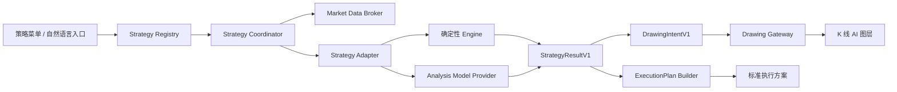

# Haolo 四策略 Skill 解耦与策略广场兼容改造计划

> 文档状态：冻结执行基线（P0–P6 已实施，P7 发布门禁待内部验证周期）  
> 创建日期：2026-08-14  
> 当前范围：四策略运行时解耦、声明式扩展契约、统一执行方案与兼容回滚已落地  
> 进度台账：`docs/trading-strategy-skill-decoupling-progress.zh-CN.md`  
> 上位架构：`docs/trading-expert-realtime-ai-execution-plan.zh-CN.md`
> 策略接入规范：`resources/trading-strategies/README.zh-CN.md`

## 1. 目标

以最小回归风险将当前四个官方策略解耦为可注册、可校验、可独立测试的 `Trading Strategy Skill`：

- 缠论：`chan`；
- 订单流：`order-flow`；
- 波浪理论：`wave`；
- 威科夫：`wyckoff`。

完成后必须同时满足：

1. 四个策略的入口、请求识别、行情准备、确定性分析、模型复核、受控绘图、报告、取消和错误处理与改造前行为等价。
2. 中央菜单、Renderer 调度、Preload/Main IPC 和 Drawing Gateway 不再为第五个策略增加一整套专属分支。
3. 新增一个符合规范的官方内置策略时，只增加策略包、适配器和自身测试；不得修改中央策略列表和四选一分支。
4. 为未来“自然语言创建策略 → 校验 → 回放 → 画线 → 标准执行方案 → 保存/发布策略广场”保留同一协议边界。
5. 每个策略分析最终都输出 `ExecutionPlanV1`。当数据或证据不足时，也必须输出结构完整的 `wait`、`no_trade` 或 `insufficient_data` 方案，不能编造可执行价位。

## 2. 本轮不做什么

- 不在首轮开放任意第三方 JavaScript/Node 模块热加载。
- 不让 Strategy Skill 直接访问 Electron、DOM、文件系统、网络、API Key 或任意 IPC。
- 不把确定性引擎替换成纯大模型看图或自由推理。
- 不在本次解耦中重写四个策略的理论算法、提示词内容或绘图视觉。
- 不同时迁移统一 Data Hub；继续遵守现有 MarketSnapshot 过渡边界。
- 不自动下单；`ExecutionPlanV1` 是分析与计划，不是订单指令。
- 不为追求目录整齐而一次性移动全部旧文件。

## 3. 核心判断

### 3.1 为什么不是只拆成四个 `SKILL.md`

`SKILL.md` 适合承载策略知识、分析纪律、术语和报告要求，但当前四个策略还包含：

- 行情与数据覆盖要求；
- 确定性引擎；
- 请求分类和参数继承；
- Provider 复核协议；
- Drawing Gateway 工具、图层、颜色与数量白名单；
- 任务生命周期、取消、错误恢复和持久化。

因此本方案定义的 `Trading Strategy Skill` 是 Haolo 的领域策略包。它可以包含 `SKILL.md`，但运行时必须以机器可读 Manifest、受信任适配器或受限声明式规则为准。

### 3.2 风险分级

| 能力 | 风险 | 本计划处理方式 |
|---|---:|---|
| 四个官方内置策略注册化 | 中低 | 本次实施，适配器优先、行为等价、逐个迁移 |
| 用户自然语言生成声明式策略 | 中 | 只冻结兼容契约，后续独立实施与回放验证 |
| 第三方任意代码运行时热插拔 | 高 | 不纳入首轮；未来需要签名、沙箱、权限和审核 |
| 自动下单 | 极高 | 不纳入本架构；必须经过独立 Risk/Execution Gateway |

## 4. 不可破坏的行为基线

任何阶段只要破坏以下任一项，就不得进入下一阶段：

### 4.1 公共基线

- 菜单名称和顺序继续为“缠论、订单流、波浪理论、威科夫”。
- 裸 mention 继续继承当前图表的市场、周期和可见范围。
- 只有用户明确指定市场、周期或范围时才允许切换。
- 普通知识问答、截图问答和当前图表分析继续按原路由区分。
- 模型只消费受控事实和候选，不得新增引擎不存在的行情事实、价位或结构。
- AI 绘图继续使用独立图层、Drawing Gateway 和虚拟光标播放，不进入用户手工撤销栈。
- 切换市场、周期、主题、页面和任务时，既有 AI 绘图持久化语义不变。
- 分析任务的开始、进度、取消、超时、失败和最终清理行为不变。
- Prompt 在首轮只能原样迁移；不得把解耦和提示词优化混成一次改动。

### 4.2 策略专项基线

| 策略 | 必须保持的差异 |
|---|---|
| 缠论 | 当前分型、笔、中枢候选与稳定候选 ID；原 `ai/chan` 图层和语义颜色；最少 K 线要求与失败语义不变 |
| 威科夫 | 交易区间、阶段、事件与量价证据保持原规则；原 `ai/wyckoff` 图层和颜色 Token 不变 |
| 波浪理论 | 主/备计数、完整周期、确认/失效、斐波那契关系与自动扩大 K 线窗口行为不变；原 `ai/wave` 图层不变 |
| 订单流 | 只接受真实支持的数据覆盖；Binance 永续、聚合成交、深度、OI 和更高周期上下文规则不变；不可用时继续失败关闭或明确降级；原 `ai/order-flow` 图层不变 |

### 4.3 兼容性基线

- `strategyId` 永久保持 `chan | order-flow | wave | wyckoff`。
- 既有 mention、别名、图层 ID、颜色 Token、候选 ID、存储键和错误码不因目录变化而重命名。
- 旧 IPC 在迁移期继续存在，并转发到新协调器；删除前必须完成兼容窗口验收。
- 新旧执行链不能同时写入同一图层；影子运行只比较结果，不执行副作用。

## 5. 目标架构



固定责任：

| 模块 | 责任 | 禁止 |
|---|---|---|
| Strategy Registry | 发现、校验、排序、启停和版本兼容 | 执行策略算法 |
| Strategy Coordinator | 生命周期、取消、行情准备、调用顺序、错误归一化 | 写图表、读取密钥 |
| Strategy Adapter | 封装策略差异和当前旧模块 | 绕过公共安全边界 |
| Deterministic Engine | 计算可复现事实、候选、价位、证据 | 自由生成自然语言事实 |
| Model Provider | 复核歧义、选择候选、解释结论 | 新增未经引擎证明的价格和结构 |
| ExecutionPlan Builder | 将受控事实转为标准执行方案 | 直接下单、读取交易密钥 |
| Drawing Gateway | 校验绘图意图并产生受信任补丁 | 推理市场方向 |
| Renderer | 展示、主题、交互和用户确认 | 装载第三方 Node 代码 |

## 6. 目录与加载策略

### 6.1 第一阶段目录原则

首轮只增加薄适配层，不移动现有 engine/pipeline/router：

```text
src/main/trading-strategy-runtime/
  contracts/
  registry.mjs
  coordinator.mjs
  execution-plan-builder.mjs
  builtins/
    chan-adapter.mjs
    wyckoff-adapter.mjs
    wave-adapter.mjs
    order-flow-adapter.mjs

src/renderer/trading-strategy-runtime/
  client.ts
  catalog.ts
  execution-plan-view.ts

resources/trading-strategies/builtins/
  chan/
    strategy.json
    SKILL.md
    references/
  wyckoff/
  wave/
  order-flow/
```

现有 `src/main/trading-analysis/*-engine.mjs`、`*-pipeline.mjs` 和 `*-request-router.mjs` 继续作为真实实现。只有在所有策略通过新链路、旧接口已稳定转发后，才逐个移动；移动本身必须是独立提交，不夹带逻辑修改。

### 6.2 首轮允许的实现类型

```text
builtin-adapter     官方内置、代码随 Haolo 构建并接受代码审查
declarative-v1      未来由受限 DSL 解释执行，不包含任意代码
```

首轮 Manifest 不接受文件路径形式的动态 `entrypoint`，而是接受宿主已注册的 `adapterId`，防止策略包借动态导入获得 Node/Electron 权限。

## 7. StrategyManifestV1 契约

示意结构：

```json
{
  "schemaVersion": 1,
  "id": "chan",
  "version": "1.0.0",
  "publisher": { "id": "haolo", "type": "official" },
  "display": {
    "name": "缠论",
    "group": "strategy",
    "sortOrder": 10
  },
  "mentions": {
    "canonical": "缠论",
    "aliases": []
  },
  "implementation": {
    "kind": "builtin-adapter",
    "adapterId": "chan"
  },
  "capabilities": ["conversation", "chart-analysis", "drawing", "execution-plan"],
  "dataRequirements": {
    "candles": { "required": true, "minCount": 30 },
    "orderFlow": { "required": false }
  },
  "drawingPolicyId": "chan-v1",
  "executionPlanPolicyId": "standard-v1",
  "assets": {
    "skill": "SKILL.md"
  }
}
```

启动校验必须拒绝：

- 未知 `schemaVersion`；
- 重复 `id`、mention、别名、排序键或图层；
- 未注册 `adapterId`；
- 未声明的数据能力；
- 跨策略颜色 Token；
- 任意工具、任意 CSS、HTML 或脚本入口；
- 不兼容的宿主版本；
- Manifest 超出大小和字段限制。

单个策略校验失败只禁用该策略并产生诊断，不得使其他策略或整个客户端无法启动。

## 8. StrategyAdapterV1 契约

适配器负责表达差异，协调器负责公共流程。建议接口语义如下：

```ts
interface StrategyAdapterV1 {
  readonly id: string;
  classify(request: StrategyRequest, context: RequestContext): Promise<Classification>;
  prepareData(request: StrategyRequest, services: ReadonlyHostServices): Promise<PreparedInput>;
  analyze(input: PreparedInput, context: AnalysisContext): Promise<StrategyResultV1>;
  buildExecutionPlan(result: StrategyResultV1, context: PlanContext): ExecutionPlanV1;
}
```

约束：

- 输入快照不可变并携带 `snapshotId`、`inputHash`、市场和周期。
- `ReadonlyHostServices` 只能提供受控行情、模型 Provider、取消信号和日志接口。
- 绘图只通过 `StrategyResultV1.drawings` 返回，不能直接触碰 Renderer。
- 适配器不得吞掉取消、覆盖超时或返回未归一化异常。
- 订单流的特殊行情准备保留在适配器 hook 中，不强塞进其他策略。

## 9. StrategyResultV1 与绘图

所有策略输出统一外壳，策略专项信息放入受版本控制的 `details`：

```ts
interface StrategyResultV1 {
  schemaVersion: 1;
  analysisId: string;
  strategy: { id: string; version: string };
  snapshot: { id: string; inputHash: string; marketId: string; interval: string };
  status: "completed" | "insufficient_data" | "not_applicable";
  bias: "long" | "short" | "neutral" | "conflicted";
  evidence: EvidenceRef[];
  structures: StrategyStructure[];
  levels: StrategyLevel[];
  scenarios: StrategyScenario[];
  drawings: DrawingIntentV1[];
  coverage: DataCoverage;
  details: unknown;
}
```

`DrawingIntentV1` 只描述语义工具、时间、价格、候选 ID 和语义颜色。Drawing Gateway 继续验证：

- 市场、周期和 revision；
- 时间/价格范围；
- 工具、图层、颜色 Token；
- 对象数和单对象点数；
- 策略与 Token 的归属；
- 取消和过期状态。

策略菜单及执行方案 UI 的亮暗主题必须同步交付，覆盖 default、hover、active/selected、focus、open、loading、disabled、expired 和 error。策略绘图颜色必须复用既有 Token，或同时提供通过对比度审计的 light/dark 映射。

## 10. ExecutionPlanV1：所有策略的最终标准执行方案

### 10.1 标准字段

```ts
interface ExecutionPlanV1 {
  schemaVersion: 1;
  planId: string;
  analysisId: string;
  strategy: { id: string; version: string };
  market: { marketId: string; symbol: string; interval: string };
  snapshot: { id: string; inputHash: string; lastClosedBarTime: number };
  createdAt: number;
  expiresAt: number | null;
  action: "long" | "short" | "wait" | "no_trade" | "insufficient_data";
  marketAssessment: string;
  preconditions: PlanCondition[];
  entry: {
    mode: "limit" | "breakout" | "close_confirmation" | "conditional" | "none";
    zone: PriceZone | null;
    trigger: PlanCondition[];
    confirmation: PlanCondition[];
  };
  invalidation: {
    stop: PriceLevel | null;
    reasons: string[];
  };
  takeProfits: Array<{
    price: PriceLevel;
    allocationPercent: number;
    condition?: string;
  }>;
  positionSizing: {
    maxAccountRiskPercent: number | null;
    formula: string;
    suggestedQuantity: number | null;
    unavailableReason: string | null;
  };
  riskReward: Array<{ targetIndex: number; ratio: number }>;
  observe: PlanCondition[];
  cancelConditions: PlanCondition[];
  scenarios: StrategyScenario[];
  evidence: EvidenceRef[];
  coverage: DataCoverage;
  warnings: string[];
}
```

### 10.2 生成规则

1. 价格、时间、结构和触发条件必须来自确定性结果或通过校验的用户参数；模型只能组织表达和解释。
2. 可执行的 `long/short` 方案必须同时拥有入场触发、失效理由、止损或明确的条件式退出、有效期和证据引用。
3. 缺少止损、数据覆盖、合约规格或账户权益时，不得伪造数值；降级为条件式方案或 `wait/no_trade/insufficient_data`。
4. 分批止盈比例合计必须为 100；价格必须按 tick size 归一化。
5. 风险收益比由入场、止损和目标确定性计算，不能采用模型自报数值。
6. 建议仓位必须基于已授权且新鲜的账户权益、最大风险比例和合约规格计算；否则 `suggestedQuantity=null` 并解释原因。
7. 默认要求当前周期收盘确认；盘中触发必须由策略显式声明。
8. 每份方案必须声明需要继续观察的条件、方案有效期和取消执行条件。
9. 主场景和备选场景不能同时被描述为已触发。
10. 方案只供用户决策；不得转化成订单，除非未来独立 Risk Gateway 和用户授权均通过。

### 10.3 用户可见固定顺序

所有策略报告首屏按以下顺序输出：

1. 当前市场是否满足策略前置条件；
2. 当前动作：做多、做空、等待、不交易或数据不足；
3. 建议入场区间或触发条件；
4. 限价、突破确认或收盘确认方式；
5. 止损位置与失效理由；
6. 分批止盈位置和比例；
7. 建议仓位与最大账户风险比例；
8. 风险收益比；
9. 需要继续观察的条件；
10. 方案有效期；
11. 取消执行条件；
12. 数据覆盖、备选场景和风险提示。

图上至少能关联显示：主方向/等待区、入场区或触发线、止损/失效线、止盈目标，以及形成结论的关键结构。若状态为 `wait/no_trade/insufficient_data`，不得为了画满图表而强行生成不存在的交易位。

## 11. 分阶段实施计划

### P0：冻结基线与防回归护栏

#### TSK-P0-001 文档和架构决策冻结

工作：

- 创建本计划和独立进度台账；
- 在上位交易执行基线登记任务焦点和 ADR；
- 固化范围、非目标、迁移顺序和回滚原则。

验收标准：

- 两份文档存在且互相链接；
- 阶段、稳定任务 ID、验收、测试和进度记录规则完整；
- 上位架构仍保持“确定性引擎 + 模型综合 + Drawing Gateway”；
- Git 差异仅包含文档。

#### TSK-P0-002 建立改造前特征基线

工作：

- 为四策略固定代表性 MarketSnapshot/模型 Stub/期望 TheoryResult/DrawingPatch Fixture；
- 记录四种 mention、概念问答、截图问答、裸分析、显式市场/周期、取消、超时、错误和数据不足行为；
- 记录 Prompt 资产哈希、候选 ID、图层、颜色 Token、操作数量限制和持久化键；
- 记录四策略专项测试和全仓测试基线。

验收标准：

- 每个策略至少覆盖：正常、边界、数据不足、取消四类 Fixture；
- 确定性结果和 DrawingPatch 可稳定重复；
- 模型部分使用固定 Provider Stub，比较请求和结构语义，不比较随机自然语言全文；
- 所有新增基线测试在旧实现上先通过。

#### TSK-P0-003 功能开关与回滚路径

工作：

- 设计 `strategyRuntimeV1` 总开关和按策略开关；
- 明确旧链路、新链路和影子比较模式；
- 影子模式禁止模型重复计费和任何绘图/持久化副作用。

验收标准：

- 关闭总开关时完全走旧链路；
- 单策略可独立回退；
- 开关切换不会删除历史绘图或更改用户设置；
- 自动化测试覆盖三种模式。

### P1：只增加契约、注册表和薄适配器

#### TSK-P1-001 协议与 Schema

实现 `StrategyManifestV1`、`StrategyResultV1`、`DrawingIntentV1`、`ExecutionPlanV1` 和统一错误协议。

验收标准：

- JSON Schema 与 TypeScript/运行时验证语义一致；
- 未知字段、版本、非法数值、重复 ID 和越权能力失败关闭；
- Fuzz/边界测试不会导致主进程崩溃；
- 协议版本升级规则和向后兼容测试存在。

#### TSK-P1-002 Registry 与四个官方 Manifest

验收标准：

- Registry 能稳定发现并按原顺序返回四策略；
- 一个坏 Manifest 只禁用自身；
- 重复 ID/mention/alias/layer 被拒绝；
- 不修改中央列表即可注册测试用第五策略；
- 首轮不接受任意代码路径。

#### TSK-P1-003 四个 Legacy Adapter

验收标准：

- 每个适配器只调用当前 router/pipeline/engine，不改算法；
- 新适配器与旧直接调用在同一 Fixture 上产生等价的确定性结果、绘图补丁和错误；
- 订单流专项数据准备不影响其他策略。

### P2：主进程统一协调器与兼容 IPC

#### TSK-P2-001 Strategy Coordinator

统一任务 ID、取消、超时、行情准备、Provider 调用、结果校验和错误映射。

验收标准：

- 同一任务只能完成、取消或失败一次；
- 切市场、切周期和重复发送时取消语义与旧实现一致；
- Provider 超时、Malformed JSON、Drawing 校验失败均失败关闭；
- 协调器不包含 `if strategyId === ...` 的业务算法。

#### TSK-P2-002 通用 IPC 和旧接口桥接

目标接口：

```text
tradingStrategy:list
tradingStrategy:classify
tradingStrategy:run
tradingStrategy:cancel
```

验收标准：

- IPC 重复校验窗口来源、请求大小、strategyId、市场身份和取消所有权；
- 旧四组 IPC 转发到同一协调器；
- 旧接口与新接口契约测试结果一致；
- Preload 不暴露任意通道调用能力。

### P3：Renderer 注册驱动和公共执行骨架

#### TSK-P3-001 动态策略目录

验收标准：

- 菜单内容、顺序、键盘操作和视觉与当前版本一致；
- 不再在 Renderer 中写死四策略数组；
- 禁用/不兼容策略有明确状态且不会影响其余菜单；
- 浅色/暗色覆盖 default、hover、active/selected、focus、open、loading、disabled 和 error；
- Windows 100%/125%/150% 缩放无溢出。

#### TSK-P3-002 公共分类、分析和任务生命周期

验收标准：

- 四套发送分支和四套分析任务函数由统一客户端驱动；
- 用户可见进度文案、消息落点、标题、取消和错误保持策略专项配置；
- 一个任务只能写自己的会话、市场和 AI 图层；
- 页面切换和任务停放/恢复不重复分析、不丢失完成绘图。

### P4：按策略逐个切流

迁移顺序固定为：缠论 → 威科夫 → 波浪理论 → 订单流。任何一个未通过完整门禁，下一策略不得开始。

#### TSK-P4-CHAN 缠论切流

#### TSK-P4-WYCKOFF 威科夫切流

#### TSK-P4-WAVE 波浪理论切流

#### TSK-P4-ORDERFLOW 订单流切流

每个策略使用同一验收门禁：

1. 全部旧 Fixture 通过；
2. router 分类、参数继承、Prompt 请求、TheoryResult、候选 ID、DrawingPatch、报告结构、错误码等价；
3. 正常、数据不足、取消、超时、Malformed Provider、非法 Drawing 均覆盖；
4. 真实行情烟测完成，但只验证数据来源、协议、图层和约束，不固化实时方向；
5. 浅色/暗色与缩放视觉验收通过；
6. 本策略专项、公共生命周期、Drawing、布局、TypeScript、生产构建和全仓测试通过；
7. 开关回退旧链路再次通过冒烟；
8. 进度台账已记录证据后才能开始下一策略。

订单流额外门禁：

- 非 Binance 永续和真实订单流数据不足继续失败关闭；
- 不以 OHLCV 或模型猜测替代成交、深度或 OI；
- 多周期上下文部分失败时只按原规则降级；
- 原数据覆盖标签、窗口限制和最大绘图预算不变。

### P5：统一执行方案落地

#### TSK-P5-001 ExecutionPlan Builder

验收标准：

- 四策略均输出有效 `ExecutionPlanV1`；
- 所有价格都能追溯到结果 level/evidence；
- `long/short` 缺少入场、失效、止损或有效期时验证失败；
- 风险收益、tick size、止盈比例和仓位公式由程序计算；
- 数据不足时可靠输出非交易方案。

#### TSK-P5-002 标准报告与图表关联

验收标准：

- 四策略均按第 10.3 节固定顺序展示；
- 报告条目可定位对应的入场、止损、目标和证据图形；
- `wait/no_trade` 不画虚假入场和目标；
- 长文本、缺失可选字段、过期和错误状态在双主题下可读；
- 屏幕阅读器语义和键盘焦点顺序通过。

#### TSK-P5-003 执行安全边界

验收标准：

- 源码和 IPC 中不存在从 ExecutionPlan 直接下单的路径；
- 未授权账户数据不参与仓位数值计算；
- 日志、聊天和导出不包含 API Secret；
- 静态扫描和安全测试通过。

### P6：验证未来策略广场兼容性

#### TSK-P6-001 声明式测试策略

增加一个只用于测试、不会进入生产菜单的 `declarative-v1` 示例策略。

验收标准：

- 新策略不修改 Registry、中央菜单、IPC、协调器、Drawing Gateway 核心分支即可完成注册、分析、绘图和执行方案；
- 删除该包后系统正常启动且四个官方策略不受影响；
- 非法 DSL、未来数据引用、未授权数据和越权绘图全部被拒绝。

#### TSK-P6-002 自然语言生成兼容性契约

本阶段只冻结生成物和验证流程，不开放任意代码执行：

```text
自然语言 → Strategy Draft → 歧义澄清 → 声明式规则 → 静态校验
          → 历史回放 → 用户确认 → 私有保存/未来发布
```

验收标准：

- 用户明确值、系统建议默认值和待确认值可区分；
- 未确认歧义不能进入可运行状态；
- 生成物可被现有 Registry/Coordinator/Drawing/ExecutionPlan 契约消费；
- 包含来源、版本、权限、测试结果和发布状态。

### P7：清理、打包与发布门禁

#### TSK-P7-001 删除旧分支

只有四策略均稳定切流并至少经过一个内部验证周期后执行。

验收标准：

- 删除旧四分支、旧 IPC 和重复声明后没有悬空引用；
- 旧 IPC 如需兼容外部版本，保留明确弃用层而非复制实现；
- `main.ts` 和 `main.mjs` 的策略专项分支数量显著下降；
- Git diff 将纯移动与逻辑修改分开审查。

#### TSK-P7-002 打包与安装版验收

验收标准：

- 开发版、Vite 生产构建和 Windows 安装包均能发现四个 Manifest；
- ASAR/资源路径、升级覆盖、旧用户数据和离线启动通过；
- 单个策略资源缺失只禁用自身并产生可诊断错误；
- 性能相对 P0 基线无不可接受退化。

## 12. 严格测试矩阵

### 12.1 每次代码变更的最低门禁

```powershell
pnpm run typecheck
pnpm exec node --test test/trading-expert-chan-analysis.test.mjs
pnpm exec node --test test/trading-expert-wyckoff-analysis.test.mjs
pnpm exec node --test test/trading-expert-wave-analysis.test.mjs
pnpm exec node --test test/trading-expert-order-flow-analysis.test.mjs
pnpm exec node --test test/trading-expert-analysis-lifecycle.test.mjs
pnpm exec node --test test/trading-expert-drawing-tools.test.mjs
pnpm exec node --test test/trading-expert-layout.test.mjs
pnpm run build
git diff --check
```

阶段出口还必须执行全仓：

```powershell
pnpm test
```

如果全仓存在与本阶段无关的既有失败，必须先在 P0 基线中有可复现记录；新失败一律阻断阶段完成，不能以“看起来无关”直接放行。

### 12.2 测试层级

| 层级 | 必测内容 |
|---|---|
| Schema/Contract | Manifest、Result、Drawing、ExecutionPlan、错误协议、版本兼容 |
| Unit | Registry、Coordinator、Adapter、Plan Builder、tick/风险计算 |
| Golden/Characterization | 四策略确定性结果、Prompt 请求、DrawingPatch、错误码 |
| IPC Integration | Preload 白名单、窗口所有权、取消、大小限制、旧新桥接 |
| Renderer Integration | 菜单、mention、任务生命周期、会话、图层、持久化 |
| Visual | light/dark、100/125/150%、所有交互状态、长报告和错误态 |
| Security | 越权工具、跨策略 Token、任意路径、脚本、原型污染、过大输入 |
| Resilience | 单策略损坏、Provider 超时、断网、取消、重复请求、页面切换 |
| Performance | 启动、首次分析、内存、绘图播放、策略发现 |
| Packaging | Vite、Electron 开发版、Windows 打包、ASAR、升级和离线 |

### 12.3 等价比较规则

- 确定性引擎：深度比较规范化后的完整结果。
- Prompt：比较结构、规则资产版本、候选集合和请求哈希；不比较请求 ID/时间戳。
- 模型结果：固定 Provider Stub 时比较完整结果；真实模型只比较 Schema、候选引用、价格来源和安全约束。
- DrawingPatch：忽略 revision/创建时间后比较图层、工具、坐标、Token、顺序和数量。
- 用户报告：比较标准章节、关键字段和证据引用；不锁死非关键自然语言措辞。
- 实时烟测：不锁死市场方向，只验证真实数据覆盖和契约边界。

## 13. 性能和可靠性门槛

以 P0 测得的基线为准，阶段出口建议门槛：

- Registry 冷启动发现与校验 P95 不超过 100ms；
- 适配层相对旧调用增加的本地 P95 延迟不超过 5% 或 20ms，取较宽者；
- 同一 MarketSnapshot 不重复复制大型 K 线数组；
- 同一分析只调用一次收费模型；
- 取消后不得继续写会话、图层或持久化；
- 单策略初始化失败不影响其他策略和普通聊天；
- 不新增持续增长的监听器、计时器、任务 Map 或绘图对象。

具体阈值在 TSK-P0-002 测得真实基线后允许通过 ADR 调整，但不得无记录放宽。

## 14. 风险与控制

| 风险 | 等级 | 控制 |
|---|---:|---|
| 过度抽象抹平订单流/波浪特殊行为 | 中高 | 公共骨架 + 策略 hook，不追求完全无差异接口 |
| 大文件中一次替换四条链路 | 高 | 先桥接、逐策略切流、功能开关 |
| 模型输出波动导致误判回归 | 中 | 固定 Provider Stub + 结构语义比较 |
| 历史绘图和上下文丢失 | 中 | 永久保留 ID/layer/storage key，持久化迁移测试 |
| Drawing Token 动态化破坏主题 | 中 | 宿主白名单，light/dark 同时审计 |
| 订单流数据被通用层错误降级 | 中高 | 明确 dataRequirements 和专项失败关闭测试 |
| 动态资源在 ASAR 中丢失 | 中 | 首轮内置打包，安装版测试 |
| 第三方供应链和任意代码执行 | 高 | 首轮不开放，未来签名/沙箱/能力授权 |
| 执行方案看似具体但无法落地 | 高 | 必填触发、止损、有效期、取消条件和证据；数值由程序计算 |
| 执行方案被误当自动订单 | 高 | 独立类型、无交易 IPC、UI 明确确认边界 |

## 15. 回滚规则

1. 每个策略独立开关，失败时只回滚当前策略。
2. 旧实现保留到 P7，不在 P1–P5 提前删除。
3. 数据结构变更只允许向前兼容写入；未验证前不批量迁移或删除用户数据。
4. 影子比较不产生模型费用、绘图、聊天消息或持久化副作用。
5. 回滚后必须重新运行当前策略冒烟、公共生命周期和历史绘图恢复测试。
6. 若发现跨策略污染、数据伪造、越权绘图、重复模型调用或潜在下单路径，立即关闭新运行时总开关并阻断发布。

## 16. 阶段完成定义

一个任务只有同时满足以下条件才能在进度台账标记“已完成”：

- 代码或文档范围已审查；
- 本任务验收项逐条有证据；
- 必需测试实际执行且记录命令、数量和结果；
- `git diff --check` 通过；
- 涉及 UI 时完成亮暗主题和相关交互状态验证；
- 涉及策略时完成新旧行为等价对比；
- 涉及阶段出口时完成全仓测试和生产构建；
- 已记录已知限制、风险和明确回滚点；
- 已更新 `docs/trading-strategy-skill-decoupling-progress.zh-CN.md`。

不能用“代码已写完”“局部测试通过”或估算百分比代替完成证据。

## 17. 最终总验收

只有以下全部成立，本改造才算完成：

1. 四个原有策略全部通过新 Strategy Registry/Coordinator 运行。
2. 关闭新运行时后仍可回到旧链路，直到正式清理门禁通过。
3. 四策略在代表性 Fixture 上与改造前确定性结果、绘图和错误行为等价。
4. 四策略真实行情烟测、双主题视觉、取消、错误、持久化和打包测试通过。
5. 新增声明式测试策略不修改中央代码即可完成注册、分析、绘图和标准执行方案。
6. 每个策略最终输出符合 `ExecutionPlanV1` 的可读方案；没有条件时明确等待或不交易。
7. 不存在 Strategy Skill 直接操作 DOM、Electron、密钥、任意网络、文件系统或交易下单的路径。
8. 全仓测试、TypeScript、生产构建、Windows 安装包和变更检查通过。
9. 进度台账包含每个阶段的实际完成证据、测试结果、风险和回滚说明。
10. 上位交易架构文档和相关 ADR 与最终实现一致。

## 18. 谐波 v2 独立子引擎扩展

M1-140 在既有 `harmonic` Strategy Skill 内增加拓扑隔离，不把新形态继续堆进经典规则表：

- `classic-xabcd` 子引擎继续独占 Gartley、Bat、Butterfly、Crab、Deep Crab，规则版本保持 `1.0.0`；
- `shark-0xabc` 子引擎独占 Shark，固定标签 `0-X-A-B-C`，C 为 Terminal Bar；
- `cypher-xabcd` 子引擎独占 Cypher，D 按 XC 的 0.786 回撤完成，不能套用经典 XA 完成规则；
- `harmonic` 聚合器只负责共享摆动点上下文、候选合并、去重、排序和统一输出，不参与修改任何子引擎的比例判定；
- 报告、绘图和执行计划从候选读取 `topologyId`、`terminalLabel`、`measurements`、PRZ 组件及目标依据，禁止继续硬编码所有形态都以 D 完成；
- 5-0、独立 AB=CD、Three Drives、alternate/anti 等未冻结变体不计入“已支持”，后续必须按相同规范新增独立规则、子引擎和测试。

验收标准：七种形态均通过多空镜像；新旧五种输出兼容；Shark/Cypher 通过边界值、交叉误判、确认、绘图和执行方案端到端测试；Skill、类型、语法、生产构建和全仓基线通过；新增失败为零。

## 19. M1-141：谐波“无合格候选”完成态与扫描覆盖修复

### 19.1 问题定义

谐波确定性引擎在当前窗口找不到同时通过拓扑、全部硬比例、PRZ 收敛与未失效检查的五点序列时，返回 `insufficient_data` 是合法业务结果。旧管线将该结果抛成 `TRADING_HARMONIC_INSUFFICIENT_DATA`，通用渲染层再把它显示为“盘面分析未完成”，混淆了“扫描成功但不应交易”和“系统故障”。

### 19.2 改造原则

- 不放宽任何 Gartley、Bat、Butterfly、Crab、Deep Crab、Shark 或 Cypher 硬比例，不移动摆动点，不伪造 PRZ；
- `insufficient_data` 在策略结果层保持可审计，在任务生命周期层归一为 `completed`；
- 无候选时不调用收费模型，直接由确定性规则引擎生成完整结论；
- 标准执行方案必须明确“不交易”，不得生成入场、止损、目标、仓位或风险收益数字；
- 图上只允许绘制 `ai/strategy/harmonic` 的紫色 `strategy-note` 观察摆动和声明性标签，不能伪装成已通过的谐波形态或 PRZ；
- 用户未明确指定区间时，Manifest 通过通用 `preferredCount` 声明优先读取最近 600 根已收盘 K 线；80 根仍为硬下限，显式用户区间优先；
- `preferredCount` 是所有策略可复用的 Manifest 契约，不在宿主增加 `strategy.id === "harmonic"` 分支。

### 19.3 验收标准

- 无候选输入返回 `ok: true`，Coordinator 状态为 `completed`，`ExecutionPlanV1.action` 为 `insufficient_data`；
- 报告明确列出七种已扫描形态、失败门槛、当前不交易、重扫条件和观察线含义；
- 无候选路径模型调用次数为 0，绘图全部受策略图层和语义颜色白名单约束；
- 七种既有形态的识别、确认、绘图、T1/T2 与执行方案回归全部通过；
- `preferredCount` 首次校验和公共 Manifest 二次校验幂等，缺省 `null` 不得被误判为 0；
- 原四策略组合回归、类型检查、Skill 校验、生产构建和全仓基线均无新增失败。

## 20. M1-142：谐波 v3 多尺度发现与发展中形态

### 20.1 问题定义

v2 的七形态比例表和独立子引擎边界正确，但发现层只使用一个摆动半径、一个压缩阈值，并且只检查连续五个摆动点。实际 K 线中的次级高低点会切断主要 XABCD/0XABC 序列；同时只有终点形成后才返回内容，使合法的 XABC/0XAB 发展过程都落入“无候选”。这会造成高漏检和“每次都分析不出来”的体验，但不能通过放宽完成比例或移动点位修复。

### 20.2 改造原则

- 完成形态继续使用 v2 已冻结的七形态拓扑、全部硬比例、PRZ、Terminal Bar、失效和目标规则，数值不放宽；
- 发现层并行运行 fine、standard、structural、macro 四个尺度，并允许受限跳过最多两对被目标端点支配的次级高低点；每尺度序列硬上限 2,000，禁止无界组合；
- 同一形态和同一组点位跨尺度只保留一个候选，不得因扫描次数制造重复证据；
- 完成候选与发展中候选分仓输出。仅当没有完成候选时，才允许用已通过前置比例且投影收敛的 XABC/0XAB 输出 `developing`；
- 发展中候选只画已确认点位和“预测 PRZ”，明确展示可能分支，模型调用次数为 0；不生成 Terminal Bar、入场、止损、目标、仓位、风险收益或成功概率；
- 价格明显越过预测区、前置结构被改写或长时间不完成时取消，必须重新扫描；
- 完成、发展中、无候选三条路径都必须是任务成功完成态，但只有完整且确认后的候选才有条件式执行价位。

### 20.3 验收标准

- 七形态多空完成样本与 v2 比例/PRZ/确认/绘图/执行结果无回退；
- 含被支配次级摆动对的有效样本能恢复主要形态，含更极端端点的路径不能被跳过；
- 七种形态在终点尚未形成时均可进入 `developing` 候选集合；共享 XABC 的分支歧义必须如实披露；
- 发展中链路零模型调用、零执行价位，只输出部分拓扑、预测 PRZ、等待条件和取消条件；
- 600 根高波动 K 线四尺度扫描 P95 不超过 200ms，每尺度序列不超过 2,000；
- 谐波专项、原四策略组合、运行时、类型、Skill、生产构建、全仓基线和差异检查无新增失败。

## 21. M1-143：专业谐波绘图语法

### 21.1 问题定义

现有 Drawing Gateway 只接受基础路径、矩形、箭头和备注，渲染器再依据候选整体状态统一决定虚实线。结果是发展中候选的已确认 X-A-B-C 也全部变为虚线，X/A/B/C/D 使用带引线的备注布局，而且图中缺少 Fibonacci 测量弦与比例数字。形态识别可以正确，但图形语义和专业分析图不一致。

### 21.2 改造原则

- 扩展通用受控绘图协议，不在宿主或 SVG 渲染器增加 `strategy.id === "harmonic"` 分支；后续 Strategy Skill 可复用同一能力；
- Drawing Gateway 仅白名单允许 `solid/dashed/dotted`、1–4 线宽、枚举字体和纯文本锚点；任意 CSS、HTML、颜色、字体或超宽线条继续拒绝；
- 完成形态的 XABCD/0XABC 主拓扑使用 3px 实线，点名使用无引线纯文本；测量弦使用 1.5px 点虚线，并在线段中部显示三位小数比例；
- 经典、Shark、Cypher 分别使用自己的测量拓扑，禁止把经典 XA/AB=CD 测量套到 Shark 或 Cypher；
- 发展中形态的已确认部分保持实线，仅预测终点腿使用虚线并标记 `D?`/`C?`；投影终点绑定最新已收盘 K 线时间，只表达目标价格方向，不预测形成时间；
- PRZ、确认、失效、T1/T2 保持虚线条件层；无候选观察线不伪装成完成形态；
- 所有颜色复用 `strategy-support/resistance/note` 语义 Token，文字描边使用 `--trading-market-panel`，亮色和暗色同步验收。

### 21.3 验收标准

- 经典完成形态输出实线 XABCD、五个纯文本点名、四组测量弦与比例文字；Shark/Cypher 各自输出三组正确测量，不发生跨拓扑污染；
- 发展中输出“确认部分实线 + 预测腿虚线 + 预测 PRZ”，不生成任何入场、止损、目标或仓位；
- 协议与渲染持久化往返保留线型、线宽、字号和粗体，非法样式、超宽线条和错误点数被拒绝；
- 亮暗主题下比例文字具有面板色描边，方向色和注释色均来自现有语义变量，不增加硬编码单主题颜色；
- 七形态识别、比例、PRZ、Terminal Bar、执行方案保持不变；谐波专项、Drawing Gateway、原四策略组合、全仓基线、类型、Skill、构建和差异检查无新增失败。

## 22. M1-144：传统图表形态学完整策略链路

### 22.1 知识冻结与产品边界

以 Fidelity《Identifying Chart Patterns》、Fidelity 技术分析课程与 webinar transcript、StockCharts ChartSchool 形态目录/入门/Flag-Pennant 规则、IFTA CFTe syllabus 为证据层。所有来源共同支持以下硬边界：先前趋势（适用时）、几何触点、已收盘突破、假突破、形态高度或旗杆投射和结构失效必须分开验证；“看起来像”不能代替确认，图表形态不是收益保证。

产品层按用户要求拆为三类独立子引擎，共冻结 17 个可量化核心定义：

- 反转：头肩顶、头肩底、双顶、双底、三重顶、三重底、上升楔形、下降楔形；
- 延续：看涨/看跌旗形、看涨/看跌三角旗、杯柄形态；
- 双向：对称三角形、上升三角形、下降三角形、矩形整理。

广义形态知识中的扩散、钻石、圆弧、Bump-and-Run、岛形、缺口、蜡烛、V 形、谐波、波浪和 Wyckoff 不在 v1 中静默近似；必须另行冻结可复算规则和 Fixture 后才能宣称支持。这一范围控制避免用“全形态”名义引入主观曲线拟合。

### 22.2 解耦架构

- `chart-patterns` 作为独立官方 Strategy Skill，拥有 Manifest、Skill 工作流、知识规则和 Adapter；
- `chart-pattern-reversal`、`chart-pattern-continuation`、`chart-pattern-bilateral` 只负责各自形态，聚合引擎只共享 ATR、多尺度摆动、排序和证据，不允许跨类别修改规则；
- Registry 只增加一次 Adapter 注册；菜单、mention、Manifest 数据需求、通用行情加载、分屏任务、Drawing Gateway、ExecutionPlanV1 和会话持久化继续使用既有通用链路；
- 用户只发送 `@策略:图表形态学` 时使用确定性短路由，继承当前画布并直接分析；其他自然语言仍由受限请求路由器区分问答、截图、分析和绘图；
- 无候选、发展中、已确认、假突破均为成功完成的业务状态。只有系统异常、契约错误或数据不足才是任务失败。

### 22.3 识别、确认与执行规则

- fine/standard/structural/macro 四尺度只使用已收盘 OHLCV 提取交替摆动，ATR 归一化深度和间距；
- 反转形态必须通过对应先前趋势；旗形/三角旗必须有至少 4 ATR 的旗杆且整理回撤不超过 52%；杯柄必须有先前上升、相近杯口、上半区浅柄和跨越多个 K 线的圆底，拒绝 V 底；
- 双向形态在收盘突破前保持 neutral，同时生成上下边界的条件场景，不能依据“上升/下降三角形”名称预判方向；
- 突破使用边界外 `max(0.12 ATR, 0.04% price)` 的收盘缓冲；三根内收回边界标记 failed，取消原触发；
- T1/T2 分别按形态高度或旗杆的 61.8%/100% 投射；止损位放在相反边界/终端摆动外加 ATR 缓冲；方案三个当前周期过期；
- 输出经 Coordinator 统一形成 `ExecutionPlanV1`，包含前置条件、方向、触发、确认、失效、两档目标、仓位公式、风险收益、观察、有效期和取消条件，且不存在下单能力。

### 22.4 专业绘图语义

- 已确认历史结构：3px 实线；
- 支撑、阻力、颈线和分析边界：虚线；
- 各触点：纯文本标签；头肩使用 LS/N1/H/N2/RS，双/三重顶底、杯柄和通道使用各自标签；
- 收盘突破：方向箭头；
- 触发、失效、T1/T2：条件水平虚线；
- 无候选：仅用点虚观察摆动并明确“未通过硬规则”，不能伪装成形态；
- 所有图元固定在 `ai/strategy/chart-patterns`，颜色只使用 `strategy-*` 语义 Token；亮暗主题共享通用 Drawing Gateway，策略卡图标两套主题同时交付。

### 22.5 分阶段验收

1. 知识冻结：来源、17 个定义、未支持范围和反例写入 Skill 规则；Skill 校验通过。
2. 子引擎：多空镜像、趋势前置、几何、触点、深度、确认、假突破和交叉误判单元测试通过。
3. 聚合与绘图：三类自动发现、无候选完成态、实线/虚线/标签/箭头/价位和受控图层通过。
4. 完整链路：Manifest → Registry → deterministic/model router → Coordinator → market snapshot → engine → Drawing Gateway → report → ExecutionPlanV1 → renderer/persistence 通过。
5. 非功能：600 根扫描低于 500ms 自动门槛；请求注入失败关闭；无交易 IPC；亮暗主题、键盘卡片、组合回归、类型和生产构建通过。
6. 发布门禁：全仓新增失败为零；Windows 真实行情、多缩放截图、安装包和前向统计继续按 P7 独立签字，不能用合成 Fixture 代替交易有效性统计。

回滚点：设置 `HAOLO_DISABLED_TRADING_STRATEGIES=chart-patterns` 可单独禁用；或移除 Manifest/Adapter 注册和策略卡主题即可恢复到原五策略目录。没有数据库、订单、历史用户策略或凭据迁移。
